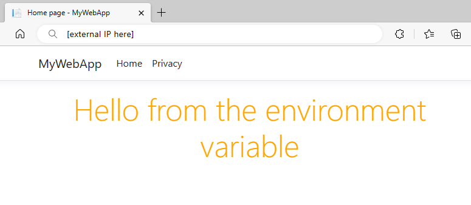

# Quickstart: Use Azure App Configuration in Azure Kubernetes Service (preview)

In Kubernetes, you set up pods to consume configuration from ConfigMaps. It lets you decouple configuration from your container images, making your applications easily portable. [Azure App Configuration Kubernetes Provider](https://mcr.microsoft.com/product/azure-app-configuration/kubernetes-provider/about) can construct ConfigMaps and Secrets from your key-values and Key Vault references in Azure App Configuration. It enables you to take advantage of Azure App Configuration for the centralized storage and management of your configuration without any changes to your application code.

In this quickstart, you incorporate Azure App Configuration Kubernetes Provider in an Azure Kubernetes Service workload where you run a simple ASP.NET Core app consuming configuration from json files.

## Prerequisites

* An App Configuration store. [Create a store](./quickstart-azure-app-configuration-create.md#create-an-app-configuration-store).
* An Azure Container Registry. [Create a registry](/azure/aks/tutorial-kubernetes-prepare-acr#create-an-azure-container-registry).
* An Azure Kubernetes Service (AKS) cluster that is granted permission to pull images from your Azure Container Registry. [Create an AKS cluster](/azure/aks/tutorial-kubernetes-deploy-cluster#create-a-kubernetes-cluster).
* [.NET Core SDK](https://dotnet.microsoft.com/download)
* [Azure CLI](/cli/azure/install-azure-cli)
* [Docker Desktop](https://www.docker.com/products/docker-desktop/)
* [helm](https://helm.sh/docs/intro/install/)
* [kubectl](https://kubernetes.io/docs/tasks/tools/)

> [!TIP]
> The Azure Cloud Shell is a free, interactive shell that you can use to run the command line instructions in this article. It has common Azure tools preinstalled, including the .NET Core SDK. If you're logged in to your Azure subscription, launch your [Azure Cloud Shell](https://shell.azure.com) from shell.azure.com. You can learn more about Azure Cloud Shell by [reading our documentation](../cloud-shell/overview.md)
>

## Create an application running in AKS

In this section, you will create a simple ASP.NET Core web application running in Azure Kubernetes Service (AKS). The application reads configuration from local json file. In the next section, you will enable it to consume configuration from Azure App Configuration without changing the application code. 

### Create an application

1. Use the .NET Core command-line interface (CLI) and run the following command to create a new ASP.NET Core web app project in a new *MyWebApp* directory:
   
    ```dotnetcli
    dotnet new webapp --output MyWebApp --framework net6.0
    ```

1. Open *Index.cshtml* in the Pages directory, and update the content with the following code.
   
    ```html
    @page
    @model IndexModel
    @using Microsoft.Extensions.Configuration
    @inject IConfiguration Configuration
    @{
        ViewData["Title"] = "Home page";
    }

    <style>
        h1 {
            color: @Configuration["Settings:FontColor"];
        }
    </style>

    <div class="text-center">
        <h1>@Configuration["Settings:Message"]</h1>
    </div>
    ```

1. Create a *config* directory in the root directory of your project, add a *demosettings.json* file in it with the following content.

    ```json
    {
      "Settings": {
        "FontColor": "Black",
        "Message": "Message from the local configuration"
      }
    }
    ```

1. Open *program.cs* and add the newly created configuration file by calling `AddJsonFile` method. 

    ```csharp   
    // Existing code in Program.cs
    // ... ...

    // Add a JSON configuration source 
    builder.Configuration.AddJsonFile("config/demosettings.json"); 

    var app = builder.Build();

    // The rest of existing code in program.cs
    // ... ...
    ```

### Containerize the application 

1. Run the [dotnet publish](/dotnet/core/tools/dotnet-publish) command to build the app in release mode and create the assets in the *published* folder.
   
    ```dotnetcli
    dotnet publish -c Release -o published
    ```

1. Create a file named *Dockerfile* at the root of your project directory, open it in a text editor, and enter the following content. A Dockerfile is a text file that doesn't have an extension and that is used to create a container image.

    ```dockerfile
    FROM mcr.microsoft.com/dotnet/aspnet:6.0 AS runtime
    WORKDIR /app
    COPY published/ ./
    ENTRYPOINT ["dotnet", "MyWebApp.dll"]
    ```

1. Build a container image named *aspnetapp* by running the following command.

   ```docker
   docker build --tag aspnetapp .
   ```

### Push the image to Azure Container Registry

1. Run the [az acr login](/cli/azure/acr#az-acr-login) command to login your container registry. The following example logs into a registry named *myregistry*. Replace the registry name with yours.

    ```azurecli
    az acr login --name myregistry
    ```

    The command returns `Login Succeeded` once login is successful.

1. Use [docker tag](https://docs.docker.com/engine/reference/commandline/tag/) to create a tag *myregistry.azurecr.io/aspnetapp:v1* for the image *aspnetapp*.

    ```docker
    docker tag aspnetapp myregistry.azurecr.io/aspnetapp:v1
    ```

    > [!TIP]
    > To review the list of your existing docker images and tags, run `docker image ls`. In this scenario, you should see at least two images: `aspnetapp` and `myregistry.azurecr.io/aspnetapp`.

1. Use [docker push](https://docs.docker.com/engine/reference/commandline/push/) to upload the image to the container registry. For example, the following command pushes the image to a repository named *aspnetapp* with tag *v1* under the registry *myregistry*.

    ```docker
    docker push myregistry.azurecr.io/aspnetapp:v1
    ```

### Deploy the application

1.  Create a *Deployment* directory in the root directory of your project.

1. Add a *deployment.yaml* file to the *Deployment* directory with the following content to create a deployment. Replace the value of `template.spec.containers.image` with the image you created in the previous step.

    ```yaml
    apiVersion: apps/v1
    kind: Deployment
    metadata:
      name: aspnetapp-demo
      labels:
        app: aspnetapp-demo
    spec:
      replicas: 1
      selector:
        matchLabels:
          app: aspnetapp-demo
      template:
        metadata:
          labels:
            app: aspnetapp-demo
        spec:
          containers:
          - name: aspnetapp
            image: myregistry.azurecr.io/aspnetapp:v1
            ports:
            - containerPort: 80
    ```

1. Add a *service.yaml* file to the *Deployment* directory with the following content to create a LoadBalancer service. 
 
    ```yaml
    apiVersion: v1
    kind: Service
    metadata:
      name: aspnetapp-demo-service
    spec:
      type: LoadBalancer
      ports:
      - port: 80
      selector:
        app: aspnetapp-demo
    ```

1. Run the following command to deploy the application to the AKS cluster.

    ```console
    kubectl create namespace appconfig-demo
    kubectl apply -f ./Deployment -n appconfig-demo
    ```

1. Run the following command and get the External IP address exposed by the LoadBalancer service.
   
    ```console
    kubectl get service aspnetapp-demo-service -n appconfig-demo
    ```

1. Open a browser window, and navigate to the IP address obtained in the previous step. The web page looks like this:

    

## Use App Configuration Kubernetes Provider

Now that you have an application running in AKS, you'll deploy the App Configuration Kubernetes Provider to your AKS cluster running as a Kubernetes controller. The provider retrieves data from your App Configuration store and creates a ConfigMap, which is consumable as a json file by being mounted as a data volume.

### Setup the Azure App Configuration store

1. Add following key-values to the App Configuration store and leave **Label** and **Content Type** with their default values. For more information about how to add key-values to a store using the Azure portal or the CLI, go to [Create a key-value](./quickstart-azure-app-configuration-create.md#create-a-key-value).

    |**Key**|**Value**|
    |---|---|
    |Settings:FontColor|*Green*|
    |Settings:Message|*Hello from Azure App Configuration*|

1. Follow the steps in [use workload identity](./reference-kubernetes-provider.md#use-workload-identity) to get prepared for allowing the App Configuration Kubernetes Provider to use the user assigned managed identity to connect to your App Configuration store.

### Install App Configuration Kubernetes Provider to AKS cluster
1. Run the following command to get access credentials for your AKS cluster. Replace the value of the `name` and `resource-group` parameters with your AKS instance:
   
    ```console
    az aks get-credentials --name <your-aks-instance-name> --resource-group <your-aks-resource-group>
    ```

1. Install Azure App Configuration Kubernetes Provider to your AKS cluster using `helm`:
   
    ```console
    helm install azureappconfiguration.kubernetesprovider \
         oci://mcr.microsoft.com/azure-app-configuration/helmchart/kubernetes-provider \
         --version 1.0.0-preview4 \
         --namespace azappconfig-system \
         --create-namespace
    ```

1. Add an *appConfigurationProvider.yaml* file to the *Deployment* directory with the following content to create an `AzureAppConfigurationProvider` resource. `AzureAppConfigurationProvider` is a custom resource that defines what data to download from an Azure App Configuration store and creates a ConfigMap.

    Replace the value of the `endpoint` field with the endpoint of your Azure App Configuration store, and the value of the `spec.auth.workloadIdentity.managedIdentityClientId` field with the client ID of the user-assigned managed identity you created in previous step [use workload identity](./reference-kubernetes-provider.md#use-workload-identity).
   
    ```yaml
    apiVersion: azconfig.io/v1beta1
    kind: AzureAppConfigurationProvider
    metadata:
      name: appconfigurationprovider-sample
    spec:
      endpoint: <your-app-configuration-store-endpoint>
      target:
        configMapName: configmap-created-by-appconfig-provider
        configMapData: 
          type: json
          key: demosettings.json
      auth:
        workloadIdentity:
          managedIdentityClientId: <your-managed-identity-client-id>
    ```
    
    > [!NOTE]
    > `AzureAppConfigurationProvider` is a declarative API object. It defines the desired state of the ConfigMap created from the data in your App Configuration store with the following behavior:
    >
    > - The ConfigMap will fail to be created if a ConfigMap with the same name already exists in the same namespace.
    > - The ConfigMap will be reset based on the present data in your App Configuration store if it's deleted or modified by any other means.
    > - The ConfigMap will be deleted if the App Configuration Kubernetes Provider is uninstalled.

2. Update the *deployment.yaml* file in the *Deployment* directory to use the ConfigMap `configmap-created-by-appconfig-provider` as a mounted data volume. Replace the value of `template.spec.containers.image` with the image you created in the previous step.
   
    ```yaml
    apiVersion: apps/v1
    kind: Deployment
    metadata:
      name: aspnetapp-demo
      labels:
        app: aspnetapp-demo
    spec:
      replicas: 1
      selector:
        matchLabels:
          app: aspnetapp-demo
      template:
        metadata:
          labels:
            app: aspnetapp-demo
        spec:
          containers:
          - name: aspnetapp
            image: myregistry.azurecr.io/aspnetapp:v1
            ports:
            - containerPort: 80
            volumeMounts:
            - name: config-volume
              mountPath: /app/config
          volumes:
          - name: config-volume 
            configMap: configmap-created-by-appconfig-provider 
            items:
            - key: demosettings.json
              path: demosettings.json
    ```

3. Run the following command to deploy the changes. Replace the namespace if you are using your existing AKS application.
   
    ```console
    kubectl apply -f ./Deployment -n appconfig-demo
    ```

4. Refresh the browser. The page shows updated content.

    

### Troubleshooting

If you don't see your application picking up the data from your App Configuration store, run the following command to validate that the ConfigMap is created properly.

```console
kubectl get configmap configmap-created-by-appconfig-provider -n appconfig-demo
```

If the ConfigMap is not created, run the following command to get the data retrieval status.

```console
kubectl get AzureAppConfigurationProvider appconfigurationprovider-sample -n appconfig-demo -o yaml
```

If the Azure App Configuration Kubernetes Provider retrieved data from your App Configuration store successfully, the `phase` property under the status section of the output should be `COMPLETE`, as shown in the following example.

```console
$ kubectl get AzureAppConfigurationProvider appconfigurationprovider-sample -n appconfig-demo -o yaml

apiVersion: azconfig.io/v1beta1
kind: AzureAppConfigurationProvider
  ... ... ...
status:
  lastReconcileTime: "2023-04-06T06:17:06Z"
  lastSyncTime: "2023-04-06T06:17:06Z"
  message: Complete sync settings to ConfigMap or Secret
  phase: COMPLETE
```

If the phase is not `COMPLETE`, the data isn't downloaded from your App Configuration store properly. Run the following command to show the logs of the Azure App Configuration Kubernetes Provider.

```console    
kubectl logs deployment/az-appconfig-k8s-provider -n azappconfig-system
```   

Use the logs for further troubleshooting. For example, if you see requests to your App Configuration store are responded with *RESPONSE 403: 403 Forbidden*, it may indicate the App Configuration Kubernetes Provider doesn't have the necessary permission to access your App Configuration store. Follow the instructions in [Setup the Azure App Configuration store](#setup-the-azure-app-configuration-store) to ensure the managed identity is enabled and it's assigned the proper permission.

## Clean up resources

Uninstall the App Configuration Kubernetes Provider from your AKS cluster if you want to keep the AKS cluster.

```console
helm uninstall azureappconfiguration.kubernetesprovider --namespace azappconfig-system
```

[!INCLUDE[Azure App Configuration cleanup](../../includes/azure-app-configuration-cleanup.md)]

## Next steps

In this quickstart, you:

* Created an application running in Azure Kubernetes Service (AKS).
* Connected your AKS cluster to your App Configuration store using the App Configuration Kubernetes Provider.
* Created a ConfigMap with data from your App Configuration store.
* Ran the application with configuration from your App Configuration store without changing your application code.

To learn more about the Azure App Configuration Kubernetes Provider, see [Azure App Configuration Kubernetes Provider reference](./reference-kubernetes-provider.md).