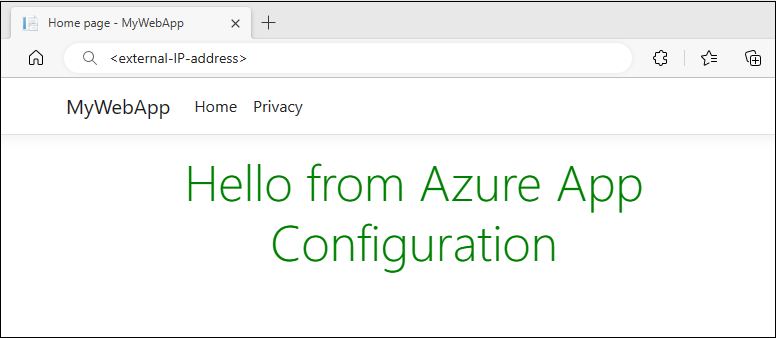

# Quickstart: Use Azure App Configuration in Azure Kubernetes Service (preview)
In Kubernetes, you set up pods to consume ConfigMaps for configuration. It lets you decouple configuration from your container images, making your applications easily portable. [Azure App Configuration Kubernetes Provider](https://mcr.microsoft.com/product/azure-app-configuration/kubernetes-provider/about) can construct ConfigMaps based on your data in Azure App Configuration. It enables you to take advantage of Azure App Configuration for the centralized storage and management of your configuration without any changes to your application code.

In this quickstart, you incorporate Azure App Configuration Kubernetes Provider in an Azure Kubernetes Service workload where you run a simple ASP.NET Core app consuming configuration from environment variables.

## Prerequisites

* An Azure account with an active subscription. [Create one for free](https://azure.microsoft.com/free/).
* An App Configuration store. [Create a store](./quickstart-azure-app-configuration-create.md#create-an-app-configuration-store).
* An Azure Container Registry. [Create a registry](/azure/aks/tutorial-kubernetes-prepare-acr?tabs=azure-cli#create-an-azure-container-registry).
* An Azure Kubernetes Service (AKS) cluster that integrates with the Azure Container Registry you created. [Create an AKS cluster](/azure/aks/tutorial-kubernetes-deploy-cluster?tabs=azure-cli#create-a-kubernetes-cluster).
* [.NET Core SDK](https://dotnet.microsoft.com/download)
* [Azure CLI](/cli/azure/install-azure-cli)
* [helm](https://helm.sh/docs/intro/install/)
* [kubectl](https://kubernetes.io/docs/tasks/tools/)

> [!TIP]
> The Azure Cloud Shell is a free, interactive shell that you can use to run the command line instructions in this article. It has common Azure tools preinstalled, including the .NET Core SDK. If you're logged in to your Azure subscription, launch your [Azure Cloud Shell](https://shell.azure.com) from shell.azure.com. You can learn more about Azure Cloud Shell by [reading our documentation](../cloud-shell/overview.md)
>

## Create an application running in AKS
In this section, it creates an ASP.NET Core web application that consumes environment variables as configuration and run it in Azure Kubernetes Service. This section has nothing to do with Azure App Configuration or Azure App Configuration Kubernetes Provider, it just for demonstrating the end-to-end usage scenario of Azure App Configuration Kubernetes Provider later. If you already have an application that is consuming environment variables in Kubernetes, you can just skip this section and go to [Use App Configuration Kubernetes Provider](#use-app-configuration-kubernetes-provider). 
### Create an application
1. Use the .NET Core command-line interface (CLI) and run the following command to create a new ASP.NET Core web app project in a new MyWebApp folder:
   
    ``` dotnetcli
    dotnet new webapp --output MyWebApp --framework net6.0
    ```

1. Open *Index.cshtml* in the Pages directory, and update the content with the following code.
   
    ``` html
    @page
    @model IndexModel
    @using Microsoft.Extensions.Configuration
    @inject IConfiguration Configuration
    @{
        ViewData["Title"] = "Home page";
    }

    <style>
        h1 {
            color: @Configuration.GetSection("Settings")["FontColor"];
        }
    </style>

    <div class="text-center">
        <h1 class="display-4">@Configuration.GetSection("Settings")["Message"]</h1>
    </div>
    ```

### Containerize the application 
1. Run the [dotnet publish](/dotnet/core/tools/dotnet-publish) command to build the app in release mode and create the assets in the published folder.
   
    ``` dotnetcli
    dotnet publish -c Release -o published
    ```

1. Create a file named *Dockerfile* in the directory containing your .csproj file, open it in a text editor, and enter the following content. A Dockerfile is a text file that doesn't have an extension and that is used to create a container image.

    ``` dockerfile
    FROM mcr.microsoft.com/dotnet/aspnet:6.0 AS runtime
    WORKDIR /app
    COPY published/ ./
    ENTRYPOINT ["dotnet", "MyWebApp.dll"]
    ```

1. Build a container image named *aspnetapp* by running the following command.

   ``` docker
   docker build --tag aspnetapp .
   ```

### Push the image to Azure Container Registry
1. Run the [az acr login](/cli/azure/acr#az-acr-login) command to login your container registry. The following example login a registry named *myregistry*. Replace the registry name with yours.

    ```azurecli
    az acr login --name myregistry
    ```

    The command returns `Login Succeeded` once login is successful.

1. Use [docker tag](https://docs.docker.com/engine/reference/commandline/tag/) to create a tag *myregistry.azurecr.io/aspnetapp:v1* for the image *aspnetapp*.

    ```docker
    docker tag aspnetapp myregistry.azurecr.io/aspnetapp:v1
    ```

    > [!TIP]
    > To review the list of your existing docker images and tags, run `docker image ls`. In this scenario, you should see at least two images: `aspnetapp` and `myregistry.azurecr.io/aspnetapp`.

1. Use [docker push](https://docs.docker.com/engine/reference/commandline/push/) to upload the image to the container registry. For example, the following command pushes the image to a repository named *aspnetapp* with tag *v1* under the registry *myregistry*.

    ```docker
    docker push myregistry.azurecr.io/aspnetapp:v1
    ```

### Deploy and visit the application
1.  Create an *AKS-AppConfiguration-Demo* directory in the root directory of your project.

1. Add a *deployment.yaml* to the *AKS-AppConfiguration-Demo* directory with the following content to create a deployment. Replace the value of `template.spec.containers.image` with the image you created in the previous step.

    ``` yaml
    apiVersion: apps/v1
    kind: Deployment
    metadata:
      name: aspnetapp-demo
      labels:
        app: aspnetapp-demo
    spec:
      replicas: 1
      selector:
        matchLabels:
          app: aspnetapp-demo
      template:
        metadata:
          labels:
            app: aspnetapp-demo
        spec:
          containers:
          - name: aspnetapp
            image: myregistry.azurecr.io/aspnetapp:v1
            ports:
            - containerPort: 80
            env:
            - name: Settings__Message
              value: "Message from the local configuration"
            - name: Settings__FontColor
              value: "Black"
    ```

1. Add a *service.yaml* to the *AKS-AppConfiguration-Demo* directory with the following content to create a LoadBalancer service. 
 
    ``` yaml
    apiVersion: v1
    kind: Service
    metadata:
      name: aspnetapp-demo-service
    spec:
      type: LoadBalancer
      ports:
      - port: 80
      selector:
        app: aspnetapp-demo
    ```

1. Run the following command to deploy the application to the AKS cluster.

    ``` bash
    kubectl create namespace appconfig-demo
    kubectl apply -f ./AKS-AppConfiguration-Demo -n appconfig-demo
    ```

1. Run the following command and get the External IP that exposed by the LoadBalancer service.
   
    ``` bash
    kubectl get service configmap-demo-service -n appconfig-demo
    ```

1. Open a browser window, and navigate to the IP address obtained in the previous step. The web page looks like this:

    

## Use App Configuration Kubernetes Provider
Now that you have an application running in AKS, you'll deploy the App Configuration Kubernetes Provider to your AKS cluster running as a Kubernetes controller. The provider retrieves data from your App Configuration store and creates a ConfigMap, which is consumable as environment variables by your application.
### Setup the Azure App Configuration store
1. Add following key-values to the App Configuration store and leave **Label** and **Content Type** with their default values. For more information about how to add key-values to a store using the Azure portal or the CLI, go to [Create a key-value](./quickstart-azure-app-configuration-create.md#create-a-key-value).

    |**Key**|**Value**|
    |---|---|
    |Settings__FontColor|*Green*|
    |Settings__Message|*Hello from Azure App Configuration*|
    
1. [Enabling the system-assigned managed identity on the Virtual Machine Scale Sets of your AKS cluster](/azure/active-directory/managed-identities-azure-resources/qs-configure-portal-windows-vmss#enable-system-assigned-managed-identity-on-an-existing-virtual-machine-scale-set). This allows the App Configuration Kubernetes Provider to use the managed identity to connect to your App Configuration store.

1. Grant read access to your App Configuration store by [assigning the managed identity the App Configuration Data Reader role](/azure/azure-app-configuration/howto-integrate-azure-managed-service-identity?tabs=core5x&pivots=framework-dotnet#grant-access-to-app-configuration).

### Install App Configuration Kubernetes Provider to AKS cluster
1. Run the following command to get access credentials for your AKS cluster. Replace the value of the `name` and `resource-group` parameters with your AKS instance:
   
    ```bash
    az aks get-credentials --name <your-aks-instance-name> --resource-group <your-aks-resource-group>
    ```

1. Install Azure App Configuration Kubernetes Provider to your AKS cluster using `helm`:
   
    ``` bash
    helm install azureappconfiguration.kubernetesprovider \
         oci://mcr.microsoft.com/azure-app-configuration/helmchart/kubernetes-provider \
         --version 1.0.0-preview \
         --namespace azappconfig-system \
         --create-namespace
    ```

1. Add an *appConfigurationProvider.yaml* file to the *AKS-AppConfiguration-Demo* directory with the following content to create an `AzureAppConfigurationProvider` resource. `AzureAppConfigurationProvider` is a custom resource that defines how to retrieve key-values from an Azure App Configuration store.

    Replace the value of the `endpoint` field with the endpoint of your Azure App Configuration store.
   
    ``` yaml
    apiVersion: azconfig.io/v1beta1
    kind: AzureAppConfigurationProvider
    metadata:
      name: appconfigurationprovider-sample
    spec:
      endpoint: <your-app-configuration-store-endpoint>
      target:
        configMapName: demo-configmap
    ```

2. Update the *deployment.yaml* in *AKS-AppConfiguration-Demo* directory to use the configMap `demo-configmap` as environment variable.
   
    Replace the whole `env` section 
    ``` yaml
    env:
    - name: Settings__Message
      value: "Message from the local configuration"
    - name: Settings__FontColor
      value: "Black"
    ```
    with
    ``` yaml
    envFrom:
    - configMapRef:
        name: demo-configmap
    ```

3. Run the following command to deploy the `AzureAppConfigurationProvider` resource.
   
    ``` bash
    kubectl apply -f ./AKS-AppConfiguration-Demo -n appconfig-demo
    ```

4. Refresh the browser. The page shows updated content.

    

### Troubleshooting
If you don't see your application picking up the data from your App Configuration store, run the following command to validate that the ConfigMap is created properly.

``` bash
kubectl get configmap demo-configmap -n appconfig-demo
```

If the ConfigMap is not created properly, run the following command to get the data retrieval status.

``` bash
kubectl get AzureAppConfigurationProvider appconfigurationprovider-sample -n appconfig-demo -o yaml
```

If the Azure App Configuration Kubernetes Provider retrieved data from your App Configuration store successfully, the `phase` property under the status section of the output should be `COMPLETE`, as shown in the following example.


If the phase is not `COMPLETE`, the data isn't downloaded from your App Configuration store properly. Run the following command to show the logs of the Azure App Configuration Kubernetes Provider.

``` bash    
kubectl logs deployment/az-appconfig-k8s-provider -n azappconfig-system
```   

Use the logs for further troubleshooting. For example, if you see requests to your App Configuration store are responded with *RESPONSE 403: 403 Forbidden*, it may indicate the App Configuration Kubernetes Provider doesn't have the necessary permission to access your App Configuration store. Follow the instructions in [Setup the Azure App Configuration store](#setup-the-azure-app-configuration-store) to ensure the managed identity is enabled and it's assigned the proper permission.

## Clean up resources

[!INCLUDE[Azure App Configuration cleanup](../../includes/azure-app-configuration-cleanup.md)]

Remove the resources that have been deployed to AKS.

``` bash
kubectl delete -f ./AKS-AppConfiguration-Demo -n appconfig-demo
kubectl delete namespace appconfig-demo
```

Follow the steps below to uninstall the Azure App Configuration Kubernetes Provider from your AKS cluster.

``` bash
helm uninstall azureappconfiguration.kubernetesprovider --namespace azappconfig-system
```

## Summary

In this quickstart, you:

* Provisioned a new App Configuration store.
* Connected to your App Configuration store in Kubernetes using the App Configuration Kubernetes Provider controller.
* Download your App Configuration store's key-values to a ConfigMap.
* Displayed a web page in Kubernetes using the settings you configured in your App Configuration store.