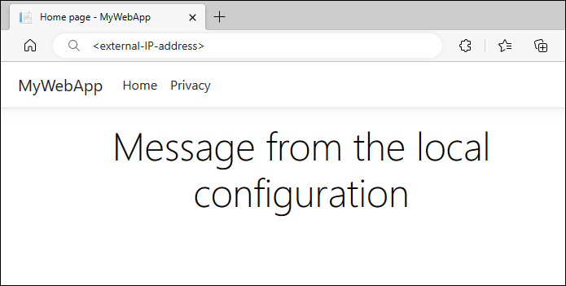

# Quickstart: Use Azure App Configuration in Azure Kubernetes Service

When you use the Kubernetes platform, you can set up pods to consume configuration data from ConfigMaps. This practice improves the portability of your applications, because you can decouple configuration data from your container images. [Azure App Configuration Kubernetes Provider](https://mcr.microsoft.com/product/azure-app-configuration/kubernetes-provider/about) offers a way to construct Kubernetes ConfigMaps and Secrets from key-value pairs and Azure Key Vault references in Azure App Configuration. When you use this provider, you can use App Configuration to centrally store and manage your configuration data without making changes to your application code.

A ConfigMap can be consumed as environment variables or a mounted file. In this quickstart, you incorporate Azure App Configuration Kubernetes Provider in an Azure Kubernetes Service (AKS) workload. In that workload, you run a basic ASP.NET Core app that consumes configuration data from a JSON file.

> [!TIP]
> For other ways to access App Configuration from a workload that's hosted in Kubernetes, see [Azure Kubernetes Service access to App Configuration](./howto-best-practices.md#azure-kubernetes-service-access-to-app-configuration).

> [!NOTE]
> This quickstart walks you through setting up Azure App Configuration Kubernetes Provider. Optionally, you can use the following [Azure Developer CLI](/azure/developer/azure-developer-cli/install-azd) commands to provision Azure resources and deploy the sample application that this quickstart uses. These commands use the `azure-appconfig-aks` template for this purpose. For more information about this template, go to the [azure-appconfig-aks](https://github.com/Azure-Samples/azure-appconfig-aks) GitHub repo.
> 
>  ```azd
>  azd init -t azure-appconfig-aks
>  azd up
>  ```

## Prerequisites

* An App Configuration store. [Create a store](./quickstart-azure-app-configuration-create.md#create-an-app-configuration-store).
* An instance of Azure Container Registry. [Create a registry](/azure/aks/tutorial-kubernetes-prepare-acr#create-an-azure-container-registry).
* An Azure Kubernetes Service (AKS) cluster that has permission to pull images from your container registry. [Create an AKS cluster](/azure/aks/tutorial-kubernetes-deploy-cluster#create-a-kubernetes-cluster).
* [.NET SDK 8.0 or later](https://dotnet.microsoft.com/download)
* [The Azure CLI](/cli/azure/install-azure-cli)
* [Docker Desktop](https://www.docker.com/products/docker-desktop/)
* [helm](https://helm.sh/docs/intro/install/)
* [kubectl](https://kubernetes.io/docs/tasks/tools/)

## Create an application that runs in Azure Kubernetes Service (AKS)

In this section, you create a basic ASP.NET Core web application that runs in Azure Kubernetes Service (AKS). The application reads configuration data from a local JSON file. In the next section, you enable the application to consume configuration data from App Configuration without changing the application code.

If you already have an Azure Kubernetes Service (AKS) application that reads configuration from a file, you can skip this section and go to [Use App Configuration Kubernetes Provider](#use-app-configuration-kubernetes-provider). But ensure the configuration file that the provider generates matches the file path that your application uses.

### Create an application

1. Use the .NET command-line interface (CLI) to run the following command. It creates an ASP.NET Core web app project in a new *MyWebApp* directory.
   
    ```dotnetcli
    dotnet new webapp --output MyWebApp --framework net8.0
    ```

1. In the *MyWebApp* directory, go to the *Pages* directory, and then open *Index.cshtml*. Replace the content with the following code:
   
    ```html
    @page
    @model IndexModel
    @using Microsoft.Extensions.Configuration
    @inject IConfiguration Configuration
    @{
        ViewData["Title"] = "Home page";
    }

    <style>
        h1 {
            color: @Configuration["Settings:FontColor"];
        }
    </style>

    <div class="text-center">
        <h1>@Configuration["Settings:Message"]</h1>
    </div>
    ```

1. Create a *config* directory in the root of your project. In the *config* directory, add a *mysettings.json* file that contains the following content:

    ```json
    {
      "Settings": {
        "FontColor": "Black",
        "Message": "Message from the local configuration"
      }
    }
    ```

1. In your project root directory, open *Program.cs*, and then add the JSON file to the configuration source by calling the `AddJsonFile` method. 

    ```csharp   
    // Existing code in Program.cs
    // ... ...

    // Add a JSON configuration source 
    builder.Configuration.AddJsonFile("config/mysettings.json", reloadOnChange: true, optional: false);

    var app = builder.Build();

    // The rest of existing code in Program.cs
    // ... ...
    ```

### Containerize the application 

1. Run the [dotnet publish](/dotnet/core/tools/dotnet-publish) command to build the app in release mode and create the assets in the *published* directory.
   
    ```dotnetcli
    dotnet publish -c Release -o published
    ```

1. Create a file named *Dockerfile* at the root of your project directory, open it in a text editor, and enter the following content. A Dockerfile is a text file that doesn't have an extension. You use it to create a container image.

    ```dockerfile
    FROM mcr.microsoft.com/dotnet/aspnet:8.0 AS runtime
    WORKDIR /app
    COPY published/ ./
    ENTRYPOINT ["dotnet", "MyWebApp.dll"]
    ```

1. Build a container image named *aspnetapp* by running the following command:

   ```docker
   docker build --tag aspnetapp .
   ```

### Push the image to Container Registry

1. Run the [az acr login](/cli/azure/acr#az-acr-login) command to sign in to your container registry. The following code signs in to a registry named *myregistry*. Replace that registry name with the name of yours.

    ```azurecli
    az acr login --name myregistry
    ```

    The command returns `Login Succeeded` if you successfully sign in.

1. Use [docker tag](https://docs.docker.com/engine/reference/commandline/tag/) to create a tag called *myregistry.azurecr.io/aspnetapp:v1* for the *aspnetapp* image.

    ```docker
    docker tag aspnetapp myregistry.azurecr.io/aspnetapp:v1
    ```

    > [!TIP]
    > To review the list of your existing docker images and tags, run `docker image ls`. In this scenario, you should see at least two images: `aspnetapp` and `myregistry.azurecr.io/aspnetapp`.

1. Use [docker push](https://docs.docker.com/engine/reference/commandline/push/) to upload the image to the container registry. For example, the following command pushes the image to a repository named *aspnetapp* with tag *v1* under the registry *myregistry*.

    ```docker
    docker push myregistry.azurecr.io/aspnetapp:v1
    ```

### Deploy the application

1. Create a *Deployment* directory in the root directory of your project.

1. Add a *deployment.yaml* file to the *Deployment* directory with the following content to create a deployment. Replace the value of `template.spec.containers.image` with the image you created in the previous step.

    ```yaml
    apiVersion: apps/v1
    kind: Deployment
    metadata:
      name: aspnetapp-demo
      labels:
        app: aspnetapp-demo
    spec:
      replicas: 1
      selector:
        matchLabels:
          app: aspnetapp-demo
      template:
        metadata:
          labels:
            app: aspnetapp-demo
        spec:
          containers:
          - name: aspnetapp
            image: myregistry.azurecr.io/aspnetapp:v1
            ports:
            - containerPort: 80
    ```

1. Add a *service.yaml* file to the *Deployment* directory with the following content to create a LoadBalancer service. 
 
    ```yaml
    apiVersion: v1
    kind: Service
    metadata:
      name: aspnetapp-demo-service
    spec:
      type: LoadBalancer
      ports:
      - port: 80
      selector:
        app: aspnetapp-demo
    ```

1. Run the following command to deploy the application to the AKS cluster.

    ```console
    kubectl create namespace appconfig-demo
    kubectl apply -f ./Deployment -n appconfig-demo
    ```

1. Run the following command to get the external IP address exposed by the LoadBalancer service.
   
    ```console
    kubectl get service aspnetapp-demo-service -n appconfig-demo
    ```

1. In a browser window, go to the IP address you obtained in the previous step. The webpage should look similar to the following screenshot:

    

## Use App Configuration Kubernetes Provider

Now that you have an application running in AKS, the next step is to deploy Azure App Configuration Kubernetes Provider to your AKS cluster running as a Kubernetes controller. The provider retrieves data from your App Configuration store and creates a ConfigMap, which is consumable as a JSON file mounted in a data volume.

### Set up the Azure App Configuration store

Add the following key and values to the App Configuration store. For each one, use default values for **Label** and **Content Type**. For more information about how to add keys to a store by using the Azure portal or the Azure CLI, see [Create a key-value](./quickstart-azure-app-configuration-create.md#create-a-key-value).

|**Key**|**Value**|
|---|---|
|Settings:FontColor|*Green*|
|Settings:Message|*Hello from Azure App Configuration*|

### Set up App Configuration Kubernetes Provider

1. Install Azure App Configuration Kubernetes Provider on your AKS cluster. You can install the provider either as an AKS extension or by using a Helm chart. The AKS extension provides seamless installation and management via the Azure CLI, ARM templates, or Bicep files. Also, using the AKS extension facilitates automatic minor and patch version updates, helping to ensure your system remains up to date.
   
    #### [AKS extension](#tab/extension)

    Add the `k8s-extension` to your Azure CLI extensions:

    ```azurecli
    az extension add --name k8s-extension
    ```

    Register the `KubernetesConfiguration` resource provider:
    
    ```azurecli
    az provider register --namespace Microsoft.KubernetesConfiguration
    ```

    Install the AKS extension for App Configuration. Replace the `cluster-name` and `resource-group` parameter values with those of your AKS instance:

    ```azurecli
    az k8s-extension create --cluster-type managedClusters \
        --cluster-name <your-aks-instance-name> \
        --resource-group <your-aks-resource-group> \
        --name appconfigurationkubernetesprovider \
        --extension-type Microsoft.AppConfiguration
    ```
    
    For more information, see [Install Azure App Configuration AKS extension](/azure/aks/azure-app-configuration).
  
    #### [Helm chart](#tab/helm)

    Run the following command to obtain access credentials for your AKS cluster. Replace the `name` and `resource-group` parameter values with those of your AKS instance:
   
    ```azurecli
    az aks get-credentials --name <your-aks-instance-name> --resource-group <your-aks-resource-group>
    ```
    
    Install the Helm chart:

    ```console
    helm install azureappconfiguration.kubernetesprovider \
        oci://mcr.microsoft.com/azure-app-configuration/helmchart/kubernetes-provider \
        --namespace azappconfig-system \
        --create-namespace
    ```

    ---

1. Add an *appConfigurationProvider.yaml* file to the *Deployment* directory with the following content to create an `AzureAppConfigurationProvider` resource. `AzureAppConfigurationProvider` is a custom resource that defines what data to download from an Azure App Configuration store and creates a ConfigMap.
   
    ```yaml
    apiVersion: azconfig.io/v1
    kind: AzureAppConfigurationProvider
    metadata:
      name: appconfigurationprovider-sample
    spec:
      endpoint: <your-app-configuration-store-endpoint>
      target:
        configMapName: configmap-created-by-appconfig-provider
        configMapData: 
          type: json
          key: mysettings.json
      auth:
        workloadIdentity:
          serviceAccountName: <your-service-account-name>
    ```

    - For the `endpoint` field, replace the value with the endpoint of your App Configuration store.
    - For the `auth` section, wait until you get to the next step to enter your authentication information.
    
    > [!NOTE]
    > `AzureAppConfigurationProvider` is a declarative API object. It defines the desired state of the ConfigMap created from the data in your App Configuration store with the following behavior:
    >
    > - ConfigMap creation fails if a ConfigMap with the same name already exists in the same namespace.
    > - The ConfigMap is reset based on the present data in your App Configuration store if it's deleted or modified by any other means.
    > - The ConfigMap is deleted if App Configuration Kubernetes Provider is uninstalled.

1. Follow the [instructions to use the workload identity](./reference-kubernetes-provider.md#use-workload-identity) to authenticate with your App Configuration store. Update the *appConfigurationProvider.yaml* file by replacing the `serviceAccountName` field with the name of the service account you created. For more information on other authentication methods, refer to the examples in the [Authentication](./reference-kubernetes-provider.md#authentication) section.

1. Update the *deployment.yaml* file in the *Deployment* directory to use the ConfigMap `configmap-created-by-appconfig-provider` as a mounted data volume. It is important to ensure that the `volumeMounts.mountPath` matches the `WORKDIR` specified in your *Dockerfile* and the *config* directory created before.
   
    ```yaml
    apiVersion: apps/v1
    kind: Deployment
    metadata:
      name: aspnetapp-demo
      labels:
        app: aspnetapp-demo
    spec:
      replicas: 1
      selector:
        matchLabels:
          app: aspnetapp-demo
      template:
        metadata:
          labels:
            app: aspnetapp-demo
        spec:
          containers:
          - name: aspnetapp
            image: myregistry.azurecr.io/aspnetapp:v1
            ports:
            - containerPort: 80
            volumeMounts:
            - name: config-volume
              mountPath: /app/config
          volumes:
          - name: config-volume 
            configMap: 
              name: configmap-created-by-appconfig-provider
    ```

1. Run the following command to deploy the changes. Replace the namespace if you are using your existing AKS application.
   
    ```console
    kubectl apply -f ./Deployment -n appconfig-demo
    ```

1. Refresh the browser. The page shows updated content.

    

## Troubleshooting

If you don't see your application picking up the data from your App Configuration store, run the following command to validate that the ConfigMap is created properly.

```console
kubectl get configmap configmap-created-by-appconfig-provider -n appconfig-demo
```

If the ConfigMap is not created, run the following command to get the data retrieval status.

```console
kubectl get AzureAppConfigurationProvider appconfigurationprovider-sample -n appconfig-demo -o yaml
```

If the Azure App Configuration Kubernetes Provider retrieved data from your App Configuration store successfully, the `phase` property under the status section of the output should be `COMPLETE`, as shown in the following example.

```console
$ kubectl get AzureAppConfigurationProvider appconfigurationprovider-sample -n appconfig-demo -o yaml

apiVersion: azconfig.io/v1
kind: AzureAppConfigurationProvider
  ... ... ...
status:
  lastReconcileTime: "2023-04-06T06:17:06Z"
  lastSyncTime: "2023-04-06T06:17:06Z"
  message: Complete sync settings to ConfigMap or Secret
  phase: COMPLETE
```

If the phase is not `COMPLETE`, the data isn't downloaded from your App Configuration store properly. Run the following command to show the logs of the Azure App Configuration Kubernetes Provider.

```console    
kubectl logs deployment/az-appconfig-k8s-provider -n azappconfig-system
```   

Use the logs for further troubleshooting. Refer to the [FAQ](#faq) section for common issues.

## FAQ

#### Why isn't the ConfigMap or Secret being generated?

You can follow the steps in the [Troubleshooting](#troubleshooting) guide to collect logs for detailed error information. Here are some common causes.

- **RESPONSE 403: 403 Forbidden**: The configured identity lacks the necessary permissions to access the App Configuration store. Refer to the [Authentication](./reference-kubernetes-provider.md#authentication) section for examples that match the identity you are using.
- **A Key Vault reference is found in App Configuration, but 'spec.secret' was not configured**: One or more Key Vault references are included in the selected key-values, but the authentication information for Key Vaults is not provided. To maintain the integrity of the configuration, the entire configuration fails to load. Configure the `spec.secret` section to provide the necessary authentication information. For examples and more information, see [Key Vault reference](./reference-kubernetes-provider.md#key-vault-references) .

#### Why does the generated ConfigMap not contain the expected data?

Ensure that you specify the correct key-value selectors to match the expected data. If no selectors are specified, all key-values without a label will be downloaded from your App Configuration store. When using a key filter, verify that it matches the prefix of your expected key-values. If your key-values have labels, make sure to specify the label filter in the selectors. For more examples, refer to the [key-value selection](./reference-kubernetes-provider.md#key-value-selection) documentation.

#### How can I customize the installation of the Azure App Configuration Kubernetes Provider?

You can customize the installation by providing additional Helm values when installing the Azure App Configuration Kubernetes Provider. For example, you can set the log level, configure the provider to run on a specific node, or disable the workload identity. Refer to the [installation guide](./reference-kubernetes-provider.md#installation) for more information.

#### How to trigger on-demand refresh of ConfigMap and Secret

While you can set up automatic data refresh, there are times when you might want to trigger an on-demand refresh to get the latest data from App Configuration and Key Vault. To do this, you can modify the `metadata.annotations` section of `AzureAppConfigurationProvider`. The Kubernetes provider will then reconcile and update the ConfigMap and Secret with the latest data from your App Configuration store and Key Vault. See [On-demand Refresh](./reference-kubernetes-provider.md#on-demand-refresh) for an example.

It is not recommended to delete or modify the ConfigMap and Secret generated by the Kubernetes provider. Although new ones will be generated from the latest data, this could cause downtime for your applications in the event of any failures.

#### Why am I unable to authenticate with Azure App Configuration using workload identity after upgrading the provider to version 2.0.0?

Starting with version 2.0.0, a user-provided service account is required for authenticating with Azure App Configuration [using workload identity](./reference-kubernetes-provider.md#use-workload-identity). This change enhances security through namespace isolation. Previously, a Kubernetes provider’s service account was used for all namespaces. For updated instructions, see the documentation on using workload identity. If you need time to migrate when upgrading to version 2.0.0, you can temporarily set `workloadIdentity.globalServiceAccountEnabled=true` during provider installation. Please note that support for using the provider’s service account will be deprecated in a future release.

## Clean up resources

Uninstall the App Configuration Kubernetes Provider from your AKS cluster if you want to keep the AKS cluster.

```console
helm uninstall azureappconfiguration.kubernetesprovider --namespace azappconfig-system
```

[!INCLUDE[Azure App Configuration cleanup](../../includes/azure-app-configuration-cleanup.md)]

> [!NOTE]
> If you use the Azure Developer CLI to set up the resources, you can run the `azd down` command to delete all resources created by the `azure-appconfig-aks` template.
> 

## Next steps

In this quickstart, you:

* Created an application running in Azure Kubernetes Service (AKS).
* Connected your AKS cluster to your App Configuration store using the App Configuration Kubernetes Provider.
* Created a ConfigMap with data from your App Configuration store.
* Ran the application with configuration from your App Configuration store without changing your application code.

To learn how to update your AKS workloads to dynamically refresh configuration, continue to the next tutorial.

> [!div class="nextstepaction"]
> [Use dynamic configuration in Azure Kubernetes Service](./enable-dynamic-configuration-azure-kubernetes-service.md)

To learn more about the Azure App Configuration Kubernetes Provider, see [Azure App Configuration Kubernetes Provider reference](./reference-kubernetes-provider.md).
