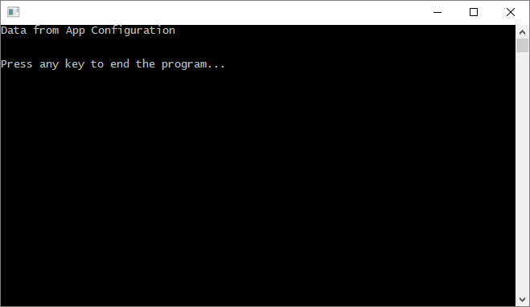

# Quickstart: Create a .NET Framework app with Azure App Configuration

Azure App Configuration is a managed configuration service in Azure. It lets you easily store and manage all your application settings in one place that is separated from your code. This quickstart shows you how to incorporate the service into a .NET Framework-based Windows desktop console app.



## Prerequisites

To complete this quickstart, install [Visual Studio 2017](https://visualstudio.microsoft.com/vs) and [.NET Framework 4.7.1](https://dotnet.microsoft.com/download) or later if you haven’t already.

[!INCLUDE [quickstarts-free-trial-note](../../includes/quickstarts-free-trial-note.md)]

## Create an app configuration store

[!INCLUDE [azure-app-configuration-create](../../includes/azure-app-configuration-create.md)]

## Create a .NET console app

1. Launch Visual Studio and select **File** > **New** > **Project**.

2. In the **New Project** dialog, select **Installed**, expand **Visual C#** > **Windows Desktop**, select **Console App (.NET Framework)**, type a **Name** for your project, choose **.NET Framework 4.7.1** or up and click **OK**.

## Connect to app configuration store

1. Right-click your project and select **Manage NuGet Packages...**. In the **Browse** tab, search and add following NuGet packages to your project (check the **Include prerelease** box if you cannot find them).
    ```
    Microsoft.Configuration.ConfigurationBuilders.AzureAppConfiguration 1.0.0 preview or later
    Microsoft.Configuration.ConfigurationBuilders.Environment 2.0.0 preview or later
    ```

2. Update the *App.config* file of your project as following:

    ```xml
    <configSections>
        <section name="configBuilders" type="System.Configuration.ConfigurationBuildersSection, System.Configuration, Version=4.0.0.0, Culture=neutral, PublicKeyToken=b03f5f7f11d50a3a" restartOnExternalChanges="false" requirePermission="false" />
    </configSections>

    <configBuilders>
        <builders>
            <add name="MyConfigStore" mode="Greedy" connectionString="${ConnectionString}" type="Microsoft.Configuration.ConfigurationBuilders.AzureAppConfigurationBuilder, Microsoft.Configuration.ConfigurationBuilders.AzureAppConfiguration" />
            <add name="Environment" mode="Greedy" type="Microsoft.Configuration.ConfigurationBuilders.EnvironmentConfigBuilder, Microsoft.Configuration.ConfigurationBuilders.Environment" />
        </builders>
    </configBuilders>

    <appSettings configBuilders="Environment,MyConfigStore">
        <add key="AppName" value="Console App Demo" />
        <add key="ConnectionString" value ="Set via an environment variable - for example, dev, test, staging, or production connection string." />
    </appSettings>
    ```

   Please note, as we will be reading the connection string of your app configuration store from the environment variable `ConnectionString`, it's important to add the `Environment` configuration builder before the `MyConfigStore` in the `configBuilders` property of the `appSettings` section.

3. Open *Program.cs* and update the `Main` method to use App Configuration by calling `ConfigurationManager`.

    ```csharp
    static void Main(string[] args)
    {
        string message = ConfigurationManager.AppSettings["TestApp:Settings:Message"];

        Console.WriteLine(message);
    }
    ```

## Build and run the app locally

1. Set an environment variable named **ConnectionString** to the connection string of your app configuration store. If you are using Windows Command Prompt, execute the following command:

        setx ConnectionString "connection-string-of-your-app-configuration-store"

    If you are using Windows PowerShell, execute the following command:

        $Env:ConnectionString = "connection-string-of-your-app-configuration-store"

2. Restart Visual Studio to allow the change to take effect, and then press **Ctrl + F5** on your keyboard to build and run the console app.

## Clean up resources

[!INCLUDE [azure-app-configuration-cleanup](../../includes/azure-app-configuration-cleanup.md)]

## Next steps

In this quickstart, you've created a new app configuration store and used it with a .NET Framework console app. To learn more about using App Configuration, continue to the next tutorial that demonstrates authentication.

> [!div class="nextstepaction"]
> [Managed Identities for Azure Resources Integration](./integrate-azure-managed-service-identity.md)
