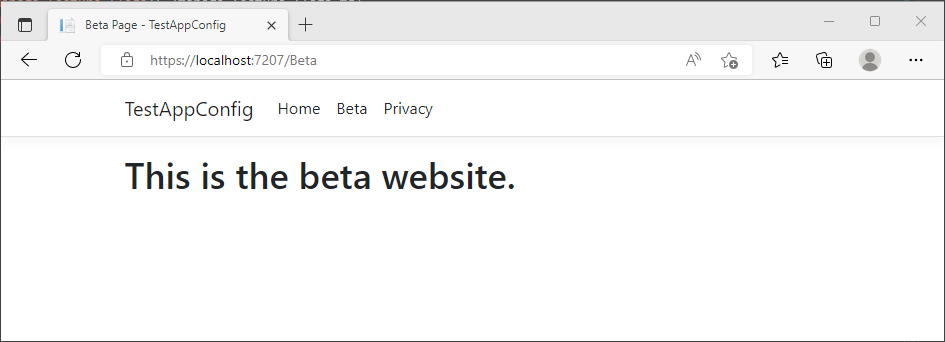

# Quickstart: Add feature flags to an ASP.NET Core app

In this quickstart, you'll create a feature flag in Azure App Configuration and use it to dynamically control the availability of a new web page in an ASP.NET Core app without restarting or redeploying it.

The feature management support extends the dynamic configuration feature in App Configuration. The example in this quickstart builds on the ASP.NET Core app introduced in the dynamic configuration tutorial. Before you continue, finish the [quickstart](./quickstart-aspnet-core-app.md), and the [tutorial](./enable-dynamic-configuration-aspnet-core.md) to create an ASP.NET Core app with dynamic configuration first.

## Prerequisites

Follow the documents to create an ASP.NET Core app with dynamic configuration.
- [Quickstart: Create an ASP.NET Core app with App Configuration](./quickstart-aspnet-core-app.md)
- [Tutorial: Use dynamic configuration in an ASP.NET Core app](./enable-dynamic-configuration-aspnet-core.md)

## Create a feature flag

Add a feature flag called *Beta* to the App Configuration store and leave **Label** and **Description** with their default values. For more information about how to add feature flags to a store using the Azure portal or the CLI, go to [Create a feature flag](./quickstart-azure-app-configuration-create.md#create-a-feature-flag).

> [!div class="mx-imgBorder"]
> 

## Use a feature flag

1. Navigate into the project's directory, and run the following command to add a reference to the [Microsoft.FeatureManagement.AspNetCore](https://www.nuget.org/packages/Microsoft.FeatureManagement.AspNetCore) NuGet package.

    ```dotnetcli
    dotnet add package Microsoft.FeatureManagement.AspNetCore
    ```

1. Open *Program.cs*, and add a call to the `UseFeatureFlags` method inside the `AddAzureAppConfiguration` call.

    #### [.NET 6.x](#tab/core6x)
    ```csharp
    // Load configuration from Azure App Configuration
    builder.Configuration.AddAzureAppConfiguration(options =>
    {
        options.Connect(connectionString)
               // Load all keys that start with `TestApp:` and have no label
               .Select("TestApp:*", LabelFilter.Null)
               // Configure to reload configuration if the registered sentinel key is modified
               .ConfigureRefresh(refreshOptions =>
                    refreshOptions.Register("TestApp:Settings:Sentinel", refreshAll: true));
        
        // Load all feature flags with no label
        options.UseFeatureFlags();
    });
    ```

    #### [.NET Core 3.x](#tab/core3x)
    ```csharp
    public static IHostBuilder CreateHostBuilder(string[] args) =>
        Host.CreateDefaultBuilder(args)
            .ConfigureWebHostDefaults(webBuilder =>
            {
                webBuilder.ConfigureAppConfiguration(config =>
                {
                    //Retrieve the Connection String from the secrets manager
                    IConfiguration settings = config.Build();
                    string connectionString = settings.GetConnectionString("AppConfig");

                    // Load configuration from Azure App Configuration
                    config.AddAzureAppConfiguration(options =>
                    {
                        options.Connect(connectionString)
                               // Load all keys that start with `TestApp:` and have no label
                               .Select("TestApp:*", LabelFilter.Null)
                               // Configure to reload configuration if the registered sentinel key is modified
                               .ConfigureRefresh(refreshOptions =>
                                    refreshOptions.Register("TestApp:Settings:Sentinel", refreshAll: true));

                        // Load all feature flags with no label
                        options.UseFeatureFlags();
                    });
                });

                webBuilder.UseStartup<Startup>();
            });
    ```
    ---

    > [!TIP]
    > When no parameter is passed to the `UseFeatureFlags` method, it loads *all* feature flags with *no label* in your App Configuration store. The default refresh expiration of feature flags is 30 seconds. You can customize this behavior via the `FeatureFlagOptions` parameter. For example, the following code snippet loads only feature flags that start with *TestApp:* in their *key name* and have the label *dev*. The code also changes the refresh expiration time to 5 minutes. Note that this refresh expiration time is separate from that for regular key-values.
    >
    > ```csharp
    > options.UseFeatureFlags(featureFlagOptions =>
    > {
    >     featureFlagOptions.Select("TestApp:*", "dev");
    >     featureFlagOptions.CacheExpirationInterval = TimeSpan.FromMinutes(5);
    > });
    > ```

1. Add feature management to the service collection of your app by calling `AddFeatureManagement`.

    #### [.NET 6.x](#tab/core6x)
    Update *Program.cs* with the following code. 

    ```csharp
    // Existing code in Program.cs
    // ... ...

    builder.Services.AddRazorPages();

    // Add Azure App Configuration middleware to the container of services.
    builder.Services.AddAzureAppConfiguration();

    // Add feature management to the container of services.
    builder.Services.AddFeatureManagement();

    // Bind configuration "TestApp:Settings" section to the Settings object
    builder.Services.Configure<Settings>(builder.Configuration.GetSection("TestApp:Settings"));

    var app = builder.Build();

    // The rest of existing code in program.cs
    // ... ...
    ```

    #### [.NET Core 3.x](#tab/core3x)
    Open *Startup.cs*, and update the `ConfigureServices` method.

    ```csharp
    public void ConfigureServices(IServiceCollection services)
    {
        services.AddRazorPages();

        // Add Azure App Configuration middleware to the container of services.
        services.AddAzureAppConfiguration();

        // Add feature management to the container of services.
        services.AddFeatureManagement();

        // Bind configuration "TestApp:Settings" section to the Settings object
        services.Configure<Settings>(Configuration.GetSection("TestApp:Settings"));
    }   
    ```
    ---

    Add `using Microsoft.FeatureManagement;` at the top of the file if it's not present.

1. Add a new empty Razor page named **Beta** under the *Pages* directory. It includes two files *Beta.cshtml* and *Beta.cshtml.cs*.

    Open *Beta.cshtml*, and update it with the following markup:

    ```cshtml
    @page
    @model TestAppConfig.Pages.BetaModel
    @{
        ViewData["Title"] = "Beta Page";
    }

    <h1>This is the beta website.</h1>
    ```

    Open *Beta.cshtml.cs*, and add `FeatureGate` attribute to the `BetaModel` class. The `FeatureGate` attribute ensures the *Beta* page is accessible only when the *Beta* feature flag is enabled. If the *Beta* feature flag isn't enabled, the page will return 404 Not Found.

    ```csharp
    using Microsoft.AspNetCore.Mvc.RazorPages;
    using Microsoft.FeatureManagement.Mvc;

    namespace TestAppConfig.Pages
    {
        [FeatureGate("Beta")]
        public class BetaModel : PageModel
        {
            public void OnGet()
            {
            }
        }
    }   
    ```

1. Open *Pages/_ViewImports.cshtml*, and register the feature manager Tag Helper using an `@addTagHelper` directive:

    ```cshtml
    @addTagHelper *, Microsoft.FeatureManagement.AspNetCore
    ```

    The preceding code allows the `<feature>` Tag Helper to be used in the project's *.cshtml* files.

1. Open *_Layout.cshtml* in the *Pages*\\*Shared* directory. Insert a new `<feature>` tag in between the *Home* and *Privacy* navbar items, as shown in the highlighted lines below.

    :::code language="html" source="../../includes/azure-app-configuration-navbar.md" range="15-38" highlight="13-17":::

    The `<feature>` tag ensures the *Beta* menu item is shown only when the *Beta* feature flag is enabled.

## Build and run the app locally

1. To build the app by using the .NET Core CLI, run the following command in the command shell:

    ```dotnetcli
    dotnet build
    ```

1. After the build successfully completes, run the following command to run the web app locally:

    ```dotnetcli
    dotnet run
    ```
1. Open a browser window, and go to the URL shown in the `dotnet run` output. Your browser should display a page similar to the image below.

    


1. Sign in to the [Azure portal](https://portal.azure.com). Select **All resources**, and select the App Configuration store that you created previously. 

1. Select **Feature manager** and locate the **Beta** feature flag. Enable the flag by selecting the checkbox under **Enabled**.

1. Refresh the browser a few times. When the cache expires after 30 seconds, the page shows with updated content.

    

1. Select the *Beta* menu. It will bring you to the beta website that you enabled dynamically.

    

## Clean up resources

[!INCLUDE[Azure App Configuration cleanup](../../includes/azure-app-configuration-cleanup.md)]

## Next steps

In this quickstart, you added feature management capability to an ASP.NET Core app on top of dynamic configuration. The [Microsoft.FeatureManagement.AspNetCore](https://www.nuget.org/packages/Microsoft.FeatureManagement.AspNetCore) library offers rich integration for ASP.NET Core apps, including feature management in MVC controller actions, razor pages, views, routes, and middleware. For more information, continue to the following tutorial.

> [!div class="nextstepaction"]
> [Use feature flags in ASP.NET Core apps](./use-feature-flags-dotnet-core.md)

While a feature flag allows you to activate or deactivate functionality in your app, you may want to customize a feature flag based on your app's logic. Feature filters allow you to enable a feature flag conditionally. For more information, continue to the following tutorial.

> [!div class="nextstepaction"]
> [Use feature filters for conditional feature flags](./howto-feature-filters-aspnet-core.md)

Azure App Configuration offers built-in feature filters that enable you to activate a feature flag only during a specific period or to a particular targeted audience of your app. For more information, continue to the following tutorial.

> [!div class="nextstepaction"]
> [Enable features for targeted audiences](./howto-targetingfilter-aspnet-core.md)

To enable feature management capability for other types of apps, continue to the following tutorials.

> [!div class="nextstepaction"]
> [Use feature flags in .NET apps](./quickstart-feature-flag-dotnet.md)

> [!div class="nextstepaction"]
> [Use feature flags in Azure Functions](./quickstart-feature-flag-azure-functions-csharp.md)

To learn more about managing feature flags in Azure App Configuration, continue to the following tutorial.

> [!div class="nextstepaction"]
> [Manage feature flags in Azure App Configuration](./manage-feature-flags.md)
