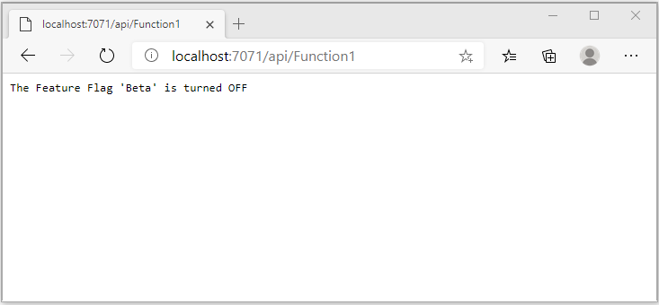
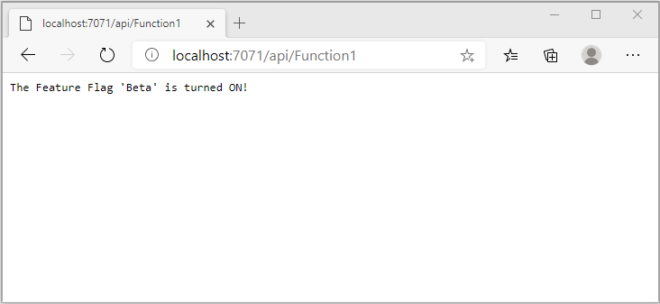

# Quickstart: Add feature flags to an Azure Functions app

In this quickstart, you create an Azure Functions app and use feature flags in it. You use the feature management from Azure App Configuration to centrally store all your feature flags and control their states.

The .NET Feature Management libraries extend the framework with feature flag support. These libraries are built on top of the .NET configuration system. They integrate with App Configuration through its .NET configuration provider.

## Prerequisites

- An Azure account with an active subscription. [Create one for free](https://azure.microsoft.com/free/).
- An App Configuration store. [Create a store](./quickstart-azure-app-configuration-create.md#create-an-app-configuration-store).
- [Visual Studio 2019](https://visualstudio.microsoft.com/vs) with the **Azure development** workload.
- [Azure Functions tools](../azure-functions/functions-develop-vs.md#check-your-tools-version)

## Add a feature flag

Add a feature flag called *Beta* to the App Configuration store and leave **Label** and **Description** with their default values. For more information about how to add feature flags to a store using the Azure portal or the CLI, go to [Create a feature flag](./quickstart-azure-app-configuration-create.md#create-a-feature-flag).

> [!div class="mx-imgBorder"]
> 

## Create a Functions app

[!INCLUDE [Create a project using the Azure Functions template](../../includes/functions-vstools-create.md)]

## Connect to an App Configuration store

This project will use [dependency injection in .NET Azure Functions](../azure-functions/functions-dotnet-dependency-injection.md). It adds Azure App Configuration as an extra configuration source where your feature flags are stored.

1. Right-click your project, and select **Manage NuGet Packages**. On the **Browse** tab, search for and add following NuGet packages to your project.
   - [Microsoft.Extensions.Configuration.AzureAppConfiguration](https://www.nuget.org/packages/Microsoft.Extensions.Configuration.AzureAppConfiguration/) version 4.1.0 or later
   - [Microsoft.FeatureManagement](https://www.nuget.org/packages/Microsoft.FeatureManagement/) version 2.2.0 or later
   - [Microsoft.Azure.Functions.Extensions](https://www.nuget.org/packages/Microsoft.Azure.Functions.Extensions/) version 1.1.0 or later 

2. Add a new file, *Startup.cs*, with the following code. It defines a class named `Startup` that implements the `FunctionsStartup` abstract class. An assembly attribute is used to specify the type name used during Azure Functions startup.

    ```csharp
    using System;
    using Microsoft.Azure.Functions.Extensions.DependencyInjection;
    using Microsoft.Extensions.Configuration;
    using Microsoft.FeatureManagement;

    [assembly: FunctionsStartup(typeof(FunctionApp.Startup))]

    namespace FunctionApp
    {
        class Startup : FunctionsStartup
        {
            public override void ConfigureAppConfiguration(IFunctionsConfigurationBuilder builder)
            {
            }

            public override void Configure(IFunctionsHostBuilder builder)
            {
            }
        }
    }
    ```


3. Update the `ConfigureAppConfiguration` method, and add Azure App Configuration provider as an extra configuration source by calling `AddAzureAppConfiguration()`. 

    The `UseFeatureFlags()` method tells the provider to load feature flags. All feature flags have a default cache expiration of 30 seconds before rechecking for changes. The expiration interval can be updated by setting the `FeatureFlagsOptions.CacheExpirationInterval` property passed to the `UseFeatureFlags` method. 

    ```csharp
    public override void ConfigureAppConfiguration(IFunctionsConfigurationBuilder builder)
    {
        builder.ConfigurationBuilder.AddAzureAppConfiguration(options =>
        {
            options.Connect(Environment.GetEnvironmentVariable("ConnectionString"))
                   .Select("_")
                   .UseFeatureFlags();
        });
    }
    ```

    > [!TIP]
    > If you don't want any configuration other than feature flags to be loaded to your application, you can call `Select("_")` to only load a nonexisting dummy key `"_"`. By default, all configuration key-values in your App Configuration store will be loaded if no `Select` method is called.

4. Update the `Configure` method to make Azure App Configuration services and feature manager available through dependency injection.

    ```csharp
    public override void Configure(IFunctionsHostBuilder builder)
    {
        builder.Services.AddAzureAppConfiguration();
        builder.Services.AddFeatureManagement();
    }
    ```

5. Open *Function1.cs*, and add the following namespaces.

    ```csharp
    using System.Linq;
    using Microsoft.FeatureManagement;
    using Microsoft.Extensions.Configuration.AzureAppConfiguration;
    ```

   Add a constructor used to obtain instances of `_featureManagerSnapshot` and `IConfigurationRefresherProvider` through dependency injection. From the `IConfigurationRefresherProvider`, you can obtain the instance of `IConfigurationRefresher`.

    ```csharp
    private readonly IFeatureManagerSnapshot _featureManagerSnapshot;
    private readonly IConfigurationRefresher _configurationRefresher;

    public Function1(IFeatureManagerSnapshot featureManagerSnapshot, IConfigurationRefresherProvider refresherProvider)
    {
        _featureManagerSnapshot = featureManagerSnapshot;
        _configurationRefresher = refresherProvider.Refreshers.First();
    }
    ```

6. Update the `Run` method to change the value of the displayed message depending on the state of the feature flag.

   The `TryRefreshAsync` method is called at the beginning of the Functions call to refresh feature flags. It will be a no-op if the cache expiration time window isn't reached. Remove the `await` operator if you prefer the feature flags to be refreshed without blocking the current Functions call. In that case, later Functions calls will get updated value.

    ```csharp
    [FunctionName("Function1")]
    public async Task<IActionResult> Run(
        [HttpTrigger(AuthorizationLevel.Anonymous, "get", "post", Route = null)] HttpRequest req,
        ILogger log)
    {
        log.LogInformation("C# HTTP trigger function processed a request.");

        await _configurationRefresher.TryRefreshAsync();

        string message = await _featureManagerSnapshot.IsEnabledAsync("Beta")
                ? "The Feature Flag 'Beta' is turned ON"
                : "The Feature Flag 'Beta' is turned OFF";

        return (ActionResult)new OkObjectResult(message);
    }
    ```

## Test the function locally

1. Set an environment variable named **ConnectionString**, where the value is the connection string you retrieved earlier in your App Configuration store under **Access Keys**. If you use the Windows command prompt, run the following command and restart the command prompt to allow the change to take effect:

    ```cmd
        setx ConnectionString "connection-string-of-your-app-configuration-store"
    ```

    If you use Windows PowerShell, run the following command:

    ```azurepowershell
        $Env:ConnectionString = "connection-string-of-your-app-configuration-store"
    ```

    If you use macOS or Linux, run the following command:

    ```bash
        export ConnectionString='connection-string-of-your-app-configuration-store'
    ```

1. Press F5 to test your function. If prompted, accept the request from Visual Studio to download and install **Azure Functions Core (CLI)** tools. You might also need to enable a firewall exception so that the tools can handle HTTP requests.

1. Copy the URL of your function from the Azure Functions runtime output.

    

1. Paste the URL for the HTTP request into your browser's address bar. The following image shows the response indicating that the feature flag `Beta` is disabled. 

    

1. Sign in to the [Azure portal](https://portal.azure.com). Select **All resources**, and select the App Configuration store that you created.

1. Select **Feature manager**, and change the state of the **Beta** key to **On**.

1. Refresh the browser a few times. When the cached feature flag expires after 30 seconds, the page should have changed to indicate the feature flag `Beta` is turned on, as shown in the image below.
 
    

> [!NOTE]
> The example code used in this tutorial can be downloaded from the [Azure App Configuration GitHub repo](https://github.com/Azure/AppConfiguration/tree/master/examples/DotNetCore/AzureFunction).

## Clean up resources

[!INCLUDE [azure-app-configuration-cleanup](../../includes/azure-app-configuration-cleanup.md)]

## Next steps

In this quickstart, you created a feature flag and used it with an Azure Functions app via the [Microsoft.FeatureManagement](https://www.nuget.org/packages/Microsoft.FeatureManagement/) library.

- Learn more about [feature management](./concept-feature-management.md)
- [Manage feature flags](./manage-feature-flags.md)
- [Use conditional feature flags](./howto-feature-filters-aspnet-core.md)
- [Enable staged rollout of features for targeted audiences](./howto-targetingfilter-aspnet-core.md)
- [Use dynamic configuration in an Azure Functions app](./enable-dynamic-configuration-azure-functions-csharp.md)
