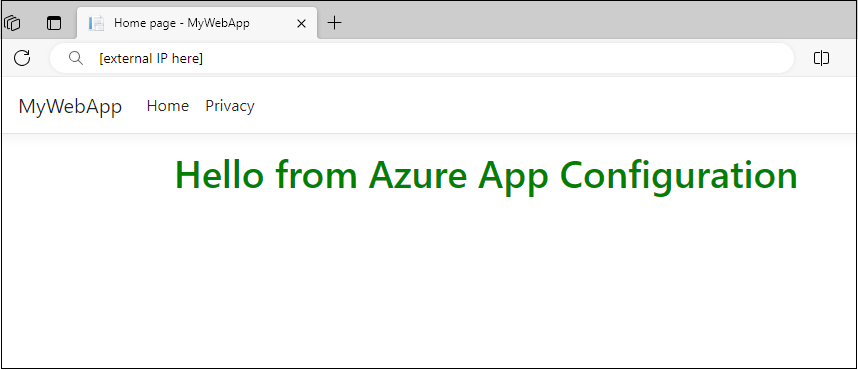
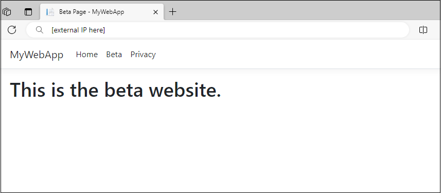

# Quickstart: Add feature flags to workloads in Azure Kubernetes Service

In this quickstart, you will add feature management capability to an ASP.NET Core app running in Azure Kubernetes Service (AKS). By leveraging Azure App Configuration and its Kubernetes Provider, you can dynamically control the availability of a new web page in an ASP.NET Core app without restarting or redeploying it.

## Prerequisites

Finish the [Create an application](./quickstart-azure-kubernetes-service.md#create-an-application) section in quickstart.

> [!TIP]
> The Azure Cloud Shell is a free, interactive shell that you can use to run the command line instructions in this article. It has common Azure tools preinstalled, including the .NET Core SDK. If you're logged in to your Azure subscription, launch your [Azure Cloud Shell](https://shell.azure.com) from shell.azure.com. You can learn more about Azure Cloud Shell by [reading our documentation](../cloud-shell/overview.md)
>

## Create an application running in AKS

In this section, you will use feature flags in a simple ASP.NET web application and run it in Azure Kubernetes Service (AKS). 

1. Navigate into the project's directory, and run the following command to add a reference to the [Microsoft.FeatureManagement.AspNetCore](https://www.nuget.org/packages/Microsoft.FeatureManagement.AspNetCore) NuGet package version 3.2.0 or later.

    ```dotnetcli
    dotnet add package Microsoft.FeatureManagement.AspNetCore
    ```

1. Open *program.cs* and add feature management to the service collection of your app by calling `AddFeatureManagement`.

    ```csharp   
    // Existing code in Program.cs
    // ... ...

    // Add a JSON configuration source 
    builder.Configuration.AddJsonFile("config/mysettings.json"); 

    // Add feature management to the container of services.
    builder.Services.AddFeatureManagement();

    var app = builder.Build();

    // The rest of existing code in program.cs
    // ... ...
    ```
    Add `using Microsoft.FeatureManagement;` at the top of the file if it's not present.

1. Add a new empty Razor page named **Beta** under the *Pages* directory. It includes two files *Beta.cshtml* and *Beta.cshtml.cs*.

    Open *Beta.cshtml*, and update it with the following markup:

    ```cshtml
    @page
    @model MyWebApp.Pages.BetaModel
    @{
        ViewData["Title"] = "Beta Page";
    }

    <h1>This is the beta website.</h1>
    ```

    Open *Beta.cshtml.cs*, and add `FeatureGate` attribute to the `BetaModel` class. The `FeatureGate` attribute ensures the *Beta* page is accessible only when the *Beta* feature flag is enabled. If the *Beta* feature flag isn't enabled, the page will return 404 Not Found.

    ```csharp
    using Microsoft.AspNetCore.Mvc.RazorPages;
    using Microsoft.FeatureManagement.Mvc;

    namespace MyWebApp.Pages
    {
        [FeatureGate("Beta")]
        public class BetaModel : PageModel
        {
            public void OnGet()
            {
            }
        }
    }   
    ```

1. Open *Pages/_ViewImports.cshtml*, and register the feature manager Tag Helper using an `@addTagHelper` directive:

    ```cshtml
    @addTagHelper *, Microsoft.FeatureManagement.AspNetCore
    ```

    The preceding code allows the `<feature>` Tag Helper to be used in the project's *.cshtml* files.

1. Open *_Layout.cshtml* in the *Pages*\\*Shared* directory. Insert a new `<feature>` tag in between the *Home* and *Privacy* navbar items, as shown in the highlighted lines below.

    :::code language="html" source="../../includes/azure-app-configuration-navbar.md" range="15-38" highlight="13-17":::

    The `<feature>` tag ensures the *Beta* menu item is shown only when the *Beta* feature flag is enabled.

1. [Containerize the application](./quickstart-azure-kubernetes-service.md#containerize-the-application) and [Push the image to Azure Container Registry](./quickstart-azure-kubernetes-service.md#push-the-image-to-azure-container-registry). 

1. [Deploy the application](./quickstart-azure-kubernetes-service.md#deploy-the-application)

## Use App Configuration Kubernetes Provider

Now that you have an application running in AKS, you'll deploy the App Configuration Kubernetes Provider to your AKS cluster running as a Kubernetes controller. The provider retrieves data from your App Configuration store and creates a ConfigMap, which is consumable as a JSON file mounted in a data volume.

### Setup the Azure App Configuration store

Add following key-values to the App Configuration store and leave **Label** and **Content Type** with their default values. For more information about how to add key-values to a store using the Azure portal or the CLI, go to [Create a key-value](./quickstart-azure-app-configuration-create.md#create-a-key-value).

|**Key**|**Value**|
|---|---|
|Settings:FontColor|*Green*|
|Settings:Message|*Hello from Azure App Configuration*|

### Create a feature flag

Add a feature flag called *Beta* to the App Configuration store and leave **Label** and **Description** with their default values. For more information about how to add feature flags to a store using the Azure portal or the CLI, go to [Create a feature flag](./quickstart-azure-app-configuration-create.md#create-a-feature-flag).

> [!div class="mx-imgBorder"]
> 

### Setup the App Configuration Kubernetes Provider
1. Run the following command to get access credentials for your AKS cluster. Replace the value of the `name` and `resource-group` parameters with your AKS instance:
   
    ```console
    az aks get-credentials --name <your-aks-instance-name> --resource-group <your-aks-resource-group>
    ```

1. Install Azure App Configuration Kubernetes Provider to your AKS cluster using `helm`:
   
    ```console
    helm install azureappconfiguration.kubernetesprovider \
         oci://mcr.microsoft.com/azure-app-configuration/helmchart/kubernetes-provider \
         --namespace azappconfig-system \
         --create-namespace
    ```

1. Add an *appConfigurationProvider.yaml* file to the *Deployment* directory with the following content to create an `AzureAppConfigurationProvider` resource. `AzureAppConfigurationProvider` is a custom resource that defines what data to download from an Azure App Configuration store and creates a ConfigMap.
   
    ```yaml
    apiVersion: azconfig.io/v1
    kind: AzureAppConfigurationProvider
    metadata:
      name: appconfigurationprovider-sample
    spec:
      endpoint: <your-app-configuration-store-endpoint>
      target:
        configMapName: configmap-created-by-appconfig-provider
        configMapData: 
          type: json
          key: mysettings.json
      auth:
        workloadIdentity:
          managedIdentityClientId: <your-managed-identity-client-id>
      featureFlag:
        selectors:
          - keyFilter: 'Beta'
        refresh:
          enabled: true
    ```

    Replace the value of the `endpoint` field with the endpoint of your Azure App Configuration store. Follow the steps in [use workload identity](./reference-kubernetes-provider.md#use-workload-identity) and update the `auth` section with the client ID of the user-assigned managed identity you created.
    
    > [!NOTE]
    > `AzureAppConfigurationProvider` is a declarative API object. It defines the desired state of the ConfigMap created from the data in your App Configuration store with the following behavior:
    >
    > - The ConfigMap will fail to be created if a ConfigMap with the same name already exists in the same namespace.
    > - The ConfigMap will be reset based on the present data in your App Configuration store if it's deleted or modified by any other means.
    > - The ConfigMap will be deleted if the App Configuration Kubernetes Provider is uninstalled.

1. Update the *deployment.yaml* file in the *Deployment* directory to use the ConfigMap `configmap-created-by-appconfig-provider` as a mounted data volume. It is important to ensure that the `volumeMounts.mountPath` matches the `WORKDIR` specified in *Dockerfile* and the *config* directory you created before.
   
    ```yaml
    apiVersion: apps/v1
    kind: Deployment
    metadata:
      name: aspnetapp-demo
      labels:
        app: aspnetapp-demo
    spec:
      replicas: 1
      selector:
        matchLabels:
          app: aspnetapp-demo
      template:
        metadata:
          labels:
            app: aspnetapp-demo
        spec:
          containers:
          - name: aspnetapp
            image: myregistry.azurecr.io/aspnetapp:v1
            ports:
            - containerPort: 80
            volumeMounts:
            - name: config-volume
              mountPath: /app/config
            env:
            - name: DOTNET_USE_POLLING_FILE_WATCHER
            value: "true"
          volumes:
          - name: config-volume 
            configMap: 
              name: configmap-created-by-appconfig-provider
              items:
              - key: mysettings.json
                path: mysettings.json
    ```

1. Run the following command to deploy the application to the AKS cluster.

    ```console
    kubectl apply -f ./Deployment -n appconfig-demo
    ```

1. Refresh the browser. The page shows updated content.

    

1. Update the **Beta** feature flag in your App Configuration store. Enable the flag by selecting the checkbox under **Enabled**.

1. After refreshing the browser a few times, you will see the updated content once the ConfigMap is updated in 30 seconds.

    

1. Select the **Beta** menu. It will bring you to the beta website that you enabled dynamically.

    

## Clean up resources

Uninstall the App Configuration Kubernetes Provider from your AKS cluster if you want to keep the AKS cluster.

```console
helm uninstall azureappconfiguration.kubernetesprovider --namespace azappconfig-system
```

[!INCLUDE[Azure App Configuration cleanup](../../includes/azure-app-configuration-cleanup.md)]

## Next steps

In this quickstart, you:

* Added feature management capability to an ASP.NET Core app running in Azure Kubernetes Service (AKS).
* Connected your AKS cluster to your App Configuration store using the App Configuration Kubernetes Provider.
* Created a ConfigMap with data from your App Configuration store.
* Ran the application with dynamic configuration from your App Configuration store without changing your application code.

To learn more about how to update your AKS workloads to dynamically refresh configuration, see the tutorial.

> [!div class="nextstepaction"]
> [Use dynamic configuration in Azure Kubernetes Service](./enable-dynamic-configuration-azure-kubernetes-service.md)


To learn more about the Azure App Configuration Kubernetes Provider, see [Azure App Configuration Kubernetes Provider reference](./reference-kubernetes-provider.md).