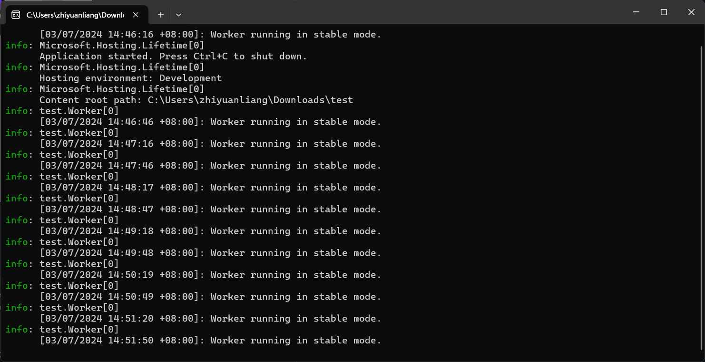
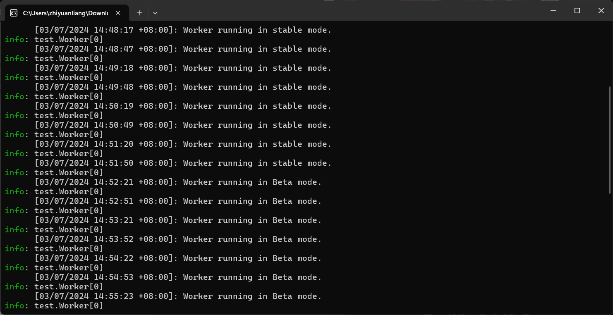

# Quickstart: Add feature flags to a .NET background service

In this quickstart, you incorporate the feature management capability from Azure App Configuration into a .NET background service. You use App Configuration to centrally store and manage your feature flags.

## Prerequisites

Feature management support extends the dynamic configuration feature in App Configuration. The example in this quickstart builds on the .NET background service app introduced in the dynamic configuration tutorial. Before you continue, finish the following tutorial to create a .NET background service app with dynamic configuration first.

- [Tutorial: Use dynamic configuration in a .NET background service](./enable-dynamic-configuration-dotnet-background-service.md)

## Add a feature flag

Add a feature flag called *Beta* to the App Configuration store and leave **Label** and **Description** with their default values. For more information about how to add feature flags to a store using the Azure portal or the CLI, go to [Create a feature flag](./manage-feature-flags.md#create-a-feature-flag).

> [!div class="mx-imgBorder"]
> 

## Use the feature flag

1. Add references to the `Microsoft.FeatureManagement` NuGet package by running the following command:

    ```dotnetcli
    dotnet add package Microsoft.FeatureManagement
    ```

1. Run the following command to restore packages for your project:

    ```dotnetcli
    dotnet restore
    ```

1. Open *Program.cs* and add the following statement:

    ```csharp
    using Microsoft.FeatureManagement;
    ```

1. Add a call to the `UseFeatureFlags` method inside the `AddAzureAppConfiguration` call and register feature management services.

    ```csharp
    // Existing code in Program.cs
    // ... ...

    builder.Configuration.AddAzureAppConfiguration(options =>
    {
        options.Connect(Environment.GetEnvironmentVariable("ConnectionString"));

        // Use feature flags
        options.UseFeatureFlags();

        // Register the refresher so that the Worker service can consume it through dependency injection
        builder.Services.AddSingleton(options.GetRefresher());
    });

    // Register feature management services
    builder.Services.AddFeatureManagement();

    // The rest of existing code in Program.cs
    // ... ...
    ```

    > [!TIP]
    > When no parameter is passed to the `UseFeatureFlags` method, it loads *all* feature flags with *no label* in your App Configuration store. The default refresh interval of feature flags is 30 seconds. You can customize this behavior via the `FeatureFlagOptions` parameter. For example, the following code snippet loads only feature flags that start with *TestApp:* in their *key name* and have the label *dev*. The code also changes the refresh interval time to 5 minutes. Note that this refresh interval time is separate from that for regular key-values.
    >
    > ```csharp
    > options.UseFeatureFlags(featureFlagOptions =>
    > {
    >     featureFlagOptions.Select("TestApp:*", "dev");
    >     featureFlagOptions.CacheExpirationInterval = TimeSpan.FromMinutes(5);
    > });
    > ```

1. Open *Worker.cs* and add the following statement:

    ```csharp
    using Microsoft.FeatureManagement;
    ```

1. Update the constructor of the `Worker` service to obtain instances of `IConfigurationRefresher` and `IFeatureManager` through dependency injection.

    ```csharp
    public class Worker : BackgroundService
    {
        private readonly ILogger<Worker> _logger;
        private readonly IConfigurationRefresher _refresher;
        private readonly IFeatureManager _featureManager;

        public Worker(ILogger<Worker> logger, IConfigurationRefresher refresher, IFeatureManager featureManager)
        {
            _logger = logger ?? throw new ArgumentNullException(nameof(logger));
            _refresher = refresher ?? throw new ArgumentNullException(nameof(refresher));
            _featureManager = featureManager ?? throw new ArgumentNullException(nameof(featureManager));
        }

        // ... ...
    }
    ```

1. Update the `ExecuteAsync` method to log a message depending on the state of the feature flag. 

    The `TryRefreshAsync` method is called at the beginning of every iteration of the task execution to refresh the feature flag. It will be a no-op if the refresh interval time window isn't reached. The `await` operator is not used so that the feature flags are refreshed without blocking the current iteration of the task execution. In that case, later iterations of the task execution will get updated value.

    ```csharp
    protected override async Task ExecuteAsync(CancellationToken stoppingToken)
    {
        while (!stoppingToken.IsCancellationRequested)
        {
            // Intentionally not await TryRefreshAsync to avoid blocking the execution.
            _refresher.TryRefreshAsync(stoppingToken);

            if (_logger.IsEnabled(LogLevel.Information))
            {
                if (await _featureManager.IsEnabledAsync("Beta"))
                {
                    _logger.LogInformation("[{time}]: Worker is running with Beta feature.", DateTimeOffset.Now);
                }
                else
                {
                    _logger.LogInformation("[{time}]: Worker is running.", DateTimeOffset.Now);
                }
            }
            
            await Task.Delay(TimeSpan.FromSeconds(30), stoppingToken);
        }
    }
    ```

## Build and run the app locally

1. Run the following command to build the app:

    ```dotnetcli
    dotnet build
    ```

1. After the build successfully completes, run the following command to run the app locally:


    ```dotnetcli
    dotnet run
    ```

1. You should see the following outputs in the console.

    

1. Sign in to the [Azure portal](https://portal.azure.com). Select **All resources**, and select the App Configuration store that you created previously. 

1. Select **Feature manager** and locate the **Beta** feature flag. Enable the flag by selecting the checkbox under **Enabled**.

1. Wait a few moments for the refresh interval time window to pass. You will see the updated log message.

    

## Clean up resources

[!INCLUDE [azure-app-configuration-cleanup](../../includes/azure-app-configuration-cleanup.md)]

## Next steps

To enable feature management capability for other types of apps, continue to the following tutorials.

> [!div class="nextstepaction"]
> [Use feature flags in .NET console apps](./quickstart-feature-flag-dotnet.md)

> [!div class="nextstepaction"]
> [Use feature flags in ASP.NET Core apps](./quickstart-feature-flag-aspnet-core.md)

To learn more about managing feature flags in Azure App Configuration, continue to the following tutorial.

> [!div class="nextstepaction"]
> [Manage feature flags in Azure App Configuration](./manage-feature-flags.md)
