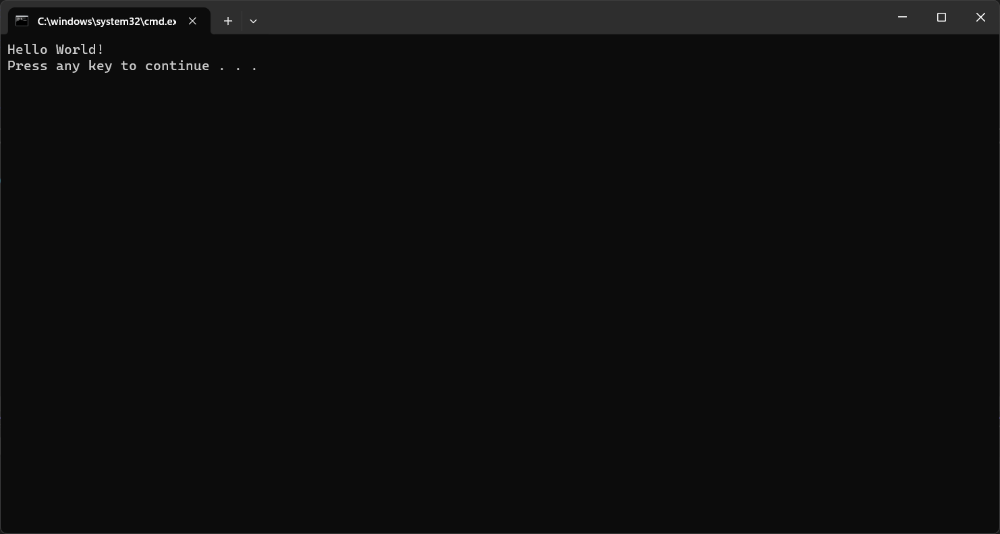

# Quickstart: Add feature flags to a .NET/.NET Framework console app

In this quickstart, you incorporate Azure App Configuration into a .NET console app to create an end-to-end implementation of feature management. You can use the App Configuration service to centrally store all your feature flags and control their states. 

The .NET Feature Management libraries extend the framework with feature flag support. These libraries are built on top of the .NET configuration system. They integrate with App Configuration through its .NET configuration provider.

## Prerequisites

- An Azure account with an active subscription. [Create one for free](https://azure.microsoft.com/free/).
- An App Configuration store. [Create a store](./quickstart-azure-app-configuration-create.md#create-an-app-configuration-store).
- [.NET SDK 6.0 or later](https://dotnet.microsoft.com/download) - also available in the [Azure Cloud Shell](https://shell.azure.com).

If you want to use .NET Framework, please install the following things.

- [Visual Studio](https://visualstudio.microsoft.com/vs)
- [.NET Framework 4.7.2 or later](https://dotnet.microsoft.com/download/dotnet-framework)

## Add a feature flag

Add a feature flag called *Beta* to the App Configuration store and leave **Label** and **Description** with their default values. For more information about how to add feature flags to a store using the Azure portal or the CLI, go to [Create a feature flag](./quickstart-azure-app-configuration-create.md#create-a-feature-flag).

> [!div class="mx-imgBorder"]
> 

## Create a .NET console app

### [.NET](#tab/dotnet)

You can use the [.NET command-line interface (CLI)](/dotnet/core/tools/) to create a new .NET console app project. The advantage of using the .NET CLI over Visual Studio is that it's available across the Windows, macOS, and Linux platforms.  Alternatively, use the preinstalled tools available in the [Azure Cloud Shell](https://shell.azure.com).

1. Create a new folder for your project.

1. In the new folder, run the following command to create a new .NET console app project:

    ```dotnetcli
    dotnet new console
    ```

### [.NET Framework](#tab/dotnet-framework)

You can use Visual Studio to create a new .NET Framework console app project.

1. Start Visual Studio, and select **File** > **New** > **Project**.

1. In **Create a new project**, filter on the **Console** project type and click on **Console App (.NET Framework)**. Click **Next**.

1. In **Configure your new project**, enter a project name. Under **Framework**, select **.NET Framework 4.8** or higher. Click **Create**.

---

## Use feature flag

### [.NET](#tab/dotnet)

1. Add references to the `Microsoft.Extensions.Configuration.AzureAppConfiguration` and `Microsoft.FeatureManagement` NuGet packages by running the following commands.

    ```dotnetcli
    dotnet add package Microsoft.Extensions.Configuration.AzureAppConfiguration
    dotnet add package Microsoft.FeatureManagement
    ```

1. Run the following command to restore packages for your project.

    ```dotnetcli
    dotnet restore
    ```

1. Open *Program.cs* and add the following statements.

    ```csharp
    using Microsoft.Extensions.Configuration;
    using Microsoft.Extensions.Configuration.AzureAppConfiguration;
    using Microsoft.FeatureManagement;
    ```

1. Connect to App Configuration, specifying the `UseFeatureFlags` option so that feature flags are retrieved. Create a `ConfigurationFeatureDefinitionProvider` to provide feature flag definition from the configuration and a `FeatureManager` to evaluate feature flags' state. Then display a message if the `Beta` feature flag is enabled.

    ```csharp
        IConfiguration configuration = new ConfigurationBuilder()
            .AddAzureAppConfiguration(options =>
            {
                options.Connect(Environment.GetEnvironmentVariable("ConnectionString"))
                    .UseFeatureFlags();
            }).Build();

        IFeatureDefinitionProvider featureDefinitionProvider = new ConfigurationFeatureDefinitionProvider(configuration);

        IFeatureManager featureManager = new FeatureManager(
            featureDefinitionProvider, 
            new FeatureManagementOptions());

        if (await featureManager.IsEnabledAsync("Beta"))
        {
            Console.WriteLine("Welcome to the beta!");
        }

        Console.WriteLine("Hello World!");
    ```

### [.NET Framework](#tab/dotnet-framework)

1. Right-click your project, and select **Manage NuGet Packages**. On the **Browse** tab, search and add the following NuGet packages to your project.

    ```
    Microsoft.Extensions.Configuration.AzureAppConfiguration
    Microsoft.FeatureManagement
    ```

1. Open *Program.cs* and add the following statements.

    ```csharp
    using Microsoft.Extensions.Configuration;
    using Microsoft.Extensions.Configuration.AzureAppConfiguration;
    using Microsoft.FeatureManagement;
    using System.Threading.Tasks;
    ```

1. Update the `Main` method to connect to App Configuration, specifying the `UseFeatureFlags` option so that feature flags are retrieved. Create a `ConfigurationFeatureDefinitionProvider` to provide feature flag definitions from the configuration and a `FeatureManager` to evaluate feature flags' state. Then display a message if the `Beta` feature flag is enabled.

    ```csharp
        public static async Task Main(string[] args)
        {         
            IConfiguration configuration = new ConfigurationBuilder()
                .AddAzureAppConfiguration(options =>
                {
                    options.Connect(Environment.GetEnvironmentVariable("ConnectionString"))
                           .UseFeatureFlags();
                }).Build();

            IFeatureDefinitionProvider featureDefinitionProvider = new ConfigurationFeatureDefinitionProvider(configuration);

            IFeatureManager featureManager = new FeatureManager(
                featureDefinitionProvider, 
                new FeatureManagementOptions());

            if (await featureManager.IsEnabledAsync("Beta"))
            {
                Console.WriteLine("Welcome to the beta!");
            }

            Console.WriteLine("Hello World!");
        }
    ```

---

## Build and run the app locally

1. Set an environment variable named **ConnectionString** to the connection string of your App Configuration store. If you use the Windows command prompt, run the following command.

    ### [Windows command prompt](#tab/windowscommandprompt)

    To build and run the app locally using the Windows command prompt, run the following command:

    ```console
    setx ConnectionString "connection-string-of-your-app-configuration-store"
    ```

    Restart the command prompt to allow the change to take effect. Print the value of the environment variable to validate that it's set properly.

    ### [PowerShell](#tab/powershell)

    If you use Windows PowerShell, run the following command.

    ```azurepowershell
    $Env:ConnectionString = "connection-string-of-your-app-configuration-store"
    ```

    ### [macOS](#tab/unix)

    If you use macOS, run the following command.

    ```console
    export ConnectionString='connection-string-of-your-app-configuration-store'
    ```

    Restart the command prompt to allow the change to take effect. Print the value of the environment variable to validate that it's set properly.

    ### [Linux](#tab/linux)

    If you use Linux, run the following command.

    ```console
    export ConnectionString='connection-string-of-your-app-configuration-store'
    ```

    Restart the command prompt to allow the change to take effect. Print the value of the environment variable to validate that it's set properly.

    ---

1. Build and run the application.

    ### [.NET](#tab/dotnet)

    - Run the following command to build the console app.

        ```dotnetcli
        dotnet build
        ```

    - After the build successfully completes, run the following command to run the app locally.

        ```dotnetcli
        dotnet run
        ```

    ### [.NET Framework](#tab/dotnet-framework)    

    - Restart Visual Studio to allow the change to take effect. 

    - Press Ctrl + F5 to build and run the console app.

    ---

1. You should see the following outputs in the console.

    

1. Sign in to the [Azure portal](https://portal.azure.com). Select **All resources**, and select the App Configuration store that you created previously. 

1. Select **Feature manager** and locate the **Beta** feature flag. Enable the flag by selecting the checkbox under **Enabled**.

1. Run the application again. You should see the Beta message in the console.

    

## Clean up resources

[!INCLUDE [azure-app-configuration-cleanup](../../includes/azure-app-configuration-cleanup.md)]

## Next steps

In this quickstart, you created a feature flag in App Configuration and used it with a .NET Framework console app. To learn how to dynamically update feature flags and other configuration values without restarting the application, continue to the next tutorial.

> [!div class="nextstepaction"]
> [Enable dynamic configuration](./enable-dynamic-configuration-dotnet.md)
