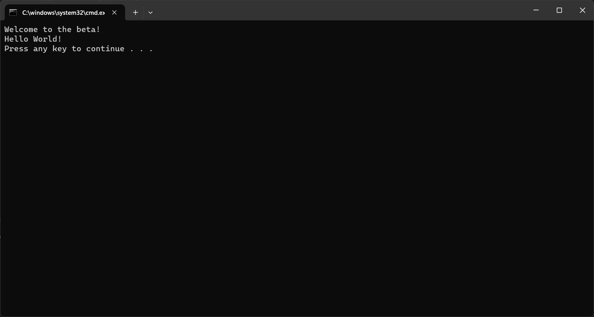

# Quickstart: Add feature flags to a .NET Framework app

In this quickstart, you incorporate Azure App Configuration into a .NET Framework app to create an end-to-end implementation of feature management. You can use the App Configuration service to centrally store all your feature flags and control their states. 

The .NET Feature Management libraries extend the framework with feature flag support. These libraries are built on top of the .NET configuration system. They integrate with App Configuration through its .NET configuration provider.

## Prerequisites

- An Azure account with an active subscription. [Create one for free](https://azure.microsoft.com/free/).
- An App Configuration store. [Create a store](./quickstart-azure-app-configuration-create.md#create-an-app-configuration-store).
- [Visual Studio 2019](https://visualstudio.microsoft.com/vs)
- [.NET Framework 4.8](https://dotnet.microsoft.com/download)

## Add a feature flag

Add a feature flag called *Beta* to the App Configuration store and leave **Label** and **Description** with their default values. For more information about how to add feature flags to a store using the Azure portal or the CLI, go to [Create a feature flag](./quickstart-azure-app-configuration-create.md#create-a-feature-flag).

> [!div class="mx-imgBorder"]
> 

## Create a .NET console app

1. Start Visual Studio, and select **File** > **New** > **Project**.

1. In **Create a new project**, filter on the **Console** project type and click on **Console App (.NET Framework)**. Click **Next**.

1. In **Configure your new project**, enter a project name. Under **Framework**, select **.NET Framework 4.8** or higher. Click **Create**.

## Connect to an App Configuration store

1. Right-click your project, and select **Manage NuGet Packages**. On the **Browse** tab, search and add the following NuGet packages to your project.

    ```
    Microsoft.Extensions.DependencyInjection
    Microsoft.Extensions.Configuration.AzureAppConfiguration
    Microsoft.FeatureManagement
    ```

1. Open *Program.cs* and add the following statements:

    ```csharp
    using Microsoft.Extensions.DependencyInjection;
    using Microsoft.Extensions.Configuration;
    using Microsoft.Extensions.Configuration.AzureAppConfiguration;
    using Microsoft.FeatureManagement;
    using System.Threading.Tasks;
    ```

1. Update the `Main` method to connect to App Configuration, specifying the `UseFeatureFlags` option so that feature flags are retrieved. Then display a message if the `Beta` feature flag is enabled.

    ```csharp
        public static async Task Main(string[] args)
        {         
            IConfigurationRoot configuration = new ConfigurationBuilder()
                .AddAzureAppConfiguration(options =>
                {
                    options.Connect(Environment.GetEnvironmentVariable("ConnectionString"))
                           .UseFeatureFlags();
                }).Build();

            IServiceCollection services = new ServiceCollection();

            services.AddSingleton<IConfiguration>(configuration).AddFeatureManagement();

            using (ServiceProvider serviceProvider = services.BuildServiceProvider())
            {
                IFeatureManager featureManager = serviceProvider.GetRequiredService<IFeatureManager>();

                if (await featureManager.IsEnabledAsync("Beta"))
                {
                    Console.WriteLine("Welcome to the beta!");
                }
            }

            Console.WriteLine("Hello World!");
            Console.WriteLine("Press any key to continue ...");
            Console.Read();
        }
    ```

## Build and run the app locally

1. Set an environment variable named **ConnectionString** to the connection string of your App Configuration store. If you use the Windows command prompt, run the following command:

    ```console
        setx ConnectionString "connection-string-of-your-app-configuration-store"
    ```

    If you use Windows PowerShell, run the following command:

    ```powershell
        $Env:ConnectionString = "connection-string-of-your-app-configuration-store"
    ```

1. Restart Visual Studio to allow the change to take effect. 

1. Press Ctrl + F5 to build and run the console app.

    

## Clean up resources

[!INCLUDE [azure-app-configuration-cleanup](../../includes/azure-app-configuration-cleanup.md)]

## Next steps

In this quickstart, you created a feature flag in App Configuration and used it with a .NET Framework console app. To learn how to dynamically update feature flags and other configuration values without restarting the application, continue to the next tutorial.

> [!div class="nextstepaction"]
> [Enable dynamic configuration](./enable-dynamic-configuration-dotnet.md)
