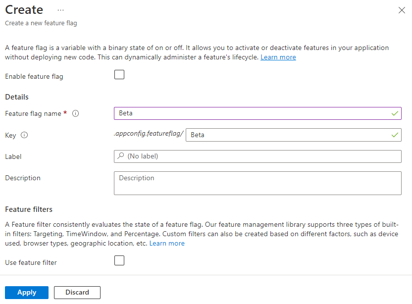

# Quickstart: Add feature flags to a Node.js console app

In this quickstart, you incorporate Azure App Configuration into a Node.js console app to create an end-to-end implementation of feature management. You can use App Configuration to centrally store all your feature flags and control their states.

The JavaScript Feature Management libraries extend the framework with feature flag support. They seamlessly integrate with App Configuration through its JavaScript configuration provider. As an example, this tutorial shows how to use the JavaScript Feature Management in a Node.js app.

## Prerequisites

- An Azure account with an active subscription. [Create one for free](https://azure.microsoft.com/free/).
- An App Configuration store. [Create a store](./quickstart-azure-app-configuration-create.md#create-an-app-configuration-store).
- [LTS versions of Node.js](https://github.com/nodejs/release#release-schedule). For information about installing Node.js either directly on Windows or using the Windows Subsystem for Linux (WSL), see [Get started with Node.js](/windows/dev-environment/javascript/nodejs-overview)

## Add a feature flag

Add a feature flag called *Beta* to the App Configuration store and leave **Label** and **Description** with their default values. For more information about how to add feature flags to a store using the Azure portal or the CLI, go to [Create a feature flag](./manage-feature-flags.md#create-a-feature-flag).

> [!div class="mx-imgBorder"]
> 


## Use the feature flag

1. Install the Feature Management by using the `npm install` command.

    ``` console
    npm install @microsoft/feature-management
    ```

1. Create a file named *app.js* and add the following code.

    ### [Microsoft Entra ID (recommended)](#tab/entra-id)
    You use the `DefaultAzureCredential` to authenticate to your App Configuration store. Follow the [instructions](./concept-enable-rbac.md#authentication-with-token-credentials) to assign your credential the **App Configuration Data Reader** role. Be sure to allow sufficient time for the permission to propagate before running your application.

    ``` javascript
    const sleepInMs = require("util").promisify(setTimeout);
    const { load } = require("@azure/app-configuration-provider");
    const { DefaultAzureCredential } = require("@azure/identity");
    const { FeatureManager, ConfigurationMapFeatureFlagProvider} = require("@microsoft/feature-management");
    const endpoint = process.env.AZURE_APPCONFIG_ENDPOINT;
    const credential = new DefaultAzureCredential(); // For more information, see https://learn.microsoft.com/azure/developer/javascript/sdk/credential-chains#use-defaultazurecredential-for-flexibility

    async function run() {
        // Connect to Azure App Configuration using endpoint and token credential
        const settings = await load(endpoint, credential, {
            featureFlagOptions: {
                enabled: true,
                // Note: selectors must be explicitly provided for feature flags.
                selectors: [{
                    keyFilter: "*"
                }],
                refresh: {
                    enabled: true,
                    refreshIntervalInMs: 10_000
                }
            }
        });

        // Create a feature flag provider which uses a map as feature flag source
        const ffProvider = new ConfigurationMapFeatureFlagProvider(settings);
        // Create a feature manager which will evaluate the feature flag
        const fm = new FeatureManager(ffProvider);

        while (true) {
            await settings.refresh(); // Refresh to get the latest feature flag settings
            const isEnabled = await fm.isEnabled("Beta"); // Evaluate the feature flag
            console.log(`Beta is enabled: ${isEnabled}`);
            await sleepInMs(5000);
        }
    }

    run().catch(console.error);
    ```

    ### [Connection string](#tab/connection-string)
    ``` javascript
    const sleepInMs = require("util").promisify(setTimeout);
    const { load } = require("@azure/app-configuration-provider");
    const { FeatureManager, ConfigurationMapFeatureFlagProvider} = require("@microsoft/feature-management");
    const connectionString = process.env.AZURE_APPCONFIG_CONNECTION_STRING;

    async function run() {
        // Connect to Azure App Configuration using connection string
        const settings = await load(connectionString, {
            featureFlagOptions: {
                enabled: true,
                // Note: selectors must be explicitly provided for feature flags.
                selectors: [{
                    keyFilter: "*"
                }],
                refresh: {
                    enabled: true,
                    refreshIntervalInMs: 10_000
                }
            }
        });

        // Create a feature flag provider which uses a map as feature flag source
        const ffProvider = new ConfigurationMapFeatureFlagProvider(settings);
        // Create a feature manager which will evaluate the feature flag
        const fm = new FeatureManager(ffProvider);

        while (true) {
            await settings.refresh(); // Refresh to get the latest feature flag settings
            const isEnabled = await fm.isEnabled("Beta"); // Evaluate the feature flag
            console.log(`Beta is enabled: ${isEnabled}`);
            await sleepInMs(5000);
        }
    }

    run().catch(console.error);
    ```

    ---

## Run the application

1. Set the environment variable.

    ### [Microsoft Entra ID (recommended)](#tab/entra-id)
    Set the environment variable named **AZURE_APPCONFIG_ENDPOINT** to the endpoint of your App Configuration store found under the *Overview* of your store in the Azure portal.

    If you use the Windows command prompt, run the following command and restart the command prompt to allow the change to take effect:

    ```cmd
    setx AZURE_APPCONFIG_ENDPOINT "<endpoint-of-your-app-configuration-store>"
    ```

    If you use PowerShell, run the following command:

    ```powershell
    $Env:AZURE_APPCONFIG_ENDPOINT = "<endpoint-of-your-app-configuration-store>"
    ```

    If you use macOS or Linux, run the following command:

    ```bash
    export AZURE_APPCONFIG_ENDPOINT='<endpoint-of-your-app-configuration-store>'
    ```

    ### [Connection string](#tab/connection-string)
    Set the environment variable named **AZURE_APPCONFIG_CONNECTION_STRING** to the read-only connection string of your App Configuration store found under *Access keys* of your store in the Azure portal.

    If you use the Windows command prompt, run the following command and restart the command prompt to allow the change to take effect:

    ```cmd
    setx AZURE_APPCONFIG_CONNECTION_STRING "<connection-string-of-your-app-configuration-store>"
    ```

   If you use PowerShell, run the following command:

    ```powershell
    $Env:AZURE_APPCONFIG_CONNECTION_STRING = "<connection-string-of-your-app-configuration-store>"
    ```

    If you use macOS or Linux, run the following command:

    ```bash
    export AZURE_APPCONFIG_CONNECTION_STRING='<connection-string-of-your-app-configuration-store>'
    ```
    
    ---

1. Run the following command to run the app locally:

    ``` console
    node app.js
    ```

1. You will see the following console outputs because the *Beta* feature flag is disabled.

    ``` console
    Beta is enabled: false
    ```

1. Sign in to the [Azure portal](https://portal.azure.com). Select **All resources**, and select the App Configuration store that you created previously. 

1. Select **Feature manager** and locate the *Beta* feature flag. Enable the flag by selecting the checkbox under **Enabled**.

1. Wait for a few seconds and you will see the console outputs change.

    ``` console
    Beta is enabled: true
    ```