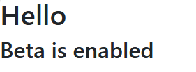

# Quickstart: Add feature flags to a Python app

 In this quickstart, you'll create a feature flag in Azure App Configuration and use it to dynamically control Python apps to create an end-to-end implementation of feature management.

The feature management support extends the dynamic configuration feature in App Configuration. These examples in the quickstart build on thePpython apps introduced in the dynamic configuration tutorial. Before you continue, finish the [quickstart](./quickstart-python-provider.md) and the [tutorial](./enable-dynamic-configuration-python.md) to create python apps with dynamic configuration first.

This library does **not** have a dependency on any Azure libraries. They seamlessly integrate with App Configuration through its Python configuration provider.

## Prerequisites

- An Azure account with an active subscription. [Create one for free](https://azure.microsoft.com/free/).
- An App Configuration store. [Create a store](./quickstart-azure-app-configuration-create.md#create-an-app-configuration-store).
- Python 3.8 or later - for information on setting up Python on Windows, see the [Python on Windows documentation](/windows/python/), otherwise see [python downloads](https://www.python.org/downloads/).
- [azure-appconfiguration-provider library](https://pypi.org/project/azure-appconfiguration-provider/) 1.2.0 or later.

## Add a feature flag

Add a feature flag called *Beta* to the App Configuration store and leave **Label** and **Description** with their default values. For more information about how to add feature flags to a store using the Azure portal or the CLI, go to [Create a feature flag](./manage-feature-flags.md#create-a-feature-flag). At this stage the Enable feature flag check bock should be unchecked.

> [!div class="mx-imgBorder"]
> 

## Console applications

1. Install Feature Management by using the `pip install` command.

    ```console
    pip install featuremanagement
    ```

1. Create a new python file called `app.py` and add the following code:

    ```python
    from featuremanagement import FeatureManager
    from azure.identity import InteractiveBrowserCredential
    from azure.appconfiguration.provider import load
    import os
    from time import sleep
    
    endpoint = os.environ["APP_CONFIGURATION_ENDPOINT"]
    
    # Connecting to Azure App Configuration using an endpoint
    # credential is used to authenticate the client, the InteractiveBrowserCredential is used for this sample. It will open a browser window to authenticate the user. For all credential options see [credential classes](https://github.com/Azure/azure-sdk-for-python/tree/main/sdk/identity/azure-identity#credential-classes).
    # feature_flag_enabled makes it so that the provider will load feature flags from Azure App Configuration
    # feature_flag_refresh_enabled makes it so that the provider will refresh feature flags from Azure App Configuration, when the refresh operation is triggered
    config = load(endpoint=endpoint, credential=InteractiveBrowserCredential(), feature_flag_enabled=True, feature_flag_refresh_enabled=True)
    
    feature_manager = FeatureManager(config)
    
    # Is always false
    print("Beta is ", feature_manager.is_enabled("Beta"))
    
    while not feature_manager.is_enabled("Beta"):
        sleep(5)
        config.refresh()
    
    print("Beta is ", feature_manager.is_enabled("Beta"))
    ```

When starting the application, a browser window will open to authenticate the user. The user must have at least the `App Configuration Data Reader` role to access the App Configuration store, see [App Configuration roles](./concept-enable-rbac.md#azure-built-in-roles-for-azure-app-configuration) for more info.

1. Set an environment variable named **APP_CONFIGURATION_ENDPOINT**, and set it to the endpoint to your App Configuration store. At the command line, run the following command and restart the command prompt to allow the change to take effect:

    ### [Windows command prompt](#tab/windowscommandprompt)

    To build and run the app locally using the Windows command prompt, run the following command:

    ```console
    setx APP_CONFIGURATION_ENDPOINT "endpoint-of-your-app-configuration-store"
    ```

    Restart the command prompt to allow the change to take effect. Validate that it's set properly by printing the value of the environment variable.

    ### [PowerShell](#tab/powershell)

    If you use Windows PowerShell, run the following command:

    ```azurepowershell
    $Env:APP_CONFIGURATION_ENDPOINT = "endpoint-of-your-app-configuration-store"
    ```

    ### [macOS](#tab/unix)

    If you use macOS, run the following command:

    ```console
    export APP_CONFIGURATION_ENDPOINT='endpoint-of-your-app-configuration-store'
    ```

    Restart the command prompt to allow the change to take effect. Validate that it's set properly by printing the value of the environment variable.

    ### [Linux](#tab/linux)

    If you use Linux, run the following command:

    ```console
    export APP_CONFIGURATION_ENDPOINT='endpoint-of-your-app-configuration-store'
    ```

    Restart the command prompt to allow the change to take effect. Validate that it's set properly by printing the value of the environment variable.

    ---

1. Run the python application.

    ```shell
    python app.py
    ```

1. In the App Configuration portal select **Feature Manager**, and change the state of the **Beta** feature flag to **On**, using the toggle in the **Enabled** column.

    | Key | State |
    |---|---|
    | Beta | On |

1. After about 30s, which is the refresh interval for the provider, the application will print the following:

    ```console
    Beta is True
    ```

## Web applications

The following example shows how to update an existing web application, using Azure App Configuration with dynamic refresh to also use feature flags. See [Python Dynamic Configuration](./enable-dynamic-configuration-python.md) for a more detailed example of how to use dynamic refresh for configuration values. Before continuing, make sure you have the Beta feature flag enabled in your App Configuration store.

### [Flask](#tab/flask)

In `app.py`, set up Azure App Configuration's load method to additionally load feature flags, along with enabling refresh of feature flags.

```python
from featuremanagement import FeatureManager

...

global azure_app_config, feature_manager
# Connecting to Azure App Configuration using an endpoint
# credential is used to authenticate the client, the InteractiveBrowserCredential is used for this sample. It will open a browser window to authenticate the user. For all credential options see [credential classes](https://github.com/Azure/azure-sdk-for-python/tree/main/sdk/identity/azure-identity#credential-classes).
# feature_flag_enabled makes it so that the provider will load feature flags from Azure App Configuration
# feature_flag_refresh_enabled makes it so that the provider will refresh feature flags from Azure App Configuration, when the refresh operation is triggered
azure_app_config = load(endpoint=endpoint, credential=InteractiveBrowserCredential(),
                        refresh_on=[WatchKey("sentinel")],
                        on_refresh_success=on_refresh_success,
                        refresh_interval=10, # Default value is 30 seconds, shortened for this sample
                        feature_flag_enabled=True,
                        feature_flag_refresh_enabled=True,
                    )
feature_manager = FeatureManager(config)
```

Also update your routes to check for updated feature flags.

```python
@app.route("/")
def index():
    ...
    context["message"] = azure_app_config.get("message")
    context["beta"] = feature_manager.is_enabled("Beta")
    ...
```

Update your template `index.html` to use the new feature flags.

```html
...

<body>
  <main>
    <div>
      <h1>{{message}}</h1>
      
      <h2>Beta is enabled</h2>
      
    </div>
  </main>
</body>
```

Once you have updated and run your application, you can see the feature flag in action, where the `Beta is enabled` message will appear on the page, but only if the feature flag is enabled in the App Configuration store.

> [!div class="mx-imgBorder"]
> 

You can find a full sample project [here](https://github.com/Azure/AppConfiguration/tree/main/examples/Python/python-flask-webapp-sample).

### [Django](#tab/django)

Set up Azure App Configuration in your Django settings file, `settings.py` to load feature flags.

```python
from featuremanagement import FeatureManager

...
# Connecting to Azure App Configuration using an endpoint
# credential is used to authenticate the client, the InteractiveBrowserCredential is used for this sample. It will open a browser window to authenticate the user. For all credential options see [credential classes](https://github.com/Azure/azure-sdk-for-python/tree/main/sdk/identity/azure-identity#credential-classes).
# feature_flag_enabled makes it so that the provider will load feature flags from Azure App Configuration
# feature_flag_refresh_enabled makes it so that the provider will refresh feature flags from Azure App Configuration, when the refresh operation is triggered
AZURE_APPCONFIGURATION = load(
        endpoint=endpoint, credential=InteractiveBrowserCredential(),
        refresh_on=[WatchKey("sentinel")],
        on_refresh_success=on_refresh_success,
        refresh_interval=10, # Default value is 30 seconds, shortened for this sample
        feature_flag_enabled=True,
        feature_flag_refresh_enabled=True,
    )
FEATURE_MANAGER = FeatureManager(config)
```

You can access your feature flags to add them to the context. For example, in views.py:

```python
def index(request):
    ...

    context = {
      "message": settings.AZURE_APPCONFIGURATION.get('message'),
      "beta": settings.FEATURE_MANAGER.is_enabled('Beta')
    }
    return render(request, 'hello_azure/index.html', context)
```

Update your template `index.html` to use the new configuration values.

```html
<body>
  <main>
    <div>
      <h1>{{message}}</h1>
      
      <h2>Beta is enabled</h2>
      
    </div>
  </main>
</body>
```

Once you have updated and run your application, you can see the feature flag in action, where the `Beta is enabled` message will appear on the page, but only if the feature flag is enabled in the App Configuration store.

> [!div class="mx-imgBorder"]
> 

You can find a full sample project [here](https://github.com/Azure/AppConfiguration/tree/main/examples/Python/python-django-webapp-sample).

---

Whenever these endpoints are triggered, a refresh check can be performed to ensure the latest configuration values are used. The check can return immediately if the refresh interval has yet to pass or a refresh is already in progress.

When a refresh is complete all values are updated at once, so the configuration is always consistent within the object.

## Clean up resources

[!INCLUDE [azure-app-configuration-cleanup](../../includes/azure-app-configuration-cleanup.md)]

## Next steps

In this quickstart, you created a new App Configuration store and used it to manage features in a Python app via the [Feature Management library](https://microsoft.github.io/FeatureManagement-Python/html/index.html).

- Learn more about [feature management](./concept-feature-management.md).
- [Manage feature flags](./manage-feature-flags.md).
