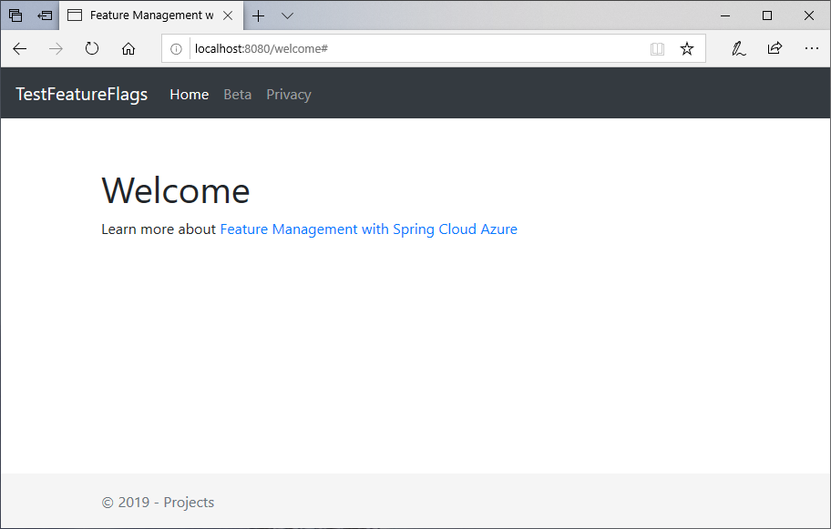

# Quickstart: Add feature flags to a Spring Boot app

In this quickstart, you incorporate Azure App Configuration into a Spring Boot web app to create an end-to-end implementation of feature management. You can use the App Configuration service to centrally store all your feature flags and control their states.

The Spring Boot Feature Management libraries extend the framework with comprehensive feature flag support. These libraries do **not** have a dependency on any Azure libraries. They seamlessly integrate with App Configuration through its Spring Boot configuration provider.

## Prerequisites

- An Azure account with an active subscription. [Create one for free](https://azure.microsoft.com/free/).
- An App Configuration store. [Create a store](./quickstart-azure-app-configuration-create.md#create-an-app-configuration-store).
- A supported [Java Development Kit SDK](/java/azure/jdk) with version 11.
- [Apache Maven](https://maven.apache.org/download.cgi) version 3.0 or above.

## Add a feature flag

Add a feature flag called *Beta* to the App Configuration store and leave **Label** and **Description** with their default values. For more information about how to add feature flags to a store using the Azure portal or the CLI, go to [Create a feature flag](./quickstart-azure-app-configuration-create.md#create-a-feature-flag).

> [!div class="mx-imgBorder"]
> 

## Create a Spring Boot app

To create a new Spring Boot project:

1. Browse to the [Spring Initializr](https://start.spring.io).

1. Specify the following options:

   * Generate a **Maven** project with **Java**.
   * Specify a **Spring Boot** version that's equal to or greater than 2.0.
   * Specify the **Group** and **Artifact** names for your application.  This article uses `com.example` and `demo`.
   * Add the **Spring Web** dependency.

1. After you specify the previous options, select **Generate Project**. When prompted, download the project to your local computer.

## Add feature management

1. After you extract the files on your local system, your Spring Boot application is ready for editing. Locate  *pom.xml* in the root directory of your app.

1. Open the *pom.xml* file in a text editor and add the following to the list of `<dependencies>`:

    ```xml
    <dependency>
        <groupId>com.azure.spring</groupId>
        <artifactId>azure-spring-cloud-appconfiguration-config-web</artifactId>
        <version>2.6.0</version>
    </dependency>
    <dependency>
        <groupId>com.azure.spring</groupId>
        <artifactId>azure-spring-cloud-feature-management-web</artifactId>
        <version>2.4.0</version>
    </dependency>
    <dependency>
        <groupId>org.springframework.boot</groupId>
        <artifactId>spring-boot-starter-thymeleaf</artifactId>
    </dependency>
    ```

> [!NOTE]
> * If you need to support an older version of Spring Boot see our [old appconfiguration library](https://github.com/Azure/azure-sdk-for-java/blob/spring-cloud-starter-azure-appconfiguration-config_1.2.9/sdk/appconfiguration/spring-cloud-starter-azure-appconfiguration-config/README.md) and our [old feature flag library](https://github.com/Azure/azure-sdk-for-java/blob/spring-cloud-starter-azure-appconfiguration-config_1.2.9/sdk/appconfiguration/spring-cloud-azure-feature-management/README.md).
> * There is a non-web Feature Management Library that doesn't have a dependency on spring-web. Refer to GitHub's [documentation](https://github.com/Azure/azure-sdk-for-java/tree/main/sdk/spring/spring-cloud-azure-feature-management) for differences.

## Connect to an App Configuration store

1. Navigate to the `resources` directory of your app and open `bootstrap.properties`.  If the file does not exist, create it. Add the following line to the file.

    ```properties
    spring.cloud.azure.appconfiguration.stores[0].connection-string= ${APP_CONFIGURATION_CONNECTION_STRING}
    spring.cloud.azure.appconfiguration.stores[0].feature-flags.enabled=true
    ```

1. Set an environment variable named **APP_CONFIGURATION_CONNECTION_STRING**, and set it to the connection string to your App Configuration store. At the command line, run the following command and restart the command prompt to allow the change to take effect:

    ### [Windows command prompt](#tab/windowscommandprompt)

    To build and run the app locally using the Windows command prompt, run the following command:

    ```console
    setx APP_CONFIGURATION_CONNECTION_STRING "connection-string-of-your-app-configuration-store"
    ```

    Restart the command prompt to allow the change to take effect. Print the value of the environment variable to validate that it is set properly.

    ### [PowerShell](#tab/powershell)

    If you use Windows PowerShell, run the following command:

    ```azurepowershell
    $Env:APP_CONFIGURATION_CONNECTION_STRING = "connection-string-of-your-app-configuration-store"
    ```

    ### [macOS](#tab/unix)

    If you use macOS, run the following command:

    ```console
    export APP_CONFIGURATION_CONNECTION_STRING='connection-string-of-your-app-configuration-store'
    ```

    Restart the command prompt to allow the change to take effect. Print the value of the environment variable to validate that it is set properly.

    ### [Linux](#tab/linux)

    If you use Linux, run the following command:

    ```console
    export APP_CONFIGURATION_CONNECTION_STRING='connection-string-of-your-app-configuration-store'
    ```

    Restart the command prompt to allow the change to take effect. Print the value of the environment variable to validate that it is set properly.

    ---

1. Create a new Java file named *HelloController.java* in the package directory of your app.

    ```java
    package com.example.demo;

    import org.springframework.boot.context.properties.ConfigurationProperties;
    import org.springframework.stereotype.Controller;
    import org.springframework.ui.Model;

    import com.azure.spring.cloud.feature.manager.FeatureManager;
    import org.springframework.web.bind.annotation.GetMapping;


    @Controller
    @ConfigurationProperties("controller")
    public class HelloController {

        private FeatureManager featureManager;

        public HelloController(FeatureManager featureManager) {
            this.featureManager = featureManager;
        }

        @GetMapping("/welcome")
        public String mainWithParam(Model model) {
            model.addAttribute("Beta", featureManager.isEnabledAsync("Beta").block());
            return "welcome";
        }
    }
    ```

1. Create a new HTML file named *welcome.html* in the templates directory of your app.

    ```html
    <!DOCTYPE html>
    <html lang="en" xmlns:th="http://www.thymeleaf.org">
    <head>
        <meta charset="utf-8">
        <meta name="viewport" content="width=device-width, initial-scale=1, shrink-to-fit=no">
        <title>Feature Management with Spring Cloud Azure</title>

        <link rel="stylesheet" href="/css/main.css">
        <link rel="stylesheet" href="https://stackpath.bootstrapcdn.com/bootstrap/4.3.1/css/bootstrap.min.css" integrity="sha384-ggOyR0iXCbMQv3Xipma34MD+dH/1fQ784/j6cY/iJTQUOhcWr7x9JvoRxT2MZw1T" crossorigin="anonymous">

        <script src="https://code.jquery.com/jquery-3.6.0.min.js" integrity="sha256-/xUj+3OJU5yExlq6GSYGSHk7tPXikynS7ogEvDej/m4=" crossorigin="anonymous"></script>
        <script src="https://unpkg.com/@popperjs/core@2"></script>
        <script src="https://cdn.jsdelivr.net/npm/bootstrap@5.1.3/dist/js/bootstrap.bundle.min.js" integrity="sha384-ka7Sk0Gln4gmtz2MlQnikT1wXgYsOg+OMhuP+IlRH9sENBO0LRn5q+8nbTov4+1p" crossorigin="anonymous"></script>

    </head>
    <body>
        <header>
        <!-- Fixed navbar -->
        <nav class="navbar navbar-expand-md navbar-dark fixed-top bg-dark">
            <a class="navbar-brand" href="#">TestFeatureFlags</a>
            <button class="navbar-toggler" aria-expanded="false" aria-controls="navbarCollapse" aria-label="Toggle navigation" type="button" data-target="#navbarCollapse" data-toggle="collapse">
            <span class="navbar-toggler-icon"></span>
            </button>
            <div class="collapse navbar-collapse" id="navbarCollapse">
            <ul class="navbar-nav mr-auto">
                <li class="nav-item active">
                <a class="nav-link" href="#">Home <span class="sr-only">(current)</span></a>
                </li>
                <li class="nav-item" th:if="${Beta}">
                <a class="nav-link" href="#">Beta</a>
                </li>
                <li class="nav-item">
                <a class="nav-link" href="#">Privacy</a>
                </li>
            </ul>
            </div>
        </nav>
        </header>
        <div class="container body-content">
            <h1 class="mt-5">Welcome</h1>
            <p>Learn more about <a href="https://github.com/Azure/azure-sdk-for-java/blob/master/sdk/appconfiguration/azure-spring-cloud-feature-management/README.md">Feature Management with Spring Cloud Azure</a></p>

        </div>
        <footer class="footer">
            <div class="container">
            <span class="text-muted">&copy; 2019 - Projects</span>
        </div>

        </footer>
    </body>
    </html>

    ```

1. Create a new folder named CSS under `static` and inside of it a new CSS file named *main.css*.

    ```css
    html {
     position: relative;
     min-height: 100%;
    }
    body {
     margin-bottom: 60px;
    }
    .footer {
     position: absolute;
     bottom: 0;
     width: 100%;
     height: 60px;
     line-height: 60px;
     background-color: #f5f5f5;
    }

    body > .container {
     padding: 60px 15px 0;
    }

    .footer > .container {
     padding-right: 15px;
     padding-left: 15px;
    }

    code {
     font-size: 80%;
    }
    ```

## Build and run the app locally

1. Build your Spring Boot application with Maven and run it.

    ```shell
    mvn clean package
    mvn spring-boot:run
    ```

1. Open a browser window, and go to the URL: `http://localhost:8080/welcome`.

    

1. In the App Configuration portal select **Feature Manager**, and change the state of the **Beta** key to **On**:

    | Key | State |
    |---|---|
    | Beta | On |

1. Refresh the browser page to see the new configuration settings.

    

## Clean up resources

[!INCLUDE [azure-app-configuration-cleanup](../../includes/azure-app-configuration-cleanup.md)]

## Next steps

In this quickstart, you created a new App Configuration store and used it to manage features in a Spring Boot web app via the [Feature Management libraries](https://azure.github.io/azure-sdk-for-java/springboot.html).

* Library [reference documentation](https://go.microsoft.com/fwlink/?linkid=2180917)
* Learn more about [feature management](./concept-feature-management.md).
* [Manage feature flags](./manage-feature-flags.md).
* [Use feature flags in a Spring Boot Core app](./use-feature-flags-spring-boot.md).
