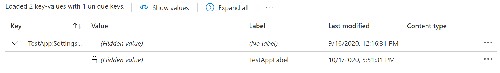
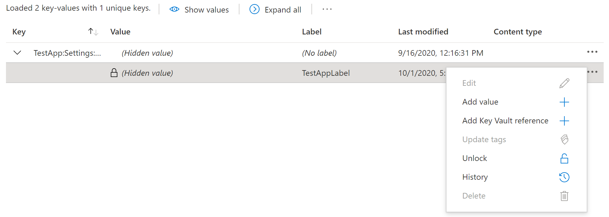

# Quickstart: Create a Python app with Azure App Configuration

In this quickstart, you will use Azure App Configuration to centralize storage and management of application settings using the [Azure App Configuration client library for Python](https://github.com/Azure/azure-sdk-for-python/tree/master/sdk/appconfiguration/azure-appconfiguration).

## Prerequisites

- Azure subscription - [create one for free](https://azure.microsoft.com/free/)
- Python 2.7, or 3.5 or later - For information on setting up Python on Windows, see the [Python on Windows documentation]( https://docs.microsoft.com/windows/python/)

## Create an App Configuration store

[!INCLUDE [azure-app-configuration-create](../../includes/azure-app-configuration-create.md)]

7. Select **Configuration Explorer** > **Create** > **Key-value** to add the following key-value pairs:

    | Key | Value |
    |---|---|
    | TestApp:Settings:Message | Data from Azure App Configuration |

    Leave **Label** and **Content Type** empty for now.

8. Select **Apply**.


## Setting up

This section walks you through preparing a project to work with the Azure App Configuration client library for Python.

### Create the project

Create a Python application named *app-configuration-quickstart*.

1. In a console window (such as cmd, PowerShell, or Bash), create a new directory for the project.

    ```console
    mkdir app-configuration-quickstart
    ```

1. Switch to the newly created *app-configuration-quickstart* directory.

    ```console
    cd app-configuration-quickstart
    ```

### Install the package

Install the Azure App Configuration client library for Python package by using the `pip install` command.

```console
pip install azure-appconfiguration
```

This command installs the Azure App Configuration client library for Python package and all the libraries on which it depends. In this case, that is just the Azure core library for Python, azure-core, and the Azure for Python REST library, msrest.

### Set up the app framework

1. Open a new text file in your code editor
1. Add `import` statements
1. Create the structure for the program, including very basic exception handling

    Here's the code:

    ```python
    import os
    from azure.appconfiguration import *
    
    try:
        print("Azure App Configuration - Python quickstart sample")
        # Quick start code goes here
    except Exception as ex:
        print('Exception:')
        print(ex)

    ```

1. Save the new file as *app-configuration-quickstart.py* in the *app-configuration-quickstart* directory.


## Configure your storage connection string


1. Set an environment variable named **AZURE_APP_CONFIG_CONNECTION_STRING**, and set it to the access key to your App Configuration store. At the command line, run the following command:

    ```cmd
    setx AZURE_APP_CONFIG_CONNECTION_STRING "connection-string-of-your-app-configuration-store"
    ```

    If you use Windows PowerShell, run the following command:

    ```azurepowershell
    $Env:AZURE_APP_CONFIG_CONNECTION_STRING = "connection-string-of-your-app-configuration-store"
    ```

    If you use macOS or Linux, run the following command:

    ```console
    export AZURE_APP_CONFIG_CONNECTION_STRING='connection-string-of-your-app-configuration-store'
    ```

2. Restart the command prompt to allow the change to take effect. Print out the value of the environment variable to validate that it is set properly.

## Code examples 

These example code snippets in this section show you how to perform common actions with the Azure App Configuration client library for Python.

* [Connect to an App Configuration store](#connect-to-an-app-configuration-store)
* [Get a configuration setting](#get-a-configuration-setting)
* [Add a configuration setting](#add-a-configuration-setting)
* [Get a list of configuration settings](#get-a-list-of-configuration-settings)
* [Lock a configuration setting](#lock-a-configuration-setting)
* [Update a configuration setting](#update-a-configuration-setting)
* [Delete a configuration setting](#delete-a-configuration-setting)


### Connect to an App Configuration store

The following code snippet creates an instance of the **AzureAppConfiguration** class using the specified connection string. Add this code to the end of the `try` block.

```python
    connection_string = os.getenv('AZURE_APP_CONFIG_CONNECTION_STRING')
    app_config_client = AzureAppConfigurationClient.from_connection_string(connection_string)
```

### Get a configuration setting

The following code snippet retrieves the configuration value by calling **get_configuration_setting** and setting the **key** parameter to the key you configured in the Azure portal. Add this code to the end of the `try` block.

```python
    fetched_config_setting = client.get_configuration_setting(key = 'TestApp:Settings:Message')
    print(
        "Fetched key: ", fetched_config_setting.key,
        " value: ", fetched_config_setting.value
    )
```


### Add a configuration setting

Previously in this quickstart, you added a configuration key and value using the Azure portal. You can also add configuration settings using the Python client library. The following code snippet initialzies a **ConfigurationSetting** object with a key, value, and a label which can be used to categorize settings. Next, the configuration setting is added to the remote store by calling **add_configuration_setting** and passing in the **ConfigruationSetting** object. Add this code to the end of the `try` block.

```python
    config_setting = ConfigurationSetting(
        key='TestApp:Settings:Message',
        label='TestAppLabel',
        value='Value from labeled key'
    )

    added_config_setting = client.add_configuration_setting(config_setting)
```

Note that attempting to call **add_configuration_setting** with a key and label pair that already exist will throw an exception.

### Get a list of configuration settings

The following code snippet retrieves a list of configuration settings. The **key_filter** parameter is set using a wild card to retrieve all of the settings with keys that match the pattern. You can also provide a **label_filter** parameter to filter by label. Add this code to the end of the `try` block.

```python
    filtered_settings_list = client.list_configuration_settings( key_filter="TestApp*")
    print("Key list:")
    for item in filtered_listed:
        print("   key: ", item.key, " label: ", item.label, "value: ", item.value)
```

### Lock a configuration setting

The following code snippet shows how to lock a setting so that it can't be modified without first unlocking it. The setting is locked by calling **set_read_only** and passing in a **ConfigurationSetting** object containing the key and label of the setting to be updated. This example attempts to update the locked setting to demonstrate that an exception is thrown. Finally, the setting is unlocked so that it can be modified in the next step. Add this code to the end of the `try` block.

```python
    locked_config_setting = client.set_read_only(config_setting)
    print("Read-only status: ", locked_config_setting.read_only)

    # Update the value of the ConfigurationSetting object
    config_setting.value = "Updated value"

    try:
        client.set_configuration_setting(config_setting)
    except Exception as ex:
        print('Exception:')
        print(ex)

    unlocked_config_setting = client.set_read_only(config_setting, False)
    print("Read-only status: ", unlocked_config_setting.read_only)
```

Settings that are locked with the Python client API are also locked in the Azure portal, as indicated by the lock icon next to the setting's value in the **Configuration explorer**.



Unlock a setting in the portal by clicking the elipses at the end of the setting's row and selecting **Unlock**. 



### Update a configuration setting

The following code snippet updates an existing setting by calling **set_configuration_settings** and passing in the **ConfigurationSetting** object for which the value was updated in the previous step. You can use **set_configuration_settings** to update an existing setting or create a new setting. Add this code to the end of the `try` block.

```python
    updated_config_setting = client.set_configuration_setting(config_setting)
    
    filtered_settings_list = client.list_configuration_settings( key_filter="TestApp*")
    print("Key list:")
    for item in filtered_settings_list:
        print("   key: ", item.key, " label: ", item.label, "value: ", item.value)
```

### Delete a configuration setting

The following code snippet deletes a configuration setting by calling the **delete_configuration_settings** method.

```python
    deleted_config_setting = client.delete_configuration_setting(
        key="TestApp:Settings:Message", label="TestAppLabel"
    )
    
    filtered_settings_list = client.list_configuration_settings( key_filter="TestApp*")
    print("Key list:")
    for item in filtered_settings_list:
        print("   key: ", item.key, " label: ", item.label, "value: ", item.value)
```

## Run the app

This app retrieves an configuration setting created through the Azure portal. Next, using the Azure App Configuration client library for Python, the app creates a new setting, retrieves a list of existing settings, locks and unlocks a setting, updates a setting, and finally deletes a setting.

In your console window, navigate to the directory containing the *app-configuration-quickstart.py* file, then execute the following `python` command to run the app.

```console
python app-configuration-quickstart.py
```

The output of the app is similar to the following example:

```output
Azure App Configuration - Python quickstart sample
Fetched key:  TestApp:Settings:Message  value:  Data from Azure App Configuration
Key list:
   key:  TestApp:Settings:Message  label:  None value:  Data from Azure App Configuration
   key:  TestApp:Settings:Message  label:  TestAppLabel value:  Value from labeled key
Read-only status:  True
Exception:
Operation returned an invalid status 'Conflict'
Read-only status:  False
Key list:
   key:  TestApp:Settings:Message  label:  None value:  Data from Azure App Configuration
   key:  TestApp:Settings:Message  label:  TestAppLabel value:  Updated value
Key list:
   key:  TestApp:Settings:Message  label:  None value:  Data from Azure App Configuratione
```
## Clean up resources

[!INCLUDE [azure-app-configuration-cleanup](../../includes/azure-app-configuration-cleanup.md)]

## Next steps

In this quickstart, you created a new App Configuration store and accessed it from Python. 

For tutorials, samples, quick starts and other documentation, visit:

> [!div class="nextstepaction"]
> [Azure for Python Developers](https://docs.microsoft.com/azure/python/)

* To learn more, see the [Azure App Configuration client library for Python](https://github.com/Azure/azure-sdk-for-python/tree/master/sdk/appconfiguration/azure-appconfiguration).
