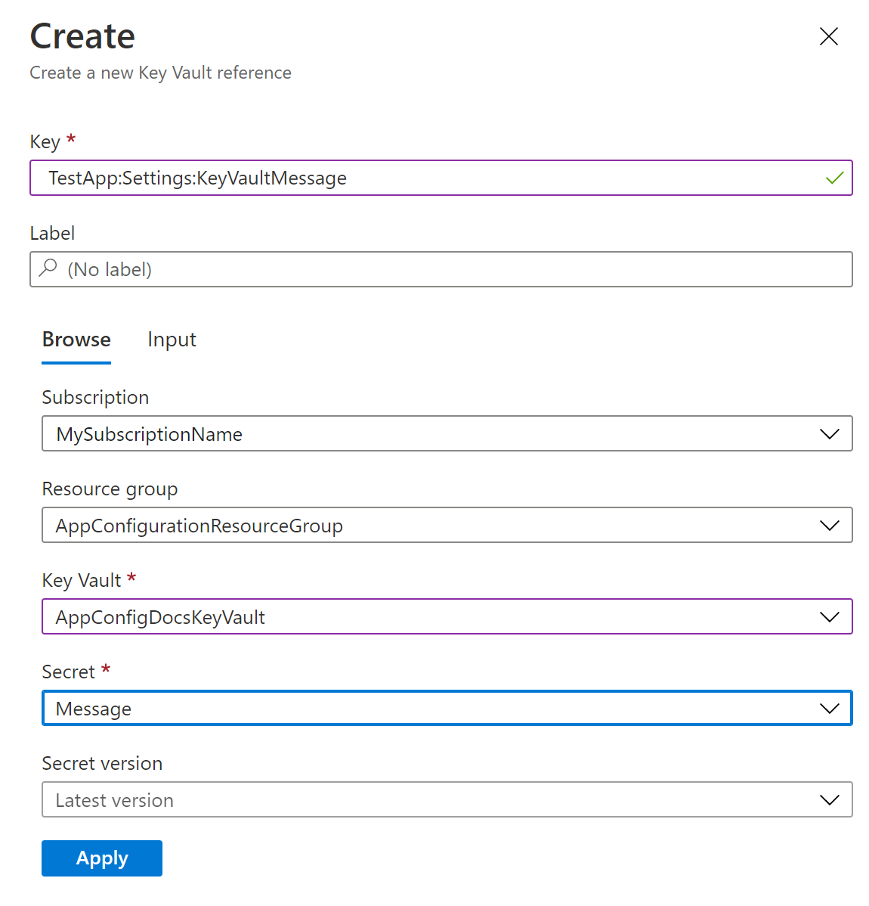
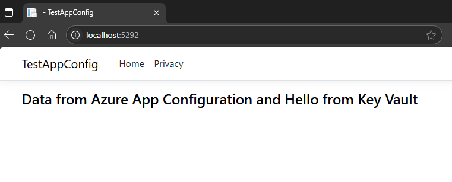

# Tutorial: Use Key Vault references in an ASP.NET Core app

In this tutorial, you learn how to use the Azure App Configuration service together with Azure Key Vault. App Configuration and Key Vault are complementary services used side by side in most application deployments.

App Configuration helps you use the services together by creating keys that reference values stored in Key Vault. When App Configuration creates such keys, it stores the URIs of Key Vault values rather than the values themselves.

Your application uses the App Configuration client provider to retrieve Key Vault references, just as it does for any other keys stored in App Configuration. In this case, the values stored in App Configuration are URIs that reference the values in the Key Vault. They are not Key Vault values or credentials. Because the client provider recognizes the keys as Key Vault references, it uses Key Vault to retrieve their values.

Your application is responsible for authenticating properly to both App Configuration and Key Vault. The two services don't communicate directly.

This tutorial shows you how to implement Key Vault references in your code. It builds on the web app introduced in the quickstarts. Before you continue, finish [Create an ASP.NET Core app with App Configuration](./quickstart-aspnet-core-app.md) first.

You can use any code editor to do the steps in this tutorial. For example, [Visual Studio Code](https://code.visualstudio.com/) is a cross-platform code editor that's available for the Windows, macOS, and Linux operating systems.

In this tutorial, you learn how to:

> [!div class="checklist"]
> * Create an App Configuration key that references a value stored in Key Vault.
> * Access the value of this key from an ASP.NET Core web application.

## Prerequisites

Before you start this tutorial, install the [.NET SDK](https://dotnet.microsoft.com/download).

[!INCLUDE [quickstarts-free-trial-note](../../includes/quickstarts-free-trial-note.md)]

## Create a vault

1. Select the **Create a resource** option in the upper-left corner of the Azure portal:

    
1. In the search box, type **Key Vault** and select **Key Vault** from the drop-down.
1. From the results list, select **Key vaults** on the left.
1. In **Key vaults**, select **Add**.
1. On the right in **Create key vault**, provide the following information:
    - Select **Subscription** to choose a subscription.
    - In **Resource Group**, enter an existing resource group name or select **Create new** and enter a resource group name.
    - In **Key vault name**, a unique name is required.
    - In the **Region** drop-down list, choose a location.
1. Leave the other **Create key vault** options with their default values.
1. Click **Review + Create**.
1. The system will validate and display the data you entered. Click **Create**.

At this point, your Azure account is the only one authorized to access this new vault.


## Add a secret to Key Vault

To add a secret to the vault, you need to take just a few additional steps. In this case, add a message that you can use to test Key Vault retrieval. The message is called **Message**, and you store the value "Hello from Key Vault" in it.

1. From the Key Vault properties pages, select **Secrets**.
1. Select **Generate/Import**.
1. In the **Create a secret** pane, enter the following values:
    - **Upload options**: Enter **Manual**.
    - **Name**: Enter **Message**.
    - **Value**: Enter **Hello from Key Vault**.
1. Leave the other **Create a secret** properties with their default values.
1. Select **Create**.

## Add a Key Vault reference to App Configuration

1. Sign in to the [Azure portal](https://portal.azure.com). Select **All resources**, and then select the App Configuration store instance that you created in the quickstart.

1. Select **Configuration Explorer**.

1. Select **+ Create** > **Key vault reference**, and then specify the following values:
    - **Key**: Select **TestApp:Settings:KeyVaultMessage**.
    - **Label**: Leave this value blank.
    - **Subscription**, **Resource group**, and **Key vault**: Enter the values corresponding to those in the key vault you created in the previous section.
    - **Secret**: Select the secret named **Message** that you created in the previous section.



## Update your code to use a Key Vault reference

1. Add a reference to the required NuGet packages by running the following command:

    ```dotnetcli
    dotnet add package Azure.Identity
    ```

1. Open *Program.cs*, and add references to the following required packages:

    ```csharp
    using Azure.Identity;
    ```

1. Update the `CreateWebHostBuilder` method to use App Configuration by calling the `config.AddAzureAppConfiguration` method. Include the `ConfigureKeyVault` option, and pass the correct credential to your Key Vault using the `SetCredential` method. If you have multiple Key Vaults, the same credential will be used for all of them. If your Key Vaults require different credentials, you can set them using `Register` or `SetSecretResolver` methods from the [`AzureAppConfigurationKeyVaultOptions`](/dotnet/api/microsoft.extensions.configuration.azureappconfiguration.azureappconfigurationkeyvaultoptions) class.

     #### [.NET 6.0+](#tab/core6x)

    ```csharp
    var builder = WebApplication.CreateBuilder(args);

    builder.Configuration.AddAzureAppConfiguration(options =>
        {
            options.Connect(
                builder.Configuration["ConnectionStrings:AppConfig"])
                    .ConfigureKeyVault(kv =>
                    {
                        kv.SetCredential(new DefaultAzureCredential());
                    });
        });
    ```

    #### [.NET Core 3.x](#tab/core3x)

    ```csharp
        public static IHostBuilder CreateHostBuilder(string[] args) =>
            Host.CreateDefaultBuilder(args)
            .ConfigureWebHostDefaults(webBuilder =>
            webBuilder.ConfigureAppConfiguration((hostingContext, config) =>
            {
                var settings = config.Build();

                config.AddAzureAppConfiguration(options =>
                {
                    options.Connect(settings["ConnectionStrings:AppConfig"])
                            .ConfigureKeyVault(kv =>
                            {
                                kv.SetCredential(new DefaultAzureCredential());
                            });
                });
            })
            .UseStartup<Startup>());
    ```
    ---

1. When you initialized the connection to App Configuration, you set up the connection to Key Vault by calling the `ConfigureKeyVault` method. After the initialization, you can access the values of Key Vault references in the same way you access the values of regular App Configuration keys.

    To see this process in action, open *Index.cshtml* in the **Views** > **Home** folder. Replace its contents with the following code:

    ```html
    @page
    @using Microsoft.Extensions.Configuration
    @inject IConfiguration Configuration

    <style>
        body {
            background-color: @Configuration["TestApp:Settings:BackgroundColor"]
        }
        h1 {
            color: @Configuration["TestApp:Settings:FontColor"];
            font-size: @Configuration["TestApp:Settings:FontSize"]px;
        }
    </style>

    <h1>@Configuration["TestApp:Settings:Message"]
        and @Configuration["TestApp:Settings:KeyVaultMessage"]</h1>
    ```

    You access the value of the Key Vault reference **TestApp:Settings:KeyVaultMessage** in the same way as for the configuration value of **TestApp:Settings:Message**.


## Grant your app access to Key Vault

Azure App Configuration won't access your key vault. Your app will read from Key Vault directly, so you need to grant your app access to the secrets in your key vault. This way, the secret always stays with your app. The access can be granted using either a [Key Vault access policy](../key-vault/general/assign-access-policy-portal.md) or [Azure role-based access control](../key-vault/general/rbac-guide.md).

You use `DefaultAzureCredential` in your code above. It's an aggregated token credential that automatically tries a number of credential types, like `EnvironmentCredential`, `ManagedIdentityCredential`, `SharedTokenCacheCredential`, and `VisualStudioCredential`. For more information, see [DefaultAzureCredential Class](/dotnet/api/azure.identity.defaultazurecredential). You can replace `DefaultAzureCredential` with any credential type explicitly. However, using `DefaultAzureCredential` enables you to have the same code that runs in both local and Azure environments. For example, you grant your own credential access to your key vault. `DefaultAzureCredential` automatically falls back to `SharedTokenCacheCredential` or `VisualStudioCredential` when you use Visual Studio for local development.

Alternatively, you can set the AZURE_TENANT_ID, AZURE_CLIENT_ID, and AZURE_CLIENT_SECRET environment variables, and `DefaultAzureCredential` will use the client secret you have via the `EnvironmentCredential` to authenticate with your key vault. After your app is deployed to an Azure service with managed identity enabled, such as Azure App Service, Azure Kubernetes Service, or Azure Container Instance, you grant the managed identity of the Azure service permission to access your key vault. `DefaultAzureCredential` automatically uses `ManagedIdentityCredential` when your app is running in Azure. You can use the same managed identity to authenticate with both App Configuration and Key Vault. For more information, see [How to use managed identities to access App Configuration](howto-integrate-azure-managed-service-identity.md).

## Build and run the app locally

1. To build the app by using the .NET CLI, run the following command in the command shell:

    ```dotnetcli
    dotnet build
    ```

1. After the build is complete, use the following command to run the web app locally:

    ```dotnetcli
    dotnet run
    ```

1. Open a browser window, and go to `http://localhost:5000`, which is the default URL for the web app hosted locally.

    


## Clean up resources

[!INCLUDE [azure-app-configuration-cleanup](../../includes/azure-app-configuration-cleanup.md)]

## Next steps

In this tutorial, you created a key in App Configuration that references a secret stored in Key Vault.
To learn how to automatically reload secrets and certificates from Key Vault, continue to the next tutorial:

> [!div class="nextstepaction"]
> [Reload secrets and certificates from Key Vault automatically](./reload-key-vault-secrets-dotnet.md)

To learn how to use Managed Identity to streamline access to App Configuration and Key Vault, refer to the following tutorial:

> [!div class="nextstepaction"]
> [Managed identity integration](./howto-integrate-azure-managed-service-identity.md)
