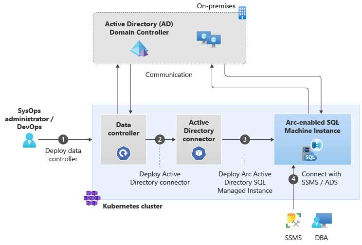

# Azure Arc-enabled SQL Managed Instance with Active Directory authentication 

Azure Arc-enabled data services support Active Directory (AD) for Identity and Access Management (IAM). The Arc-enabled SQL Managed Instance uses an existing on-premises Active Directory (AD) domain for authentication. 

This article describes how to enable Azure Arc-enabled SQL Managed Instance with Active Directory (AD) Authentication. The article demonstrates two possible AD integration modes: 
-  Customer-managed keytab (CMK) 
-  Service-managed keytab (SMK)  

The notion of Active Directory(AD) integration mode describes the process for keytab management including: 
- Creating AD account used by SQL Managed Instance
- Registering Service Principal Names (SPNs) under the above AD account.
- Generating keytab file 

## Background
To enable Active Directory authentication for SQL Server on Linux and Linux containers, use a [keytab file](/sql/linux/sql-server-linux-ad-auth-understanding#what-is-a-keytab-file). The keytab file is a cryptographic file containing service principal names (SPNs), account names and hostnames. SQL Server uses the keytab file for authenticating itself to the Active Directory (AD) domain and authenticating its clients using Active Directory (AD). Do the following steps to enable Active Directory authentication for Arc-enabled SQL Managed Instance: 

- [Deploy data controller](create-data-controller-indirect-cli.md) 
- [Deploy a customer-managed keytab AD connector](deploy-customer-managed-keytab-active-directory-connector.md) or [Deploy a service-managed keytab AD connector](deploy-system-managed-keytab-active-directory-connector.md)
- [Deploy SQL managed instances](deploy-active-directory-sql-managed-instance.md)

The following diagram shows how to enable Active Directory authentication for Azure Arc-enabled SQL Managed Instance:

## What is an Active Directory (AD) connector?

In order to enable Active Directory authentication for SQL Managed Instance, the instance must be deployed in an environment that allows it to communicate with the Active Directory domain. 

To facilitate this, Azure Arc-enabled data services introduces a new Kubernetes-native [Custom Resource Definition (CRD)](https://kubernetes.io/docs/concepts/extend-kubernetes/api-extension/custom-resources/) called `Active Directory Connector`. It provides Azure Arc-enabled SQL managed instances running on the same data controller the ability to perform Active Directory authentication.

## Compare AD integration modes

What is the difference between the two Active Directory integration modes?

To enable Active Directory authentication for Arc-enabled SQL Managed Instance, you need an Active Directory connector where you specify the Active Directory integration deployment mode. The two Active Directory integration modes are:

- Customer-managed keytab
- Service-managed keytab 

The following section compares these modes.

|                  |Customer-managed keytab​|System-managed keytab|
|------------------|---------|--------|
|**Use cases**|Small and medium size businesses who are familiar with managing Active Directory objects and want flexibility in their automation process |All sizes of businesses - seeking to highly automated Active Directory management experience|
|**User provides**|An Active Directory account and SPNs under that account, and a [keytab file](/sql/linux/sql-server-linux-ad-auth-understanding#what-is-a-keytab-file) for Active Directory authentication |An [Organizational Unit (OU)](../../active-directory-domain-services/create-ou.md) and a domain service account has [sufficient permissions](deploy-system-managed-keytab-active-directory-connector.md?#prerequisites) on that OU in Active Directory.|
|**Characteristics**|User managed. Users bring the Active Directory account, which impersonates the identity of the managed instance and the keytab file. |System managed. The system creates a domain service account for each managed instance and sets SPNs automatically on that account. It also, creates and delivers a keytab file to the managed instance. |
|**Deployment process**| 1. Deploy data controller   2. Create keytab file  3. Set up keytab information to Kubernetes secret  4. Deploy AD connector, deploy SQL managed instance  For more information, see [Deploy a customer-managed keytab Active Directory connector](deploy-customer-managed-keytab-active-directory-connector.md)  | 1. Deploy data controller, deploy AD connector 2. Deploy SQL managed instance  For more information, see [Deploy a system-managed keytab Active Directory connector](deploy-system-managed-keytab-active-directory-connector.md) |
|**Manageability**|You can create the keytab file by following the instructions from [Active Directory utility (`adutil`)](/sql/linux/sql-server-linux-ad-auth-adutil-introduction). Manual keytab rotation. |Managed keytab rotation.|
|**Limitations**|We do not recommend sharing keytab files among services. Each service should have a specific keytab file. As the number of keytab files increases the level of effort and complexity increases. |Managed keytab generation and rotation. The service account will require sufficient permissions in Active Directory to manage the credentials.     Distributed Availability Group is not supported.|

For either mode, you need a specific Active Directory account, keytab, and Kubernetes secret for each SQL managed instance.

## Enable Active Directory authentication in Arc-enabled SQL Managed Instance

When you deploy SQL Managed Instance with the intention to enable Active Directory authentication, the deployment needs to reference an Active Directory connector instance to use. Referencing the Active Directory connector in managed instance specification automatically sets up the needed environment in the SQL Managed Instance container for the managed instance to authenticate with Active Directory.

## Next steps

* [Deploy a customer-managed keytab Active Directory (AD) connector](deploy-customer-managed-keytab-active-directory-connector.md)
* [Deploy a system-managed keytab Active Directory (AD) connector](deploy-system-managed-keytab-active-directory-connector.md)
* [Deploy an Azure Arc-enabled SQL Managed Instance in Active Directory (AD)](deploy-active-directory-sql-managed-instance.md)
* [Connect to Azure Arc-enabled SQL Managed Instance using Active Directory authentication](connect-active-directory-sql-managed-instance.md)
