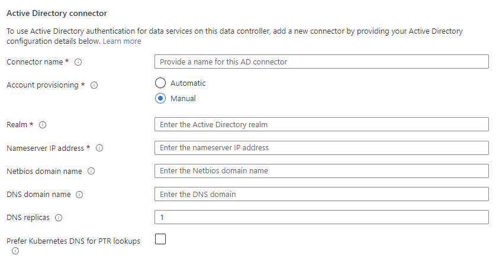
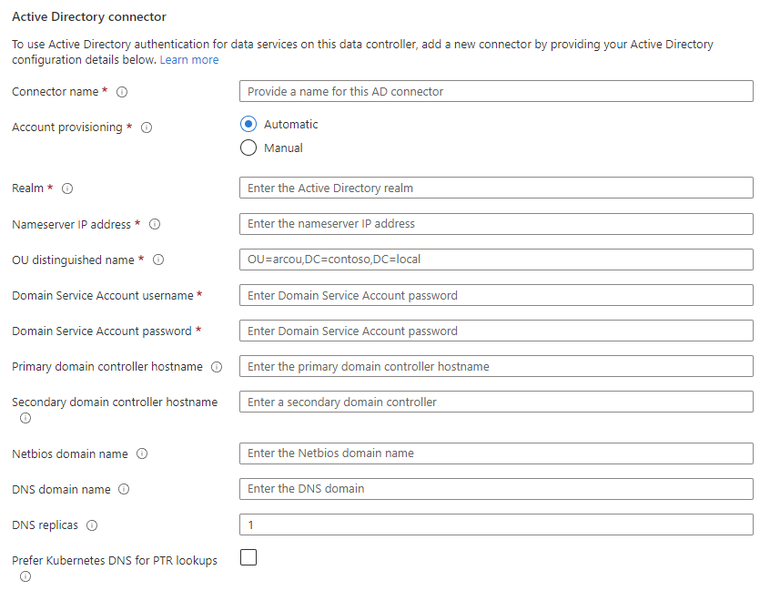

# Tutorial – Deploy Active Directory connector using Azure portal

Active Directory (AD) connector is a key component to enable Active Directory authentication on SQL Managed Instance enabled by Azure Arc.

This article explains how to deploy, manage, and delete an Active Directory (AD) connector in directly connected mode from the Azure portal. 

## Prerequisites

For details about how to set up OU and AD account, go to [Deploy Azure Arc-enabled data services in Active Directory authentication - prerequisites](active-directory-prerequisites.md).

Make sure you have the following deployed before proceed with the steps in this article: 

- An Arc-enabled Azure Kubernetes cluster.
- A data controller in directly connected mode.

## Create a new AD connector

1. Log in to [Azure portal](https://portal.azure.com).
1. In the search resources field at the top of the portal, type **data controllers**, and select **Azure Arc data controllers**.

Azure takes you to where you can find all available data controllers deployed in your selected Azure subscription.

1. Select the data controller where you wish to add an AD connector.
1. Under **Settings** select **Active Directory**. The portal shows the Active Directory connectors for this data controller. 
1. Select **+ Add Connector**, the portal presents an **Add Connector** interface. 
1. Under **Active Directory connector**
    1. Specify your **Connector name**.
    2. Choose the account provisioning type - either **Automatic** or **Manual**.

The account provisioning type determines whether you deploy a customer-managed keytab AD connector or a system-managed keytab AD connector. 

### Create a new customer-managed keytab AD connector

1. Click **Add Connector**.
 
1. Choose the account provisioning type **Manual**.
 
1. Set the editable fields for your connector:
   - **Realm**: The name of the Active Directory (AD) domain in uppercase. For example *CONTOSO.COM*.
   - **Nameserver IP address**: A comma-separated list of Active Directory DNS server IP addresses. For example: *10.10.10.11, 10.10.10.12*.
   - **Netbios domain name**: Optional. The NETBIOS name of the Active Directory domain. For example *CONTOSO*. Defaults to the first label of realm.
   - **DNS domain name**: Optional. The DNS domain name associated with the Active Directory domain. For example, *contoso.com*.
   - **DNS replicas**: Optional. The number of replicas to deploy for the DNS proxy service. Defaults to `1`. 
   - **Prefer Kubernetes DNS for PTR lookups**: Optional. Check to set Kubernetes DNS for IP address lookup. Clear to use Active Directory DNS. 

   

1. Click **Add Connector** to create a new customer-managed keytab AD connector.

### Create a new system-managed keytab AD connector
1. Click **Add Connector**.
1. Choose the account provisioning type **Automatic**.
1. Set the editable fields for your connector:
   - **Realm**: The name of the Active Directory (AD) domain in uppercase. For example *CONTOSO.COM*.
   - **Nameserver IP address**: A comma-separated list of Active Directory DNS server IP addresses. For example: *10.10.10.11, 10.10.10.12*.
   - **OU distinguished name** The distinguished name of the Organizational Unit (OU) pre-created in the Active Directory (AD) domain. For example, `OU=arcou,DC=contoso,DC=com`.
   - **Domain Service Account username** The username of the Domain Service Account in Active Directory. 
   - **Domain Service Account password** The password of the Domain Service Account in Active Directory. 
   - **Primary domain controller hostname (Optional)** The hostname of the primary Active Directory domain controller. For example, `azdc01.contoso.com`.
   - **Secondary domain controller hostname (Optional)** The secondary domain controller hostname.
   - **Netbios domain name**: Optional. The NETBIOS name of the Active Directory domain. For example *CONTOSO*. Defaults to the first label of realm.
   - **DNS domain name**: Optional. The DNS domain name associated with the Active Directory domain. For example, *contoso.com*.
   - **DNS replicas (Optional)** The number of replicas to deploy for the DNS proxy service. Defaults to `1`. 
   - **Prefer Kubernetes DNS for PTR lookups**: Optional. Check to set Kubernetes DNS for IP address lookup. Clear to use Active Directory DNS.

   

1. Click **Add Connector** to create a new system-managed keytab AD connector.

## Edit an existing AD connector

1. Select the AD connect that you want to edit. Select the ellipses (**...**), and then **Edit**. The portal presents an **Edit Connector** interface. 

1. You may update any editable fields. For example:
   - **Primary domain controller hostname** The hostname of the primary Active Directory domain controller. For example, `azdc01.contoso.com`.
   - **Secondary domain controller hostname** The secondary domain controller hostname.
   - **Nameserver IP address**: A comma-separated list of Active Directory DNS server IP addresses. For example: *10.10.10.11, 10.10.10.12*.
   - **DNS replicas** The number of replicas to deploy for the DNS proxy service. Defaults to `1`. 
   - **Prefer Kubernetes DNS for PTR lookups**: Check to set Kubernetes DNS for IP address lookup. Clear to use Active Directory DNS.

1. Click on **Apply** for changes to take effect. 

## Delete an AD connector

1. Select the ellipses (**...**) on the right of the Active Directory connector you would like to delete.
1. Select **Delete**.

To delete multiple AD connectors at one time:

1. Select the checkbox in the beginning row of each AD connector you want to delete.

   Alternatively, select the checkbox in the top row to select all the AD connectors in the table.

1. Click **Delete** in the management bar to delete the AD connectors that you selected. 

## Related content
* [Tutorial – Deploy Active Directory connector using Azure CLI](deploy-active-directory-connector-cli.md)
* [Tutorial – Deploy AD connector in customer-managed keytab mode](deploy-customer-managed-keytab-active-directory-connector.md)
* [Tutorial – Deploy Active Directory connector in system-managed keytab mode](deploy-system-managed-keytab-active-directory-connector.md)
* [Deploy Arc-enabled SQL Managed Instance with Active Directory Authentication](deploy-active-directory-sql-managed-instance.md).
