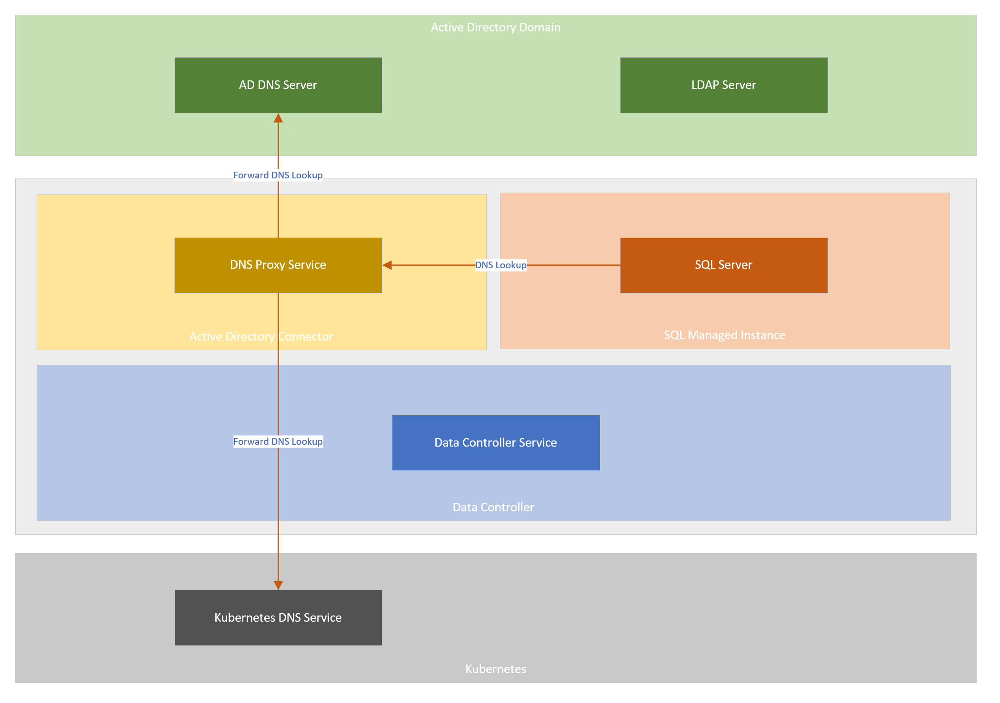

# Tutorial – Deploy Active Directory (AD) connector in customer-managed keytab mode

This article explains how to deploy Active Directory (AD) connector in customer-managed keytab mode. The connector is a key component to enable Active Directory authentication on Azure Arc-enabled SQL Managed Instance.

## Active Directory connector in customer-managed keytab mode

In customer-managed keytab mode, an Active Directory connector deploys a DNS proxy service that proxies the DNS requests coming from the managed instance to either of the two upstream DNS services:
* Active Directory DNS Servers
* Kubernetes DNS Servers

The AD Connector facilitates the environment needed by SQL to authenticate AD logins.

The following diagram shows AD Connector and DNS Proxy service functionality in customer-managed keytab mode: 



## Prerequisites

Before you proceed, you must have:

* An instance of Data Controller deployed on a supported version of Kubernetes
* An Active Directory (AD) domain

## Input for deploying Active Directory (AD) Connector

To deploy an instance of Active Directory connector, several inputs are needed from the Active Directory domain environment.

These inputs are provided in a YAML specification of AD Connector instance.

Following metadata about the AD domain must be available before deploying an instance of AD Connector:
* Name of the Active Directory domain
* List of the domain controllers (fully qualified domain names)
* List of the DNS server IP addresses

Following input fields are exposed to the users in the Active Directory connector spec:

- **Required**

   - `spec.activeDirectory.realm`
     Name of the Active Directory domain in uppercase. This is the AD domain that this instance of AD Connector will be associated with.
   
   - `spec.activeDirectory.dns.nameserverIpAddresses`
      List of Active Directory DNS server IP addresses. DNS proxy service will forward DNS queries in the provided domain name to these servers.

- **Optional**

   - `spec.activeDirectory.netbiosDomainName` NetBIOS name of the Active Directory domain. This is the short domain name (pre-Windows 2000 name) of your Active Directory domain. This is often used to qualify accounts in the AD domain. e.g. if the accounts in the domain are referred to as CONTOSO\admin, then CONTOSO is the NETBIOS domain name.
      
      This field is optional. When not provided, its value defaults to the first label of the `spec.activeDirectory.realm` field.
    
      In most domain environments, this is set to the default value but some domain environments may have a non-default value. You will need to use this field only when your domain's NetBIOS name does not match the first label of its fully qualified name.

  - `spec.activeDirectory.dns.domainName` 
      DNS domain name for which DNS lookups should be forwarded to the Active Directory DNS servers.

      A DNS lookup for any name belonging to this domain or its descendant domains will get forwarded to Active Directory.

      This field is optional. When not provided, it defaults to the value provided for `spec.activeDirectory.realm` converted to lowercase.

  - `spec.activeDirectory.dns.replicas` 
      Replica count for DNS proxy service. This field is optional and defaults to 1 when not provided.

  - `spec.activeDirectory.dns.preferK8sDnsForPtrLookups`
      Flag indicating whether to prefer Kubernetes DNS server response over AD DNS server response for IP address lookups.

      DNS proxy service relies on this field to determine which upstream group of DNS servers to prefer for IP address lookups.

      This field is optional. When not provided, it defaults to `true` i.e. the DNS lookups of IP addresses will be first forwarded to Kubernetes DNS servers. If Kubernetes DNS servers fail to answer the lookup, the query is then forwarded to AD DNS servers. When set to `false`, these DNS lookups will be forwarded to AD DNS servers first and upon failure, fall back to Kubernetes.


## Deploy a customer-managed keytab Active Directory (AD) connector

To deploy an AD connector, create a .yaml specification file called `active-directory-connector.yaml`.

The following example is an example of a customer-managed keytab AD connector uses an AD domain of name `CONTOSO.LOCAL`. Ensure to replace the values with the ones for your AD domain.

```yaml
apiVersion: arcdata.microsoft.com/v1beta1
kind: ActiveDirectoryConnector
metadata:
  name: adarc
  namespace: <namespace>
spec:
  activeDirectory:
    realm: CONTOSO.LOCAL
  dns:
    preferK8sDnsForPtrLookups: false
    nameserverIPAddresses:
      - <DNS Server 1 IP address>
      - <DNS Server 2 IP address>
```

The following command deploys the AD connector instance. Currently, only kube-native approach of deploying is supported.

```console
kubectl apply –f active-directory-connector.yaml
```

After submitting the deployment of AD Connector instance, you may check the status of the deployment using the following command.

```console
kubectl get adc -n <namespace>
```

## Next steps
* [Deploy a system-managed keytab Active Directory (AD) connector](deploy-system-managed-keytab-active-directory-connector.md)
* [Deploy SQL Managed Instance with Active Directory Authentication](deploy-active-directory-sql-managed-instance.md).
* [Connect to AD-integrated Azure Arc-enabled SQL Managed Instance](connect-active-directory-sql-managed-instance.md).

