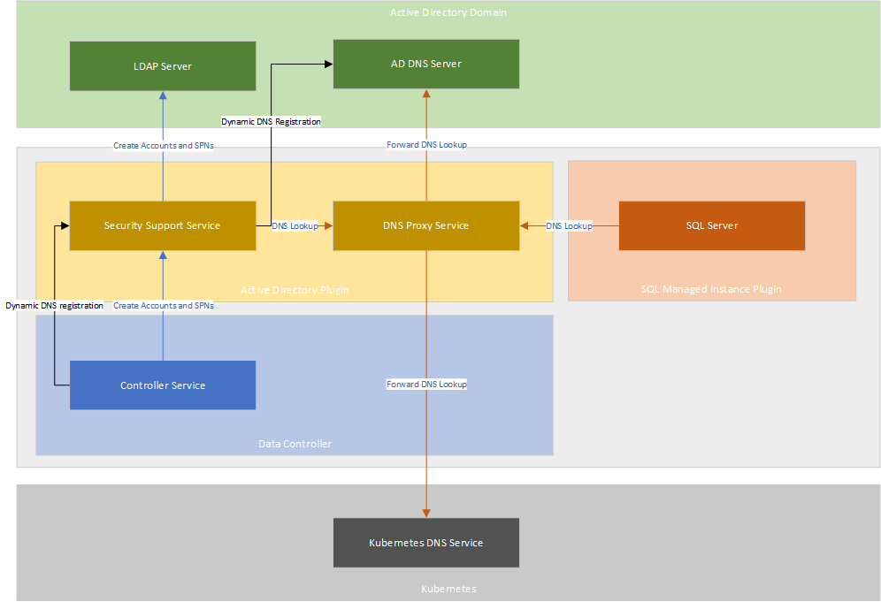

# Tutorial – Deploy Active Directory connector in system-managed keytab mode

This article explains how to deploy Active Directory connector in system-managed keytab mode. It is a key component to enable Active Directory authentication on SQL Managed Instance enabled by Azure Arc.

## Active Directory connector in system-managed keytab mode

In System-Managed Keytab mode, an Active Directory connector deploys a DNS proxy service that proxies the DNS requests coming from the managed instance to either of the two upstream DNS services:
* Active Directory DNS Servers
* Kubernetes DNS Servers

In addition to the DNS proxy service, AD Connector also deploys a Security Support Service that facilitates communication to the AD domain for automatic creation and management of AD accounts, Service Principal Names (SPNs) and keytabs.

The following diagram shows AD Connector and DNS Proxy service functionality in system-managed keytab mode: 



## Prerequisites

Before you proceed, you must have:

* An instance of Data Controller deployed on a supported version of Kubernetes
* An Active Directory domain
* A pre-created organizational unit (OU) in the Active Directory domain
* An Active Directory domain service account

The AD domain service account should have sufficient permissions to automatically create and delete users accounts inside the provided organizational unit (OU) in the active directory. 

Grant the following permissions - scoped to the Organizational Unit (OU) - to the domain service account:
 
- Read all properties
- Write all properties
- Create User objects
- Delete User objects
- Reset Password for Descendant User objects

For details about how to set up OU and AD account, go to [Deploy Azure Arc-enabled data services in Active Directory authentication with system-managed keytab - prerequisites](active-directory-prerequisites.md)

## Input for deploying Active Directory connector in system-managed keytab mode

To deploy an instance of Active Directory connector, several inputs are needed from the Active Directory domain environment.

These inputs are provided in a yaml specification for the AD connector instance.

The following metadata about the AD domain must be available before deploying an instance of AD connector:

* Name of the Active Directory domain
* List of the domain controllers (fully qualified domain names)
* List of the DNS server IP addresses

The following input fields are exposed to the users in the Active Directory connector specification:

- **Required**
   - `spec.activeDirectory.realm`
      Name of the Active Directory domain in uppercase. This is the AD domain that this instance of AD Connector will be associated with.

   - `spec.activeDirectory.domainControllers.primaryDomainController.hostname`
      Fully qualified domain name of the Primary Domain Controller (PDC) in the AD domain.

      If you do not know which domain controller in the domain is primary, you can find out by running this command on any Windows machine joined to the AD domain: `netdom query fsmo`.
   
   - `spec.activeDirectory.dns.nameserverIpAddresses`
      List of Active Directory DNS server IP addresses. DNS proxy service will forward DNS queries in the provided domain name to these servers.

- **Optional**
  - `spec.activeDirectory.serviceAccountProvisioning` This is an optional field which defines your AD connector deployment mode with possible values as `manual` for customer-managed keytab or `automatic` for system-managed keytab. When this field is not set, the value defaults to `manual`. When set to `automatic` (system-managed keytab), the system will automatically generate AD accounts and Service Principal Names (SPNs) for the SQL Managed Instances associated with this AD Connector and create keytab files for them. When set to `manual` (customer-managed keytab), the system will not provide automatic generation of the AD account and keytab generation. The user will be expected to provide a keytab file.

  - `spec.activeDirectory.ouDistinguishedName` This is an optional field. Though it becomes conditionally mandatory when the value of `serviceAccountProvisioning` is set to `automatic`. This field accepts the Distinguished Name (DN) of the Organizational Unit (OU) that the users must create in Active Directory domain before deploying AD Connector. It is used to store the system-generated AD accounts for SQL Managed Instances in Active Directory domain. The example of the value looks like: `OU=arcou,DC=contoso,DC=local`.

  - `spec.activeDirectory.domainServiceAccountSecret` This is an optional field. It becomes conditionally mandatory when the value of `serviceAccountProvisioning` is set to `automatic`. This field accepts the name of the Kubernetes secret that contains the username and password of the Domain Service Account that was created prior to the AD Connector deployment. The system will use this account to generate other AD accounts in the OU and perform actions on those AD accounts.

  - `spec.activeDirectory.netbiosDomainName` NetBIOS name of the Active Directory domain. This is the short domain name (pre-Windows 2000 name) of your Active Directory domain. This is often used to qualify accounts in the AD domain. e.g. if the accounts in the domain are referred to as CONTOSO\admin, then CONTOSO is the NETBIOS domain name.
      
      This field is optional. When not provided, its value defaults to the first label of the `spec.activeDirectory.realm` field.
    
      In most domain environments, this is set to the default value but some domain environments may have a non-default value. You will need to use this field only when your domain's NetBIOS name does not match the first label of its fully qualified name.

  - `spec.activeDirectory.domainControllers.secondaryDomainControllers[*].hostname` 
      List of the fully qualified domain names of the secondary domain controllers in the AD domain.

      If your domain is served by multiple domain controllers, it is a good practice to provide some of their fully qualified domain names in this list. This allows high-availability for Kerberos operations.

      This field is optional and not needed. The system will automatically detect the secondary domain controllers when a value is not provided.

  - `spec.activeDirectory.dns.domainName` 
      DNS domain name for which DNS lookups should be forwarded to the Active Directory DNS servers.

      A DNS lookup for any name belonging to this domain or its descendant domains will get forwarded to Active Directory.

      This field is optional. When not provided, it defaults to the value provided for `spec.activeDirectory.realm` converted to lowercase.

  - `spec.activeDirectory.dns.replicas` 
      Replica count for DNS proxy service. This field is optional and defaults to 1 when not provided.

  - `spec.activeDirectory.dns.preferK8sDnsForPtrLookups`
      Flag indicating whether to prefer Kubernetes DNS server response over AD DNS server response for IP address lookups.

      DNS proxy service relies on this field to determine which upstream group of DNS servers to prefer for IP address lookups.

      This field is optional. When not provided, it defaults to `true` i.e. the DNS lookups of IP addresses will be first forwarded to Kubernetes DNS servers. If Kubernetes DNS servers fail to answer the lookup, the query is then forwarded to AD DNS servers. When set to `false`, these DNS lookups will be forwarded to AD DNS servers first and upon failure, fall back to Kubernetes.

## Deploy Active Directory connector in system-managed keytab mode 

To deploy an AD connector, create a YAML specification file called `active-directory-connector.yaml`.

Following is an example of a system-managed keytab AD connector that uses an AD domain of name `CONTOSO.LOCAL`. Ensure to replace the values with the ones for your AD domain. The `adarc-dsa-secret` contains the AD domain service account that was created prior to the AD deployment. 

> [!NOTE]
> Make sure the password of provided domain service AD account here doesn't contain `!` as special characters. 
> 

```yaml
apiVersion: v1 
kind: Secret 
type: Opaque 
metadata: 
  name: adarc-dsa-secret
  namespace: <namespace>
data: 
  password: <your base64 encoded password>
  username: <your base64 encoded username>
---
apiVersion: arcdata.microsoft.com/v1beta2
kind: ActiveDirectoryConnector
metadata:
  name: adarc
  namespace: <namespace>
spec:
  activeDirectory:
    realm: CONTOSO.LOCAL
    serviceAccountProvisioning: automatic
    ouDistinguishedName: "OU=arcou,DC=contoso,DC=local"
    domainServiceAccountSecret: adarc-dsa-secret
    domainControllers:
      primaryDomainController:
        hostname: dc1.contoso.local
      secondaryDomainControllers:
      - hostname: dc2.contoso.local
      - hostname: dc3.contoso.local
  dns:
    preferK8sDnsForPtrLookups: false
    nameserverIPAddresses:
      - <DNS Server 1 IP address>
      - <DNS Server 2 IP address>
```


The following command deploys the AD connector instance. Currently, only kube-native approach of deploying is supported.

```console
kubectl apply –f active-directory-connector.yaml
```

After submitting the deployment for the AD connector instance, you may check the status of the deployment using the following command.

```console
kubectl get adc -n <namespace>
```

## Related content
* [Deploy a customer-managed keytab Active Directory connector](deploy-customer-managed-keytab-active-directory-connector.md)
* [Deploy SQL Managed Instance with Active Directory Authentication](deploy-active-directory-sql-managed-instance.md).
* [Connect to AD-integrated SQL Managed Instance enabled by Azure Arc](connect-active-directory-sql-managed-instance.md).
