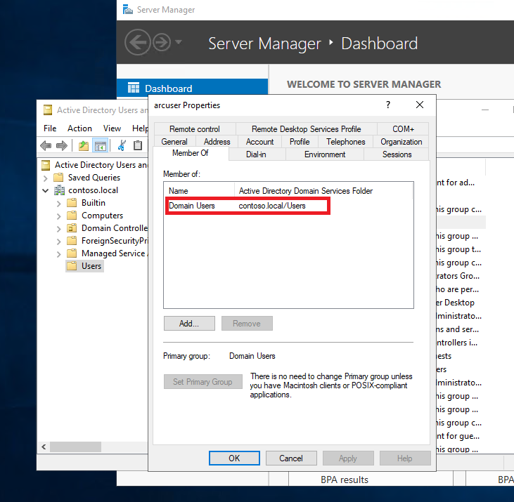
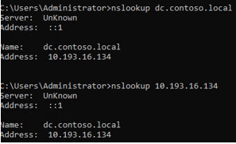

# Plan Azure Arc-enabled SQL Managed Instance in Active Directory manual authentication mode 

This article explains how to prepare to deploy an Azure Arc-enabled SQL Managed Instance the Active Directory (AD) manual authentication mode, it contains the following steps: 

1. Prepare the Active Directory (AD) domain controller 
1. Preparing the MSSQL keytab files
1. Preparing the Arc Data with AD deployment profile

## Background 

Azure Arc-enabled data services support Active Directory (AD) for identity and access management (IAM). SQL Managed Instances use an existing Active Directory (AD) for authentication. 

> [!TIP]
> Create an organizational unit (OU) for better administration experience and an active directory user account (AD account) prior to the deployment.

## Prerequisites

* Latest [Azure CLI](/cli/azure/install-azure-cli) with [`arcdata` extension](install-arcdata-extension.md) 
* On-premises AD domain controller
* A shell-based terminal of any Linux distribution, Azure Cloud Shell, or WSL 2.0 

## Create an AD deployment user account

Create an active directory user account. Select **Active Directory Users and Computers** on the left panel, find **Users** and then **New**. Alternatively, you can create an AD user with the following PowerShell script:

```powershell
New-ADUser -Name <your-ad-user-name>
```

Make sure this user has **Domain Users** permission to start with, you can check its properties to know further its permissions as the following: 



## Create service principal names (SPNs) for the SQL endpoint

SQL Managed Instance needs two service principal names that are derived from the chosen DNS domain name for the endpoint and the chosen port number for the endpoint. For example:

```console
MSSQLSvc/<DNS name>@<Realm>
MSSQLSvc/<DNS name>:<Port>@<Realm>
```

Register the SPNs under the AD account created in the previous step. Use the following command on the domain controller:

```console
setspn -S <SPN> <Account>
```

For example, if the user name is `arcuser` and the AD domain is `contoso.local`, the SPNs are, and SQL Server external service is exposed on the port 31433  :
 
```console
MSSQLSvc/arcuser.contoso.local@CONTOSO.LOCAL
MSSQLSvc/arcuser.contoso.local:31433@CONTOSO.LOCAL
```

## Create an organizational unit (OU)

This step is not mandatory, although it’s highly encouraged when it comes to managing many AD accounts of large organization. 

On the domain controller, open **Active Directory Users and Computers**. On the left panel, right-click the directory under which you want to create your OU and select **New** > **Organizational Unit**. Follow the prompts from the wizard to create the OU. Alternatively, you can create an OU with PowerShell script:

```powershell
New-ADOrganizationalUnit -Name "<name>" -Path "<Distinguished name of the directory you wish to create the OU in>"
```

## Verify your AD Domain Controller and DNS Server 

Create a canonical name based on the domain name. Configure an A record and a PTR record on the DNS server. 

* An **A record** maps a domain to the physical IP address of the computer hosting that domain.
* A **PTR record** is the opposite of the 'A' record, it provides the IP address associated with a domain name. DNS PTR records are used in reverse DNS lookups.

When creating a SQL login for a user named `arcuser` in `contoso.local domain` (`contoso\arcuser`),  SQL Server:

1. Attempts a forward lookup on `contoso` and gets the IP address of the domain controller
1. Performs a reverse lookup to get the full AD domain name as a result, in our case is `contoso.local`

To verify the domain name:

1. Open your terminal
1. Use `nslookup` to check A/PTR record set up
1. Verify the output as the following image which means you have configured A/PTR record successfully: 



## Prepare the MSSQL keytab file 

Use `adutil` to prepare the `sqlkeytab` file, then use it to create the Kubernetes secret. `adutil` is a command-line interface (CLI) utility for interacting and managing Active Directory domains. You can use this tool to simplify Active Directory (AD) authentication configuration for both SQL Server on Linux and Linux-based SQL containers. For an AD user named `arcuser` from `contoso.local` domain, this user can use the following command to authenticate:

```console
$ kinit arcuser@CONTOSO.LOCAL
Password for arcuser@CONTOSO.LOCAL:
```

The following command to create the MSSQL keytabs.

```console
$ adutil keytab create --path mssql.keytab --principal arcuser@CONTOSO.LOCAL  --enctype aes256-cts-hmac-sha1-96,arcfour-hmac --password <password> --kvno 2

$ adutil keytab create --path mssql.keytab --principal MSSQLSvc/arcuser.contoso.local@CONTOSO.LOCAL  --enctype aes256-cts-hmac-sha1-96,arcfour-hmac --password <password> --kvno 2

$ adutil keytab create --path mssql.keytab --principal MSSQLSvc/arcuser.contoso.local:31433@CONTOSO.LOCAL  --enctype aes256-cts-hmac-sha1-96,arcfour-hmac --password <password> --kvno 2
```

Once a keytab is generated, use it in the `.yaml` definition to create a Kubernetes secret. 

## Prepare the Arc Data with AD integration deployment profile 

Use the following command to initiate a deployment profile

```azurecli
    az arcdata dc config init --source azure-arc-kubeadm --path ./arc-k8s-custom
```

Use the following scripts to set up arc data deployment profile: 

```azurecli
az arcdata dc config replace --path arc-k8s-custom/control.json --json-values ".spec.infrastructure=onpremises"
az arcdata dc config replace --path arc-k8s-custom/control.json --json-values "spec.storage.data.className=local-storage"
az arcdata dc config replace --path arc-k8s-custom/control.json --json-values "spec.storage.logs.className=local-storage"
```

## Next steps

* Deploying [Arc-enabled SQL Managed Instance in Active Directory (AD) Manual Authentication mode](deploy-active-directory-manual-mode.md)
* [Connect to AD-integrated Azure Arc-enabled SQL Managed Instance](connect-ad-sql-mi.md)
