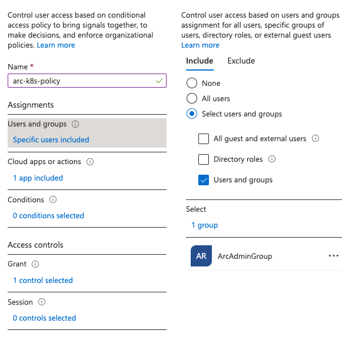
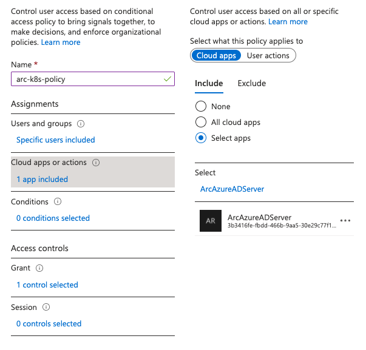
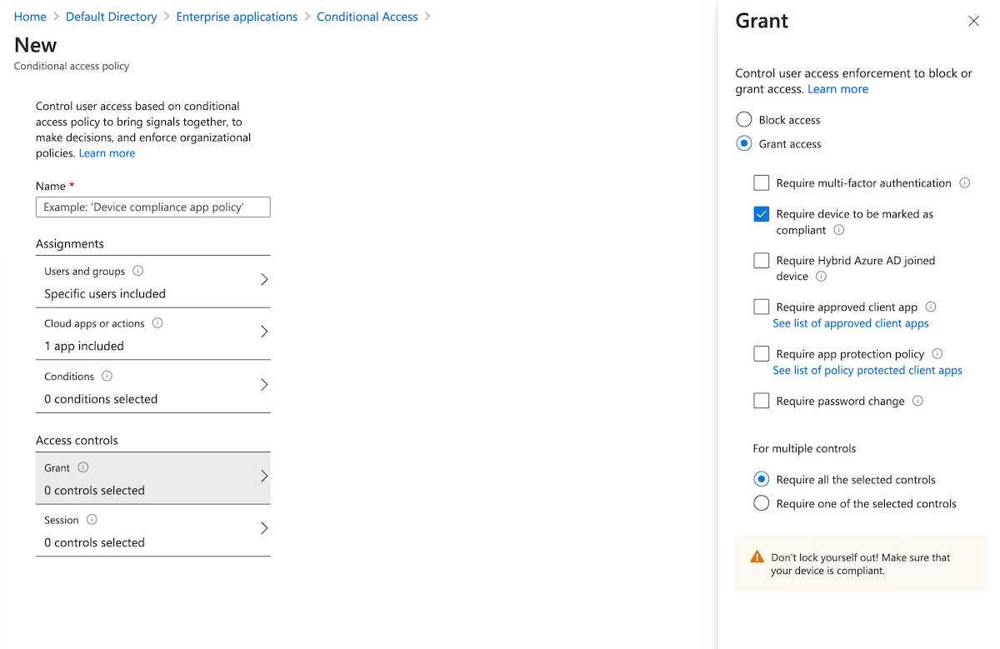
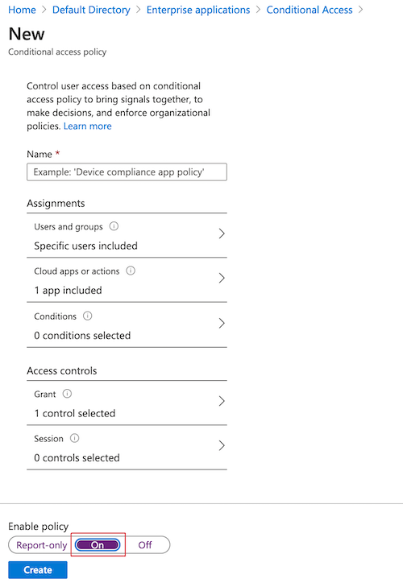
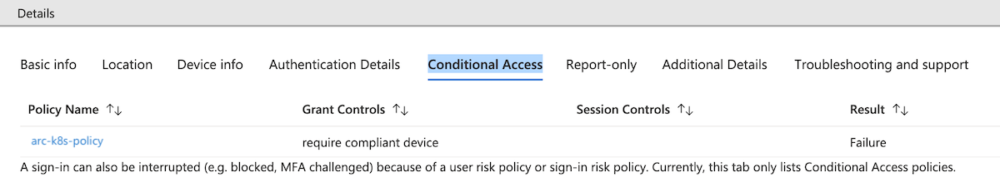
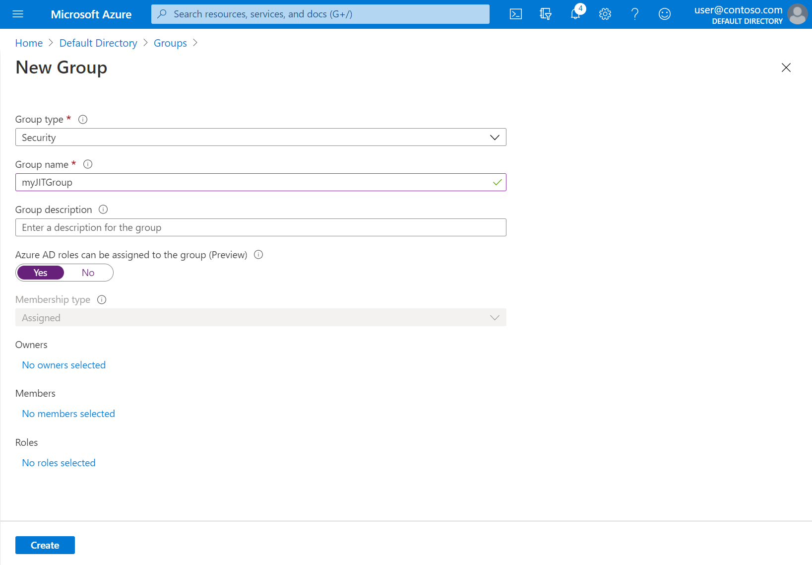
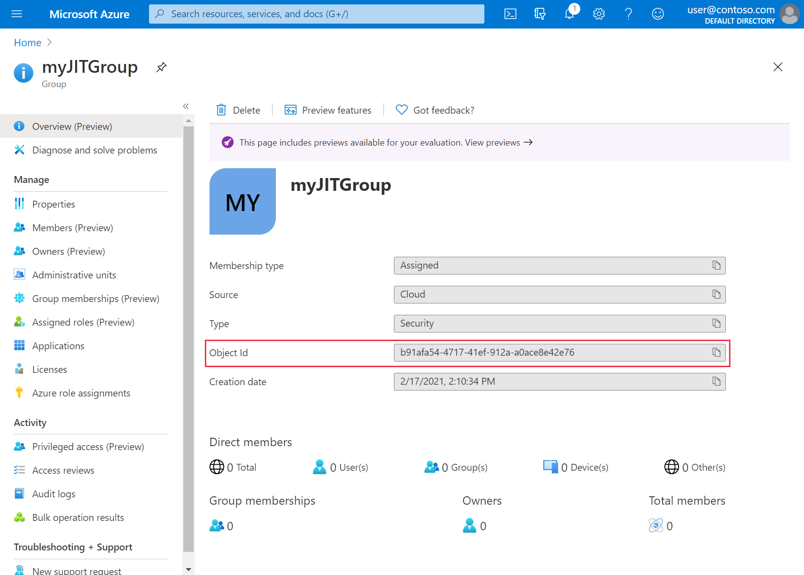
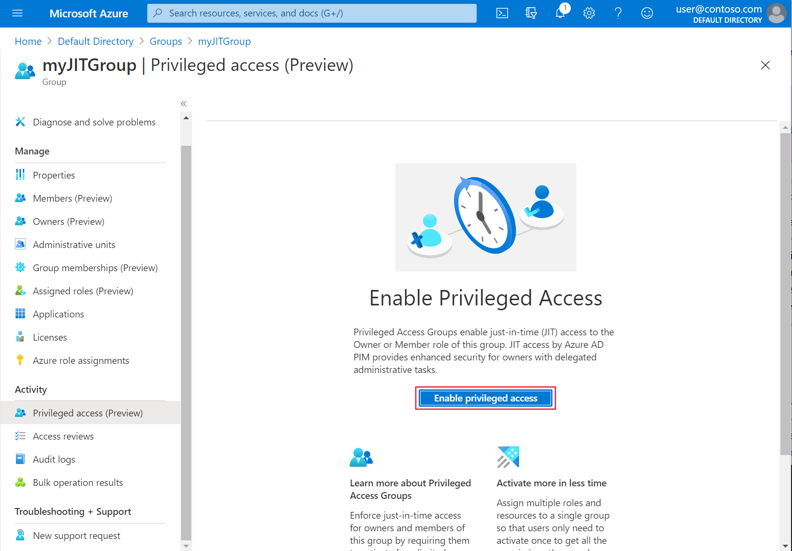
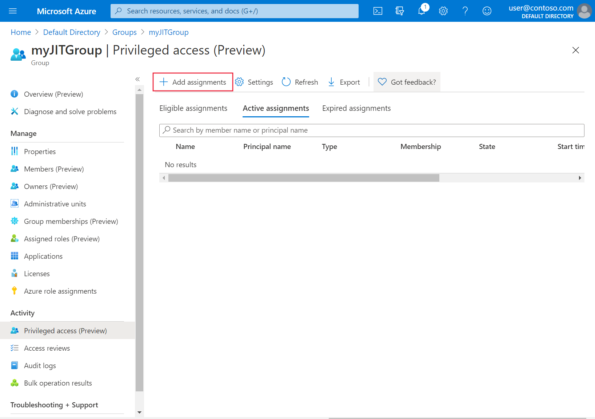
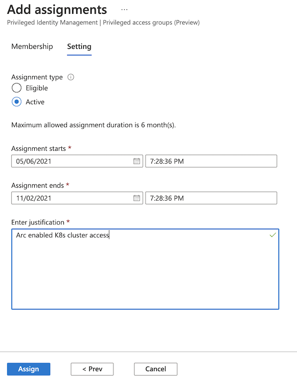

# Integrate Azure Active Directory with Azure Arc enabled Kubernetes clusters

Kubernetes [ClusterRoleBinding and RoleBinding](https://kubernetes.io/docs/reference/access-authn-authz/rbac/#rolebinding-and-clusterrolebinding) object types help to define authorization in Kubernetes natively. By using this feature, you can use Azure Active Directory (Azure AD) and role assignments in Azure to control authorization checks on the cluster. This implies that you can now use Azure role assignments to granularly control who can read, write, and delete Kubernetes objects like deployment, pod, and service.

A conceptual overview of this feature is available in the [Azure RBAC on Azure Arc enabled Kubernetes](conceptual-azure-rbac.md) article.

[!INCLUDE [preview features note](./includes/preview/preview-callout.md)]

## Prerequisites

- [Install or upgrade the Azure CLI](/cli/azure/install-azure-cli) to version 2.16.0 or later.

- Install the `connectedk8s` Azure CLI extension, version 1.1.0 or later:

    ```azurecli
    az extension add --name connectedk8s
    ```
    
    If the `connectedk8s` extension is already installed, you can update it to the latest version by using the following command: 

    ```azurecli
    az extension update --name connectedk8s
    ```

- Connect an existing Azure Arc enabled Kubernetes cluster:
    - If you haven't connected a cluster yet, use our [quickstart](quickstart-connect-cluster.md).
    - [Upgrade your agents](agent-upgrade.md#manually-upgrade-agents) to version 1.1.0 or later.

> [!NOTE]
> You can't set up this feature for managed Kubernetes offerings of cloud providers like Elastic Kubernetes Service or Google Kubernetes Engine where the user doesn't have access to the API server of the cluster. For Azure Kubernetes Service (AKS) clusters, this [feature is available natively](../../aks/manage-azure-rbac.md) and doesn't require the AKS cluster to be connected to Azure Arc.

## Set up Azure AD applications

### Create a server application

1. Create a new Azure AD application and get its `appId` value. This value is used in later steps as `serverApplicationId`.

    ```azurecli
    az ad app create --display-name "<clusterName>Server" --identifier-uris "https://<clusterName>Server" --query appId -o tsv
    ```

1. Update the application's group membership claims:

    ```azurecli
    az ad app update --id <serverApplicationId> --set groupMembershipClaims=All
    ```

1. Create a service principal and get its `password` field value. This value is required later as `serverApplicationSecret` when you're enabling this feature on the cluster.

    ```azurecli
    az ad sp create --id <serverApplicationId>
    az ad sp credential reset --name <serverApplicationId> --credential-description "ArcSecret" --query password -o tsv
    ```

1. Grant API permissions to the application:

    ```azurecli
    az ad app permission add --id <serverApplicationId> --api 00000003-0000-0000-c000-000000000000 --api-permissions e1fe6dd8-ba31-4d61-89e7-88639da4683d=Scope
    az ad app permission grant --id <serverApplicationId> --api 00000003-0000-0000-c000-000000000000
    ```

    > [!NOTE]
    > An Azure tenant administrator has to run this step.
    > 
    > For usage of this feature in production, we recommend that you  create a different server application for every cluster.

### Create a client application

1. Create a new Azure AD application and get its `appId` value. This value is used in later steps as `clientApplicationId`.

    ```azurecli
    az ad app create --display-name "<clusterName>Client" --native-app --reply-urls "https://<clusterName>Client" --query appId -o tsv
    ```

2. Create a service principal for this client application:

    ```azurecli
    az ad sp create --id <clientApplicationId>
    ```

3. Get the `oAuthPermissionId` value for the server application:

    ```azurecli
    az ad app show --id <serverApplicationId> --query "oauth2Permissions[0].id" -o tsv
    ```

4. Grant the required permissions for the client application:

    ```azurecli
    az ad app permission add --id <clientApplicationId> --api <serverApplicationId> --api-permissions <oAuthPermissionId>=Scope
    az ad app permission grant --id <clientApplicationId> --api <serverApplicationId>
    ```

## Create a role assignment for the server application

The server application needs the `Microsoft.Authorization/*/read` permissions to check if the user making the request is authorized on the Kubernetes objects that are a part of the request.

1. Create a file named *accessCheck.json* with the following contents:

    ```json
    {
      "Name": "Read authorization",
      "IsCustom": true,
      "Description": "Read authorization",
      "Actions": ["Microsoft.Authorization/*/read"],
      "NotActions": [],
      "DataActions": [],
      "NotDataActions": [],
      "AssignableScopes": [
        "/subscriptions/<subscription-id>"
      ]
    }
    ```

    Replace `<subscription-id>` with the actual subscription ID.

2. Run the following command to create the new custom role:

    ```azurecli
    az role definition create --role-definition ./accessCheck.json
    ```

3. From the output of the preceding command, store the value of the `id` field. This field is used in later steps as `roleId`.

4. Create a role assignment on the server application as `assignee` by using the role that you created:

    ```azurecli
    az role assignment create --role <roleId> --assignee <serverApplicationId> --scope /subscriptions/<subscription-id>
    ```

## Enable Azure RBAC on the cluster

Enable Azure role-based access control (RBAC) on your Arc enabled Kubernetes cluster by running the following command:

```console
az connectedk8s enable-features -n <clusterName> -g <resourceGroupName> --features azure-rbac --app-id <serverApplicationId> --app-secret <serverApplicationSecret>
```
    
> [!NOTE]
> Before you run the preceding command, ensure that the `kubeconfig` file on the machine is pointing to the cluster on which you'll enable the Azure RBAC feature.
>
> Use `--skip-azure-rbac-list` with the preceding command for a comma-separated list of usernames, emails, and OpenID connections undergoing authorization checks by using Kubernetes native `ClusterRoleBinding` and `RoleBinding` objects instead of Azure RBAC.

### Generic cluster where no reconciler is running on the apiserver specification

1. SSH into every master node of the cluster and take the following steps:

    1. Open the `apiserver` manifest in edit mode:
        
        ```console
        sudo vi /etc/kubernetes/manifests/kube-apiserver.yaml
        ```

    1. Add the following specification under `volumes`:
        
        ```yml
        - name: azure-rbac
          secret:
            secretName: azure-arc-guard-manifests
        ```

    1. Add the following specification under `volumeMounts`:

        ```yml
        - mountPath: /etc/guard
          name: azure-rbac
          readOnly: true
        ```

    1. Add the following `apiserver` arguments:

        ```yml
        - --authentication-token-webhook-config-file=/etc/guard/guard-authn-webhook.yaml
        - --authentication-token-webhook-cache-ttl=5m0s
        - --authorization-webhook-cache-authorized-ttl=5m0s
        - --authorization-webhook-config-file=/etc/guard/guard-authz-webhook.yaml
        - --authorization-webhook-version=v1
        - --authorization-mode=Node,Webhook,RBAC
        ```
    
        If the Kubernetes cluster is version 1.19.0 or later, you also need to set the following `apiserver` argument:

        ```yml
        - --authentication-token-webhook-version=v1
        ```

    1. Save and close the editor to update the `apiserver` pod.


### Cluster created by using Cluster API

1. Copy the guard secret that contains authentication and authorization webhook configuration files from the workload cluster onto your machine:

    ```console
    kubectl get secret azure-arc-guard-manifests -n kube-system -o yaml > azure-arc-guard-manifests.yaml
    ```

1. Change the `namespace` field in the *azure-arc-guard-manifests.yaml* file to the namespace within the management cluster where you're applying the custom resources for creation of workload clusters.

1. Apply this manifest:

    ```console
    kubectl apply -f azure-arc-guard-manifests.yaml
    ```

1. Edit the `KubeadmControlPlane` object by running `kubectl edit kcp <clustername>-control-plane`:
    
    1. Add the following snippet under `files`:
    
        ```console
        - contentFrom:
            secret:
              key: guard-authn-webhook.yaml
              name: azure-arc-guard-manifests
          owner: root:root
          path: /etc/kubernetes/guard-authn-webhook.yaml
          permissions: "0644"
        - contentFrom:
            secret:
              key: guard-authz-webhook.yaml
              name: azure-arc-guard-manifests
          owner: root:root
          path: /etc/kubernetes/guard-authz-webhook.yaml
          permissions: "0644"
        ```

    1. Add the following snippet under `apiServer` > `extraVolumes`:
    
        ```console
        - hostPath: /etc/kubernetes/guard-authn-webhook.yaml
            mountPath: /etc/guard/guard-authn-webhook.yaml
            name: guard-authn
            readOnly: true
        - hostPath: /etc/kubernetes/guard-authz-webhook.yaml
            mountPath: /etc/guard/guard-authz-webhook.yaml
            name: guard-authz
            readOnly: true
        ```

    1. Add the following snippet under `apiServer` > `extraArgs`:
    
        ```console
        authentication-token-webhook-cache-ttl: 5m0s
        authentication-token-webhook-config-file: /etc/guard/guard-authn-webhook.yaml
        authentication-token-webhook-version: v1
        authorization-mode: Node,Webhook,RBAC
        authorization-webhook-cache-authorized-ttl: 5m0s
        authorization-webhook-config-file: /etc/guard/guard-authz-webhook.yaml
        authorization-webhook-version: v1
        ```

    1. Save and close to update the `KubeadmControlPlane` object. Wait for these changes to appear on the workload cluster.


## Create role assignments for users to access the cluster

Owners of the Azure Arc enabled Kubernetes resource can use either built-in roles or custom roles to grant other users access to the Kubernetes cluster.

### Built-in roles

| Role | Description |
|---|---|
| [Azure Arc Kubernetes Viewer](../../role-based-access-control/built-in-roles.md#azure-arc-kubernetes-viewer) | Allows read-only access to see most objects in a namespace. This role doesn't allow viewing secrets. This is because `read` permission on secrets would enable access to `ServiceAccount` credentials in the namespace. These credentials would in turn allow API access through that `ServiceAccount` value (a form of privilege escalation). |
| [Azure Arc Kubernetes Writer](../../role-based-access-control/built-in-roles.md#azure-arc-kubernetes-writer) | Allows read/write access to most objects in a namespace. This role doesn't allow viewing or modifying roles or role bindings. However, this role allows accessing secrets and running pods as any `ServiceAccount` value in the namespace. So it can be used to gain the API access levels of any `ServiceAccount` value in the namespace. |
| [Azure Arc Kubernetes Admin](../../role-based-access-control/built-in-roles.md#azure-arc-kubernetes-admin) | Allows admin access. It's intended to be granted within a namespace through `RoleBinding`. If you use it in `RoleBinding`, it allows read/write access to most resources in a namespace, including the ability to create roles and role bindings within the namespace. This role doesn't allow write access to resource quota or to the namespace itself. |
| [Azure Arc Kubernetes Cluster Admin](../../role-based-access-control/built-in-roles.md#azure-arc-kubernetes-cluster-admin) | Allows superuser access to execute any action on any resource. When you use it in `ClusterRoleBinding`, it gives full control over every resource in the cluster and in all namespaces. When you use it in `RoleBinding`, it gives full control over every resource in the role binding's namespace, including the namespace itself.|

You can create role assignments scoped to the Arc enabled Kubernetes cluster in the Azure portal, on the **Access Control (IAM)** pane of the cluster resource. You can also use the following Azure CLI commands:

```azurecli
az role assignment create --role "Azure Arc Kubernetes Cluster Admin" --assignee <AZURE-AD-ENTITY-ID> --scope $ARM_ID
```

In those commands, `AZURE-AD-ENTITY-ID` can be a username (for example, `testuser@mytenant.onmicrosoft.com`) or even the `appId` value of a service principal.

Here's another example of creating a role assignment scoped to a specific namespace within the cluster:

```azurecli
az role assignment create --role "Azure Arc Kubernetes Viewer" --assignee <AZURE-AD-ENTITY-ID> --scope $ARM_ID/namespaces/<namespace-name>
```

> [!NOTE]
> You can create role assignments scoped to the cluster by using either the Azure portal or the Azure CLI, but you can create role assignments scoped to namespaces only by using the CLI.

### Custom roles

You can choose to create your own role definition for use in role assignments.

Walk through the following example of a role definition that allows a user to only read deployments. For more information, see [the full list of data actions that you can use to construct a role definition](../../role-based-access-control/resource-provider-operations.md#microsoftkubernetes).

Copy the following JSON object into a file called *custom-role.json*. Replace the `<subscription-id>` placeholder with the actual subscription ID. The custom role uses one of the data actions and lets you view all deployments in the scope (cluster or namespace) where the role assignment is created.

```json
{
    "Name": "Arc Deployment Viewer",
    "Description": "Lets you view all deployments in cluster/namespace.",
    "Actions": [],
    "NotActions": [],
    "DataActions": [
        "Microsoft.Kubernetes/connectedClusters/apps/deployments/read"
    ],
    "NotDataActions": [],
    "assignableScopes": [
        "/subscriptions/<subscription-id>"
    ]
}
```

1. Create the role definition by running the following command from the folder where you saved *custom-role.json*:

    ```bash
    az role definition create --role-definition @custom-role.json
    ```

1. Create a role assignment by using this custom role definition:

    ```bash
    az role assignment create --role "Arc Deployment Viewer" --assignee <AZURE-AD-ENTITY-ID> --scope $ARM_ID/namespaces/<namespace-name>
    ```

## Configure kubectl with user credentials

There are two ways to get the *kubeconfig* file that you need to access the cluster:

- You use the [Cluster Connect](cluster-connect.md) feature (`az connectedk8s proxy`) of the Azure Arc enabled Kubernetes cluster.
- The cluster admin shares the *kubeconfig* file with every other user.

### If you're accessing the cluster by using the Cluster Connect feature

Run the following command to start the proxy process:

```console
az connectedk8s proxy -n <clusterName> -g <resourceGroupName>
```

After the proxy process is running, you can open another tab in your console to [start sending your requests to the cluster](#send-requests-to-the-cluster).

### If the cluster admin shared the kubeconfig file with you 

1. Run the following command to set the credentials for the user:

    ```console
    kubectl config set-credentials <testuser>@<mytenant.onmicrosoft.com> \
    --auth-provider=azure \
    --auth-provider-arg=environment=AzurePublicCloud \
    --auth-provider-arg=client-id=<clientApplicationId> \
    --auth-provider-arg=tenant-id=<tenantId> \
    --auth-provider-arg=apiserver-id=<serverApplicationId>
    ```

1. Open the *kubeconfig* file that you created earlier. Under `contexts`, verify that the context associated with the cluster points to the user credentials that you created in the previous step.

1. Add the **config-mode** setting under `user` > `config`:
  
    ```console
    name: testuser@mytenant.onmicrosoft.com
    user:
        auth-provider:
        config:
            apiserver-id: $SERVER_APP_ID
            client-id: $CLIENT_APP_ID
            environment: AzurePublicCloud
            tenant-id: $TENANT_ID
            config-mode: "1"
        name: azure
    ```

## Send requests to the cluster

1. Run any `kubectl` command. For example:
   * `kubectl get nodes` 
   * `kubectl get pods`

1. After you're prompted for a browser-based authentication, copy the device login URL (`https://microsoft.com/devicelogin`) and open on your web browser.

1. Enter the code printed on your console. Copy and paste the code on your terminal into the prompt for device authentication input.

1. Enter the username (`testuser@mytenant.onmicrosoft.com`) and the associated password.

1. If you see an error message like this, it means you're unauthorized to access the requested resource:

    ```console
    Error from server (Forbidden): nodes is forbidden: User "testuser@mytenant.onmicrosoft.com" cannot list resource "nodes" in API group "" at the cluster scope: User doesn't have access to the resource in Azure. Update role assignment to allow access.
    ```

    An administrator needs to create a new role assignment that authorizes this user to have access on the resource.

## Use Conditional Access with Azure AD

When you're integrating Azure AD with your Arc enabled Kubernetes cluster, you can also use [Conditional Access](../../active-directory/conditional-access/overview.md) to control access to your cluster.

> [!NOTE]
> Azure AD Conditional Access is an Azure AD Premium capability.

To create an example Conditional Access policy to use with the cluster, complete the following steps:

1. At the top of the Azure portal, search for and select **Azure Active Directory**.
1. On the menu for Azure Active Directory on the left side, select **Enterprise applications**.
1. On the menu for enterprise applications on the left side, select **Conditional Access**.
1. On the menu for Conditional Access on the left side, select **Policies** > **New policy**.
    
    [  ](./media/azure-rbac/conditional-access-new-policy.png#lightbox)

1. Enter a name for the policy, such as **arc-k8s-policy**.
1. Select **Users and groups**. Under **Include**, choose **Select users and groups**. Then choose the users and groups where you want to apply the policy. For this example, choose the same Azure AD group that has administrative access to your cluster.

    [  ](./media/azure-rbac/conditional-access-users-groups.png#lightbox)

1. Select **Cloud apps or actions**. Under **Include**, choose **Select apps**. Then search for and select the server application that you created earlier.

    [  ](./media/azure-rbac/conditional-access-apps.png#lightbox)

1. Under **Access controls**, select **Grant**. Select **Grant access** > **Require device to be marked as compliant**.

    [  ](./media/azure-rbac/conditional-access-grant-compliant.png#lightbox)
    
1. Under **Enable policy**, select **On** > **Create**.

    [  ](./media/azure-rbac/conditional-access-enable-policies.png#lightbox)

Access the cluster again. For example, run the `kubectl get nodes` command to view nodes in the cluster:

```console
kubectl get nodes
```

Follow the instructions to sign in again. An error message states that you're successfully logged in, but your admin requires the device that's requesting access to be managed by Azure AD to access the resource. Follow these steps:

1. In the Azure portal, go to **Azure Active Directory**.
1. Select **Enterprise applications**. Then under **Activity**, select **Sign-ins**. 
1. An entry at the top shows **Failed** for **Status** and **Success** for **Conditional Access**. Select the entry, and then select **Conditional Access** in **Details**. Notice that your Conditional Access policy is listed.

   [  ](./media/azure-rbac/conditional-access-sign-in-activity.png#lightbox)

## Configure just-in-time cluster access with Azure AD

Another option for cluster access control is to use Privileged Identity Management (PIM) for just-in-time requests.

>[!NOTE]
> PIM is an Azure AD Premium capability that requires a Premium P2 SKU. For more on Azure AD SKUs, see the [pricing guide](https://azure.microsoft.com/pricing/details/active-directory/).

To configure just-in-time access requests for your cluster, complete the following steps:

1. At the top of the Azure portal, search for and select **Azure Active Directory**.
1. Take note of the tenant ID. For the rest of these instructions, we'll refer to that ID as `<tenant-id>`.

    [  ](./media/azure-rbac/jit-get-tenant-id.png#lightbox)

1. On the menu for Azure Active Directory on the left side, under **Manage**, select **Groups** > **New group**.

    [  ](./media/azure-rbac/jit-create-new-group.png#lightbox)

1. Make sure that **Security** is selected for **Group type**.  Enter a group name, such as **myJITGroup**. Under **Azure AD Roles can be assigned to this group (Preview)**, select **Yes**. Finally, select **Create**.

    [  ](./media/azure-rbac/jit-new-group-created.png#lightbox)

1. You're brought back to the **Groups** page. Select your newly created group and take note of the object ID. For the rest of these instructions, we'll refer to this ID as `<object-id>`.

    [  ](./media/azure-rbac/jit-get-object-id.png#lightbox)

1. Back in the Azure portal, on the menu for **Activity** on the left side, select **Privileged Access (Preview)**. Then select **Enable Privileged Access**.

    [  ](./media/azure-rbac/jit-enabling-priv-access.png#lightbox)

1. Select **Add assignments** to begin granting access.

    [  ](./media/azure-rbac/jit-add-active-assignment.png#lightbox)

1. Select a role of **Member**, and select the users and groups to whom you want to grant cluster access. A group admin can modify these assignments at any time. When you're ready to move on, select **Next**.

    [  ](./media/azure-rbac/jit-adding-assignment.png#lightbox)

1. Choose an assignment type of **Active**, choose the desired duration, and provide a justification. When you're ready to proceed, select **Assign**. For more on assignment types, see [Assign eligibility for a privileged access group (preview) in Privileged Identity Management](../../active-directory/privileged-identity-management/groups-assign-member-owner.md#assign-an-owner-or-member-of-a-group).

    [  ](./media/azure-rbac/jit-set-active-assignment.png#lightbox)

After you've made the assignments, verify that just-in-time access is working by accessing the cluster. For example, use the `kubectl get nodes` command to view nodes in the cluster:

```console
kubectl get nodes
```

Note the authentication requirement and follow the steps to authenticate. If authentication is successful, you should see output similar to the following:

```output
To sign in, use a web browser to open the page https://microsoft.com/devicelogin and enter the code AAAAAAAAA to authenticate.

NAME      STATUS   ROLES    AGE      VERSION
node-1    Ready    agent    6m36s    v1.18.14
node-2    Ready    agent    6m42s    v1.18.14
node-3    Ready    agent    6m33s    v1.18.14
```

## Next steps

> [!div class="nextstepaction"]
> Securely connect to the cluster by using [Cluster Connect](cluster-connect.md).
