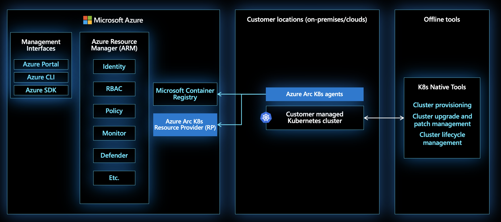

# Azure Arc-enabled Kubernetes Agent Overview

[Kubernetes](https://kubernetes.io/) can deploy containerized workloads consistently on hybrid and multi-cloud environments. Azure Arc-enabled Kubernetes provides a centralized, consistent control plane to manage policy, governance, and security across Kubernetes clusters on these heterogenous environments. This article provides an overview of the Azure Arc agents deployed on the Kubernetes clusters as part of connecting the cluster to Azure Arc.

## Deploy agents to your cluster

Most on-prem datacenters enforce strict network rules that prevent inbound communication on the network boundary firewall. Azure Arc-enabled Kubernetes works with these restrictions by not requiring inbound ports on the firewall. Azure Arc agents only require outbound communication to a prerequisite list of network endpoints.

The following steps are involved in connecting a Kubernetes cluster to Azure Arc:

1. Create a Kubernetes cluster on your choice of infrastructure (VMware vSphere, Amazon Web Services, Google Cloud Platform, etc.). 

    > [!NOTE]
    > Since Azure Arc-enabled Kubernetes currently only supports attaching existing Kubernetes clusters to Azure Arc, customers are required to create and manage the lifecycle of the Kubernetes cluster themselves.  

1. Start the Azure Arc registration for your cluster using Azure CLI.
    * Azure CLI uses Helm to deploy the agent Helm chart on the cluster.
    * The cluster nodes initiate an outbound communication to the [Microsoft Container Registry](https://github.com/microsoft/containerregistry) and pull the images needed to create the following agents in the `azure-arc` namespace:

        | Agent | Description |
        | ----- | ----------- |
        | `deployment.apps/clusteridentityoperator` | Azure Arc-enabled Kubernetes currently supports only [system assigned identities](../../active-directory/managed-identities-azure-resources/overview.md). `clusteridentityoperator` initiates the first outbound communication. This first communication fetches the Managed Service Identity (MSI) certificate used by other agents for communication with Azure. |
        | `deployment.apps/config-agent` | Watches the connected cluster for source control configuration resources applied on the cluster. Updates the compliance state. |
        | `deployment.apps/controller-manager` | An operator of operators that orchestrates interactions between Azure Arc components. |    
        | `deployment.apps/metrics-agent` | Collects metrics of other Arc agents to verify optimal performance. |
        | `deployment.apps/cluster-metadata-operator` | Gathers cluster metadata, including cluster version, node count, and Azure Arc agent version. |
        | `deployment.apps/resource-sync-agent` | Syncs the above-mentioned cluster metadata to Azure. |
        | `deployment.apps/flux-logs-agent` | Collects logs from the flux operators deployed as a part of source control configuration. |
        | `deployment.apps/extension-manager` | Installs and manages lifecycle of extension helm charts |
        | `deployment.apps/kube-aad-proxy` | Used for authentication of requests sent to the cluster using Cluster Connect |
        | `deployment.apps/clusterconnect-agent` | Reverse proxy agent that enables Cluster Connect feature to provide access to `apiserver` of cluster. This is an optional component deployed only if `cluster-connect` feature is enabled on the cluster   |
        | `deployment.apps/guard` | Authentication and authorization webhook server used for AAD RBAC feature. This is an optional component deployed only if `azure-rbac` feature is enabled on the cluster   |

1. Once all the Azure Arc-enabled Kubernetes agent pods are in `Running` state, verify that your cluster connected to Azure Arc. You should see:
    * An Azure Arc-enabled Kubernetes resource in [Azure Resource Manager](../../azure-resource-manager/management/overview.md). Azure tracks this resource as a projection of the customer-managed Kubernetes cluster, not the actual Kubernetes cluster itself.
    * Cluster metadata (like Kubernetes version, agent version, and number of nodes) appears on the Azure Arc-enabled Kubernetes resource as metadata.

## Connectivity status

| Status | Description |
| ------ | ----------- |
| Connecting | Azure Arc-enabled Kubernetes resource is created in Azure Resource Manager, but service hasn't received the agent heartbeat yet. |
| Connected | Azure Arc-enabled Kubernetes service received an agent heartbeat sometime within the previous 15 minutes. |
| Offline | Azure Arc-enabled Kubernetes resource was previously connected, but the service hasn't received any agent heartbeat for 15 minutes. |
| Expired | MSI certificate has an expiration window of 90 days after it is issued. Once this certificate expires, the resource is considered `Expired` and all features such as configuration, monitoring, and policy stop working on this cluster. More information on how to address expired Azure Arc-enabled Kubernetes resources can be found [in the FAQ article](./faq.md#how-to-address-expired-azure-arc-enabled-kubernetes-resources). |

## Understand connectivity modes

| Connectivity mode | Description |
| ----------------- | ----------- |
| Fully connected | Agents can consistently communicate with Azure with little delay in propagating GitOps configurations, enforcing Azure Policy and Gatekeeper policies, and collecting workload metrics and logs in Azure Monitor. |
| Semi-connected | The MSI certificate pulled down by the `clusteridentityoperator` is valid for up to 90 days before the certificate expires. Upon expiration, the Azure Arc-enabled Kubernetes resource stops working. To reactivate all Azure Arc features on the cluster, delete and recreate the Azure Arc-enabled Kubernetes resource and agents. During the 90 days, connect the cluster at least once every 30 days. |
| Disconnected | Kubernetes clusters in disconnected environments unable to access Azure are currently unsupported by Azure Arc-enabled Kubernetes. If this capability is of interest to you, submit or up-vote an idea on [Azure Arc's UserVoice forum](https://feedback.azure.com/d365community/forum/5c778dec-0625-ec11-b6e6-000d3a4f0858).

## Next steps

* Walk through our quickstart to [connect a Kubernetes cluster to Azure Arc](./quickstart-connect-cluster.md).
* Learn more about the creating connections between your cluster and a Git repository as a [configuration resource with Azure Arc-enabled Kubernetes](./conceptual-configurations.md).
