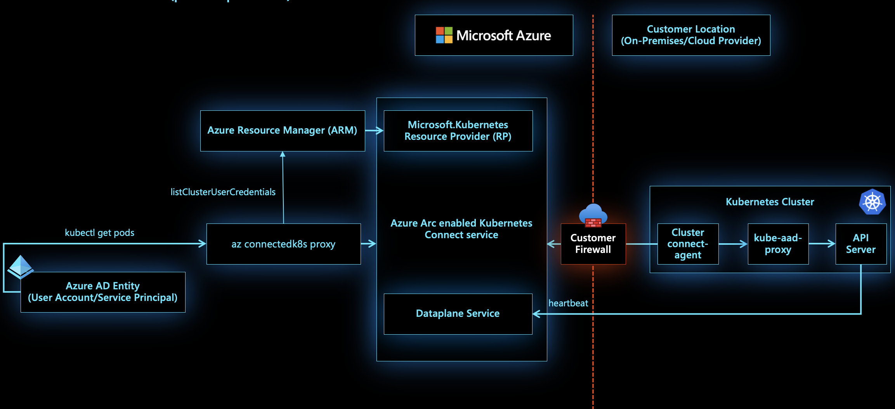

# Cluster connect on Azure Arc enabled Kubernetes

Cluster connect feature of Azure Arc enabled Kubernetes provides connectivity to the `apiserver` of the cluster without requiring any additional inbound communication to be enabled. This is achieved by mapping a Hybrid Connections resource on the Azure service side to every Arc enabled Kubernetes cluster where a reverse proxy agent is able to securely initiate a session with hybrid connection in an outbound manner. This feature allows your developers to access the clusters from anywhere for interactive development and debugging. You can even use hosted agents/runners of Azure Pipelines, GitHub Actions or any other hosted CI/CD service to deploy applications to even on-prem clusters without requiring self-hosted agents.

[!INCLUDE [preview features note](./includes/preview/preview-callout.md)]

## Architecture

For every Azure Arc enabled Kubernetes resource, there is a Hybrid Connections resource provisioned in Microsoft tenant by Azure Arc services. On the cluster side, there is a reverse proxy agent called `clusterconnect-agent` making outbound calls to the hybrid connections resource to establish the session.

When the user calls `az connectedk8s proxy`, a client side proxy binary is downloaded on the fly and spun up as a process on the client machine. This client side proxy leverages the caller's Azure access token and the Azure Resource Manager ID name of the Azure Arc enabled Kubernetes cluster (on which the `az connectedk8s proxy` is invoked) to fetch a `kubeconfig` file associated with this cluster. This `kubeconfig` file saved on the machine by client side proxy has the server URL pointing to an endpoint on the client side proxy process. 

When a user sends a request using this `kubeconfig` file, client side proxy maps the endpoint on which this request is received to the hybrid connections resource to which this messages needs to be forwarded to. The message is then passed on from hybrid connections resource to the `clusterconnect-agent` running on the cluster. The `clusterconnect-agent` then passes on the message to a component called `kube-aad-proxy`, which is responsible for doing AAD authentication on the calling entity. After AAD authentication is done, `kube-aad-proxy` leverages Kubernetes feature of [user impersonation](https://kubernetes.io/docs/reference/access-authn-authz/authentication/#user-impersonation) to pass on the request to the `apiserver` of the cluster.

In this entire process, there was no need for any inbound ports on the firewall to be enabled.

## Next steps

* Walk through our quickstart to [connect a Kubernetes cluster to Azure Arc](./quickstart-connect-cluster.md).
* Already have a Kubernetes cluster connected to Azure Arc? [Access your cluster securely from anywhere using Cluster connect](./cluster-connect.md).