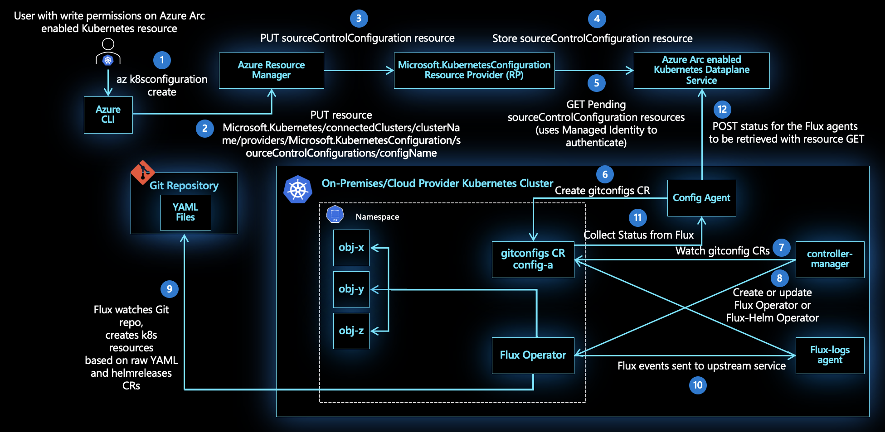

# GitOps Flux v1 configurations with Azure Arc-enabled Kubernetes

> [!IMPORTANT]
> The documents in this section are for GitOps with Flux v1.  GitOps with Flux v2 is now available for Azure Arc-enabled Kubernetes and Azure Kubernetes Service (AKS) clusters; [learn about GitOps with Flux v2](./conceptual-gitops-flux2.md). We recommend [migrating to Flux v2](conceptual-gitops-flux2.md#migrate-from-flux-v1) as soon as possible.
>
> Support for Flux v1-based cluster configuration resources created prior to January 1, 2024 will end on [May 24, 2025](https://azure.microsoft.com/updates/migrate-your-gitops-configurations-from-flux-v1-to-flux-v2-by-24-may-2025/). Starting on January 1, 2024, you won't be able to create new Flux v1-based cluster configuration resources.

In relation to Kubernetes, GitOps is the practice of declaring the desired state of Kubernetes cluster configurations (deployments, namespaces, etc.) in a Git repository. This declaration is followed by a polling and pull-based deployment of these cluster configurations using an operator. The Git repository can contain:

* YAML-format manifests describing any valid Kubernetes resources, including Namespaces, ConfigMaps, Deployments, DaemonSets, etc.
* Helm charts for deploying applications.

[Flux](https://docs.fluxcd.io/), a popular open-source tool in the GitOps space, can be deployed on the Kubernetes cluster to ease the flow of configurations from a Git repository to a Kubernetes cluster. Flux supports the deployment of its operator at both the cluster and namespace scopes. A flux operator deployed with namespace scope can only deploy Kubernetes objects within that specific namespace. The ability to choose between cluster or namespace scope helps you achieve multi-tenant deployment patterns on the same Kubernetes cluster.

## Configurations

The connection between your cluster and a Git repository is created as a configuration resource (`Microsoft.KubernetesConfiguration/sourceControlConfigurations`) on top of the Azure Arc-enabled Kubernetes resource (represented by `Microsoft.Kubernetes/connectedClusters`) in Azure Resource Manager. 

The configuration resource properties are used to deploy Flux operator on the cluster with the appropriate parameters, such as the Git repo from which to pull manifests and the polling interval at which to pull them. The configuration resource data is stored encrypted at rest in an Azure Cosmos DB database to ensure data confidentiality.

The `config-agent` running in your cluster is responsible for:
* Tracking new or updated configuration resources on the Azure Arc-enabled Kubernetes resource.
* Deploying a Flux operator to watch the Git repository for each configuration resource.
* Applying any updates made to any configuration resource. 

You can create multiple namespace-scoped configuration resources on the same Azure Arc-enabled Kubernetes cluster to achieve multi-tenancy.

> [!NOTE]
> * `config-agent` monitors for new or updated configuration resources to be available on the Azure Arc-enabled Kubernetes resource. Thus agents require connectivity for the desired state to be pulled down to the cluster. If agents are unable to connect to Azure, there is a delay in propagating the desired state to the cluster.
> * Sensitive customer inputs like private key, known hosts content, HTTPS username, and token/password are not stored for more than 48 hours in the Azure Arc-enabled Kubernetes services. If you are using sensitive inputs for configurations, bring the clusters online as regularly as possible.

## Apply configurations at scale

Since Azure Resource Manager manages your configurations, you can automate creating the same configuration across all Azure Arc-enabled Kubernetes resources using Azure Policy, within scope of a subscription or a resource group. 

This at-scale enforcement ensures a common baseline configuration (containing configurations like ClusterRoleBindings, RoleBindings, and NetworkPolicy) can be applied across an entire fleet or inventory of Azure Arc-enabled Kubernetes clusters.

## Next steps

* Use our quickstart to [connect a Kubernetes cluster to Azure Arc](./quickstart-connect-cluster.md).
* [Create configurations](./tutorial-use-gitops-connected-cluster.md) on your Azure Arc-enabled Kubernetes cluster.
* [Use Azure Policy to apply configurations at scale](./use-azure-policy.md).
