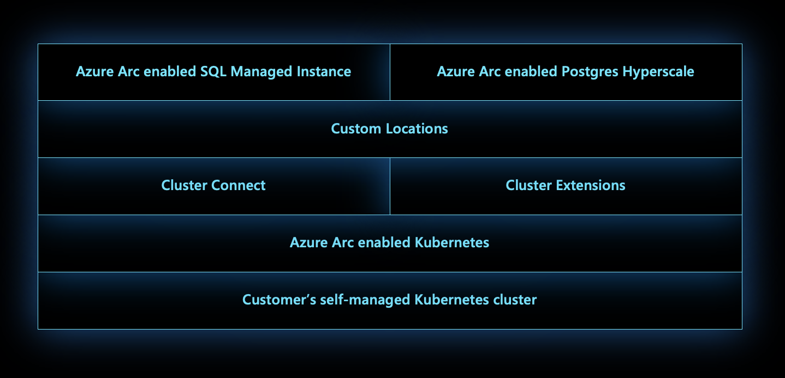

# Custom locations on top of Azure Arc-enabled Kubernetes

As an extension of the Azure location construct, the *custom locations* feature provides a way for tenant administrators to use their Azure Arc-enabled Kubernetes clusters as target locations for deploying Azure services instances. Examples of Azure offerings that can be deployed on top of custom locations include databases, such as SQL Managed Instance enabled by Azure Arc and Azure Arc-enabled PostgreSQL server.

Similar to Azure locations, end users within the tenant who have access to Custom Locations can deploy resources there using their company's private compute.

You can visualize custom locations as an abstraction layer on top of Azure Arc-enabled Kubernetes cluster, cluster connect, and cluster extensions. Custom locations create the granular [RoleBindings and ClusterRoleBindings](https://kubernetes.io/docs/reference/access-authn-authz/rbac/#rolebinding-and-clusterrolebinding) necessary for other Azure services to access the cluster. These other Azure services require cluster access to manage resources that the customer wants to deploy on their clusters.

## Architecture

When the admin [enables the custom locations feature on the cluster](custom-locations.md), a ClusterRoleBinding is created on the cluster, authorizing the Microsoft Entra application used by the custom locations resource provider. Once authorized, the custom locations resource provider can create ClusterRoleBindings or RoleBindings needed by other Azure resource providers to create custom resources on this cluster. The cluster extensions installed on the cluster determine the list of resource providers to authorize.

When the user creates a data service instance on the cluster:

1. The PUT request is sent to Azure Resource Manager.
1. The PUT request is forwarded to the Azure Arc-enabled Data Services RP.
1. The RP fetches the `kubeconfig` file associated with the Azure Arc-enabled Kubernetes cluster on which the custom location exists.
   * Custom location is referenced as `extendedLocation` in the original PUT request.
1. The Azure Arc-enabled Data Services resource provider uses the `kubeconfig` to communicate with the cluster to create a custom resource of the Azure Arc-enabled Data Services type on the namespace mapped to the custom location.
   * The Azure Arc-enabled Data Services operator was deployed via cluster extension creation before the custom location existed.
1. The Azure Arc-enabled Data Services operator reads the new custom resource created on the cluster and creates the data controller, translating into realization of the desired state on the cluster.

The sequence of steps to create the SQL managed instance and PostgreSQL instance are identical to the sequence of steps described above.

## Next steps

* Use our quickstart to [connect a Kubernetes cluster to Azure Arc](./quickstart-connect-cluster.md).
* [Create a custom location](./custom-locations.md) on your Azure Arc-enabled Kubernetes cluster.
