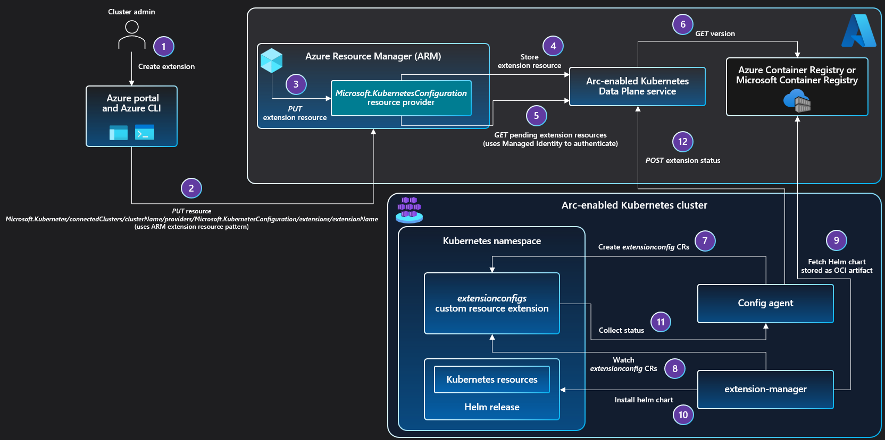

# Cluster extensions

[Helm charts](https://helm.sh/) help you manage Kubernetes applications by providing the building blocks needed to define, install, and upgrade even the most complex Kubernetes applications. The cluster extension feature builds on top of the packaging components of Helm by providing an Azure Resource Manager-driven experience for installation and lifecycle management of different Azure capabilities on top of your Kubernetes cluster.

A cluster operator or admin can [use the cluster extensions feature](extensions.md) to:

- Install and manage key management, data, and application offerings on your Kubernetes cluster.
- Use Azure Policy to automate at-scale deployment of cluster extensions across all clusters in your environment.
- Subscribe to release trains (for example, preview or stable) for each extension.
- Set up auto-upgrade for extensions or pin to a specific version and manually upgrade versions.
- Update extension properties or delete extension instances.

For a list of all currently supported extensions, see [Available extensions for Azure Arc-enabled Kubernetes clusters](extensions-release.md).

## Architecture

The cluster extension instance is created as an extension Azure Resource Manager resource (`Microsoft.KubernetesConfiguration/extensions`) on top of the Azure Arc-enabled Kubernetes resource (represented by `Microsoft.Kubernetes/connectedClusters`) in Azure Resource Manager. This representation in Azure Resource Manager allows you to author a policy that checks for all the Azure Arc-enabled Kubernetes resources with or without a specific cluster extension. Once you've determined which clusters are missing the cluster extensions with desired property values, you can remediate these non-compliant resources using Azure Policy.

The `config-agent` running in your cluster tracks new and updated extension resources on the Azure Arc-enabled Kubernetes resource. The `extensions-manager` agent running in your cluster reads the extension type that needs to be installed and pulls the associated Helm chart from Azure Container Registry or Microsoft Container Registry and installs it on the cluster.

Both the `config-agent` and `extensions-manager` components running in the cluster handle extension instance updates, version updates and extension instance deletion. These agents use the system-assigned managed identity of the cluster to securely communicate with Azure services.

> [!NOTE]
> `config-agent` checks for new or updated extension instances on top of Azure Arc-enabled Kubernetes cluster. The agents require connectivity for the desired state of the extension to be pulled down to the cluster. If agents are unable to connect to Azure, propagation of the desired state to the cluster is delayed.
>
> Protected configuration settings for an extension instance are stored for up to 48 hours in the Azure Arc-enabled Kubernetes services. As a result, if the cluster remains disconnected during the 48 hours after the extension resource was created on Azure, the extension changes from a `Pending` state to `Failed` state. To prevent this, we recommend bringing clusters online regularly.

> [!IMPORTANT]
> Currently, Azure Arc-enabled Kubernetes cluster extensions aren't supported on ARM64-based clusters, except for [Flux (GitOps)](conceptual-gitops-flux2.md). To [install and use other cluster extensions](extensions.md), the cluster must have at least one node of operating system and architecture type `linux/amd64`.

## Extension scope

Each extension type defines the scope at which they operate on the cluster. Extension installations on Arc-enabled Kubernetes clusters are either *cluster-scoped* or *namespace-scoped*.

A cluster-scoped extension will be installed in the `release-namespace` specified during extension creation. Typically, only one instance of the cluster-scoped extension and its components, such as pods, operators, and Custom Resource Definitions (CRDs), are installed in the release namespace on the cluster.

A namespace-scoped extension can be installed in a given namespace provided using the `–namespace` property. Since the extension can be deployed at a namespace scope, multiple instances of the namespace-scoped extension and its components can run on the cluster.  Each extension instance has permissions on the namespace where it is deployed to. All the above extensions are cluster-scoped except Event Grid on Kubernetes.

All of the [currently available extensions](extensions-release.md) are cluster-scoped, except for [Azure API Management on Azure Arc](../../api-management/how-to-deploy-self-hosted-gateway-azure-arc.md) .

## Next steps

- Use our quickstart to [connect a Kubernetes cluster to Azure Arc](./quickstart-connect-cluster.md).
- [Deploy cluster extensions](./extensions.md) on your Azure Arc-enabled Kubernetes cluster.
