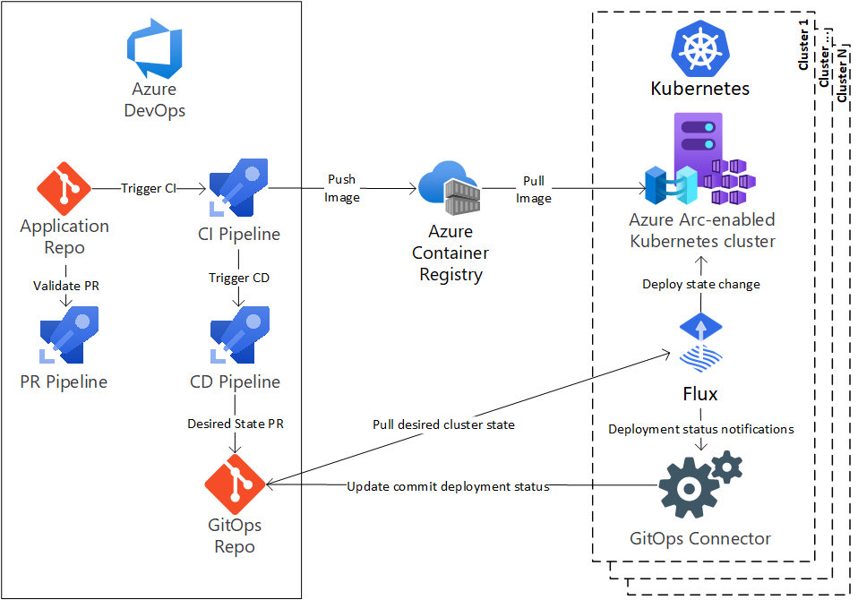

# CI/CD workflow using GitOps - Azure Arc-enabled Kubernetes

> [!IMPORTANT]
> The workflow described in this document uses GitOps with Flux v1. GitOps with Flux v2 is now available for Azure Arc-enabled Kubernetes and Azure Kubernetes Service (AKS) clusters; [learn about CI/CD workflow using GitOps with Flux v2](./conceptual-gitops-flux2-ci-cd.md). We recommend [migrating to Flux v2](conceptual-gitops-flux2.md#migrate-from-flux-v1) as soon as possible.
>
> Support for Flux v1-based cluster configuration resources created prior to January 1, 2024 will end on [May 24, 2025](https://azure.microsoft.com/updates/migrate-your-gitops-configurations-from-flux-v1-to-flux-v2-by-24-may-2025/). Starting on January 1, 2024, you won't be able to create new Flux v1-based cluster configuration resources.

Modern Kubernetes deployments house multiple applications, clusters, and environments. With GitOps, you can manage these complex setups more easily, tracking the desired state of the Kubernetes environments declaratively with Git. Using common Git tooling to track cluster state, you can increase accountability, facilitate fault investigation, and enable automation to manage environments.

This conceptual overview explains GitOps as a reality in the full application change lifecycle using Azure Arc, Azure Repos, and Azure Pipelines. [Jump to an example](#example-workflow) of a single application change to GitOps-controlled Kubernetes environments.

## Architecture

Consider an application deployed to one or more Kubernetes environments.

### Application repo
The application repo contains the application code that developers work on during their inner loop. The application’s deployment templates live in this repo in a generic form, like Helm or Kustomize. Environment-specific values aren't stored. Changes to this repo invoke a PR or CI pipeline that starts the deployment process.
### Container Registry
The container registry holds all the first- and third-party images used in the Kubernetes environments. Tag first-party application images with human readable tags and the Git commit used to build the image. Cache third-party images for security, speed, and resilience. Set a plan for timely testing and integration of security updates. For more information, see the [ACR Consume and maintain public content](../../container-registry/tasks-consume-public-content.md) guide for an example.
### PR Pipeline
PRs to the application repo are gated on a successful run of the PR pipeline. This pipeline runs the basic quality gates, such as linting and unit tests on the application code. The pipeline tests the application and lints Dockerfiles and Helm templates used for deployment to a Kubernetes environment. Docker images should be built and tested, but not pushed. Keep the pipeline duration relatively short to allow for rapid iteration.
### CI Pipeline
The application CI pipeline runs all the PR pipeline steps and expands the testing and deployment checks. The pipeline can be run for each commit, or at a regular cadence with a group of commits. At this stage, perform application testing that is too long for a PR pipeline. Push Docker images to the Container Registry after building in preparation for deployment. The replaced template can be linted with a set of testing values. Images used at service runtime should be linted, built, and tested at this point. In the CI build specifically, artifacts are published for the CD step to consume in preparation for deployment.
### Flux
Flux is a service that runs in each cluster and is responsible for maintaining the desired state. The service frequently polls the GitOps repo for changes to its cluster and applies them.
### CD Pipeline
The CD pipeline is automatically triggered by successful CI builds. It uses the previously published templates, substitutes environment values, and opens a PR to the GitOps repo to request a change to the desired state of one or more Kubernetes clusters. Cluster administrators review the state change PR and approve the merge to the GitOps repo. The pipeline then waits for the PR to complete, which allows Flux to pick up the state change.
### GitOps repo
The GitOps repo represents the current desired state of all environments across clusters. Any change to this repo is picked up by the Flux service in each cluster and deployed. PRs are created with changes to the desired state, reviewed, and merged. These PRs contain changes to both deployment templates and the resulting rendered Kubernetes manifests. Low-level rendered manifests allow more careful inspection of changes typically unseen at the template-level.
### Kubernetes clusters
At least one Azure Arc-enabled Kubernetes cluster serves the different environments needed by the application. For example, a single cluster can serve both a dev and QA environment through different namespaces. A second cluster can provide easier separation of environments and more fine-grained control.
## Example workflow
As an application developer, Alice:
* Writes application code.
* Determines how to run the application in a Docker container.
* Defines the templates that run the container and dependent services in a Kubernetes cluster.

While Alice knows the application needs the capability to run in multiple environments, she doesn't know the specific settings for each environment.

Suppose Alice wants to make an application change that alters the Docker image used in the application deployment template.

1. Alice changes the deployment template, pushes it to a remote branch on the application repo, and opens a PR for review.
2. Alice asks her team to review the change.
    * The PR pipeline runs validation.
    * After a successful pipeline run, the team signs off and the change is merged.
3. The CI pipeline validates Alice's change and successfully completes.
    * The change is safe to deploy to the cluster, and the artifacts are saved to the CI pipeline run.
4. Alice's change merges and triggers the CD pipeline.
    * The CD pipeline picks up the artifacts stored by Alice's CI pipeline run.
    * The CD pipeline substitutes the templates with environment-specific values, and stages any changes against the existing cluster state in the GitOps repo.
    * The CD pipeline creates a PR to the GitOps repo with the desired changes to the cluster state.
5. Alice's team reviews and approves her PR.
    * The change is merged into the target branch corresponding to the environment.
6. Within minutes, Flux notices a change in the GitOps repo and pulls Alice's change.
    * Because of the Docker image change, the application pod requires an update.
    * Flux applies the change to the cluster.
7. Alice tests the application endpoint to verify the deployment successfully completed.
   > [!NOTE]
   > For more environments targeted for deployment, the CD pipeline iterates by creating a PR for the next environment and repeats steps 4-7. The process many need extra approval for riskier deployments or environments, such as a security-related change or a production environment.
8.  Once all the environments have received successful deployments, the pipeline completes.

## Next steps
Learn more about creating connections between your cluster and a Git repository as a [configuration resource with Azure Arc-enabled Kubernetes](./conceptual-configurations.md)
