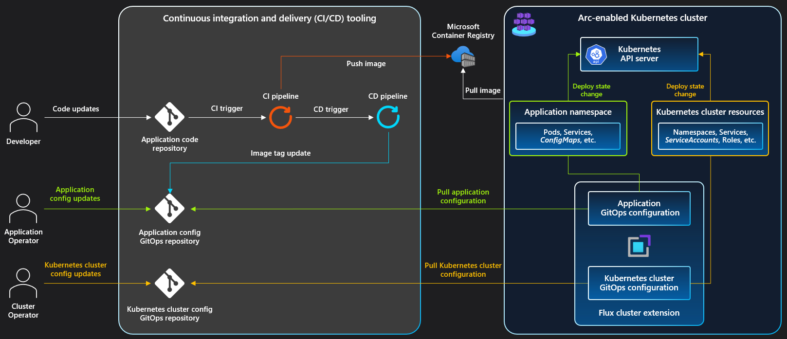

# CI/CD workflow using GitOps (Flux v2) - Azure Arc enabled Kubernetes

Modern Kubernetes deployments contain multiple applications, clusters, and environments. With GitOps, you can manage these complex setups more easily, tracking the desired state of the Kubernetes environments declaratively with Git. Using common Git tooling to declare cluster state, you can increase accountability, facilitate fault investigation, and enable automation to manage environments.

This conceptual overview explains GitOps as a reality in the full application change lifecycle using Azure Arc, Azure Repos, and Azure Pipelines. There is also an example of a single application change to GitOps-controlled Kubernetes environments.

## Architecture

Consider an application deployed to one or more Kubernetes environments.

### Application repository

The application repository contains the application code that developers work on during their inner loop. The application’s deployment templates live in this repository in a generic form, like Helm or Kustomize. Environment-specific values aren't stored. Changes to this repo invoke a PR or CI pipeline that starts the deployment process.

### Container Registry

The container registry holds all the first and third party images used in the Kubernetes environments. Tag first party application images with human readable tags and the Git commit used to build the image. Cache third-party images for security, speed, and resilience. Set a plan for timely testing and integration of security updates. For more information, see the [ACR Consume and maintain public content](../../container-registry/tasks-consume-public-content.md) guide for an example.

### PR Pipeline

Pull requests to the application repository are gated on a successful run of the PR pipeline. This pipeline runs the basic quality gates, such as linting and unit tests on the application code. The pipeline tests the application and lints Dockerfiles and Helm templates used for deployment to a Kubernetes environment. Docker images should be built and tested, but not pushed. Keep the pipeline duration relatively short to allow for rapid iteration.

### CI Pipeline

The application CI pipeline runs all the PR pipeline steps, expanding the testing and deployment checks. The pipeline can either be run for each commit to main or run at a regular cadence with a group of commits.

At this stage, application tests which are too consuming to perform in the PR pipeline can be performing, including:

* Pushing images to container registry
* Image building, linting, and testing
* Template generation of raw yamls

By the end of the CI build, artifacts are generated which can be used by the CD step to consume in preparation for deployment.

### Flux

Flux is an agent that runs in each cluster and is responsible for maintaining the desired state. The agent polls the GitOps repository at a user-defined interval and reconciles the cluster state with the state declared in the git repository.

For more information, see the [Flux tutorial](./tutorial-use-gitops-flux2.md).

### CD Pipeline

The CD pipeline is automatically triggered by successful CI builds. In this pipeline environment, environment-specific values are substituted into the previously published templates, and a new pull request is raised against the GitOps repository with these values. This pull request contains the proposed changes to the desired state of one or more Kubernetes clusters. Cluster administrators review the pull request and approve the merge to the GitOps repository. The pipeline waits for the pull request to merge, after which Flux syncs and applies the state changes.

### GitOps repository

The GitOps repository represents the current desired state of all environments across clusters. Any change to this repository is picked up by the Flux service in each cluster and deployed. Pull requests are created with changes to the desired state, reviewed, and merged. These pull requests contain changes to deployment templates and the resulting rendered Kubernetes manifests. Low-level rendered manifests allow more careful inspection of changes typically unseen at the template-level.

### GitOps Connector

[GitOps Connector](https://github.com/microsoft/gitops-connector) connects Flux to GitOps repository and CD Pipeline. While applying changes to the cluster, Flux notifies on every phase change and every health check the GitOps connector. This component serves as an adapter. It "knows" how to communicate to a Git repository and it updates the Git commit status so the synchronization progress is visible in the GitOps repository. When the deployment has successfully finished or failed the connector notifies the CD Pipeline, so it may perform post-deployment activities such as testing and moving on to the next stage in the deployment chain.

### Kubernetes clusters

At least one Azure Arc-enabled Kubernetes cluster serves the different environments needed by the application. For example, a single cluster can serve both a dev and QA environment through different namespaces. A second cluster can provide easier separation of environments and more fine-grained control.

## Example workflow

As an application developer, Alice:

* Writes application code.
* Determines how to run the application in a Docker container.
* Defines the templates that run the container and dependent services in a Kubernetes cluster.

While Alice knows the application needs the capability to run in multiple environments, she doesn't know the specific settings for each environment.

Suppose Alice wants to make an application change that alters the Docker image used in the application deployment template.

1. Alice changes the deployment template, pushes it to a remote branch on the application repository, and opens a pull request for review.
2. Alice asks her team to review the change.
    * The PR pipeline runs validation.
    * After a successful pipeline run, the team signs off and the change is merged.
3. The CI pipeline validates Alice's change and successfully completes.
    * The change is safe to deploy to the cluster, and the artifacts are saved to the CI pipeline run.
4. Alice's change merges and triggers the CD pipeline.
    * The CD pipeline picks up the artifacts stored by Alice's CI pipeline run.
    * The CD pipeline substitutes the templates with environment-specific values and stages any changes against the existing cluster state in the GitOps repository.
    * The CD pipeline creates a pull request to the GitOps repository with the desired changes to the cluster state.
5. Alice's team reviews and approves her pull request.
    * The change is merged into the target branch corresponding to the environment.
6. Within minutes, Flux notices a change in the GitOps repository and pulls Alice's change.
    * Because of the Docker image change, the application pod requires an update.
    * Flux applies the change to the cluster.
    * Flux reports the deployment status back to the GitOps repository via [GitOps Connector](https://github.com/microsoft/gitops-connector). 
7. The CD pipeline runs automated tests to verify the new deployment successfully completed and works as expected.
   > [!NOTE]
   > For additional environments targeted for deployment, the CD pipeline iterates by creating a pull request for the next environment and repeats steps 4-7. The process many need extra approval for riskier deployments or environments, such as a security-related change or a production environment.
8. When all the environments have received successful deployments, the pipeline completes.

## Next steps

Learn about creating connections between your cluster and a Git repository as a [Flux configuration resource](./conceptual-gitops-flux2.md).
