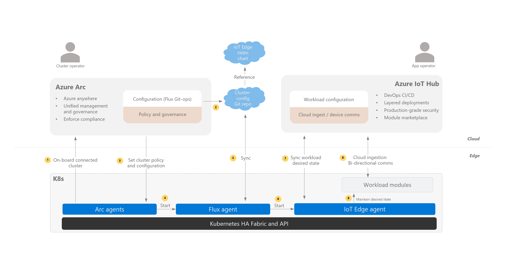

# Deploy Azure IoT Edge workloads

## Overview

Azure Arc and Azure IoT Edge easily complement each other's capabilities. 

Azure Arc provides mechanisms for cluster operators to configure the foundational components of a cluster, and apply and enforce cluster policies. 

Azure IoT Edge allows application operators to remotely deploy and manage the workloads at scale with convenient cloud ingestion and bi-directional communication primitives. 

The diagram below illustrates Azure Arc and Azure IoT Edge's relationship:



## Pre-requisites

* [Register an IoT Edge device](../../iot-edge/quickstart-linux.md#register-an-iot-edge-device) and [deploy the simulated temperature sensor module](../../iot-edge/quickstart-linux.md#deploy-a-module). Note the device's connection string for the *values.yaml* mentioned below.

* Use [IoT Edge's support for Kubernetes](https://aka.ms/edgek8sdoc) to deploy it via Azure Arc's Flux operator.

* Download the [*values.yaml*](https://github.com/Azure/iotedge/blob/preview/iiot/kubernetes/charts/edge-kubernetes/values.yaml) file for IoT Edge Helm chart and replace the `deviceConnectionString` placeholder at the end of the file with the connection string you noted earlier. Set any other supported chart installation options as needed. Create a namespace for the IoT Edge workload and generate a secret in it:

  ```
  $ kubectl create ns iotedge

  $ kubectl create secret generic dcs --from-file=fully-qualified-path-to-values.yaml --namespace iotedge
  ```

  You can also set up remotely using the [cluster config example](./tutorial-use-gitops-connected-cluster.md).

## Connect a cluster

Use the `az` Azure CLI `connectedk8s` extension to connect a Kubernetes cluster to Azure Arc:

  ```
  az connectedk8s connect --name AzureArcIotEdge --resource-group AzureArcTest
  ```

## Create a configuration for IoT Edge

The [example Git repo](https://github.com/veyalla/edgearc) points to the IoT Edge Helm chart and references the secret created in the pre-requisites section.

Use the `az` Azure CLI `k8s-configuration` extension to create a configuration that links the connected cluster to the Git repo:

  ```
  az k8s-configuration create --name iotedge --cluster-name AzureArcIotEdge --resource-group AzureArcTest --operator-instance-name iotedge --operator-namespace azure-arc-iot-edge --enable-helm-operator --helm-operator-chart-version 0.6.0 --helm-operator-chart-values "--set helm.versions=v3" --repository-url "git://github.com/veyalla/edgearc.git" --cluster-scoped
  ```

In a few minutes, you should see the IoT Edge workload modules deployed into your cluster's `iotedge` namespace. 

View the `SimulatedTemperatureSensor` pod logs in that namespace to see the sample values being generated. You can also watch the messages arrive at your IoT hub by using the [Azure IoT Hub Toolkit extension for Visual Studio Code](https://marketplace.visualstudio.com/items?itemName=vsciot-vscode.azure-iot-toolkit).

## Cleanup

Remove the configuration using:

```
az k8s-configuration delete -g AzureArcTest --cluster-name AzureArcIotEdge --name iotedge
```

## Next steps

Learn how to [use Azure Policy to govern cluster configuration](./use-azure-policy.md).
