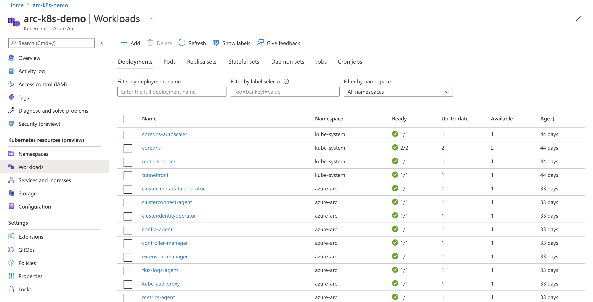
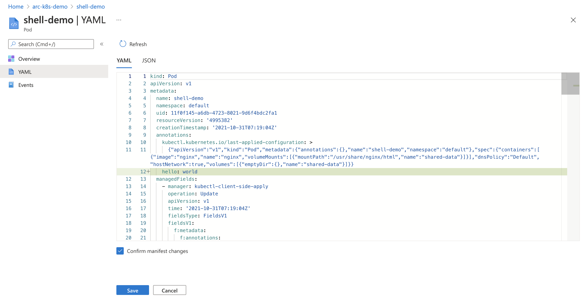

# Access Kubernetes resources from Azure portal

The Azure portal includes a Kubernetes resource view for easy access to the Kubernetes resources in your Azure Arc-enabled Kubernetes cluster. Viewing Kubernetes resources from the Azure portal reduces context switching between the Azure portal and the `kubectl` command-line tool, streamlining the experience for viewing and editing your Kubernetes resources. The resource viewer currently includes multiple resource types, including deployments, pods, and replica sets.

## Prerequisites

- An existing Kubernetes cluster [connected](quickstart-connect-cluster.md) to Azure as an Azure Arc-enabled Kubernetes resource.

- [Service account token](cluster-connect.md#service-account-token-authentication-option) for authentication to the cluster.

## View Kubernetes resources

To see the Kubernetes resources, navigate to your cluster in the Azure portal. The navigation pane on the left is used to access your resources:

- **Namespaces** displays the namespaces of your cluster. The filter at the top of the namespace list provides a quick way to filter and display your namespace resources.
- **Workloads** shows information about deployments, pods, replica sets, stateful sets, daemon sets, jobs, and cron jobs deployed to your cluster.
- **Services and ingresses** shows all of your cluster's service and ingress resources.
- **Storage** shows your Azure storage classes and persistent volume information.
- **Configuration** shows your cluster's config maps and secrets.

## Edit YAML

The Kubernetes resource view also includes a YAML editor. A built-in YAML editor means you can update Kubernetes objects from within the portal and apply changes immediately.

After you edit the YAML, select **Review + save**, confirm the changes, and then save again.

>[!WARNING]
> The Azure portal Kubernetes management capabilities and the YAML editor are built for learning and flighting new deployments in a development and testing setting. Performing direct production changes via UI or CLI is not recommended. For production environments, consider using [Configurations (GitOps)](tutorial-use-gitops-flux2.md).

## Next steps

Azure Monitor for containers provides more in-depth information about nodes and containers of the cluster when compared to the Kubernetes resource view described in this article. Learn how to [deploy Azure Monitor for containers](../../azure-monitor/containers/container-insights-enable-arc-enabled-clusters.md?toc=/azure/azure-arc/kubernetes/toc.json) on your cluster.
