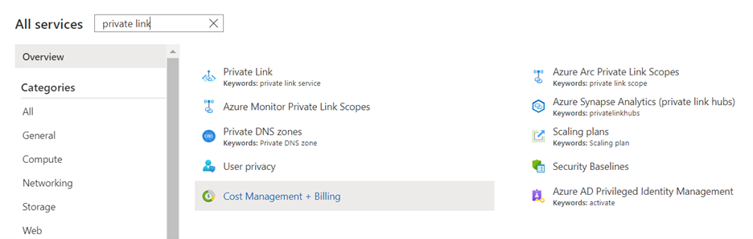
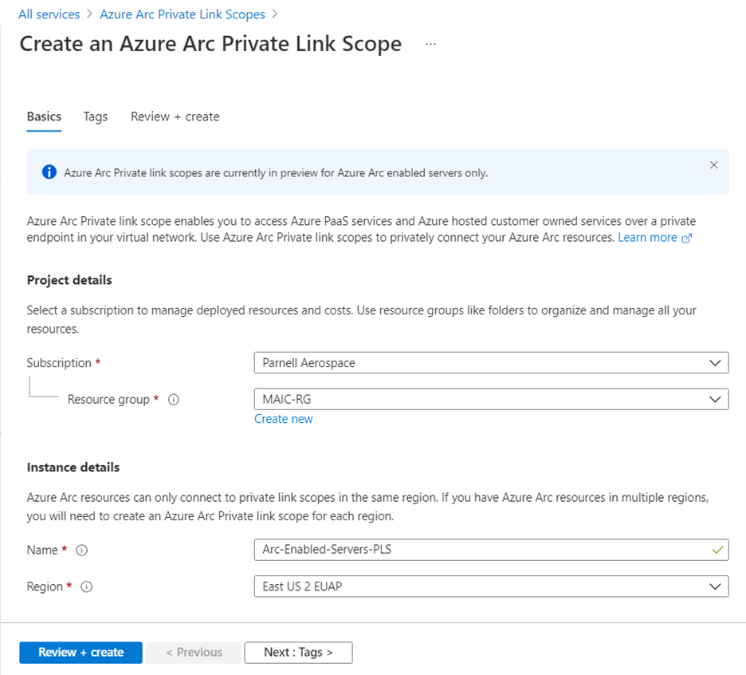
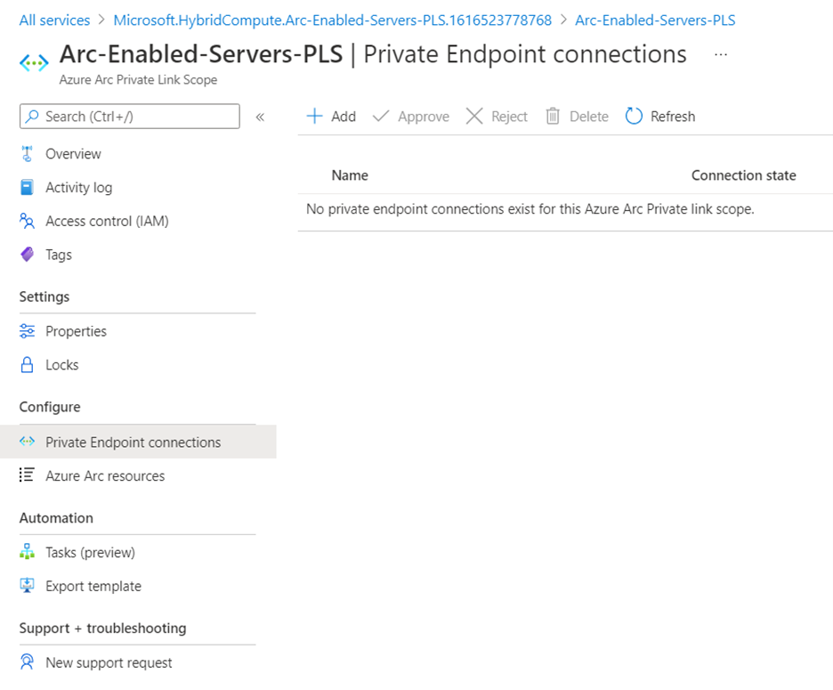
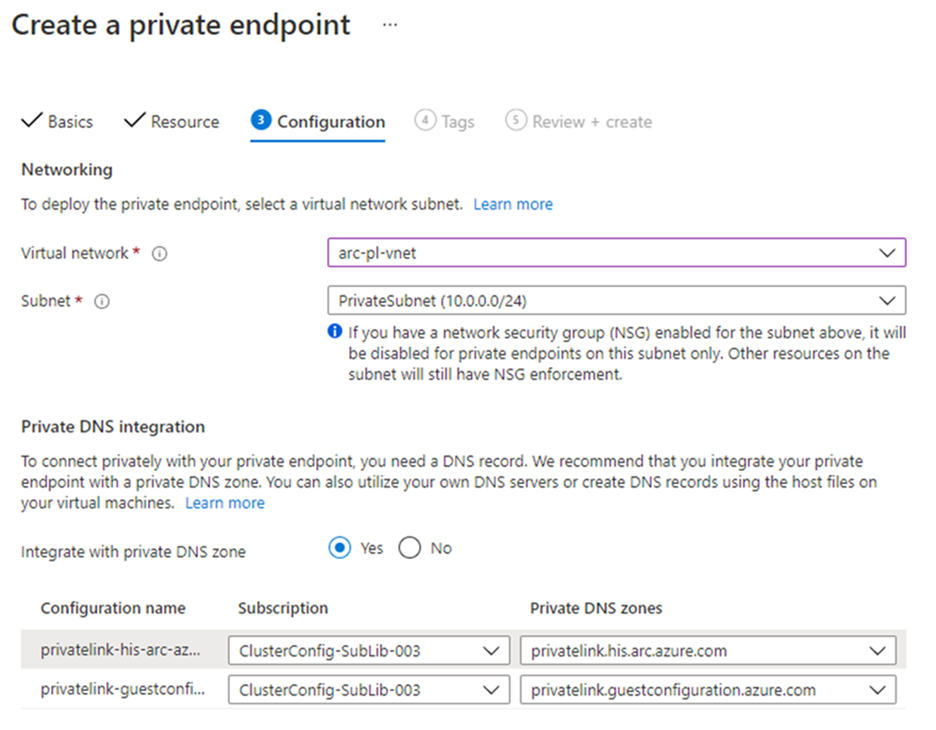
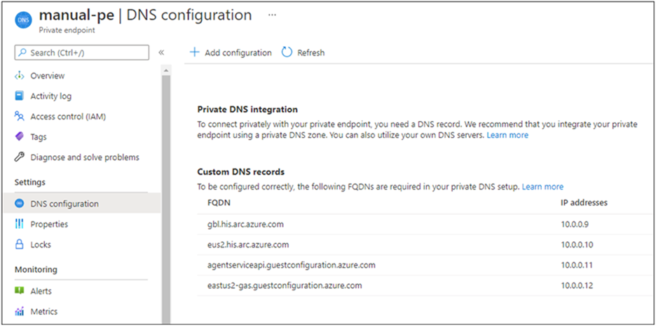

# Private connectivity for Arc enabled Kubernetes clusters using private link (preview)

[Azure Private Link](https://docs.microsoft.com/azure/private-link/private-link-overview) allows you to securely link Azure services to your virtual network using private endpoints. This means you can connect your on-premises Kubernetes clusters with Azure Arc and send all traffic over an Azure ExpressRoute or site-to-site VPN connection instead of using public networks. In Azure Arc, you can use a Private Link Scope model to allow multiple Kubernetes clusters to communicate with their Azure Arc resources using a single private endpoint.

This document covers when to use and how to set up private connectivity from your Kubernetes clusters hosted on-premises or in other clouds to Azure.

> [!IMPORTANT]
> Azure Arc Private Link Scope is currently in PREVIEW in the East US and West Europe Azure regions.
> See the [Supplemental Terms of Use for Microsoft Azure Previews](https://azure.microsoft.com/support/legal/preview-supplemental-terms/) for legal terms that apply to Azure features that are in beta, preview, or otherwise not yet released into general availability.

## Advantages

With Private Link you can:

* Connect privately to Azure Arc without opening up any public network access.
* Ensure data from the Arc-enabled Kubernetes cluster is only accessed through authorized private networks.
* Prevent data exfiltration from your private networks by defining specific Azure Arc-enabled Kubernetes clusters and other Azure services resources, such as Azure Monitor, that connects through your private endpoint.
* Securely connect your private on-premises network to Azure Arc using ExpressRoute and Private Link.
* Keep all traffic inside the Microsoft Azure backbone network.

For more information, see [Key benefits of Azure Private Link](../private-link/private-link-overview.md#key-benefits).

## How it works

Azure Arc Private Link Scope connects private endpoints (and the virtual networks they're contained in) to an Azure resource, in this case Azure Arc-enabled Kubernetes clusters. When you enable any one of the Arc-enabled Kubernetes cluster supported extensions, such as Azure Defender or Azure Monitor, then connection to other Azure resources may be required for these scenarios. For example, in the case of Azure Monitor, the logs collected from the cluster are sent to Log Analytics workspace.

Connectivity to the other Azure resources from an Arc-enabled Kubernetes cluster listed earlier requires configuring Private Link for each service. For example, refer to configuring [Private Link for Azure Monitor](https://docs.microsoft.com/azure/azure-monitor/logs/private-link-security).

## Restrictions and limitations

The Azure Arc Private Link Scope object has some limits you should consider when planning your Private Link setup.

* You can associate at most one Azure Arc Private Link Scope with a virtual network.
* An Azure Arc-enabled Kubernetes cluster can only connect to one Azure Private Link Scope.
* All on-premises Kubernetes clusters need to use the same private endpoint by resolving the correct private endpoint information (FQDN record name and private IP address) using the same DNS forwarder. For more information, see Azure Private Endpoint [DNS configuration](https://docs.microsoft.com/azure/private-link/private-endpoint-dns). The Azure Arc-enabled Kubernetes cluster, Azure Arc Private Link Scope, and virtual network must be in the same Azure region.
* Traffic to Azure Active Directory, Azure Resource Manager and Microsoft Container Registry service tags must be allowed through your on-premises network firewall during the preview.
* Other Azure services that you will use, for example Azure Monitor, requires their own private endpoints in your virtual network.
* [Cluster Connect feature](https://docs.microsoft.com/azure/azure-arc/kubernetes/conceptual-cluster-connect) is not supported yet for Kubernetes clusters with private connectivity enabled.

## Planning your Private Link setup
To connect your Kubernetes cluster to Azure Arc over a private link, you need to configure your network to accomplish the following:

1. Establish a connection between your on-premises network and an Azure virtual network using a [site-to-site VPN](https://docs.microsoft.com/azure/vpn-gateway/tutorial-site-to-site-portal) or [ExpressRoute](https://docs.microsoft.com/azure/expressroute/expressroute-howto-linkvnet-arm) circuit.
1. Deploy an Azure Arc Private Link Scope, which controls which Kubernetes clusters can communicate with Azure Arc over private endpoints and associate it with your Azure virtual network using a private endpoint.
1. Update the DNS configuration on your local network to resolve the private endpoint addresses.
1. Configure your local firewall to allow access to Azure Active Directory, Azure Resource Manager and Microsoft Container Registry. This is a temporary step for Azure Active Directory, Azure Resource Manager and will not be required when private endpoints for these services enter preview.
1. Associate the Azure Arc-enabled Kubernetes clusters with the private link scope.
1. Optionally, deploy private endpoints for other Azure services your machine or server is managed by, such as Azure Monitor.
The rest of this document assumes you have already set up your ExpressRoute circuit or site-to-site VPN connection.

## Network configuration

Azure Arc-enabled Kubernetes integrates with several Azure services to bring cloud management and governance to your hybrid Kubernetes clusters. Most of these services already offer private endpoints, but you need to configure your firewall and routing rules to allow access to Azure Active Directory and Azure Resource Manager over the internet until these services offer private endpoints. You also need to allow access to Microsoft Container Registry (and Azure Front Door.First Party as a precursor for Microsoft Container Registry) to pull images & Helm charts to enable services like Az Monitor as well as for initial setup of Azure Arc agents on the Kubernetes clusters.

There are two ways you can achieve this:

* If your network is configured to route all internet-bound traffic through the Azure VPN or ExpressRoute circuit, you can configure the network security group (NSG) associated with your subnet in Azure to allow outbound TCP 443 (HTTPS) access to Azure AD, Azure Resource Manager, Azure Frontdoor and Microsoft Container Registry  using [service tags] (https://docs.microsoft.com/azure/virtual-network/service-tags-overview). The NSG rules should look like the following:

    | Setting                 | Azure AD rule                                                 | Azure Resource Manager rule                                   | AzureFrontDoorFirstParty rule                                 | Microsoft Container Registry rule                            |     
    |-------------------------|---------------------------------------------------------------|---------------------------------------------------------------|---------------------------------------------------------------|---------------------------------------------------------------
    | Source                  | Virtual Network                                               | Virtual Network                                               | Virtual Network                                               | Virtual Network
    | Source Port ranges      | *                                                             | *                                                             | *                                                             | *
    | Destination             | Service Tag                                                   | Service Tag                                                   | Service Tag                                                   | Service Tag
    | Destination service tag | AzureActiveDirectory                                          | AzureResourceManager                                          | AzureFrontDoor.FirstParty                                     | MicrosoftContainerRegistry
    | Destination port ranges | 443                                                           | 443                                                           | 443                                                           | 443
    | Protocol                | TCP                                                           | TCP                                                           | TCP                                                           | TCP
    | Action                  | Allow                                                         | Allow                                                         | Allow (Both inbound and outbound)                             | Allow
    | Priority                | 150 (must be lower than any rules that block internet access) | 151 (must be lower than any rules that block internet access) | 152 (must be lower than any rules that block internet access) | 153 (must be lower than any rules that block internet access) |
    | Name                    | AllowAADOutboundAccess                                        | AllowAzOutboundAccess                                         | AllowAzureFrontDoorFirstPartyAccess                           | AllowMCROutboundAccess 

* Configure the firewall on your local network to allow outbound TCP 443 (HTTPS) access to Azure AD, Azure Resource Manager and Microsoft Container Registry and inbound & outbound access to Azure FrontDoor.FirstParty using the downloadable service tag files. The JSON file contains all the public IP address ranges used by Azure AD, Azure Resource Manager, Azure FrontDoor.FirstParty, Microsoft Container Registry and is updated monthly to reflect any changes. Azure ADs service tag is AzureActiveDirectory and Azure's service tag is AzureResourceManager. Consult with your network administrator and network firewall vendor to learn how to configure your firewall rules.

## Create a Private Link Scope

1. Sign in to the [Azure portal](https://portal.azure.com).
1. Go to Create a resource in the Azure portal and search for Azure Arc Private Link Scope. Or you can use the following link to open the [Azure Arc Private Link Scope page](https://portal.azure.com/#blade/HubsExtension/BrowseResource/resourceType/Microsoft.HybridCompute%2FprivateLinkScopes) in the portal.

     

1. Select Create.
1. Pick a Subscription and Resource Group. During the preview, your virtual network and Azure Arc-enabled Kubernetes clusters must be in the same subscription as the Azure Arc Private Link Scope.
1. Give the Azure Arc Private Link Scope a name. It's best to use a meaningful and clear name.
You can optionally require every Arc-enabled Kubernetes cluster associated with this Azure Arc Private Link Scope (preview) to send data to the service through the private endpoint. If you select Enable public network access, Kubernetes clusters associated with this Azure Arc Private Link Scope (preview) can communicate with the service over both private or public networks. You can change this setting after creating the scope if you change your mind.
1. Select Review + Create.

    

1. Let the validation pass, and then select Create.

### Create a private endpoint

Once your Azure Arc Private Link Scope is created, you need to connect it with one or more virtual networks using a private endpoint. The private endpoint exposes access to the Azure Arc services on a private IP in your virtual network address space.

* The Private Endpoint on your VNet allows it to reach Azure Arc-enabled Kubernetes cluster endpoints through private IPs from your network's pool, instead of using to the public IPs of these endpoints. That allows you to keep using your Azure Arc-enabled Kubernetes clusters without opening your VNet to outbound traffic not requested.
* Traffic from the Private Endpoint to your resources will go over the Microsoft Azure backbone, and not routed to public networks.

1. In your scope resource, select Private Endpoint connections in the left-hand resource menu. Select Add to start the endpoint create process. You can also approve connections that were started in the Private Link center here by selecting them and selecting Approve.

    

2. Pick the subscription, resource group, and name of the endpoint, and the region it should live in. The region needs to be the same region as the VNet you connect it to.
3. Select Next: Resource.
4. On the Resource page, perform the following:
    1. Pick the Subscription that contains your Azure Arc Private Link Scope resource.
    2. For Resource type, choose Microsoft.HybridCompute/privateLinkScopes.
    3. From the Resource drop-down, choose your Private Link scope you created earlier.
    4. Select Next: Configuration >
        

5. On the Configuration page, perform the following:
    1. Choose the virtual network and subnet from where you want to connect to Azure Arc services.
    2. Choose Yes for Integrate with private DNS zone, and let it automatically create a new Private DNS Zone. The actual DNS zones may be different from what is shown in the screenshot below.

        > [!NOTE]
        > If you choose No and prefer to manage DNS records manually, first complete setting up your Private Link - including this Private Endpoint and the Private Scope configuration. Then, configure your DNS according to the instructions in [Azure Private Endpoint DNS configuration] (https://docs.microsoft.com/azure/private-link/private-endpoint-dns). Make sure not to create empty records as preparation for your Private Link setup. The DNS records you create can override existing settings and impact your connectivity with Arc-enabled Kubernetes clusters.

    3. Select Review + create.
    4. Let validation pass.
    5. Select Create.

## Configure on-premises DNS forwarding

Your on-premises Kubernetes clusters need to be able to resolve the private link DNS records to the private endpoint IP addresses. How you configure this depends on whether you are using Azure private DNS zones to maintain DNS records, or if you are using your own DNS server on-premises and how many clusters you are configuring.
DNS configuration using Azure-integrated private DNS zones
If you set up private DNS zones for Azure Arc-enabled Kubernetes clusters when creating the private endpoint, your on-premises Kubernetes clusters need to be able to forward DNS queries to the built-in Azure DNS servers to resolve the private endpoint addresses correctly. You need a DNS forwarder in Azure (either a purpose-built VM or an Azure Firewall instance with DNS proxy enabled), after which you can configure your on-premises DNS server to forward queries to Azure to resolve private endpoint IP addresses.

The private endpoint documentation provides guidance for configuring [on-premises workloads using a DNS forwarder](https://docs.microsoft.com/azure/private-link/private-endpoint-dns#on-premises-workloads-using-a-dns-forwarder).

## Manual DNS server configuration

If you opted out of using Azure private DNS zones during private endpoint creation, you will need to create the required DNS records in your on-premises DNS server.

1. Go to the Azure portal.
2. Navigate to the private endpoint resource associated with your virtual network and private link scope.
3. From the left-hand pane, select DNS configuration to see a list of the DNS records and corresponding IP addresses you’ll need to set up on your DNS server. The FQDNs and IP addresses will change based on the region you selected for your private endpoint and the available IP addresses in your subnet.

    

4. Follow the guidance from your DNS server vendor to add the necessary DNS zones and A records to match the table in the portal. Ensure that you select a DNS server that is appropriately scoped for your network. Every Kubernetes cluster that uses this DNS server now resolves the private endpoint IP addresses and must be associated with the Azure Arc Private Link Scope , or the connection will be refused.

## Arc enable Kubernetes cluster with association to private link scope

If you have not already onboarded your Kubernetes cluster to Azure Arc, onboard the Kubernetes cluster using the Private link Scope created earlier by following the steps below:

1. Download the [CLI extension whl file](../cli-extensions/connectedk8s-1.2.0-py2.py3-none-any.whl) supporting this feature.
2. Remove any existing CLI extension for connectedk8s:

    ```console
    az extension remove -n connectedk8s
    ```

3. Add the new extension that supports private link:

    ```console
    az extension add --source <path-to-whl-file>
    ```

4. Connect the Kubernetes cluster to Azure Arc and enable private connectivity:

    ```console
    az connectedk8s connect -g <resource-group-name> -n <connected-cluster-name> -l <location> --enable-private-link true --private-link-scope-resource-id <pls-arm-id>
    ```

## Associate existing Arc enabled Kubernetes cluster with private link scope  

If you already have an Arc enabled Kubernetes cluster, associate it to the Private link Scope created earlier by following the steps below:

1. Download the [CLI extension whl file](cli-extensions/connectedk8s-1.2.0-py2.py3-none-any.whl) supporting this feature  
1. Remove any existing CLI extension for connectedk8s:

    ```console
    az extension remove -n connectedk8s
    ```

1. Add the new extension that supports private link:

    ``` console
    az extension add --source <path-to-whl-file>
    ```

1. Enable private link for existing Arc-enabled Kubernetes cluster:

    ```console
    az connectedk8s update -g <resource-group-name>  -n <connected-cluster-name> --enable-private-link true –private-link-scope-resource-id <pls-arm-id>
    ```

## Troubleshooting

If you run into problems, the following suggestions may help:

* Check your on-premises DNS server(s) to verify it is either forwarding to Azure DNS or is configured with appropriate A records in your private link zone. These lookup commands should return private IP addresses in your Azure virtual network. If they resolve public IP addresses, double check your machine or server and network’s DNS configuration.

  ```console
  nslookup gbl.his.arc.azure.com
  nslookup agentserviceapi.guestconfiguration.azure.com
    ```

a8 If you are having trouble onboarding Kubernetes cluster, confirm that you’ve added the Azure Active Directory, Azure Resource Manager, AzureFrontDoor.FirstParty and Microsoft Container Registry service tags to your local network firewall

## Next steps

* To learn more about Private Endpoint, see [What is Azure Private Endpoint?](https://docs.microsoft.com/azure/private-link/private-endpoint-overview).
