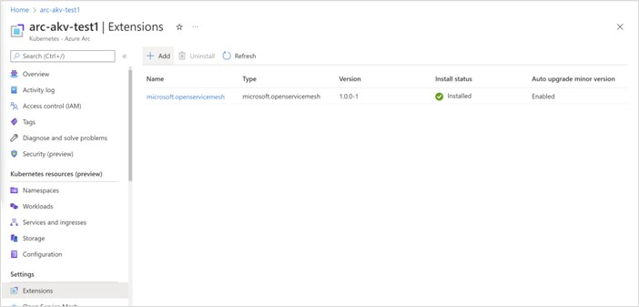
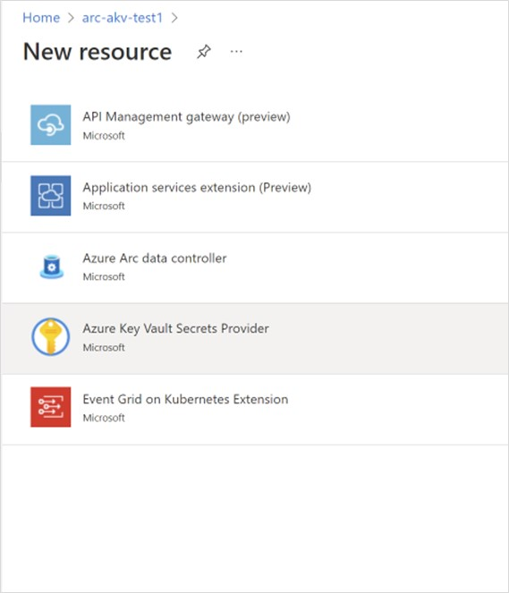

# Use the Azure Key Vault Secrets Provider extension to fetch secrets into Azure Arc-enabled Kubernetes clusters

The Azure Key Vault Provider for Secrets Store CSI Driver allows for the integration of Azure Key Vault as a secrets store with a Kubernetes cluster via a [CSI volume](https://kubernetes-csi.github.io/docs/). For Azure Arc-enabled Kubernetes clusters, you can install the Azure Key Vault Secrets Provider extension to fetch secrets.

Capabilities of the Azure Key Vault Secrets Provider extension include:

- Mounts secrets/keys/certs to pod using a CSI Inline volume
- Supports pod portability with the SecretProviderClass CRD
- Supports Linux and Windows containers
- Supports sync with Kubernetes Secrets
- Supports auto rotation of secrets
- Extension components are deployed to availability zones, making them zone redundant

## Prerequisites

- A cluster with a supported Kubernetes distribution that has already been [connected to Azure Arc](quickstart-connect-cluster.md). The following Kubernetes distributions are currently supported for this scenario:
  - Cluster API Azure
  - Azure Kubernetes Service (AKS) clusters on Azure Stack HCI
  - AKS hybrid clusters provisioned from Azure
  - Google Kubernetes Engine
  - OpenShift Kubernetes Distribution
  - Canonical Kubernetes Distribution
  - Elastic Kubernetes Service
  - Tanzu Kubernetes Grid
  - Azure Red Hat OpenShift
- Ensure you've met the [general prerequisites for cluster extensions](extensions.md#prerequisites). You must use version 0.4.0 or newer of the `k8s-extension` Azure CLI extension.

> [!TIP]
> When using this extension with [AKS hybrid clusters provisioned from Azure](extensions.md#aks-hybrid-clusters-provisioned-from-azure-preview) you must set `--cluster-type` to use `provisionedClusters` and also add `--cluster-resource-provider microsoft.hybridcontainerservice` to the command. Installing Azure Arc extensions on AKS hybrid clusters provisioned from Azure is currently in preview.

## Install the Azure Key Vault Secrets Provider extension on an Arc-enabled Kubernetes cluster

You can install the Azure Key Vault Secrets Provider extension on your connected cluster in the Azure portal, by using Azure CLI, or by deploying ARM template.

> [!TIP]
> If the cluster is behind an outbound proxy server, ensure that you connect it to Azure Arc using the [proxy configuration](quickstart-connect-cluster.md#connect-using-an-outbound-proxy-server) option before installing the extension.

> [!TIP]
> Only one instance of the extension can be deployed on each Azure Arc-enabled Kubernetes cluster.

### Azure portal

1. In the [Azure portal](https://portal.azure.com/#home), navigate to **Kubernetes - Azure Arc** and select your cluster.
1. Select **Extensions** (under **Settings**), and then select **+ Add**.

   [](media/tutorial-akv-secrets-provider/extension-install-add-button.jpg#lightbox)

1. From the list of available extensions, select **Azure Key Vault Secrets Provider** to deploy the latest version of the extension.

   [](media/tutorial-akv-secrets-provider/extension-install-new-resource.jpg)

1. Follow the prompts to deploy the extension. If needed, customize the installation by changing the default options on the **Configuration** tab.

### Azure CLI

1. Set the environment variables:

   ```azurecli-interactive
   export CLUSTER_NAME=<arc-cluster-name>
   export RESOURCE_GROUP=<resource-group-name>
   ```

2. Install the Secrets Store CSI Driver and the Azure Key Vault Secrets Provider extension by running the following command:

   ```azurecli-interactive
   az k8s-extension create --cluster-name $CLUSTER_NAME --resource-group $RESOURCE_GROUP --cluster-type connectedClusters --extension-type Microsoft.AzureKeyVaultSecretsProvider --name akvsecretsprovider
   ```

You should see output similar to this example. Note that it may take several minutes before the secrets provider Helm chart is deployed to the cluster.

```json
{
  "aksAssignedIdentity": null,
  "autoUpgradeMinorVersion": true,
  "configurationProtectedSettings": {},
  "configurationSettings": {},
  "customLocationSettings": null,
  "errorInfo": null,
  "extensionType": "microsoft.azurekeyvaultsecretsprovider",
  "id": "/subscriptions/xxxxxxxx-xxxx-xxxx-xxxx-xxxxxxxxxxxx/resourceGroups/$RESOURCE_GROUP/providers/Microsoft.Kubernetes/connectedClusters/$CLUSTER_NAME/providers/Microsoft.KubernetesConfiguration/extensions/akvsecretsprovider",
  "identity": {
    "principalId": "xxxxxxxx-xxxx-xxxx-xxxx-xxxxxxxxxxxx",
    "tenantId": null,
    "type": "SystemAssigned"
  },
  "location": null,
  "name": "akvsecretsprovider",
  "packageUri": null,
  "provisioningState": "Succeeded",
  "releaseTrain": "Stable",
  "resourceGroup": "$RESOURCE_GROUP",
  "scope": {
    "cluster": {
      "releaseNamespace": "kube-system"
    },
    "namespace": null
  },
  "statuses": [],
  "systemData": {
    "createdAt": "2022-05-12T18:35:56.552889+00:00",
    "createdBy": null,
    "createdByType": null,
    "lastModifiedAt": "2022-05-12T18:35:56.552889+00:00",
    "lastModifiedBy": null,
    "lastModifiedByType": null
  },
  "type": "Microsoft.KubernetesConfiguration/extensions",
  "version": "1.1.3"
}
```

### ARM template

1. Create a .json file using the following format. Be sure to update the \<cluster-name\> value to refer to your cluster.

   ```json
   {
       "$schema": "https://schema.management.azure.com/schemas/2019-04-01/deploymentTemplate.json#",
       "contentVersion": "1.0.0.0",
       "parameters": {
           "ConnectedClusterName": {
               "defaultValue": "<cluster-name>",
               "type": "String",
               "metadata": {
                   "description": "The Connected Cluster name."
               }
           },
           "ExtensionInstanceName": {
               "defaultValue": "akvsecretsprovider",
               "type": "String",
               "metadata": {
                   "description": "The extension instance name."
               }
           },
           "ExtensionVersion": {
               "defaultValue": "",
               "type": "String",
               "metadata": {
                   "description": "The version of the extension type."
               }
           },
           "ExtensionType": {
               "defaultValue": "Microsoft.AzureKeyVaultSecretsProvider",
               "type": "String",
               "metadata": {
                   "description": "The extension type."
               }
           },
           "ReleaseTrain": {
               "defaultValue": "stable",
               "type": "String",
               "metadata": {
                   "description": "The release train."
               }
           }
       },
       "functions": [],
       "resources": [
           {
               "type": "Microsoft.KubernetesConfiguration/extensions",
               "apiVersion": "2021-09-01",
               "name": "[parameters('ExtensionInstanceName')]",
               "identity": {
                "type": "SystemAssigned"
               },
               "properties": {
                   "extensionType": "[parameters('ExtensionType')]",
                   "releaseTrain": "[parameters('ReleaseTrain')]",
                   "version": "[parameters('ExtensionVersion')]"
               },
               "scope": "[concat('Microsoft.Kubernetes/connectedClusters/', parameters('ConnectedClusterName'))]"
           }
       ]
   }
   ```

1. Now set the environment variables by using the following Azure CLI command:

   ```azurecli-interactive
   export TEMPLATE_FILE_NAME=<template-file-path>
   export DEPLOYMENT_NAME=<desired-deployment-name>
   ```

1. Finally, run this Azure CLI command to install the Azure Key Vault Secrets Provider extension:

   ```azurecli-interactive
   az deployment group create --name $DEPLOYMENT_NAME --resource-group $RESOURCE_GROUP --template-file $TEMPLATE_FILE_NAME
   ```

You should now be able to view the secret provider resources and use the extension in your cluster.

## Validate the extension installation

To confirm successful installation of the Azure Key Vault Secrets Provider extension, run the following command.

```azurecli-interactive
az k8s-extension show --cluster-type connectedClusters --cluster-name $CLUSTER_NAME --resource-group $RESOURCE_GROUP --name akvsecretsprovider
```

You should see output similar to this example.

```json
{
  "aksAssignedIdentity": null,
  "autoUpgradeMinorVersion": true,
  "configurationProtectedSettings": {},
  "configurationSettings": {},
  "customLocationSettings": null,
  "errorInfo": null,
  "extensionType": "microsoft.azurekeyvaultsecretsprovider",
  "id": "/subscriptions/xxxxxxxx-xxxx-xxxx-xxxx-xxxxxxxxxxxx/resourceGroups/$RESOURCE_GROUP/providers/Microsoft.Kubernetes/connectedClusters/$CLUSTER_NAME/providers/Microsoft.KubernetesConfiguration/extensions/akvsecretsprovider",
  "identity": {
    "principalId": "xxxxxxxx-xxxx-xxxx-xxxx-xxxxxxxxxxxx",
    "tenantId": null,
    "type": "SystemAssigned"
  },
  "location": null,
  "name": "akvsecretsprovider",
  "packageUri": null,
  "provisioningState": "Succeeded",
  "releaseTrain": "Stable",
  "resourceGroup": "$RESOURCE_GROUP",
  "scope": {
    "cluster": {
      "releaseNamespace": "kube-system"
    },
    "namespace": null
  },
  "statuses": [],
  "systemData": {
    "createdAt": "2022-05-12T18:35:56.552889+00:00",
    "createdBy": null,
    "createdByType": null,
    "lastModifiedAt": "2022-05-12T18:35:56.552889+00:00",
    "lastModifiedBy": null,
    "lastModifiedByType": null
  },
  "type": "Microsoft.KubernetesConfiguration/extensions",
  "version": "1.1.3"
}
```

## Create or select an Azure Key Vault

Next, specify the Azure Key Vault to use with your connected cluster. If you don't already have one, create a new Key Vault by using the following commands. Keep in mind that the name of your Key Vault must be globally unique.

Set the following environment variables:

```azurecli-interactive
export AKV_RESOURCE_GROUP=<resource-group-name>
export AZUREKEYVAULT_NAME=<AKV-name>
export AZUREKEYVAULT_LOCATION=<AKV-location>
```

Next, run the following command

```azurecli
az keyvault create -n $AZUREKEYVAULT_NAME -g $AKV_RESOURCE_GROUP -l $AZUREKEYVAULT_LOCATION
```

Azure Key Vault can store keys, secrets, and certificates. For this example, you can set a plain text secret called `DemoSecret` by using the following command:

```azurecli
az keyvault secret set --vault-name $AZUREKEYVAULT_NAME -n DemoSecret --value MyExampleSecret
```

Before you move on to the next section, take note of the following properties:

- Name of the secret object in Key Vault
- Object type (secret, key, or certificate)
- Name of your Key Vault resource
- The Azure Tenant ID for the subscription to which the Key Vault belongs

## Provide identity to access Azure Key Vault

Currently, the Secrets Store CSI Driver on Arc-enabled clusters can be accessed through a service principal. Follow these steps to provide an identity that can access your Key Vault.

1. Follow the steps [to create a service principal in Azure](../../active-directory/develop/howto-create-service-principal-portal.md#register-an-application-with-azure-ad-and-create-a-service-principal). Take note of the Client ID and Client Secret generated in this step.
1. Provide Azure Key Vault GET permission to the created service principal by [following these steps](../../key-vault/general/assign-access-policy.md).
1. Use the client ID and Client Secret from the first step to create a Kubernetes secret on the connected cluster:

   ```bash
   kubectl create secret generic secrets-store-creds --from-literal clientid="<client-id>" --from-literal clientsecret="<client-secret>"
   ```

1. Label the created secret:

   ```bash
   kubectl label secret secrets-store-creds secrets-store.csi.k8s.io/used=true
   ```

1. Create a SecretProviderClass with the following YAML, filling in your values for key vault name, tenant ID, and objects to retrieve from your AKV instance:

   ```yml
   # This is a SecretProviderClass example using service principal to access Keyvault
   apiVersion: secrets-store.csi.x-k8s.io/v1
   kind: SecretProviderClass
   metadata:
     name: akvprovider-demo
   spec:
     provider: azure
     parameters:
       usePodIdentity: "false"
       keyvaultName: <key-vault-name>
       objects:  |
         array:
           - |
             objectName: DemoSecret
             objectType: secret             # object types: secret, key or cert
             objectVersion: ""              # [OPTIONAL] object versions, default to latest if empty
       tenantId: <tenant-Id>                # The tenant ID of the Azure Key Vault instance
   ```

1. Apply the SecretProviderClass to your cluster:

   ```bash
   kubectl apply -f secretproviderclass.yaml
   ```

1. Create a pod with the following YAML, filling in the name of your identity:

   ```yml
   # This is a sample pod definition for using SecretProviderClass and service principal to access Keyvault
   kind: Pod
   apiVersion: v1
   metadata:
     name: busybox-secrets-store-inline
   spec:
     containers:
       - name: busybox
         image: k8s.gcr.io/e2e-test-images/busybox:1.29
         command:
           - "/bin/sleep"
           - "10000"
         volumeMounts:
         - name: secrets-store-inline
           mountPath: "/mnt/secrets-store"
           readOnly: true
     volumes:
       - name: secrets-store-inline
         csi:
           driver: secrets-store.csi.k8s.io
           readOnly: true
           volumeAttributes:
             secretProviderClass: "akvprovider-demo"
           nodePublishSecretRef:                       
             name: secrets-store-creds
   ```

1. Apply the pod to your cluster:

   ```bash
   kubectl apply -f pod.yaml
   ```

## Validate the secrets

After the pod starts, the mounted content at the volume path specified in your deployment YAML is available.

```Bash
## show secrets held in secrets-store
kubectl exec busybox-secrets-store-inline -- ls /mnt/secrets-store/

## print a test secret 'DemoSecret' held in secrets-store
kubectl exec busybox-secrets-store-inline -- cat /mnt/secrets-store/DemoSecret
```

## Additional configuration options

The Azure Key Vault Secrets Provider extension supports [Helm chart configurations](https://github.com/Azure/secrets-store-csi-driver-provider-azure/blob/master/charts/csi-secrets-store-provider-azure/README.md#configuration).

The following configuration settings are frequently used with the Azure Key Vault Secrets Provider extension:

| Configuration Setting | Default | Description |
| --------- | ----------- | ----------- |
| enableSecretRotation | false | Boolean type. If `true`, periodically updates the pod mount and Kubernetes Secret with the latest content from external secrets store |
| rotationPollInterval | 2m | If `enableSecretRotation` is `true`, specifies the secret rotation poll interval duration. This duration can be adjusted based on how frequently the mounted contents for all pods and Kubernetes secrets need to be resynced to the latest. |
| syncSecret.enabled | false | Boolean input. In some cases, you may want to create a Kubernetes Secret to mirror the mounted content. If `true`, `SecretProviderClass` allows the `secretObjects` field to define the desired state of the synced Kubernetes Secret objects. |

These settings can be specified when the extension is installed by using the `az k8s-extension create` command:

```azurecli-interactive
az k8s-extension create --cluster-name $CLUSTER_NAME --resource-group $RESOURCE_GROUP --cluster-type connectedClusters --extension-type Microsoft.AzureKeyVaultSecretsProvider --name akvsecretsprovider --configuration-settings secrets-store-csi-driver.enableSecretRotation=true secrets-store-csi-driver.rotationPollInterval=3m secrets-store-csi-driver.syncSecret.enabled=true
```

You can also change these settings after installation by using the `az k8s-extension update` command:

```azurecli-interactive
az k8s-extension update --cluster-name $CLUSTER_NAME --resource-group $RESOURCE_GROUP --cluster-type connectedClusters --name akvsecretsprovider --configuration-settings secrets-store-csi-driver.enableSecretRotation=true secrets-store-csi-driver.rotationPollInterval=3m secrets-store-csi-driver.syncSecret.enabled=true
```

You can use other configuration settings as needed for your deployment. For example, to change the kubelet root directory while creating a cluster, modify the az k8s-extension create command:

```azurecli-interactive
az k8s-extension create --cluster-name $CLUSTER_NAME --resource-group $RESOURCE_GROUP --cluster-type connectedClusters --extension-type Microsoft.AzureKeyVaultSecretsProvider --name akvsecretsprovider --configuration-settings linux.kubeletRootDir=/path/to/kubelet secrets-store-csi-driver.linux.kubeletRootDir=/path/to/kubelet
```


## Uninstall the Azure Key Vault Secrets Provider extension

To uninstall the extension, run the following command:

```azurecli-interactive
az k8s-extension delete --cluster-type connectedClusters --cluster-name $CLUSTER_NAME --resource-group $RESOURCE_GROUP --name akvsecretsprovider
```

> [!NOTE]
> Uninstalling the extension doesn't delete the Custom Resource Definitions (CRDs) that were created when the extension was installed.

To confirm that the extension instance has been deleted, run the following command:

```azurecli-interactive
az k8s-extension list --cluster-type connectedClusters --cluster-name $CLUSTER_NAME --resource-group $RESOURCE_GROUP
```

If the extension was successfully removed, you won't see the Azure Key Vault Secrets Provider extension listed in the output. If you don't have any other extensions installed on your cluster, you'll see an empty array.

## Reconciliation and troubleshooting

The Azure Key Vault Secrets Provider extension is self-healing. If somebody tries to change or delete an extension component that was deployed when the extension was installed, that component will be reconciled to its original state. The only exceptions are for Custom Resource Definitions (CRDs). If CRDs are deleted, they won't be reconciled. To restore deleted CRDs, use the `az k8s-extension create` command again with the existing extension instance name.

For more information about resolving common issues, see the open source troubleshooting guides for [Azure Key Vault provider for Secrets Store CSI driver](https://azure.github.io/secrets-store-csi-driver-provider-azure/docs/troubleshooting/) and [Secrets Store CSI Driver](https://secrets-store-csi-driver.sigs.k8s.io/troubleshooting.html).

## Next steps

- Want to try things out? Get started quickly with an [Azure Arc Jumpstart scenario](https://aka.ms/arc-jumpstart-akv-secrets-provider) using Cluster API.
- Learn more about [Azure Key Vault](../../key-vault/general/overview.md).
