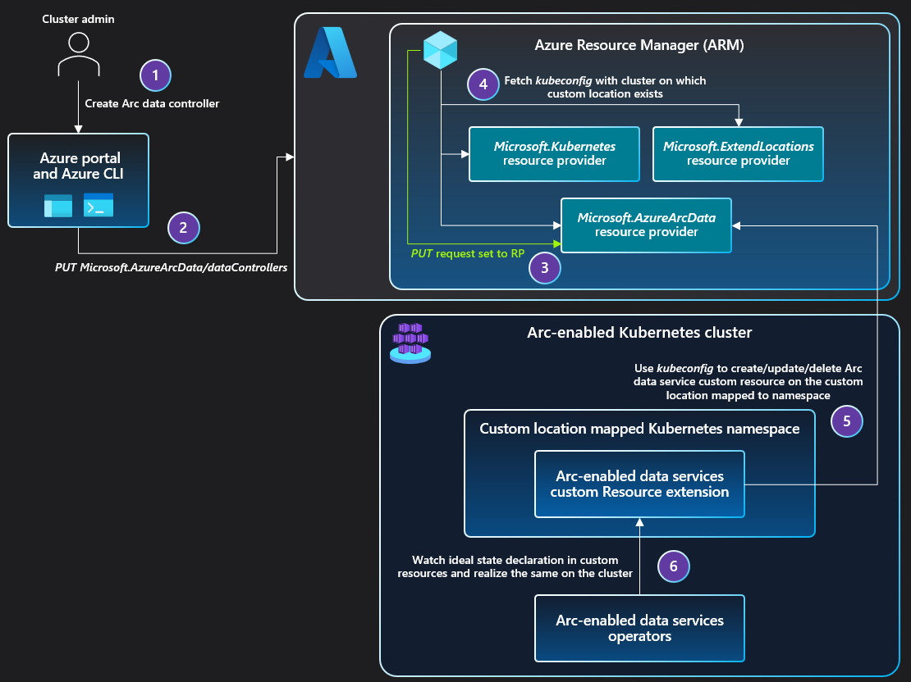

# Custom locations

As an extension of the Azure location construct, a *custom location* provides a reference as deployment target which administrators can set up, and users can point to, when creating an Azure resource. It abstracts the backend infrastructure details from application developers, database admin users, or other users in the organization. 

Since the custom location is an Azure Resource Manager resource that supports [Azure role-based access control (Azure RBAC)](../../role-based-access-control/overview.md), an administrator or operator can determine which users have access to create resource instances on:

* A namespace within a Kubernetes cluster to target deployment of Azure Arc-enabled SQL Managed Instance and Azure Arc-enabled PostgreSQL servers.
* The compute, storage, networking, and other vCenter or Azure Stack HCI resources to deploy and manage VMs.

For example, a cluster operator could create a custom location **Contoso-Michigan-Healthcare-App** representing a namespace on a Kubernetes cluster in your organization's Michigan Data Center. The operator can then assign Azure RBAC permissions to application developers on this custom location so that they can deploy healthcare-related web applications. The developers can then deploy these applications without having to know details of the namespace and Kubernetes cluster.

On Arc-enabled Kubernetes clusters, a custom location represents an abstraction of a namespace within the Azure Arc-enabled Kubernetes cluster. Custom locations create the granular [RoleBindings and ClusterRoleBindings](https://kubernetes.io/docs/reference/access-authn-authz/rbac/#rolebinding-and-clusterrolebinding) necessary for other Azure services to access the cluster.

> [!IMPORTANT]
> In the interest of ensuring new features are documented no later than their release, this page may include documentation for features that may not yet be publicly available.

## Architecture for Arc-enabled Kubernetes

When an administrator enables the custom locations feature on a cluster, a ClusterRoleBinding is created, authorizing the Microsoft Entra application used by the Custom Locations Resource Provider (RP). Once authorized, Custom Locations RP can create ClusterRoleBindings or RoleBindings needed by other Azure RPs to create custom resources on this cluster. The cluster extensions installed on the cluster determines the list of RPs to authorize.

[!INCLUDE [preview features note](../kubernetes/includes/preview/preview-callout.md)]

When the user creates a data service instance on the cluster:

1. The **PUT** request is sent to Azure Resource Manager.
1. The **PUT** request is forwarded to the Azure Arc-enabled Data Services RP.
1. The RP fetches the `kubeconfig` file associated with the Azure Arc-enabled Kubernetes cluster, on which the custom location exists.
   * The custom location is referenced as `extendedLocation` in the original PUT request.
1. The Azure Arc-enabled Data Services RP uses the `kubeconfig` to communicate with the cluster to create a custom resource of the Azure Arc-enabled Data Services type on the namespace mapped to the custom location.
   * The Azure Arc-enabled Data Services operator was deployed via cluster extension creation before the custom location existed.
1. The Azure Arc-enabled Data Services operator reads the new custom resource created on the cluster and creates the data controller, translating into realization of the desired state on the cluster.

The sequence of steps to create the SQL managed instance and PostgreSQL instance are identical to the sequence of steps described above.

## Next steps

* Use our quickstart to [connect a Kubernetes cluster to Azure Arc](../kubernetes/quickstart-connect-cluster.md). Then [create a custom location](../kubernetes/custom-locations.md) on your Azure Arc-enabled Kubernetes cluster.
