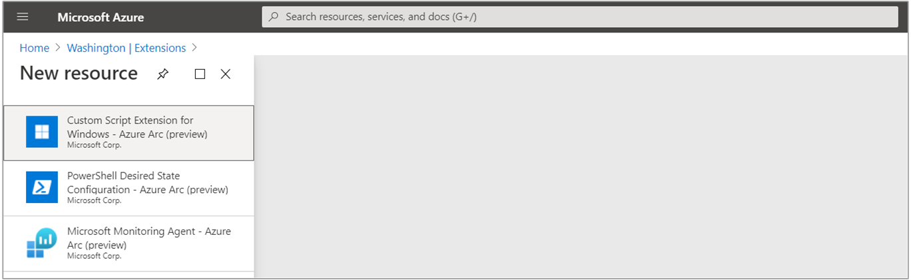

# Enable Azure VM extensions from the Azure portal

This article shows you how to deploy and uninstall Azure VM extensions, supported by Azure Arc enabled servers, to a Linux or Windows hybrid machine through the Azure portal.

## Enable extensions from the portal

VM extensions can be applied your Arc for server managed machine through the Azure portal.

1. From your browser, go to the [Azure portal](https://portal.azure.com).

2. In the portal, browse to **Servers - Azure Arc** and select your hybrid machine from the list.

3. Choose **Extensions**, then select **Add**. Choose the extension you want from the list of available extensions and follow the instructions in the wizard. In this example, we will deploy the Log Analytics VM extension.

    

    The following example shows the installation of the Log Analytics VM extension from the Azure portal:

    

    To complete the installation, you are required to provide the workspace ID and primary key. If you are not familiar with how to find this information, see [obtain workspace ID and key](../../azure-monitor/platform/log-analytics-agent.md#workspace-id-and-key).

4. After confirming the required information provided, select **Create**. A summary of the deployment is displayed and you can review the status of the deployment.

>[!NOTE]
>While multiple extensions can be batched together and processed, they are installed serially. Once the first extension installation is complete, installation of the next extension is attempted.

## Uninstall extension

You can remove one or more extensions from an Arc enabled server from the Azure portal. Perform the following steps to remove an extension.

1. From your browser, go to the [Azure portal](https://portal.azure.com).

2. In the portal, browse to **Servers - Azure Arc** and select your hybrid machine from the list.

3. Choose **Extensions**, then select an extension from the list of installed extensions.

4. Select **Uninstall** and when prompted to verify, select **Yes** to proceed.

## Next steps

* You can deploy and remove an extension using Azure CLI, PowerShell, or Azure Resource Manager template.

* Troubleshooting information can be found in the [Troubleshoot VM extensions guide](troubleshoot-vm-extensions.md).