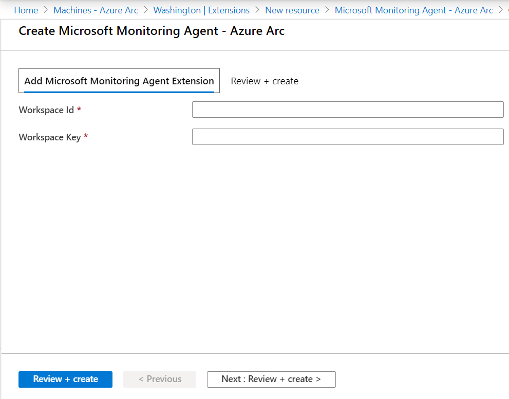

# Enable Azure VM extensions from the Azure portal

This article shows you how to deploy, update, and uninstall Azure VM extensions supported by Azure Arc enabled servers, on a Linux or Windows hybrid machine using the Azure portal.

> [!NOTE]
> The Key Vault VM extension does not support deployment from the Azure portal, only using the Azure CLI, the Azure PowerShell, or using an Azure Resource Manager template.

> [!NOTE]
> Azure Arc-enabled servers does not support deploying and managing VM extensions to Azure virtual machines. For Azure VMs, see the following [VM extension overview](../../virtual-machines/extensions/overview.md) article.

## Enable extensions

VM extensions can be applied to your Azure Arc-enabled server-managed machine via the Azure portal.

1. From your browser, go to the [Azure portal](https://portal.azure.com).

2. In the portal, browse to **Machines - Azure Arc** and select your machine from the list.

3. Choose **Extensions**, then select **Add**.

4. Choose the extension you want from the list of available extensions and follow the instructions in the wizard. In this example, we will deploy the Log Analytics VM extension.

    

    To complete the installation, you are required to provide the workspace ID and primary key. If you are not familiar with how to find this information, see [obtain workspace ID and key](../../azure-monitor/agents/agent-windows.md#workspace-id-and-key).

5. After confirming the required information provided, select **Review + Create**. A summary of the deployment is displayed and you can review the status of the deployment.

>[!NOTE]
>While multiple extensions can be batched together and processed, they are installed serially. Once the first extension installation is complete, installation of the next extension is attempted.

## List extensions installed

You can get a list of the VM extensions on your Azure Arc-enabled server from the Azure portal. Perform the following steps to see them.

1. From your browser, go to the [Azure portal](https://portal.azure.com).

2. In the portal, browse to **Machines - Azure Arc** and select your machine from the list.

3. Choose **Extensions**, and the list of installed extensions is returned.

    :::image type="content" source="media/manage-vm-extensions/list-vm-extensions.png" alt-text="List VM extension deployed to selected machine." border="true":::

## Upgrade extensions

When a new version of a supported extension is released, you can upgrade the extension to that latest release. Azure Arc-enabled servers presents a banner in the Azure portal when you navigate to Azure Arc-enabled servers, informing you there are upgrades available for one or more extensions installed on a machine. When you view the list of installed extensions for a selected Azure Arc-enabled server, you'll notice a column labeled **Update available**. If a newer version of an extension is released, the **Update available** value for that extension shows a value of **Yes**.

>[!NOTE]
>While the word **Update** is used in the Azure portal for this experience currently, it does not accurately represent the behavior of the operation. Extensions are upgraded by installing a newer version of the extension currently installed on the machine or server.

Upgrading an extension to the newest version does not affect the configuration of that extension. You are not required to respecify configuration information for any extension you upgrade.

:::image type="content" source="media/manage-vm-extensions-portal/vm-extensions-update-status.png" alt-text="List VM extension update status." border="true":::

You can upgrade one, or select multiple extensions eligible for an upgrade from the Azure portal by performing the following steps.

> [!NOTE]
> Currently you can only upgrade extensions from the Azure portal. Performing this operation from the Azure CLI or using an Azure Resource Manager template is not supported at this time.

1. From your browser, go to the [Azure portal](https://portal.azure.com).

2. In the portal, browse to **Machines - Azure Arc** and select your hybrid machine from the list.

3. Choose **Extensions**, and review the status of extensions under the **Update available** column.

You can upgrade one extension by one of three ways:

* By selecting an extension from the list of installed extensions, and under the properties of the extension, select the **Update** option.

    :::image type="content" source="media/manage-vm-extensions-portal/vm-extensions-update-from-extension.png" alt-text="Upgrade extension from selected extension." border="true":::

* By selecting the extension from the list of installed extensions, and select the **Update** option from the top of the page.

* By selecting one or more extensions that are eligible for an upgrade from the list of installed extensions, and then select the **Update** option.

    :::image type="content" source="media/manage-vm-extensions-portal/vm-extensions-update-selected.png" alt-text="Update selected extension." border="true":::

## Remove extensions

You can remove one or more extensions from an Azure Arc-enabled server from the Azure portal. Perform the following steps to remove an extension.

1. From your browser, go to the [Azure portal](https://portal.azure.com).

2. In the portal, browse to **Machines - Azure Arc** and select your hybrid machine from the list.

3. Choose **Extensions**, and then select an extension from the list of installed extensions.

4. Select **Uninstall** and when prompted to verify, select **Yes** to proceed.

## Next steps

- You can deploy, manage, and remove VM extensions using the [Azure CLI](manage-vm-extensions-cli.md), [PowerShell](manage-vm-extensions-powershell.md), or [Azure Resource Manager templates](manage-vm-extensions-template.md).

- Troubleshooting information can be found in the [Troubleshoot VM extensions guide](troubleshoot-vm-extensions.md).
