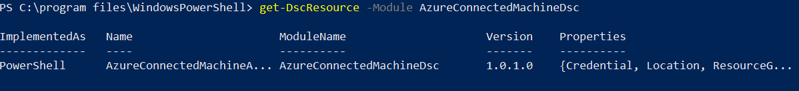

# How to install the Connected Machine agent using Windows PowerShell DSC

Using [Windows PowerShell Desired State Configuration](/powershell/dsc/getting-started/winGettingStarted) (DSC), you can automate software installation and configuration for a Windows computer. This article describes how to use DSC to install the Azure Connected Machine agent on hybrid Windows machines.

## Requirements

- Windows PowerShell version 4.0 or higher

- The [AzureConnectedMachineDsc](https://www.powershellgallery.com/packages/AzureConnectedMachineDsc) DSC module

- A service principal to connect the machines to Azure Arc-enabled servers non-interactively. Follow the steps under the section [Create a Service Principal for onboarding at scale](onboard-service-principal.md#create-a-service-principal-for-onboarding-at-scale) if you have not created a service principal for Azure Arc-enabled servers already.

## Install the ConnectedMachine DSC module

1. To manually install the module, download the source code and unzip the contents of the project directory to the
`$env:ProgramFiles\WindowsPowerShell\Modules folder`. Or, run the following command to install from the PowerShell gallery using PowerShellGet (in PowerShell 5.0):

    ```powershell
    Find-Module -Name AzureConnectedMachineDsc -Repository PSGallery | Install-Module
    ```

2. To confirm installation, run the following command and ensure you see the Azure Connected Machine DSC resources available.

    ```powershell
    Get-DscResource -Module AzureConnectedMachineDsc
    ```

   In the output, you should see something similar to the following:

   

## Install the agent and connect to Azure

The resources in this module are designed to manage the Azure Connected Machine agent configuration. Also included is a PowerShell script `AzureConnectedMachineAgent.ps1`, found in the `AzureConnectedMachineDsc\examples` folder. It uses community resources to automate the download and installation, and establish a connection with Azure Arc. This script performs similar steps described in the [Connect hybrid machines to Azure from the Azure portal](onboard-portal.md) article.

If the machine needs to communicate through a proxy server to the service, after you install the agent you need to run a command that's described [here](manage-agent.md#update-or-remove-proxy-settings). This sets the proxy server system environment variable `https_proxy`. Instead of running the command manually, you can perform this step with DSC by using the [ComputeManagementDsc](https://www.powershellgallery.com/packages/ComputerManagementDsc) module. Using this configuration, the agent communicates through the proxy server using the HTTP protocol.

>[!NOTE]
>To allow DSC to run, Windows needs to be configured to receive PowerShell remote commands even when you're running a localhost configuration. To easily configure your environment correctly, just run `Set-WsManQuickConfig -Force` in an elevated PowerShell Terminal.
>

Configuration documents (MOF files) can be applied to the machine using the `Start-DscConfiguration` cmdlet.

The following are the parameters you pass to the PowerShell script to use.

- `TenantId`: The unique identifier (GUID) that represents your dedicated instance of Microsoft Entra ID.

- `SubscriptionId`: The subscription ID (GUID) of your Azure subscription that you want the machines in.

- `ResourceGroup`: The resource group name where you want your connected machines to belong to.

- `Location`: See [supported Azure regions](overview.md#supported-regions). This location can be the same or different, as the resource group's location.

- `Tags`: String array of tags that should be applied to the connected machine resource.

- `Credential`: A PowerShell credential object with the **ApplicationId** and **password** used to register machines at scale using a [service principal](onboard-service-principal.md).

1. In a PowerShell console, navigate to the folder where you saved the `.ps1` file.

2. Run the following PowerShell commands to compile the MOF document (for information about compiling DSC configurations, see [DSC Configurations](/powershell/dsc/configurations/configurations):

    ```powershell
    .\`AzureConnectedMachineAgent.ps1 -TenantId <TenantId GUID> -SubscriptionId <SubscriptionId GUID> -ResourceGroup '<ResourceGroupName>' -Location '<LocationName>' -Tags '<Tag>' -Credential <psCredential>
    ```

3. This will create a `localhost.mof file` in a new folder named `C:\dsc`.

After you install the agent and configure it to connect to Azure Arc-enabled servers, go to the Azure portal to verify that the server has been successfully connected. View your machines in the [Azure portal](https://aka.ms/hybridmachineportal).

## Adding to existing configurations

This resource can be added to existing DSC configurations to represent an end-to-end configuration for a machine. For example, you might wish to add this resource to a configuration that sets secure operating system settings.

The [CompositeResource](https://www.powershellgallery.com/packages/compositeresource) module from the PowerShell Gallery can be used to create a [composite resource](/powershell/dsc/resources/authoringResourceComposite) of the example configuration, to further simplify combining configurations.

## Next steps

* Troubleshooting information can be found in the [Troubleshoot Connected Machine agent guide](troubleshoot-agent-onboard.md).

* Review the [Planning and deployment guide](plan-at-scale-deployment.md) to plan for deploying Azure Arc-enabled servers at any scale and implement centralized management and monitoring.

* Learn how to manage your machine using [Azure Policy](../../governance/policy/overview.md), for such things as VM [guest configuration](../../governance/machine-configuration/overview.md), verifying the machine is reporting to the expected Log Analytics workspace, enable monitoring with [VM insights](../../azure-monitor/vm/vminsights-enable-policy.md), and much more.
