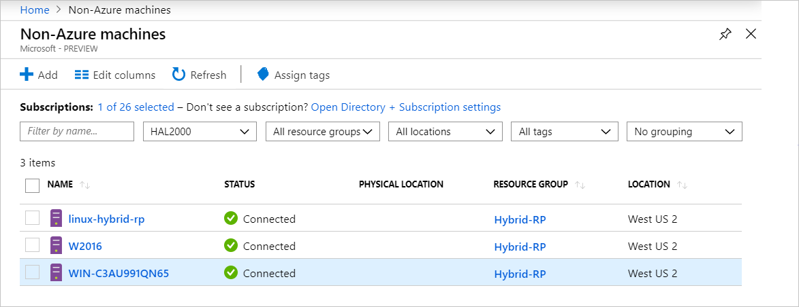

# What is Azure Arc for servers

Azure Arc for servers allows you to manage machines which are outside of Azure.
When a non-Azure machine is connected to Azure, it becomes a **Connected Machine** and is treated as a resource in Azure. Each **Connected Machine**
has a Resource ID, is managed as part of a Resource Group inside a subscription, and benefits from standard Azure constructs such as Azure Policy and tagging.

An agent package needs to be installed on each machine to connect it to Azure. The rest of this document explains the process in more detail.

Machines will have a status of **Connected** or **Disconnected** based on how recently the agent has checked in. Each check-in is called a heartbeat. If a machine has not checked-in within the past 5 minutes, it will show as offline until connectivity is restored.  <!-- For more information on troubleshooting agent connectivity, see [Troubleshooting Azure Arc for servers](troubleshoot/arc-for-servers.md). -->



## Clients

### Supported Operating Systems

In Public Preview, we support:

- Windows Server 2012 R2 and above
- Ubuntu 16.04 and 18.04

The Public Preview release is designed for evaluation purposes and should not be used to manage critical production resources.

## Azure Subscription and Service Limits

Please make sure you read the Azure Resource Manager limits, and plan for the number of the machines to be connected according to the guideline listed for the [subscription](../../azure-subscription-service-limits.md#subscription-limits---azure-resource-manager), and for the [resource groups](../../azure-subscription-service-limits.md#resource-group-limits). In particular, by default there is a limit of 800 servers per resource group.

## Networking Configuration

During installation and runtime, the agent requires connectivity to **Azure Arc service endpoints**. If outbound connectivity is blocked by Firewalls, make sure that the following URLs are not blocked by default. All connections are outbound from the agent to Azure, and are secured with **SSL**. All traffic can be routed via an **HTTPS** proxy. If you allow the IP ranges or domain names that the servers are allowed to connect to, you must allow port 443 access to the following Service Tags and DNS Names.

Service Tags:

* AzureActiveDirectory
* AzureTrafficManager

For a list of IP addresses for each service tag/region, see the JSON file - [Azure IP Ranges and Service Tags – Public Cloud](https://www.microsoft.com/download/details.aspx?id=56519). Microsoft publishes weekly updates containing each Azure Service and the IP ranges it uses. See [Service tags](https://docs.microsoft.com/azure/virtual-network/security-overview#service-tags), for more details.

These DNS Names are provided in addition to the Service Tag IP range information because the majority of services do not currently have a Service Tag registration and, as such, the IPs are subject to change. If IP ranges are required for your firewall configuration, then the **AzureCloud** Service Tag should be used to allow access to all Azure services. Do not disable security monitoring or inspection of these URLs, but allow them as you would other internet traffic.

| Domain Environment | Required Azure service endpoints |
|---------|---------|
|management.azure.com|Azure Resource Manager|
|login.windows.net|Azure Active Directory|
|dc.services.visualstudio.com|Application Insights|
|agentserviceapi.azure-automation.net|Guest Configuration|
|*-agentservice-prod-1.azure-automation.net|Guest Configuration|
|*.his.hybridcompute.azure-automation.net|Hybrid Identity Service|

### Installation Network Requirements

Download the [Azure Connected Machine Agent package](https://aka.ms/AzureConnectedMachineAgent) from our official distribution servers the below sites must be accessible from your environment. You may choose to download the package to a file share and have the agent installed from there. In this case, the onboarding script generated from the Azure portal may need to be modified.

Windows:

* `aka.ms`
* `download.microsoft.com`

Linux:

* `aka.ms`
* `packages.microsoft.com`

See the section [Proxy server configuration](quickstart-onboard-powershell.md#proxy-server-configuration), for information on how to configure the agent to use your proxy.

## Register the required Resource Providers

Once the 'Feature Flag' registration has been approved, you must register the required Resource Providers.

* **Microsoft.HybridCompute**
* **Microsoft.GuestConfiguration**

You can register the resource providers with the following commands:

Azure PowerShell:

```azurepowershell-interactive
Login-AzAccount
Set-AzContext -SubscriptionId [subscription you want to onboard]
Register-AzResourceProvider -ProviderNamespace Microsoft.HybridCompute
Register-AzResourceProvider -ProviderNamespace Microsoft.GuestConfiguration
```

Azure CLI:

```azurecli-interactive
az account set --subscription "{Your Subscription Name}"
az provider register --namespace 'Microsoft.HybridCompute'
az provider register --namespace 'Microsoft.GuestConfiguration'
```

You can also register the Resource Providers using the portal by following the steps under [Azure portal](../../azure-resource-manager/resource-manager-supported-services.md#azure-portal).

## Supported Scenarios

After you register a node you can start managing your nodes using other Azure services.

In Public Preview, the following scenarios are supported for **Connected Machines**.

## Guest Configuration

After connect the machine to Azure, you can assign Azure policies to **Connected Machines** using the same experience as policy assignment to Azure virtual machines.

For more information, see [Understand Azure Policy's Guest Configuration](../../governance/policy/concepts/guest-configuration.md).

The Guest Configuration Agent logs for a **Connected Machine** are in the following locations:

* Windows - `%ProgramFiles%\AzureConnectedMachineAgent\logs\dsc.log`
* Linux: - `/opt/logs/dsc.log`

## Log Analytics

Log data collected by the [Microsoft Monitoring Agent (MMA)](https://docs.microsoft.com/azure/azure-monitor/log-query/log-query-overview) and stored in Log Analytics workspace will now contain properties specific to the machine such as **ResourceId**, which can be used for the Resource centric log access.

- Machines that already have the MMA agent installed, will have **Azure Arc** functionality enabled via updated Management Packs.
- [MMA agent version 10.20.18011 or above](https://docs.microsoft.com/azure/virtual-machines/extensions/oms-windows#agent-and-vm-extension-version) is required for Azure Arc for servers integration.
- When querying for log data in [Azure Monitor](https://docs.microsoft.com/azure/azure-monitor/log-query/log-query-overview#log-queries), the returned data schema will contain the Hybrid **ResourceId** in the form `/subscriptions/<SubscriptionId/resourceGroups/<ResourceGroup>/providers/Microsoft.HybridCompute/machines/<MachineName>`.

For more information, see [Get started with Log Analytics in Azure Monitor](https://docs.microsoft.com/azure/azure-monitor/log-query/get-started-portal).

<!-- MMA agent version 10.20.18011 and later -->

## Next Steps

There are two methods to connect machines using Azure Arc for servers.

* **Interactively** - Follow the [Portal Quickstart](quickstart-onboard-portal.md) to generate a script from the portal and execute it on the machine. This is the best option if you are connecting one machine at a time.
* **At Scale** - Follow the [PowerShell Quickstart](quickstart-onboard-powershell.md) to create a Service Principal to connect machines non-interactively.
