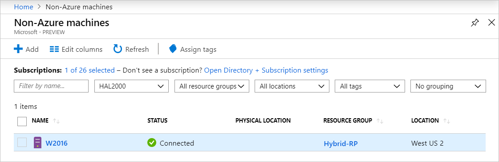

# Evaluate Azure Arc-enabled servers on an Azure virtual machine

Azure Arc-enabled servers is designed to help you connect servers running on-premises or in other clouds to Azure. Normally, you would not use Azure Arc-enabled servers on an Azure virtual machine because all the same capabilities are natively available for these VMs, including a representation of the VM in Azure Resource Manager, VM extensions, managed identities, and Azure Policy. If you attempt to install Azure Arc-enabled servers on an Azure VM, you'll receive an error message stating that it is unsupported and the agent installation will be canceled.

While you cannot install Azure Arc-enabled servers on an Azure VM for production scenarios, it is possible to configure Azure Arc-enabled servers to run on an Azure VM for *evaluation and testing purposes only*. This article will help you set up an Azure VM before you can enable Azure Arc-enabled servers on it.

> [!NOTE]
> The steps in this article are intended for virtual machines hosted in the Azure cloud. Azure Arc-enabled servers is not supported on virtual machines running on Azure Stack Hub or Azure Stack Edge.

## Prerequisites

* Your account is assigned to the [Virtual Machine Contributor](../../role-based-access-control/built-in-roles.md#virtual-machine-contributor) role.
* The Azure virtual machine is running an [operating system supported by Azure Arc-enabled servers](prerequisites.md#supported-operating-systems). If you don't have an Azure VM, you can deploy a [simple Windows VM](https://portal.azure.com/#create/Microsoft.Template/uri/https%3a%2f%2fraw.githubusercontent.com%2fAzure%2fazure-quickstart-templates%2fmaster%2fquickstarts%2fmicrosoft.compute%2fvm-simple-windows%2fazuredeploy.json) or a [simple Ubuntu Linux 18.04 LTS VM](https://portal.azure.com/#create/Microsoft.Template/uri/https%3a%2f%2fraw.githubusercontent.com%2fAzure%2fazure-quickstart-templates%2fmaster%2fquickstarts%2fmicrosoft.compute%2fvm-simple-windows%2fazuredeploy.json).
* Your Azure VM can communicate outbound to download the Azure Connected Machine agent package for Windows from the [Microsoft Download Center](https://aka.ms/AzureConnectedMachineAgent), and Linux from the Microsoft [package repository](https://packages.microsoft.com/). If outbound connectivity to the Internet is restricted following your IT security policy, you will need to download the agent package manually and copy it to a folder on the Azure VM.
* An account with elevated (that is, an administrator or as root) privileges on the VM, and RDP or SSH access to the VM.
* To register and manage the Azure VM with Azure Arc-enabled servers, you are a member of the [Azure Connected Machine Resource Administrator](../../role-based-access-control/built-in-roles.md#azure-connected-machine-resource-administrator) or [Contributor](../../role-based-access-control/built-in-roles.md#contributor) role in the resource group.

## Plan

To start managing your Azure VM as an Azure Arc-enabled server, you need to make the following changes to the Azure VM before you can install and configure Azure Arc-enabled servers.

1. Remove any VM extensions deployed to the Azure VM, such as the Log Analytics agent. While Azure Arc-enabled servers support many of the same extensions as Azure VMs, the Azure Connected Machine agent can't manage VM extensions already deployed to the VM.

2. Disable the Azure Windows or Linux Guest Agent. The Azure VM guest agent serves a similar purpose to the Azure Connected Machine agent. To avoid conflicts between the two, the Azure VM Agent needs to be disabled. Once it is disabled, you cannot use VM extensions or some Azure services.

3. Create a security rule to deny access to the Azure Instance Metadata Service (IMDS). IMDS is a REST API that applications can call to get information about the VM's representation in Azure, including its resource ID and location. IMDS also provides access to any managed identities assigned to the machine. Azure Arc-enabled servers provides its own IMDS implementation and returns information about the Azure Arc representation of the VM. To avoid situations where both IMDS endpoints are available and apps have to choose between the two, you block access to the Azure VM IMDS so that the Azure Arc-enabled server IMDS implementation is the only one available.

After you've made these changes, your Azure VM behaves like any machine or server outside of Azure and is at the necessary starting point to install and evaluate Azure Arc-enabled servers.

When Azure Arc-enabled servers is configured on the VM, you see two representations of it in Azure. One is the Azure VM resource, with a `Microsoft.Compute/virtualMachines` resource type, and the other is an Azure Arc resource, with a `Microsoft.HybridCompute/machines` resource type. As a result of preventing management of the guest operating system from the shared physical host server, the best way to think about the two resources is the Azure VM resource is the virtual hardware for your VM, and let's you control the power state and view information about its SKU, network, and storage configurations. The Azure Arc resource manages the guest operating system in that VM, and can be used to install extensions, view compliance data for Azure Policy, and complete any other supported task by Azure Arc-enabled servers.

## Reconfigure Azure VM

> [!NOTE]
> For windows, set the environment variable to override the ARC on an Azure VM installation.
> ```powershell
> [System.Environment]::SetEnvironmentVariable("MSFT_ARC_TEST",'true', [System.EnvironmentVariableTarget]::Machine)
> ```

1. Remove any VM extensions on the Azure VM.

   In the Azure portal, navigate to your Azure VM resource and from the left-hand pane, select  **Extensions**. If there are any extensions installed on the VM, select each extension individually and then select **Uninstall**. Wait for all extensions to finish uninstalling before proceeding to step 2.

2. Disable the Azure VM Guest Agent.

   To disable the Azure VM Guest Agent, you'll need to connect to your VM using Remote Desktop Connection (Windows) or SSH (Linux). Once connected, run the following commands to disable the guest agent.

   For Windows, run the following PowerShell commands:

   ```powershell
   Set-Service WindowsAzureGuestAgent -StartupType Disabled -Verbose
   Stop-Service WindowsAzureGuestAgent -Force -Verbose
   ```

   For Linux, run the following commands:

   ```bash
   CURRENT_HOSTNAME=$(hostname)
   sudo service walinuxagent stop
   sudo waagent -deprovision -force
   sudo rm -rf /var/lib/waagent
   sudo hostnamectl set-hostname $CURRENT_HOSTNAME
   ```

3. Block access to the Azure IMDS endpoint.

   While still connected to the server, run the following commands to block access to the Azure IMDS endpoint. For Windows, run the following PowerShell command:

   ```powershell
   New-NetFirewallRule -Name BlockAzureIMDS -DisplayName "Block access to Azure IMDS" -Enabled True -Profile Any -Direction Outbound -Action Block -RemoteAddress 169.254.169.254
   ```

   For Linux, consult your distribution's documentation for the best way to block outbound access to `169.254.169.254/32` over TCP port 80. Normally you'll block outbound access with the built-in firewall, but you can also temporarily block it with **iptables** or **nftables**.

   If your Azure VM is running Ubuntu, perform the following steps to configure its uncomplicated firewall (UFW):

   ```bash
   sudo ufw --force enable
   sudo ufw deny out from any to 169.254.169.254
   sudo ufw default allow incoming
   ```

   If your Azure VM is running CentOS, Red Hat, or SUSE Linux Enterprise Server (SLES), perform the following steps to configure firewalld:

   ```bash
   sudo firewall-cmd --permanent --direct --add-rule ipv4 filter OUTPUT 1 -p tcp -d 169.254.169.254 -j DROP
   sudo firewall-cmd --reload
   ```

   For other distributions, consult your firewall docs or configure a generic iptables rule with the following command:

   ```bash
   sudo iptables -A OUTPUT -d 169.254.169.254 -j DROP
   ```

   > [!NOTE]
   > The iptables configuration needs to be set after every reboot unless a persistent iptables solution is used.


4. Install and configure the Azure Connected Machine agent.

   The VM is now ready for you to begin evaluating Azure Arc-enabled servers. To install and configure the Azure Connected Machine agent, see [Connect hybrid machines using the Azure portal](onboard-portal.md) and follow the steps to generate an installation script and install using the scripted method.

   > [!NOTE]
   > If outbound connectivity to the internet is restricted from your Azure VM, you'll need to download the agent package manually. Copy the agent package to the Azure VM, and modify the Azure Arc-enabled servers installation script to reference the source folder.

If you missed one of the steps, the installation script detects it is running on an Azure VM and terminates with an error. Verify you've completed steps 1-3, and then rerun the script.

## Verify the connection with Azure Arc

After you install and configure the agent to register with Azure Arc-enabled servers, go to the Azure portal to verify that the server has successfully connected. View your machine in the [Azure portal](https://portal.azure.com).



## Next steps

* Learn [how to plan and enable a large number of machines to Azure Arc-enabled servers](plan-at-scale-deployment.md) to simplify configuration of essential security management and monitoring capabilities in Azure.

* Learn about our [supported Azure VM extensions](manage-vm-extensions.md) available to simplify deployment with other Azure services like Automation, KeyVault, and others for your Windows or Linux machine.

* When you have finished testing, [uninstall the Azure Connected Machine agent](manage-agent.md#uninstall-the-agent).
