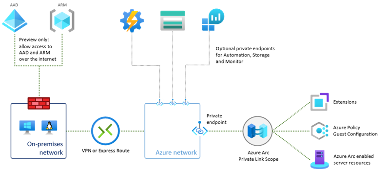
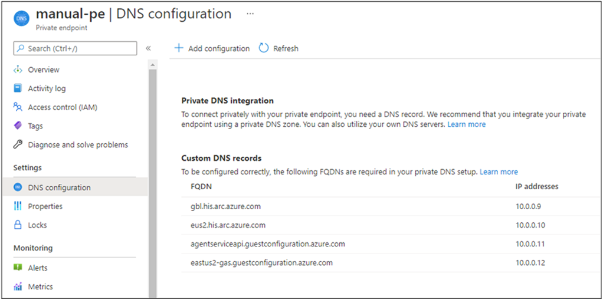
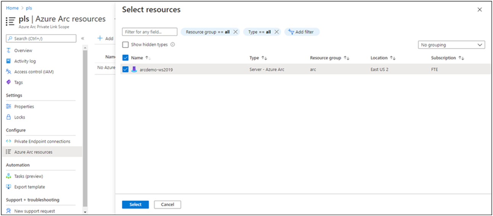

# Use Azure Private Link to securely connect networks to Azure Arc enabled servers

[Azure Private Link](../../private-link/private-link-overview.md) allows you to securely link Azure PaaS services to your virtual network using private endpoints. For many services, you just set up an endpoint per resource. This means you can connect your on-premises or multi-cloud servers with Azure Arc and send all traffic over an Express Route or site-to-site VPN connection instead of using public networks. Azure Arc enabled servers uses a Private Link Scope model to allow multiple servers or machines to communicate with their Azure Arc resources using a single private endpoint.

This article covers when to use and how to set up an Azure Arc Private Link Scope (preview). 

> [!NOTE]
> Azure Arc Private Link Scope (preview) is available in all commercial cloud regions, it is not available in the US Government cloud today.

## Advantages

With Private Link you can:

- Connect privately to Azure Arc enabled servers without opening up any public network access.
- Ensure data from the Arc enabled server is only accessed through authorized private networks. This also includes data from [VM extensions](manage-vm-extensions.md) installed on the server or machine that provide post-deployment management and monitoring support.
- Prevent data exfiltration from your private networks by defining specific Azure Arc enabled server and other Azure services resources, such as Azure Monitor, that connect through your private endpoint.
- Securely connect your private on-premises network to Azure Arc enabled servers using ExpressRoute and Private Link.
- Keep all traffic inside the Microsoft Azure backbone network.

For more information, see  [Key Benefits of Private Link](../../private-link/private-link-overview.md#key-benefits).

## How it works

Azure Arc enabled servers Private Link Scope connects private endpoints (and the virtual networks they're contained in) to one Azure resource. When you enable one or more VM extensions, such as Azure Automation Update Management or Azure Monitor, those resources 

 resources - Log Analytics workspaces and Application Insights components.



* The Private Endpoint on your VNet allows it to reach Azure Monitor endpoints through private IPs from your network's pool, instead of using to the public IPs of these endpoints. That allows you to keep using your Azure Monitor resources without opening your VNet to unrequired outbound traffic.

* Traffic from the Private Endpoint to your Azure Monitor resources will go over the Microsoft Azure backbone, and not routed to public networks.

* You can configure each of your components to allow or deny ingestion and queries from public networks. That provides a resource-level protection, so that you can control traffic to specific resources.

> [!NOTE]
> A single Azure Monitor resource can belong to multiple AMPLSs, but you cannot connect a single VNet to more than one AMPLS. 

## Planning your Private Link setup

To connect your server to Azure Arc over a private link, you need to configure your network to accomplish the following:

1. Establish a connection between your on-premises network and an Azure virtual network using a [site-to-site VPN](../../vpn-gateway/tutorial-site-to-site-portal.md) or [Express Route circuit](../../expressroute/expressroute-howto-linkvnet-arm.md).

1. Deploy an Azure Arc Private Link Scope, which controls which servers can communicate with Azure Arc over private endpoints and associate it with your Azure virtual network using a private endpoint.

1. Update the DNS configuration on your local network to resolve the private endpoint addresses.

1. Configure your local firewall to allow access to Azure Active Directory and Azure Resource Manager. This is a temporary step and will not be required when private endpoints for these services enter preview.

1. Associate the servers registered with Azure Arc enabled servers with the private link scope.

1. Optionally, deploy private endpoints for other Azure services your server is managed with, such as Azure Monitor or Azure Automation.

This article assumes you have already set up your Express Route circuit or site-to-site VPN connection.


## Network configuration

Azure Arc enabled servers integrates with several Azure services to bring cloud management and governance to your hybrid servers. Most of these services already offer private endpoints, but you need to configure your firewall and routing rules to allow access to Azure Active Directory and Azure Resource Manager over the Internet until these services offer private endpoints.

There are two ways you can achieve this:

1. If your network is configured to route all Internet-bound traffic through the Azure VPN or Express Route circuit, you can configure the network security group associated with your subnet in Azure to allow outbound TCP 443 (HTTPS) access to Azure AD and Azure using [service tags](../../virtual-network/service-tags-overview.md). The NSG rules should look like the following:

    |Setting |Azure AD rule | Azure rule |
    |--------|--------------|-----------------------------|
    |Source |Virtual network |Virtual network |
    |Source port ranges |* |* |
    |Destination |Service Tag |Service Tag |
    |Destination service tag |AzureActiveDirectory |AzureResourceManager |
    |Destination port ranges |443 |443 |
    |Protocol |Tcp |Tcp |
    |Action |Allow |Allow |
    |Priority |150 (must be lower than any rules that block Internet access) |151 (must be lower than any rules that block Internet access) |
    |Name |AllowAADOutboundAccess |AllowAzOutboundAccess |

1. Configure the firewall on your local network to allow outbound TCP 443 (HTTPS) access to Azure AD and Azure using the downloadable service tag files. The JSON file contains all the public IP address ranges used by Azure AD and Azure and is updated monthly to reflect any changes. Azure ADs service tag is `AzureActiveDirectory` and Azure's service tag is `AzureResourceManager`. You need to consult with your network admin and network firewall vendor to learn how to configure your firewall rules.

See the visual diagram under the section [How it works](#how-it-works) for the network traffic flows.

## Create a Private Link Scope

1. Go to **Create a resource** in the Azure portal and search for **Azure Arc Private Link Scope**.

   

1. Select **create**.
1. Pick a Subscription and Resource Group. During the preview, your virtual network and Azure Arc enabled servers must be in the same subscription as the Private Link Scope.
1. Give the Azure Arc Private Link Scope a name. It's best to use a meaningful and clear name.

   You can optionally require every Arc enabled server associated with this Azure Arc Private Link Scope to send data to the service through the private endpoint. If you select **Enable public network access**, servers associated with this Azure Arc Private Link Scope can communicate with the service over both private or public networks. You can change this setting after creating the scope if you change your mind.

1. Select **Review + Create**.

   

1. Let the validation pass, and then select **Create**.

## Create a private endpoint

Once your Azure Arc Private Link Scope is created, you need to connect it with one or more virtual networks using a private endpoint. The private endpoint exposes access to the Azure Arc services on a private IP in your virtual network address space.

1. In your scope resource, select **Private Endpoint connections** in the left-hand resource menu. Select **Private Endpoint** to start the endpoint create process. You can also approve connections that were started in the Private Link center here by selecting them and selecting **Approve**.

1. Pick the subscription, resource group, and name of the endpoint, and the region it should live in. The region needs to be the same region as the VNet you connect it to.

1. Select **Next: Resource**.

1. On the **Resource** page,

   a. Pick the **Subscription** that contains your Azure Arc Private Link Scope resource.

   b. For **resource type**, choose **Microsoft.HybridCompute/privateLinkScopes**.

   c. From the **resource** drop-down, choose your Private Link scope you created earlier.

   d. Select **Next: Configuration >**.
      

1. On the **Configuration** page,

   a. Choose the **virtual network** and **subnet** that you want to connect to your Azure Monitor resources. 

   b. Choose **Yes** for **Integrate with private DNS zone**, and let it automatically create a new Private DNS Zone. The actual DNS zones may be different from what is shown in the screenshot below.

     > [!NOTE]
     > If you choose **No** and prefer to manage DNS records manually, first complete setting up your Private Link - including this Private Endpoint and the AMPLS configuration. Then, configure your DNS according to the instructions in [Azure Private Endpoint DNS configuration](../../private-link/private-endpoint-dns.md). Make sure not to create empty records as preparation for your Private Link setup. The DNS records you create can override existing settings and impact your connectivity with Azure Monitor.

   c.    Select **Review + create**.

   d.    Let validation pass. 

   e.    Select **Create**. 

    

## Configure on-premises DNS forwarding

Your on-premises servers need to be able to resolve the private link DNS records to the private endpoint IP addresses. How you configure this depends on whether you’re using Azure private DNS zones to maintain DNS records, or if you’re using your own DNS server on-premises and how many servers you’re configuring.

### DNS configuration using Azure-integrated private DNS zones

If you set up private DNS zones for Azure Arc enabled servers and Guest Configuration when creating the private endpoint, your on-premises servers need to be able to forward DNS queries to the built-in Azure DNS servers to resolve the private endpoint addresses correctly. You need a DNS forwarder in Azure (either a purpose-built VM or an Azure Firewall instance with DNS proxy enabled), after which you can configure your on-premises DNS server to forward queries to Azure to resolve private endpoint IP addresses.

The private endpoint documentation provides guidance for configuring [on-premises workloads using a DNS forwarder](../../private-link/private-endpoint-dns.md#on-premises-workloads-using-a-dns-forwarder).

### Manual DNS server configuration

If you opted out of using Azure private DNS zones during private endpoint creation, you will need to create the required DNS records in your on-premises DNS server.

1. Go to the Azure portal with the Azure Arc enabled servers private link preview features enabled.

1. Navigate to the private endpoint resource associated with your virtual network and private link scope.

1. From the left-hand pane, select **DNS configuration** to see a list of the DNS records and corresponding IP addresses you’ll need to set up on your DNS server. The FQDNs and IP addresses will change based on the region you selected for your private endpoint and the available IP addresses in your subnet.

    

1. Follow the guidance from your DNS server vendor to add the necessary DNS zones and A records to match the table in the portal. Ensure that you select a DNS server that is appropriately scoped for your network. Every server that uses this DNS server now resolves the private endpoint IP addresses and must be associated with the Private Link Scope, or the connection will be refused.

### Single server scenarios

If you’re only planning to use Private Links to support a small number of servers or machines, you may not want to update your entire network’s DNS configuration. In this case, you can add the private endpoint hostnames and IP addresses to your operating systems **Hosts** file. Depending on the OS configuration, the Hosts file can be the primary or alternative method for resolving hostname to IP address.

#### Windows

1. Using an account with administrator privileges, open **C:\Windows\System32\drivers\etc\hosts**.

1. Add the private endpoint IPs and hostnames as shown in the table from step 3 under [Manual DNS server configuration](#manual-dns-server-configuration). Note that the hosts file requires the IP address first followed by a space and then the hostname.

1. Save the file with your changes. You may need to save to another directory first, then copy the file to the original path.

#### Linux

1. Using an account with the **sudoers** privilege, run `sudo nano /etc/hosts` to open the hosts file.

1. Add the private endpoint IPs and hostnames as shown in the table from step 3 under [Manual DNS server configuration](#manual-dns-server-configuration). Note that the hosts file asks for the IP address first followed by a space and then the hostname.

1. Save the file with your changes.

## Connect to an Azure Arc enabled server

> [!NOTE]
> The minimum supported version of the Azure Arc Connected Machine agent with private endpoint is version 1.4. The Arc enabled servers deployment script generated in the portal downloads the latest version.

### Configure a new Arc enabled server to use Private link

When connecting a server with Azure Arc for the first time, you can optionally connect it to a Private Link Scope.

1. From your browser, go to the [Azure portal](https://portal.azure.com).

1. Navigate to **Servers -Azure Arc**.

1. On the **Servers - Azure Arc** page, select **Add** at the upper left.

1. On the **Select a method** page, select the **Add servers using interactive script** tile, and then select **Generate script**.

1. On the **Generate script** page, select the subscription and resource group where you want the machine to be managed within Azure. Select an Azure location where the machine metadata will be stored. This location can be the same or different, as the resource group's location.

1. On the **Prerequisites** page, review the information and then select **Next: Resource details**.

1. On the **Resource details** page, provide the following:

    1. In the **Resource group** drop-down list, select the resource group the machine will be managed from.
    1. In the **Region** drop-down list, select the Azure region to store the servers metadata.
    1. In the **Operating system** drop-down list, select the operating system that the script is configured to run on.
    1. Under **Network Connectivity**, select **Private endpoint** and select the Azure Arc Private Link Scope created in Part 1 from the list.
    1. Select **Next: Tags**.

1. On the **Tags** page, review the default **Physical location tags** suggested and enter a value, or specify one or more **Custom tags** to support your standards.

1. Select **Next: Download and run script**.

1. On the **Download and run script** page, review the summary information, and then select **Download**. If you still need to make changes, select **Previous**.

After downloading the script, run it on your server using a privileged (administrator or root) account. Depending on your network configuration, you may need to download the agent on a computer with internet access and transfer it to your server. The Windows agent can be downloaded from [https://aka.ms/AzureConnectedMachineAgent](https://aka.ms/AzureConnectedMachineAgent) and the Linux agent can be downloaded from [https://packages.microsoft.com](https://packages.microsoft.com). Look for the latest version of the **azcmagent** under your OS distribution directory and installed with your local package manager.

The script will return status messages letting you know if onboarding was successful after it completes.

> [!NOTE]
> If you’re deploying the Connected Machine agent on a Linux server, there may be a five minute delay during the network connectivity check followed by an error saying that `you do not have access to login.windows.net`, even if your firewall is configured correctly. This is a known issue and will be fixed in a future agent release. Onboarding should still succeed if your firewall is configured correctly.

### Configure an existing Arc enabled server

For Arc enabled servers that were set up prior to your private link scope, you can allow them to start using the Arc enabled servers Private Link Scope by completing the following steps.

1. In the Azure portal, navigate to your Azure Arc Private Link Scope resource.

1. From the left-hand pane, select **Azure Arc resources** and then **+ Add**.

1. Select the servers in the list that you want to associate with the Private Link Scope, and then select **Select** to save your changes.

    > [!NOTE]
    > Only Azure Arc enabled servers in the same subscription and region as your Private Link Scope is shown.

    

It may take up to 15 minutes for the Private Link Scope to accept connections from the recently associated server(s).

## Restrictions and limitations

The Arc enabled Servers Private Link Scope object has a number of limits you should consider when planning your Private Link setup.

1. You can associate at most 1 Azure Arc Private Link Scope with a virtual network.

1. An Azure Arc enabled server resource can only connect to one Azure Arc enabled servers Private Link Scope

1. The Azure Arc enabled server, Azure Arc Private Link Scope, and virtual network must be in the same subscription and Azure region.

1. Traffic to Azure Active Directory and Azure Resource Manager service tags must be allowed through your on-premises network firewall during the preview. These services will offer their own private endpoints in the future.

1. Other Azure services that you will use, for example Azure Monitor, requires their own private endpoints in your virtual network.

1. Azure Arc enabled servers Private Link Scope is not currently available in Azure US Government regions.

## Troubleshooting

1. Ensure the required resource providers and feature flags are registered for your subscription.

    To check with the Azure CLI, run the following commands.

    ```azurecli
    az feature show --namespace Microsoft.Network --name AllowPrivateEndpoints

    {
      "id": "/subscriptions/ID/providers/Microsoft.Features/providers/Microsoft.Network/features/AllowPrivateEndpoints",
      "name": "Microsoft.Network/AllowPrivateEndpoints",
      "properties": {
        "state": "Registered"
      },
      "type": "Microsoft.Features/providers/features"
    }
    ```
 
    ```azurecli
    az feature show --namespace Microsoft.HybridCompute --name ArcServerPrivateLinkPreview

    {
      "id": "/subscriptions/ID/providers/Microsoft.Features/providers/microsoft.hybridcompute/features/ArcServerPrivateLinkPreview",
      "name": "microsoft.hybridcompute/ArcServerPrivateLinkPreview",
      "properties": {
        "state": "Registered"
      },
      "type": "Microsoft.Features/providers/features"
    }
    ```

    To check with Azure PowerShell, run the following commands:

    ```azurepowershell
    Get-AzProviderFeature -ProviderNamespace Microsoft.Network -FeatureName AllowPrivateEndpoints

    FeatureName           ProviderName      RegistrationState
    -----------           ------------      -----------------
    AllowPrivateEndpoints Microsoft.Network Registered
    ```

    ```azurepowershell
    Get-AzProviderFeature -ProviderNamespace Microsoft.HybridCompute -FeatureName ArcServerPrivateLinkPreview

    FeatureName                 ProviderName            RegistrationState
    -----------                 ------------            -----------------
    ArcServerPrivateLinkPreview Microsoft.HybridCompute Registered
   ```

    If the features show as registered but you are still unable to see the `Microsoft.HybridCompute/privateLinkScopes` resource when creating a private endpoint, try re-registering the resource provider as shown [here](agent-overview.md#register-azure-resource-providers).

1. Check your on-premises DNS server(s) to verify it is either forwarding to Azure DNS or is configured with appropriate A records in your private link zone. These lookup commands should return private IP addresses in your Azure virtual network. If they resolve public IP addresses, double check your server and network’s DNS configuration.

    nslookup gbl.his.arc.azure.com
    nslookup agentserviceapi.guestconfiguration.azure.com

1. If you are having trouble onboarding a server, confirm that you’ve added the Azure Active Directory and Azure Resource Manager service tags to your local network firewall. The agent needs to communicate with these services over the Internet until private endpoints are available for these services.

## Next steps