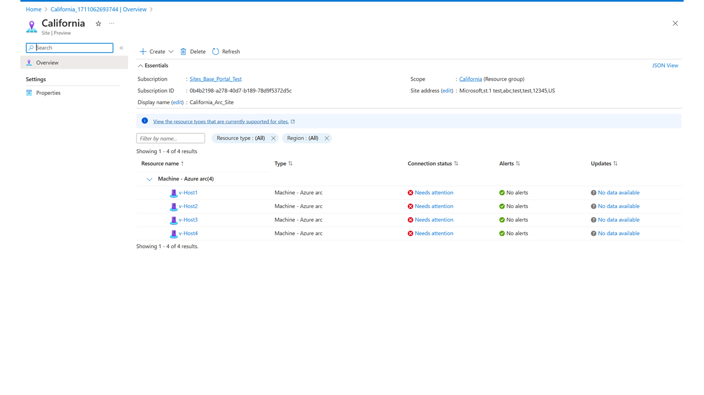

# Create a site

This how to will guide you through how to create, modify, and delete a site.

## Prerequisites

* Azure portal Access
* Internet Connectivity
* Subscription
* Resource Group or Subscription with at-least one resource for Site

## Open Azure Arc site manager

Navigate to Azure Arc site manager via **Azure Arc** [pane](https://ms.portal.azure.com/#blade/Microsoft_Azure_HybridCompute/AzureArcCenterBlade) in Azure in which **Site manager** will be displayed on the left side. 

Alternatively, you can also search for **Azure Arc site manager** in the Azure portal or **Sites - Azure Arc** using terms such as **site**, **Arc Site**, **site manager** and so on.

Once you locate **Azure Arc site manager**, select to open the main page of Azure Arc site manager, which will appear as shown.

## Create your site

1. From the main **site manager** page in **Azure Arc**, select the blue box icon that says **Create a site**

2. Fill in the details for your first site. While these details might change, at the time of this article the required details are:
    * Site scope: subscription or resource group
     *Note:* The scope can be defined only at the time of creating a site and can't be modified later. After defining the scope for a site, all the resources in the scope can be viewed and managed from site manager.
    * Site name: custom name for site
    * Display name: custom display name for site
    * Subscription: subscription for the site to be created under
    * Address: Physical address for a site
3. Once these details are provided, select **Review + create** and you're brought to a summary page to review and confirm the site details prior to creation.

4. Select **Create** to create your site.

## View and Delete your newly created site

1. Navigate to the main **site manager** page in **Azure Arc** and then to the **Sites** tab at the top of Azure Arc site manager. 

2. Here you should find your newly created site. [Note: For demo purposes, the image contains the site **London** as well to show how multiple sites will be displayed]

3. To manage your site, you can select the site to navigate to the specific site’s resource page and perform the delete action. If you wish to delete your site, you can also do so from within the created site.

    
    *Note:* Deleting a site doesn't affect the resources or the resource group and subscription in its scope. After a site is deleted, the resources of that site can't be viewed or managed from site manager.
    *Note:* A new site can be created for the resource group or the subscription after the original site is deleted.

## View and Modify your site

1. Navigate to the "Sites" tab at the top of Azure Arc site manager.

2. Here you should find your created sites.

3. To manage your site, you can select the site to navigate to the specific site’s resource page.

## Use your site

From within your site, you have the ability to certain function listed:
* View resources
* Modify resources (modifications affect the resources elsewhere as well)
* View connectivity status (when supported by resources)
* View update status (when supported by resources)
* View alerts (when supported by resources)
* Add new resources (currently only resources supporting creation from the site view)

To access these functions:
1. Navigate to the "Sites" tab at the top of Azure Arc site manager.

2. Here you should find your created sites.

3. To manage your site, you can select the site to navigate to the specific site’s resource page.

## Related content

- [Azure Arc](https://azure.microsoft.com/products/azure-arc/)