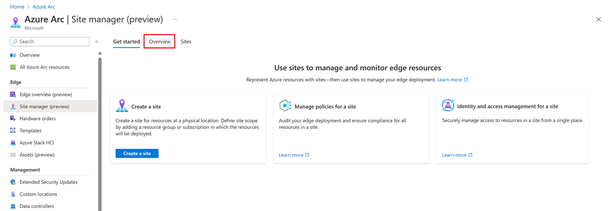
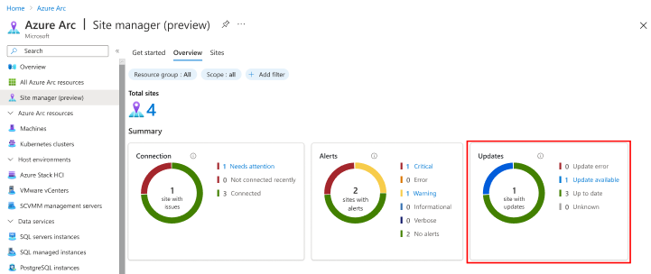
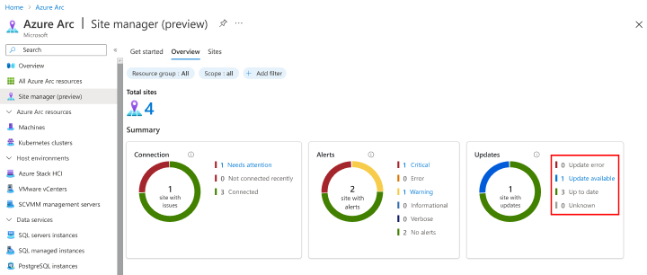
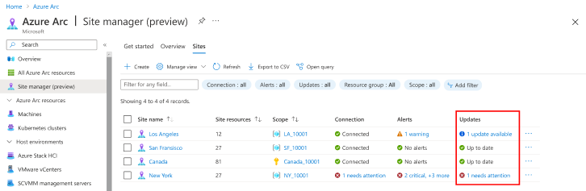
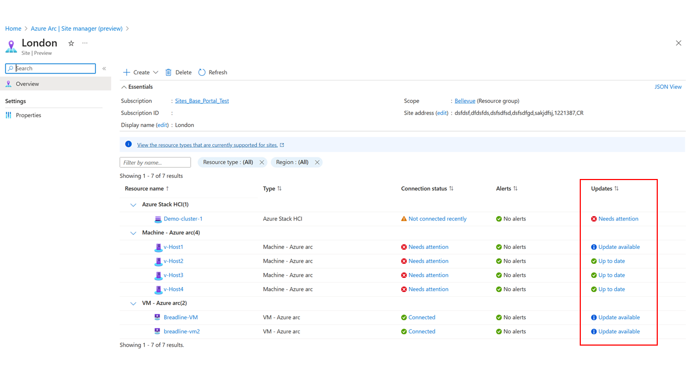

# How to view update status for an Arc Site

This article details how to view update status for an Arc Site, which reflects the status for the overall site and enables the ability to view the update status for support resources as well. The status of an overall site is based upon the underlying resources.

## Prerequisites

* Azure portal Access
* Internet Connectivity
* Subscription
* Resource Group or Subscription with at least one compatible resource type for Site that reflects and supports update status
* A site created for the associated resource group or subscription

## Update status colors and meanings

* If the color in the portal is red, this means **Needs Attention**
* If the color in the portal is blue, this means **Update Available**
* If the color in the portal is yellow, this means **Update In Progress**
* If the color in the portal is green, this means **Up to Date**

## View update status: site

To view update status for an Arc site as a whole, the below steps can be followed from the main page of Azure Arc site manager. For this example, two sites have already been created, a **London** site and a **California** site. 

1. From Azure Arc site manager, navigate to the **Overview** page. 

2. In the **Overview** page, the update statuses of the sites are shown below. This is the update status of resources aggregated by sites. In the example below, this indicates that one site is **up to date** and one site **needs attention**

3. To understand which site is **up to date** and which site **needs attention**, select either the **sites** tab or the blue colored status text to be directed to the **sites** page.

4. The **sites** page will appear and show the top-level status for each site, this reflects the most important status for the site. 

## View update status: resource

1. Navigate to the main **site manager** page in **Azure Arc** and then to the **sites** tab at the top of Azure Arc site manager. 

2. Navigate next to the **sites** tab, view the top-level status for each site, this tab reflects the most important status for the site. To see resource status, select this. For this example, **London's** update status is clicked.

3. Finally, the update status for each resource within **London** is visible, including the resource that had resulted in the top-level most important status. Which for **London** is **needs attention**

