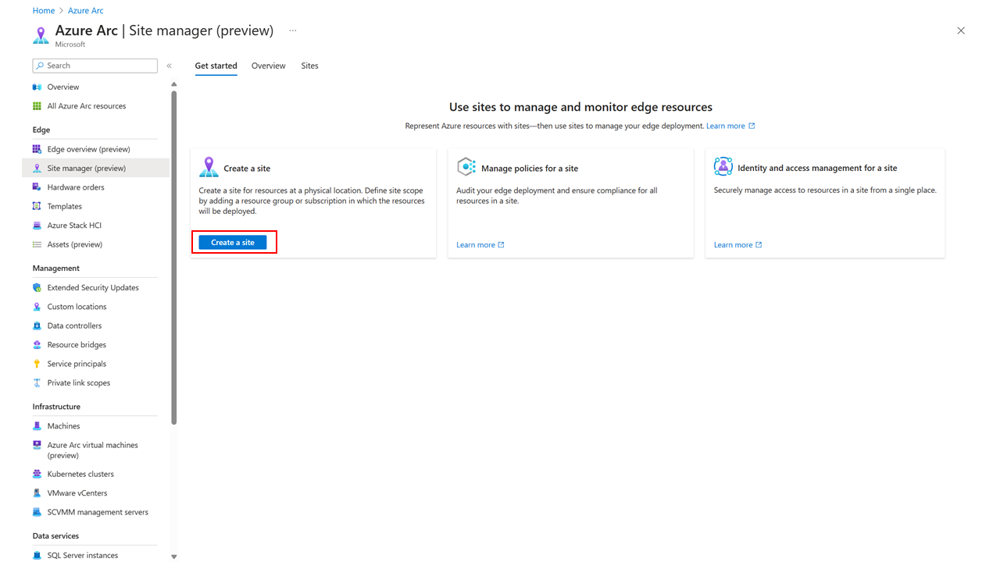
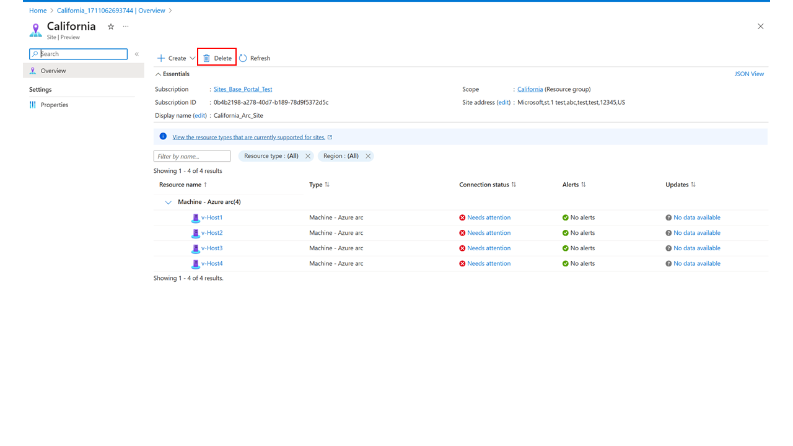

  
# Quickstart: Creating a site in Azure Arc site manager
 

The purpose of this quickstart is to enable starting with Azure Arc site manager and guides on how to create a initial site for resources currently grouped within a single resource group. In this quickstart you will create your first site. Once you create your first Arc site, you will be ready to view your resources within Arc, and conduct actions that depend on the specific resources, such as viewing Inventory, Connectivity status, Updates, and Alerts.

For current status on which resources support what functions within Arc sites, please view the [Azure Arc site manager overview](https://learn.microsoft.com/en-us/products/azure-arc/site-manager/overview).

Additionally, if you don't have a service subscription, create a free trial account in Azure [here](https://azure.microsoft.com/en-us/free/).

## Prerequisites

* Azure Portal Access
* Internet Connectivity
* Subscription
* Resource Group or Subscription with at least 1 compatible resource type for Site (note: it will be beneficial to try to name the resource group a similar name to the real site function, for the example of this article, the resource group will be named "California")

## Open Azure Arc site manager

Navigate to Azure Arc site manager the via "Azure Arc" [pane](https://ms.portal.azure.com/#blade/Microsoft_Azure_HybridCompute/AzureArcCenterBlade) in Azure in which "Site manager" will be displayed on the left side. 

Alternatively, you can also search for "Azure Arc site manager" in the Azure Portal or "Sites - Azure Arc" using terms such as "site", "Arc Site", "site manager" and so on.

Once you locate "Azure Arc site manager", click to open the main page of Azure Arc site manager which will appear as shown below (note: this page is subject to change, may not match exactly as captured below)

## Create your site

1. Click the blue box icon that says "Create a site"

2. Fill in the details for your first site. While these details may change, at the time of this article the required details are:
    * Site scope: subscription or resource group
     *Note:* The scope can be defined only at the time of creating a site and cannot be modified later. By defining the scope for a site, all the resources in the scope can be viewed and managed from site manager.
    * Site name: custom name for site
    * Display name: custom display name for site
    * Subscription: subscription for the site to be created under
    * Address: Physical address for a site
3. Once these details are provided, click "Review + create" and you will be brough to a summary page to review and confirm the site details prior to creation.

4. Click "Create" to create your site.

## View and Delete your newly created site

1. Navigate back to the main "site manager" page in "Azure Arc" and then to the "Sites" tab at the top of Azure Arc site manager. 

2. Here you should find your newly created site. [Note: For demo purposes, the image contains the site "London" as well to show how multiple sites will be displayed]

3. To manage your site, you can click the site to navigate to the specific site’s resource page and perform the delete action. If you wish to delete your site, you can also do so from within the created site.

    
    *Note:* Deleting a site does not affect the resources or the resource group and subscription in its scope. After a site is deleted, the resources of that site cannot be viewed or managed from site manager.
    *Note:* A new site can be created for the resource group or the subscription after the original site is deleted.

## Related content

- [Azure Arc](https://azure.microsoft.com/en-us/products/azure-arc/)
