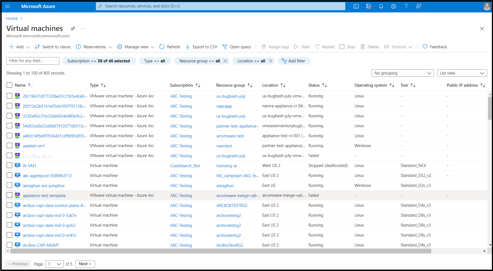

# Quickstart: Create a virtual machine on VMware vCenter using Azure Arc

Once your administrator has connected a VMware vCenter to Azure, represented VMware vCenter resources in Azure, and provided you permissions on those resources, you'll be able to create a virtual machine.

## Prerequisites

- An Azure subscription and resource group where you have Arc VMware VM contributor role

- A resourcepool resource on which you have Arc Private Cloud Resource User Role

- A virtual machine template resource on which you have Arc Private Cloud Resource User Role

- (Optional) A virtual network resource on which you have Arc Private Cloud Resource User Role

## How to create a VM in Azure portal

1. Go to [private preview portal](https://aka.ms/AzureArcVM). You'll see the new unified virtual machine browse experience that also includes Arc VMs.

    

1. Click on **+Add**

1. Select **Azure Arc machine** from the drop-down.

1. Select the **Subscription** and **Resource group** where you want to deploy the VM

1. Provide the **Virtual machine name**

1. Select a **Custom location** that your administrator has shared with you.

1. If multiple kinds of VMs are supported, select ***VMware***  as the **Virtual machine kind**.

1. Pick the **Resource pool/cluster/host** into which the VM should be deployed.

1. Pick the **Template** based on which the VM will be created.

1. You can optionally chose to **Override the template defaults** for  **CPU Cores** and **Memory**.

1. If you picked a Windows template, you can also provide a **Username**, **Password** for the **Administrator account**.

1. You can optionally change the disks configured in the template. You can add more disks or update existing disks. These disks will be created on the default datastore per the VMWare vCenter storage policies.

1. You can optionally change the network interfaces configured in the template. You can add Network interface cards or update existing NICs. You can also change the network that this NIC will be attached to provided you have appropriate permissions to the network resource.

1. You can optionally add tags to the VM resource.

1. Finally click create after reviewing all the properties.

1. The VM should be provisioned in a few minutes.

## Next Steps

- [Perform operations on VMware VMs in Azure](manage-vmware-vms-in-azure.md)
