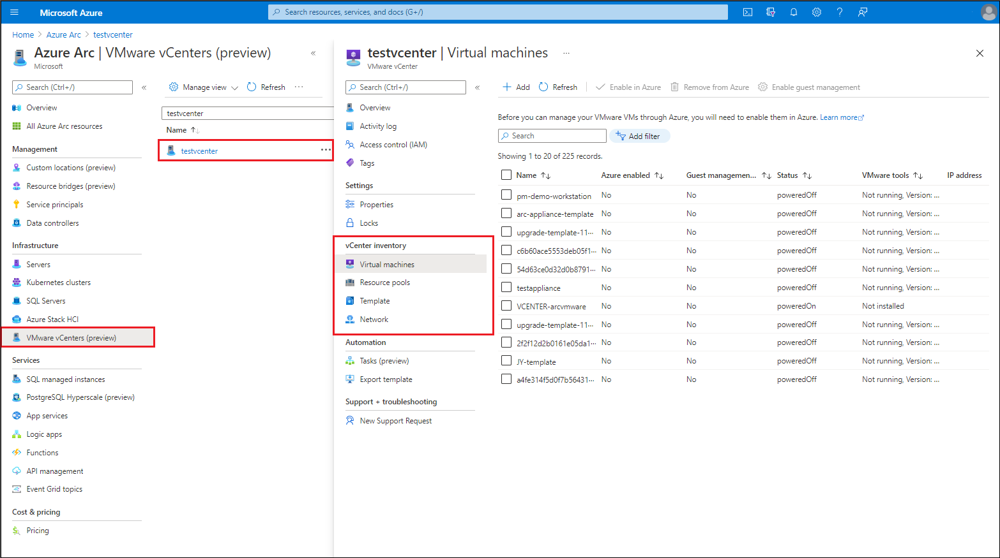

# Remove your VMware vCenter  environment from Azure Arc

In this article, you'll learn how to cleanly remove your VMware vCenter environment from Azure Arc-enabled VMware vSphere. For VMware vSphere environments that you no longer want to manage with Azure Arc-enabled VMware vSphere, follow the steps in the article to:

1. Remove guest management from VMware virtual machines
2. Remove your VMware vCenter environment from Azure Arc
3. Remove Arc resource bridge related items in your vCenter

## 1. Remove guest management from VMware virtual machines

To prevent continued billing of Azure management services after you remove the vSphere environment from Azure Arc, you must first cleanly remove guest management from all Arc-enabled VMware vSphere virtual machines where it was enabled.
When you enable guest management on Arc-enabled VMware vSphere virtual machines, the Arc connected machine agent is installed on them. Once guest management is enabled, you can install VM extensions on them and use Azure management services like the Log Analytics on them.
To cleanly remove guest management, you must follow the steps below to remove any VM extensions from the virtual machine, disconnect the agent, and uninstall the software from your virtual machine. It's important to complete each of the three steps to fully remove all related software components from your virtual machines.

### Step 1: Remove VM extensions

If you have deployed Azure VM extensions to an Azure Arc-enabled VMware vSphere VM, you must uninstall the extensions before disconnecting the agent or uninstalling the software. Uninstalling the Azure Connected Machine agent doesn't automatically remove extensions, and they won't be recognized if you late connect the VM to Azure Arc again.
Uninstall extensions using following steps:

1. Go to [Azure Arc center in Azure portal](https://portal.azure.com/#blade/Microsoft_Azure_HybridCompute/AzureArcCenterBlade/overview)

2. Select **VMware vCenters**.

3. Search and select the vCenter you want to remove from Azure Arc.

    

4. Select **Virtual machines** under **vCenter inventory**.

5. Search and select the virtual machine where you have Guest Management enabled.

6. Select **Extensions**.

7. Select the extensions and select **Uninstall**

### Step 2: Disconnect the agent from Azure Arc

Disconnecting the agent clears the local state of the agent and removes agent information from our systems. To disconnect the agent, sign-in and run the following command as an administrator/root account on the virtual machine.

```powershell
    azcmagent disconnect --force-local-only
```

### Step 3: Uninstall the agent

#### For Windows virtual machines

To uninstall the Windows agent from the machine, do the following:

1. Sign in to the computer with an account that has administrator permissions.
2. In Control Panel, select Programs and Features.
3. In Programs and Features, select Azure Connected Machine Agent, select Uninstall, and then select Yes.
4. Delete the `C:\Program Files\AzureConnectedMachineAgent` folder

#### For Linux virtual machines

To uninstall the Linux agent, the command to use depends on the Linux operating system. You must have `root` access permissions or your account must have elevated rights using sudo.

- For Ubuntu, run the following command:

  ```bash
  sudo apt purge azcmagent
  ```

- For RHEL, CentOS, Oracle Linux run the following command:

    ```bash
    sudo yum remove azcmagent
    ```

- For SLES, run the following command:

     ```bash
    sudo zypper remove azcmagent
    ```

## 2. Remove your VMware vCenter environment from Azure Arc

You can remove your VMware vSphere resources from Azure Arc either using the deboarding script or manually.

### Remove VMware vSphere resources from Azure Arc using deboarding script

Use the deboarding script to do a full cleanup of all the Arc-enabled VMware resources. The script removes all the Azure resources, including vCenter, custom location, virtual machines, virtual templates, hosts, clusters, resource pools, datastores, virtual networks, Azure Resource Manager (ARM) resource of Appliance, and the appliance VM running on vCenter.

```powershell-interactive
[CmdletBinding()]
Param(
  [string] $vCenterId,
  [string] $AVSId,
  [string] $ApplianceConfigFilePath,
  [switch] $Force
)

$DeleteFailedThreshold = 20
$AVS_API_Version = "2022-05-01"

$logFile = Join-Path $PSScriptRoot "arcvmware-deboard.log"

function logText($msg) {
  $msgFull = "$(Get-Date -UFormat '%T') $msg"
  Write-Host $msgFull
  Write-Output $msgFull >> $logFile
}

function fail($msg) {
  $msgFull = @"
  $(Get-Date -UFormat '%T') Script execution failed with error: $msg
  $(Get-Date -UFormat '%T') Debug logs have been dumped to $logFile
  $(Get-Date -UFormat '%T') The script will terminate shortly
"@
  Write-Host -ForegroundColor Red $msgFull >> $logFile
  Write-Output $msgFull >> $logFile
  Start-Sleep -Seconds 5
  exit 1
}

if (!($PSBoundParameters.ContainsKey('vCenterId') -xor $PSBoundParameters.ContainsKey('AVSId'))) {
  fail "Please specify either vCenterId or AVSId, not both."
}


logText "Writing debug logs to $logFile"

logText "Installing az cli extensions for Arc"
az extension add --upgrade --name arcappliance
az extension add --upgrade --name k8s-extension
az extension add --upgrade --name customlocation
$vmware_ext_ver = az version --query 'extensions.connectedvmware' -o tsv 2>> $logFile
if ($vmware_ext_ver -and [System.Version]$vmware_ext_ver -gt [System.Version]"0.1.12") {
  logText "Removing the connectedvmware extension and pinning it to 0.1.12"
  az extension remove --name connectedvmware --debug 2>> $logFile
}
az extension add --upgrade --name connectedvmware --version 0.1.12
az extension add --upgrade --name resource-graph

logText "Fetching some information related to the vCenter..."
if ($PSBoundParameters.ContainsKey('AVSId')) {
  $vCenterId = az rest --method get --url "$AVSId/addons/arc?api-version=$AVS_API_Version" --query "properties.vCenter" -o tsv --debug 2>> $logFile
  if ($null -eq $vCenterId) {
    fail "Unable to find vCenter ID for AVS $AVSId"
  }
  logText "vCenterId is $vCenterId"
}
else {
  $exists = az connectedvmware vcenter show --ids $vCenterId --debug 2>> $logFile
  if ($null -eq $exists) {
    fail "Unable to find vCenter ID $vCenterId"
  }
}

$customLocationID = az resource show --ids $vCenterId --query extendedLocation.name -o tsv --debug 2>> $logFile
$customLocation = az resource show --ids $customLocationID --debug 2>> $logFile | ConvertFrom-Json

if ($null -ne $customLocation) {
  $clusterExtensionIds = $customLocation.properties.clusterExtensionIds
  $applianceId = $customLocation.properties.hostResourceId
}

$otherCustomLocationsInAppliance = $(az graph query -q @"
  Resources
  | where type =~ 'Microsoft.ExtendedLocation/customLocations'
  | where id !~ '$customLocationID'
  | where properties.hostResourceId =~ '$applianceId'
  | project id
"@.Replace("`r`n", " ").Replace("`n", " ") --debug 2>> $logFile | ConvertFrom-Json).data.id

$resourceTypes = [PSCustomObject]@(
  @{ Type = "Microsoft.ConnectedVMwareVsphere/VirtualMachines"; InventoryType = "VirtualMachine"; AzSubCommand = "vm"; AzArgs = @("--retain") },
  @{ Type = "Microsoft.ConnectedVMwareVsphere/VirtualMachineTemplates"; InventoryType = "VirtualMachineTemplate"; AzSubCommand = "vm-template" },
  @{ Type = "Microsoft.ConnectedVMwareVsphere/Hosts"; InventoryType = "Host"; AzSubCommand = "host" },
  @{ Type = "Microsoft.ConnectedVMwareVsphere/Clusters"; InventoryType = "Cluster"; AzSubCommand = "cluster" },
  @{ Type = "Microsoft.ConnectedVMwareVsphere/ResourcePools"; InventoryType = "ResourcePool"; AzSubCommand = "resource-pool" },
  @{ Type = "Microsoft.ConnectedVMwareVsphere/Datastores"; InventoryType = "Datastore"; AzSubCommand = "datastore" },
  @{ Type = "Microsoft.ConnectedVMwareVsphere/VirtualNetworks"; InventoryType = "VirtualNetwork"; AzSubCommand = "virtual-network" }
)

foreach ($resourceType in $resourceTypes) {
  $resourceIds = @()
  $skipToken = $null
  $query = @"
( 
  Resources
  | where type =~ '$($resourceType.Type)'
  | where properties.vCenterId =~ '$vCenterId'
  | project id=tolower(id)
  | union (
    ConnectedVMwareVsphereResources
    | where type =~ 'Microsoft.ConnectedVMwareVsphere/VCenters/InventoryItems' and kind =~ '$($resourceType.InventoryType)'
    | where id startswith '$vCenterId/InventoryItems'
    | where properties.managedResourceId != ''
    | extend id=tolower(tostring(properties.managedResourceId))
    | project id
  )
) | distinct id
"@.Replace("`r`n", " ").Replace("`n", " ")
  logText "Searching $($resourceType.Type)..."
  $deleteFailed = @()
  while ($true) {
    if ($skipToken) {
      $page = az graph query --skip-token $skipToken -q $query --debug 2>> $logFile | ConvertFrom-Json
    }
    else {
      $page = az graph query -q $query --debug 2>> $logFile | ConvertFrom-Json
    }
    $page.data | ForEach-Object {
      $resourceIds += $_.id
    }
    if ($null -eq $page.skip_token) {
      break
    }
    $skipToken = $page.skip_token
  }
  logText "Found $($resourceIds.Count) $($resourceType.Type)"

  $azArgs = $resourceType.AzArgs
  if ($Force) {
    $azArgs = @("--force")
  }
  $width = $resourceIds.Count.ToString().Length
  for ($i = 0; $i -lt $resourceIds.Count; $i++) {
    $resourceId = $resourceIds[$i]
    logText $("({0,$width}/$($resourceIds.Count)) Deleting $resourceId" -f $($i + 1))
    az connectedvmware $resourceType.AzSubCommand delete --debug --yes --ids $resourceId $azArgs 2>> $logFile
    if ($LASTEXITCODE -ne 0) {
      logText "Failed to delete $resourceId"
      $deleteFailed += $resourceId
    }
    if ($deleteFailed.Count -gt $DeleteFailedThreshold) {
      fail @"
  Failed to delete $($deleteFailed.Count) resources. Skipping the deletion of the rest of the resources in the vCenter.
  The resource ID of these resources are:
`t$($deleteFailed -join "`n`t")

  Skipping vCenter deletion.
"@
    }
  }
}

if ($deleteFailed.Count -gt 0) {
  fail @"
  Failed to delete $($deleteFailed.Count) resources. The resource ID of these resources are:
`t$($deleteFailed -join "`n`t")

  Skipping vCenter deletion.
"@
}

Write-Host ""
logText "Successfully deleted all the resources in the vCenter"
logText "Deleting the vCenter: $vCenterId"
$azArgs = @()
if ($Force) {
  $azArgs = @("--force")
}
az connectedvmware vcenter delete --debug --yes --ids $vCenterId $azArgs 2>> $logFile
if ($LASTEXITCODE -ne 0) {
  fail "Failed to delete $vCenterId"
}
if ($PSBoundParameters.ContainsKey('AVSId')) {
  logText "Deleting the arc addon for the AVS $AVSId"
  az rest --method delete --debug --url "$AVSId/addons/arc?api-version=$AVS_API_Version" 2>> $logFile
  if ($LASTEXITCODE -ne 0) {
    fail "Failed to delete $AVSId/addons/arc"
  }
}

function extractPartsFromID($id) {
  $id -match "/+subscriptions/+([^/]+)/+resourceGroups/+([^/]+)/+providers/+([^/]+)/+([^/]+)/+([^/]+)"
  return @{
    SubscriptionId = $Matches[1]
    ResourceGroup  = $Matches[2]
    Provider       = $Matches[3]
    Type           = $Matches[4]
    Name           = $Matches[5]
  }
}

if ($null -ne $clusterExtensionIds -and $clusterExtensionIds.Count -gt 1) {
  logText "Skipping the deletion of custom location and appliance because there are multiple cluster extensions enabled in the custom location"
  logText "The cluster extension IDs are:"
  logText "  $($clusterExtensionIds -join "`n  ")"
  exit 0
}
if ($null -eq $customLocation) {
  logText "The custom location '$customLocationID' is not found. Skipping the deletion of the custom location."
}
else {
  logText "Deleting the custom location: $customLocationID"
  $clInfo = extractPartsFromID $customLocationID
  az customlocation delete --debug --yes --subscription $clInfo.SubscriptionId --resource-group $clInfo.ResourceGroup --name $clInfo.Name 2>> $logFile
  # The command above is returning error when the cluster is not reachable, so $LASTEXITCODE is not reliable.
  # Instead, check if resource is not found after delete, else throw error.
  $cl = az resource show --ids $customLocationID --debug 2>> $logFile
  if ($cl) {
    fail "Failed to delete $customLocationID"
  }
}
if ($otherCustomLocationsInAppliance.Count -gt 0) {
  logText "Skipping the deletion of the appliance because there are other custom locations in the appliance"
  logText "The custom location IDs of these custom locations are:"
  logText "  $($otherCustomLocationsInAppliance -join "`n  ")"
  exit 0
}

if ($PSBoundParameters.ContainsKey('ApplianceConfigFilePath')) {
  logText "Deleting the appliance: $applianceId"
  az arcappliance delete vmware --debug --yes --config-file $ApplianceConfigFilePath 2>> $logFile
  if ($LASTEXITCODE -ne 0) {
    fail "Failed to delete $applianceId"
  }
}
else {
  logText "Skipping the deletion of the appliance VM on the VCenter because the appliance config file path is not provided"
  logText "Just deleting the ARM resource of the appliance: $applianceId"
  az resource delete --debug --ids $applianceId 2>> $logFile
  if ($LASTEXITCODE -ne 0) {
    fail "Failed to delete $applianceId"
  }
}
logText "Cleanup Complete!"
```
#### Run the script
To run the deboarding script, follow these steps:

##### Windows
1. Open a PowerShell window as an Administrator and go to the folder where you've downloaded the PowerShell script.

   >[!Note]
   >On Windows workstations, the script must be run in PowerShell window and not in PowerShell Integrated Script Editor (ISE), as PowerShell ISE doesn't display the input prompts from Azure CLI commands. If the script is run on PowerShell ISE, it can appear as though the script is stuck while it's waiting for input.

2. Run the following command to allow the script to run because it's an unsigned script. (If you close the session before you complete all the steps, run this command again for the new session.)

```powershell-interactive
Set-ExecutionPolicy -Scope Process -ExecutionPolicy Bypass 
```
3. Run the script.

```powershell-interactive
./arcvmware-deboard.ps1
```

#### Inputs for the script

**-vCenterId**
The Azure resource ID of the VMware vCenter resource. For example, /subscriptions/204898ee-cd13-4332-1111-88ca5c11111c/resourceGroups/Synthetics/providers/Microsoft.ConnectedVMwarevSphere/VCenters/vcenterresource

**-AVSId**
The Azure resource ID of the AVS instance. Specifying vCenterId or AVSId is mandatory.

**-ApplianceConfigFilePath (optional)**
Path to kubeconfig, output from deploy command. Providing applianceconfigfilepath will also delete the appliance VM running on the vCenter.

**-Force**
Using Force flag will delete all the Azure resources without reaching Resource Bridge. Use this option if Resource Bridge VM isn't in running state.  

### Remove VMware vSphere resources from Azure manually

If you aren't using the deboarding script, follow these steps to remove the VMware vSphere resources manually.

>[!NOTE]
>When you enable VMware vSphere resources in Azure, an Azure resource representing them is created. Before you can delete the vCenter resource in Azure, you must delete all the Azure resources that represent your related vSphere resources.

1. Go to [Azure Arc center in Azure portal](https://portal.azure.com/#blade/Microsoft_Azure_HybridCompute/AzureArcCenterBlade/overview)

2. Select **VMware vCenters**.

3. Search and select the vCenter you remove from Azure Arc.

4. Select **Virtual machines** under **vCenter inventory**.

5. Select all the VMs that have **Azure Enabled** value as **Yes**.

6. Select **Remove from Azure**.

    This action will only remove these resource representations from Azure. The resources will continue to remain in your vCenter. 

7. Perform the steps 4, 5, and 6 for **Resources pools/clusters/hosts**, **Templates**, **Networks**, and **Datastores**

8. Once the deletion is complete, select **Overview**.

9. Note the **Custom location** and the **Azure Arc Resource bridge** resource in the **Essentials** section.

10. Select **Remove from Azure** to remove the vCenter resource from Azure.

11. Go to the **Custom location** resource and click **Delete**

12. Go to the **Azure Arc Resource bridge** resource and click **Delete**

At this point, all your Arc-enabled VMware vSphere resources are removed from Azure.

## 3. Remove Arc resource bridge related items in your vCenter

During onboarding, to create a connection between your VMware vCenter and Azure, an Azure Arc resource bridge is deployed in your VMware vSphere environment. As the last step, you must delete the resource bridge VM and the VM template created during the onboarding.

You can find both the virtual machine and the template on the resource pool/cluster/host that you provided during [Azure Arc-enabled VMware vSphere onboarding](quick-start-connect-vcenter-to-arc-using-script.md).

## Next steps

- [Connect the vCenter to Azure Arc again](quick-start-connect-vcenter-to-arc-using-script.md)
