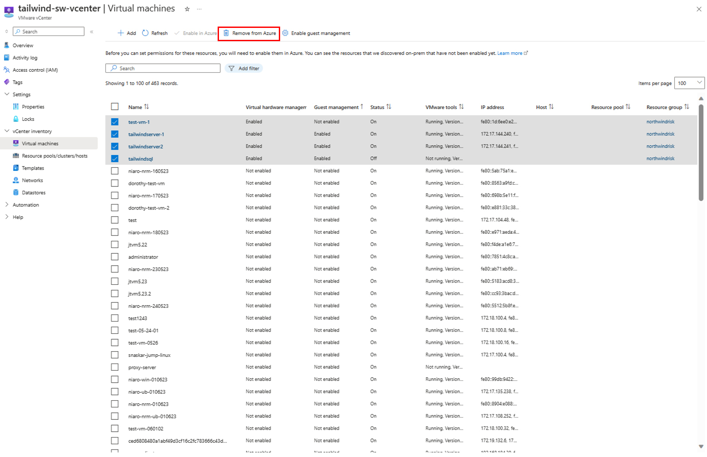
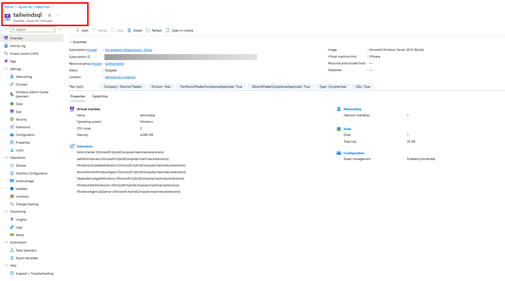

# Switch to the new preview version

On August 21, 2023, we rolled out major changes to Azure Arc-enabled VMware vSphere preview. By switching to the new preview version, you can use all Azure management services that’s available for Arc-enabled Servers.  

> [!NOTE]
> If you're a new Arc-enabled VMware vSphere (preview) customer, you will be able to leverage the new capabilities by default. Click [here](quick-start-connect-vcenter-to-arc-using-script.md) to know how to get started. 

## Existing preview customer  

If you are an existing Azure Arc-enabled VMware customer, for VMs that are Azure-enabled, follow the steps listed below to switch to the new preview version. If you had enabled guest management on any of the VMs, remove [VM extensions](/azure/azure-arc/vmware-vsphere/remove-vcenter-from-arc-vmware#step-1-remove-vm-extensions), and [disconnect agents](/azure/azure-arc/vmware-vsphere/remove-vcenter-from-arc-vmware#step-2-disconnect-the-agent-from-azure-arc) and proceed to the next steps.  

1. From your browser, go to the vCenters blade on [Azure Arc Center](https://ms.portal.azure.com/#view/Microsoft_Azure_HybridCompute/AzureArcCenterBlade/~/overview) and select the vCenter resource. 

2. Select all the virtual machines that are Azure enabled with the older preview version.  

3. After selecting all the virtual machines, select “Remove from Azure” option.  

    

4. After the removal operation is completed, enable the same resources again in Azure.  

5. Once the resources are re-enabled, the VMs are auto switched to the new preview version.  The VM resources will now be represented as Machine-Azure Arc (VMware).  

    

 
## Next steps

