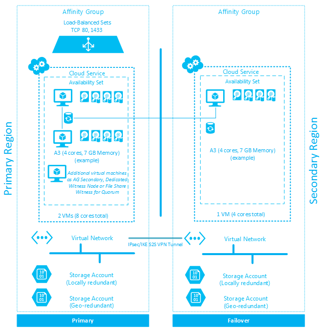

<properties 
   pageTitle="Multi-Site Data Tier (Azure Architecture Patterns)" 
   description="The Multi-Site Data Tier pattern is part of the Foundation area, which is described extensively in the CPIF Architecture document." 
   services="" 
   documentationCenter="" 
   authors="arynes" 
   manager="fredhar" 
   editor=""/>

<tags
   ms.service="cloud-services"
   ms.devlang="multiple"
   ms.topic="article"
   ms.tgt_pltfrm="na"
   ms.workload="multiple" 
   ms.date="03/25/2015"
   ms.author="arynes"/>

# Multi-Site Data Tier (Azure Architecture Patterns)

The [Cloud Platform Integration Framework (CPIF)](azure-architectures-cpif-overview.md) provides workload integration guidance for onboarding applications into a Microsoft Cloud Solution. 

CPIF describes how organizations, customers and partners should design and deploy Cloud-targeted workloads utilizing the hybrid cloud platform and management capabilities of Azure, System Center and Windows Server. 

The **Multi-Site Data Tier** pattern is part of the **Foundation** area, which is described extensively in the CPIF Architecture document. 

## Multi-Site Data Tier

The Multi-Site Data Tier design pattern details the Azure features and services required to deliver data tier services that can provide predictable performance and high availability across geographic boundaries. For the purposes of this design pattern a data tier is defined as a tier of service providing traditional data platform services in either an isolated manner or as part of a multi-tiered application.  Within this pattern, load balancing of the data tier is provided both locally within the region and across regions.   

Introduced with SQL Server 2012, AlwaysOn Availability Groups is a high-availability and disaster-recovery feature that is fully supported on Azure Infrastructure Services.  Detailed information and the official support announcement for AlwaysOn Availability Groups on Windows Azure Infrastructure Service can be found in the article AlwaysOn Availability Groups.   

This document provides an architectural overview of a Multi-Site Data Tier in Azure utilizing SQL AlwaysOn Availability Groups. With an optional read-only secondary node in an additional Azure datacenter for additional functionality and disaster recovery. Using SQL AlwaysOn in Azure provides a high-availability data tier that can be consumed by web or application tiers.  

While this document focuses on architectural patterns and practices, full deployment guidance can be found in the official tutorials, which outline the configuration of AlwaysOn Availability Groups in Azure and the configuration of the AlwaysOn Availability Group Listener. 

## Architectural Pattern Overview 

This document describes a pattern for providing access to Microsoft SQL Server content over multiple geographies for the purposes of availability and redundancy.  Critical services are illustrated below without attention to the application or web tier that will access the data itself.  The diagram below is a simple illustration of the relevant services and how they are used as part of this pattern.   

Each of the main service areas are outlined in more detail following the diagram. 
 

##  Additional Resources
[Load Balanced Data Tier (pdf)](https://gallery.technet.microsoft.com/Cloud-Platform-Integration-dfb09e41)

## See Also
[CPIF Architecture](https://gallery.technet.microsoft.com/Cloud-Platform-Integration-bd1e434a) 

[Global Load Balanced Web Tier](https://gallery.technet.microsoft.com/Cloud-Platform-Integration-2c3c663a) 

[Hybrid Networking](https://gallery.technet.microsoft.com/Cloud-Platform-Integration-5e401f38)

[Azure Search Tier](https://gallery.technet.microsoft.com/Cloud-Platform-Integration-e581d65d) 

[Batch Processing Tier](https://gallery.technet.microsoft.com/Cloud-Platform-Integration-0bc3f8b1)
