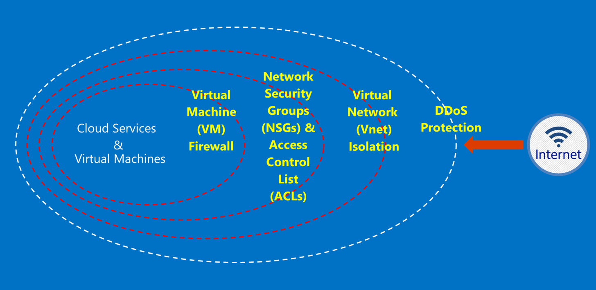

# What is Azure Australia

In 2014, Azure was launched in Australia, with two regions; Australia East (Sydney) and Australia Southeast (Melbourne). In April 2018 we two new Azure Regions located in Canberra – Australia Central and Australia Central 2 launched. The Australia Central and Australia Central 2 regions are purposely designed to meet the needs of government and critical national infrastructure, and offer specialised connectivity and flexibility so you can locate your systems beside the cloud, with levels of security and resilience only expected of Secret-classified networks. Azure Australia is a platform for the digital transformation of government and critical national infrastructure – and the only mission-critical cloud available in Australia designed specifically for those needs.

There are specific Australian Government requirements for connecting to, consuming, and operating within [Microsoft Azure Australia](https://azure.microsoft.com/en-us/global-infrastructure/australia/) for Australian Government data and systems. The resources on this page also provide general guidance applicable to all customers with a specific focus on secure configuration and operation.

Refer to the Australia page of the [Microsoft Service Trust Portal](https://aka.ms/au-irap) for current information on the Azure Australia Information Security Registered Assessor (IRAP) Assessments, certification and inclusion on the Certified Cloud Services List (CCSL). On the Australia page you will also find other Microsoft advice specific to Government and Critical Infrastructure providers.

## Principles for securing customer data in Azure Australia

Azure Australia provides a range of features and services that you can use to build cloud solutions to meet your regulated/controlled data needs. A compliant customer solution is nothing more than the effective implementation of out-of-the-box Azure Australia capabilities, coupled with a solid data security practice.

When you host a solution in Azure Australia, Microsoft handles many of these requirements at the cloud infrastructure level.

The following diagram shows the Azure defence-in-depth model. For example, Microsoft provides basic cloud infrastructure DDoS, along with customer capabilities such as security appliances or premium DDoS services for customer-specific application needs.

This article outlines the foundational principles for securing your services and applications, with guidance and best practices on how to apply these principles. In other words, how customers should make smart use of Azure Australia to meet the obligations and responsibilities that are required for a solution that handles Government sensitive and classified information.

## Next Steps

There are two categories of documentation provided for Australian Government agencies migrating to Azure.

### Securing your Azure environment

Identity, role-based access control, data protection through encryption and rights management, and effective monitoring and configuration control are key elements that you need to implement. In this section there are a series of articles explaining the built-in capabilities of Azure and how they relate to the ISM and ASD Essential 8.

Start with [Securing your data in Azure](securing-your-data.md)

### Building a Gateway in Azure

Another key step for Government agencies is the establishment of perimeter security capabilities. These capabilities are generally called Secure Internet Gateways (SIG) and when using Azure it is your responsibility to ensure these protections are in place. Microsoft does not operate a SIG; however, with the combination of our Edge services that protect all customers, and specific services deployed within your Azure environment you can operate an equivalent capability.

Start with
[Gateway auditing, logging and visibility](gateway-logging-auditing-visibility.md).