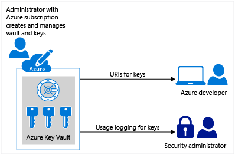

# Azure Key Vault in Azure Australia

The secure storage of cryptographic keys and management of the cryptographic key lifecycle are critical elements within cryptographic systems.  The service that provides this capability in Azure is the Azure Key Vault. Key Vault has been IRAP security accessed and ACSC certified for PROTECTED.  This article outlines the key considerations when using Key Vault to comply with the Australian Signals Directorate's (ASD) [Information Security Manual Controls](https://acsc.gov.au/infosec/ism/) (ISM).

Azure Key Vault is a cloud service that safeguards encryption keys and secrets. Because this data is sensitive and business critical, Key Vault enables secure access to key vaults, allowing only authorized users and applications. There are three main artifacts managed and controlled by Key Vault:

- keys
- secrets
- certificates

This article will focus on management of keys using Key Vault.

*Diagram 1 – Azure Key Vault*

## Key design considerations

### Deployment options

There are two options for creating Azure Key Vaults. Both options use the nCipher nShield family of Hardware Security Modules (HSM), are Federal Information Processing Standards (FIPS) validated, and are approved to store keys in PROTECTED environments. The options are:

- **Software-protected vaults:** FIPS 140-2 level 1 validated. Keys stored on an HSM. Encryption and decryption operations are performed in compute resources on Azure.
- **HSM-protected vaults:** FIPS 140-2 level 2 validated. Keys stored on an HSM. Encryption and decryption operations are performed on the HSM.

Key Vault supports Rivest-Shamir-Adleman (RSA) and Elliptic Curve Cryptography (ECC) keys. The default is RSA 2048-bit keys but there is an advanced option for RSA 3072-bit, RSA 4096-bit, and ECC keys.  All keys meet the ISM controls, but Elliptic Curve keys are preferred.

### Resource operations

There are several personas involved in Azure Key Vault:

- **Key Vault administrator:** Manages the lifecycle of the vault
- **Key administrator:** Manages the lifecycle of keys in the vault
- **Developer/operator:** Integrate keys from the vault into applications and services
- **Auditor:** Monitor key usage and access
- **Applications:** Use keys to secure information

Azure Key Vault is secured with two separate interfaces:

- **Management Plane:** This plane deals with managing the vault and it secured by RBAC.
- **Data Plane:** This plane deals with managing and accessing the artifacts in the vault.  Secured using Key Vault access policy.

As required by the ISM, proper authentication and authorisation are required before a caller (a user or an application) before they can get access to key vault by either plane.

Azure RBAC has one built-in role for Key Vault, [Key Vault Contributor](https://docs.microsoft.com/azure/role-based-access-control/built-in-roles#key-vault-contributor), to control management of the Key Vaults. The creation of custom roles aligned to more granular roles for managing your Key Vaults is recommended.

>[!WARNING]
>When access to keys is enabled via Key Vault access policy then the user or application has that access to all keys in the key vault (for example, if a user has 'delete' access then they can delete all keys).  Therefore, multiple key vaults should be deployed to align with security domains/boundaries.

### Networking

You can configure Key Vault firewalls and virtual networks to control access to the data plane.  You can allow access to users or applications on specified networks while denying access to users or applications on all other networks. [Trusted services](https://docs.microsoft.com/azure/key-vault/key-vault-overview-vnet-service-endpoints#trusted-services) are an exception to this control if "Allow trusted services" is enabled.  The virtual networking control does not apply to the management plane.

Access to Key Vaults should be explicitly restricted to the minimum set of networks that have users or applications requiring access to keys.

### Bring Your Own Key (BYOK)

Key Vault supports BYOK.  BYOK enables users to import keys from their existing key infrastructures. The BYOK toolset supports the secure transfer and import of keys from an external HSM (for example, keys generated with an offline workstation) into Key Vault.

Go to the Microsoft Download Center and [download the Azure Key Vault BYOK toolset](https://www.microsoft.com/download/details.aspx?id=45345) for Australia. The package name to download and its corresponding SHA-256 package hash are:

|Package Name|SHA-256 Hash|
|---|---|
|KeyVault-BYOK-Tools-Australia.zip|CD0FB7365053DEF8C35116D7C92D203C64A3D3EE2452A025223EEB166901C40A|
|

### Key Vault auditing and logging

The ACSC requires Commonwealth entities to use the appropriate Azure services to undertake real-time monitoring and reporting on their Azure workloads.

Logging is enabled by enabling the **_"AuditEvent"_** diagnostic setting on Key Values.  Audit events will be logged to the specified storage account.  **_"RetentionInDays"_** period should be set according to the data retention policy.  [Operations](https://docs.microsoft.com/azure/key-vault/key-vault-logging#interpret) on both the management plane and data plane are audited and logged. The [Azure Key Vault solution in Azure Monitor](https://docs.microsoft.com/azure/azure-monitor/insights/azure-key-vault) can be used to review Key Vault AuditEvent logs.  A number of other Azure services can be used to process and distribute Key Vault AuditEvents.

### Key rotation

Storing keys in Key Vault provided a single point to maintain keys outside applications that enable keys to be updated without affecting the behaviour of the applications. Storing keys in Azure Key Vault enables various strategies for supporting key rotation:

- Manually
- Programmatically via APIs
- Automation Scripts (for example, using PowerShell and Azure Automation)

These options enable keys to be rotated on a periodic basis to satisfy compliance requirements or on an ad-hoc basis if there are concerns that keys may have been compromised.

#### Key rotation strategies

It is important to develop an appropriate key rotation strategy for keys which are stored in KeyVault.  Using the wrong key will lead to information being incorrectly decrypted, and losing keys can lead to the complete loss of access to information.  Examples of key rotation strategies for different scenarios include:

- **Inflight data:** volatile information is transmitted between 2 parties.  When a key is rotated then both parties must have a mechanism to synchronous retrieving the updated keys from the key vault.
- **Data as rest:** A party stores encrypted data and decrypts it in the future to use.  When a key is going to rotated then the data must be decrypted with the old key and then encrypted with the new, rotated key.  There are approaches to minimize the impact of the decrypt/encrypt process using key encrypting keys (see example).  Microsoft manages the majority of the process related to key rotation for Azure Storage (see…)
- **Access keys:**  a number of Azure services have access keys that can be stored in Key Vault (for example, CosmosDB).  The azure services have primary and secondary access keys.  It is important that both keys are not rotated at the same time.  Therefore, one key should be rotated then after a period and the key operation has been verified then the second key can be rotated.

### High availability

The ISM has several controls that relate to Business Continuity.
Azure Key Vault has multiple layers of redundancy with contents replicated within the region and to the secondary, [paired region](https://docs.microsoft.com/azure/best-practices-availability-paired-regions).

When the key vault is in a fail-over state, it is in read-only mode and will return to read-write mode the primary service is restored.

The ISM has several controls related to backup.  It is important to develop and execute appropriate backup/restore plans for vaults and their keys.

## Key lifecycle

### Key operations

Key Vault support the following operations on a key:

- **create:** Allows a client to create a key in Key Vault. The value of the key is generated by Key Vault and stored, and isn't released to the client. Asymmetric keys may be created in Key Vault.
- **import:** Allows a client to import an existing key to Key Vault. Asymmetric keys may be imported to Key Vault using a number of different packaging methods within a JWK construct.
- **update:** Allows a client with sufficient permissions to modify the metadata (key attributes) associated with a key previously stored within Key Vault.
- **delete:** Allows a client with sufficient permissions to delete a key from Key Vault.
- **list:** Allows a client to list all keys in a given Key Vault.
- **list versions:** Allows a client to list all versions of a given key in a given Key Vault.
- **get:** Allows a client to retrieve the public parts of a given key in a Key Vault.
- **backup:** Exports a key in a protected form.
- **restore:** Imports a previously backed up key.

There is a corresponding set of permissions that can be granted to users, service principals, or applications using Key Vault access control entries to enable them to execute key operations.

Key Vault has a soft delete feature to allow the recovery of deleted vaults and keys. By default, **_"soft delete"_** is not enabled, but once enabled, objects are held for 90 days (the retention period) while appearing to be deleted.  An additional permission **_"purge"_**, allows the permanent deletion of keys if the **_"Purge Protection"_** option is disabled.

Creating or importing an existing key creates a new version of the key.

### Cryptographic operations

Key Vault also supports cryptographic operations using keys:

- **sign and verify:** this operation is a "sign hash" or "verify hash". Key Vault does not support hashing of content as part of signature creation.
- **key encryption/wrapping:** this operation is used to protect another key.
- **encrypt and decrypt:** the stored key is used to encrypt or decrypt a single block of data

There is a corresponding set of permissions that can be granted to users, service principals, or applications using Key Vault access control entries to enable them to execute cryptographic operations.

There are three key attributes that can set to control whether a key is enabled and useable of cryptographic operations:

- **enabled**
- **nbf:** not before enabled before specified date
- **exp:** expiration date

## Storage and keys

Customer-managed keys are more flexibility and enable assess to and management of the keys to be controlled. They also enable auditing the encryption keys used to protect data.
There are three aspects to storage and keys stored in Key Vault:

- Key Vault managed storage account keys
- Azure Storage Service Encryption (SSE) for data at rest
- Managed disks and Azure Disk Encryption

Key Vault's Azure Storage account key management is an extension to Key Vault's key service that supports synchronization and regeneration (rotation) of storage account keys.  [Azure Storage integration with Azure Active Directory](https://docs.microsoft.com/azure/storage/common/storage-auth-aad) (preview) is recommended when released as it provides superior security and ease of use.
SSE uses two keys to manage encryption of data at rest:

- Key Encryption Keys (KEK)
- Data Encryption Keys (DEK)

While Microsoft manages the DEKs, SSE has an option to use customer-managed KEKs that can be stored in Key Vault. This enables the rotation of keys in Azure Key Vault as per the appropriate compliance policies. When keys are rotated, Azure Storage re-encrypts the Account Encryption Key for that storage account. This does not result in re-encryption of all data and there is no other action required.

SSE is used for managed disks but customer-managed keys are not supported.  Encryption of managed disks can be done using Azure Disk Encryption with customer-managed KEK keys in Key Vault.

## Next Steps

Review the article on [Identity Federation](identity-federation.md)

Review additional Azure Key Vault documentation and tutorials in the [Reference Library](reference-library.md)
