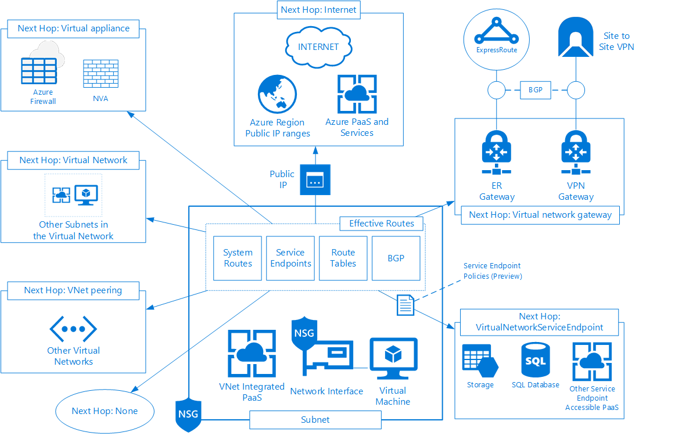

# Controlling egress traffic in Azure Australia

A fundamental component of securing ICT systems is controlling network traffic. Restricting communication to only the traffic necessary for a system to function reduces the potential for compromise. Visibility and control over the external systems that your applications and services communicate with helps detect compromised systems, and attempted or successful data exfiltration. This article provides information on how outbound (egress) network traffic works within Azure and provides recommendations for implementing network security controls for an internet connected system that aligns with the Australian Cyber Security Centre (ACSC) Consumer Guidance and the intent of the ACSC's Information Security Manual (ISM).

## Requirements

The overall security requirements for Commonwealth systems are defined in the ISM. To assist Commonwealth entities in implementing network security, the ACSC has published _ACSC Protect: Implementing Network Segmentation and Segregation_, and to assist with securing systems in Cloud environments the ACSC has published _Cloud Computing Security for Tenants_.

The ACSC documents outline the context for implementing network security and controlling traffic, and provide practical recommendations for network design and configuration.

The following key requirements for controlling egress traffic in Azure have been identified in the ACSC documents.

Description|Source
--------------- |------------------
**Implement Network Segmentation and Segregation**, for example, use an n-tier architecture, using host-based firewalls and network access controls to limit inbound and outbound network connectivity to only required ports and protocols.| [Cloud Computing for Tenants](https://acsc.gov.au/publications/protect/cloud-security-tenants.htm)
**Implement adequately high bandwidth, low latency, reliable network connectivity** between the tenant (including the tenant's remote users) and the cloud service to meet the tenant's availability requirements  | [ACSC Protect: Implementing Network Segmentation and Segregation](https://acsc.gov.au/publications/protect/network_segmentation_segregation.htm)
**Apply technologies at more than just the network layer**. Each host and network should be segmented and segregated, where possible, at the lowest level that can be practically managed. In most cases, this applies from the data link layer up to and including the application layer; however, in sensitive environments, physical isolation may be appropriate. Host-based and network-wide measures should be deployed in a complementary manner and be centrally monitored. Just implementing a firewall or security appliance as the only security measure is not sufficient. |[ACSC Protect: Implementing Network Segmentation and Segregation](https://acsc.gov.au/publications/protect/network_segmentation_segregation.htm)
**Use the principles of least privilege and need‐to‐know**. If a host, service, or network doesn't need to communicate with another host, service, or network, it should not be allowed to. If a host, service, or network only needs to talk to another host, service, or network on a specific port or protocol, it should be restricted to only those ports and protocols. Adopting these principles across a network will complement the minimisation of user privileges and significantly increase the overall security posture of the environment. |[ACSC Protect: Implementing Network Segmentation and Segregation](https://acsc.gov.au/publications/protect/network_segmentation_segregation.htm)
**Separate hosts and networks based on their sensitivity or criticality to business operations**. This may include using different hardware or platforms depending on different security classifications, security domains, or availability/integrity requirements for certain hosts or networks. In particular, separate management networks and consider physically isolating out-of-band management networks for sensitive environments. |[ACSC Protect: Implementing Network Segmentation and Segregation](https://acsc.gov.au/publications/protect/network_segmentation_segregation.htm)
**Identify, authenticate, and authorise access by all entities to all other entities**. All users, hosts, and services should have their access to all other users, hosts, and services restricted to only those required to perform their designated duties or functions. All legacy or local services which bypass or downgrade the strength of identification, authentication, and authorisation services should be disabled wherever possible and have their use closely monitored. |[ACSC Protect: Implementing Network Segmentation and Segregation](https://acsc.gov.au/publications/protect/network_segmentation_segregation.htm)
**Implement allow listing of network traffic instead of deny listing**. Only permit access for known good network traffic (traffic that is identified, authenticated, and authorised), rather than denying access to known bad network traffic (for example, blocking a specific address or service). Allow lists result in a superior security policy to deny lists, and significantly improve your capacity to detect and assess potential network intrusions. |[ACSC Protect: Implementing Network Segmentation and Segregation](https://acsc.gov.au/publications/protect/network_segmentation_segregation.htm)
**Defining an allow list of permitted websites and blocking all unlisted websites** effectively removes one of the most common data delivery and exfiltration techniques used by an adversary. If users have a legitimate requirement to access numerous websites, or a rapidly changing list of websites; you should consider the costs of such an implementation. Even a relatively permissive allow list offers better security than relying on deny lists, or no restrictions at all, while still reducing implementation costs. An example of a permissive allow list could be permitting the entire Australian subdomain, that is '*.au', or allowing the top 1,000 sites from the Alexa site ranking (after filtering Dynamic Domain Name System (DDNS) domains and other inappropriate domains).| [Australian Government Information Security Manual (ISM)](https://www.cyber.gov.au/ism)
|

This article provides information and recommendations on how network traffic leaving your Azure environment is controlled. It covers systems deployed in Azure using both Infrastructure as a Service (IaaS) and Platform as a Service (PaaS).

The [Gateway Ingress Traffic](gateway-ingress-traffic.md) article addresses network traffic entering your Azure environment and is the companion to this article for full network control coverage.

## Architecture

To appropriately control egress traffic, when you design and implement network security, you must first understand how egress network traffic works within Azure across both IaaS and PaaS. This section provides an overview of how outbound traffic generated by a resource hosted in Azure is processed, and the security controls available to restrict, and control that traffic.

### Architecture components

The architectural diagram shown here depicts the possible paths that network traffic can take when exiting a system that is deployed into a subnet in a virtual network. Traffic in a virtual network is managed and governed at a subnet level, with routing and security rules applying to the resources contained within. The components related to egress traffic are divided into Systems, Effective Routes, Next Hop types, Security Controls, and PaaS egress.

### Systems

Systems are the Azure resources and related components that generate outbound traffic within an IP subnet that is part of a virtual network.

| Component | Description |
| --- | ---|
|Virtual Network (VNet) | A VNet is a foundational resource within Azure that provides a platform and boundary for deploying resources and enabling communication. The VNet exists within an Azure Region and defines the IP Address Space and Routing boundaries for VNet integrated resources such as Virtual Machines.|
|Subnet | A subnet is an IP address range that is created within a VNet. Multiple subnets can be created within a VNet for network segmentation.|
|Network Interface| A network interface is a resource that exists in Azure. It is attached to a Virtual Machine and assigned a private, non-Internet routable IP address from the subnet that it is associated with. This IP address is dynamically or statically assigned through Azure Resource Manager.|
|Public IPs| A Public IP is a resource that reserves one of the Microsoft owned Public, Internet-Routable IP Addresses from the specified region for use within the virtual network. It can be associated with a specific Network Interface or PaaS resource, which enables the resource to communicate with the Internet, ExpressRoute and to other PaaS systems.|
|

### Routes

The path that egress traffic takes is dependent on the effective routes for that resource, which is the resultant set of routes determined by the combination of routes learnt from all possible sources and the application of Azure routing logic.

| Component | Description |
|--- | ---|
|System Routes| Azure automatically creates system routes and assigns the routes to each subnet in a virtual network. System routes cannot be created or removed, but some can be overridden with custom routes. Azure creates default system routes for each subnet, and adds additional optional default routes to specific subnets, or every subnet, when specific Azure capabilities are utilised.|
|Service Endpoints| Service endpoints provide a direct, private egress connection from a subnet to a specific PaaS capability. Service endpoints, which are only available for a subset of PaaS capabilities, provide increased performance and security for resources in a VNet accessing PaaS.|
|Route Tables| A route table is a resource in Azure that can be created to specify User-Defined Routes (UDRs) that can complement or override systems routes or routes learnt via Border Gateway Protocol. Each UDR specifies a network, a network mask, and a next hop. A route table can be associated to a subnet and the same route table can be associated to multiple subnets, but a subnet can only have zero or one route table.|
|Border Gateway Protocol (BGP)| BGP is an inter-autonomous system routing protocol. An autonomous system is a network or group of networks under a common administration and with common routing policies. BGP is used to exchange routing information between autonomous systems. BGP can be integrated into virtual networks through virtual network gateways.|
|

### Next hop types defined

Each route within Azure includes the network range and associated subnet mask and the next hop, which determines how the traffic is processed.

Next Hop Type | Description
---- | ----
**Virtual Network** | Routes traffic between address ranges within the address space of a virtual network. Azure creates a route with an address prefix that corresponds to each address range defined within the address space of a virtual network. If the virtual network address space has multiple addresses ranges defined, Azure creates an individual route for each address range. Azure automatically routes traffic between subnets within a VNet using the routes created for each address range.
**VNet peering** | When a virtual network peering is created between two virtual networks, a route is added for each address range of each virtual network to the virtual network it is peered to. Traffic is routed between the peered virtual networks in the same way as subnets within a virtual network.
**Virtual network gateway** | One or more routes with virtual network gateway listed as the next hop type are added when a virtual network gateway is added to a virtual network. The routes included are those that are configured within the local network gateway resource and any routes learnt via BGP.
**Virtual appliance** | A virtual appliance typically runs a network application, such as a firewall. The virtual appliance allows additional processing of the traffic to occur, such as filtering, inspection, or address translation. Each route with the virtual appliance hop type must also specify a next hop IP address.
**VirtualNetworkServiceEndpoint** | The public IP addresses for a specific service are added as routes to a subnet with a next hop of VirtualNetworkServiceEndpoint when a service endpoint is enabled. Service endpoints are enabled for individual services on individual subnets within a virtual network. The public IP addresses of Azure services change periodically. Azure manages the addresses in the route table automatically when the addresses change.
**Internet** | Traffic with a next hop of Internet will exit the virtual network and automatically be translated to a Public IP address either from a dynamic pool available in the associated Azure region, or by using a Public IP address configured for that resource. If the destination address is for one of Azure's services, traffic is routed directly to the service over Azure's backbone network, rather than routing the traffic to the Internet. Traffic between Azure services does not traverse the Internet, regardless of which Azure region the virtual network exists in, or which Azure region an instance of the Azure service is deployed in.
**None** | Traffic with a next hop of none is dropped. Azure creates system default routes for reserved address prefixes with none as the next hop type. Routes with a next hop of none can also be added using route tables to prevent traffic from being routed to specific networks.
|

### Security controls

Control | Description
----- | -----
**Network Security Groups (NSGs)** | NSGs control traffic into and out of virtual network resources in Azure. NSGs apply rules for the traffic flows that are permitted or denied, which includes traffic within Azure and between Azure and external networks such as on-premises or the Internet. NSGs are applied to subnets within a virtual network or to individual network interfaces.
**Azure Firewall** | Azure Firewall is a managed, cloud-based network security service that protects Azure virtual network resources. It is a fully stateful firewall as a service with built-in high availability and unrestricted cloud scalability. Azure Firewall can be configured with traditional network filtering rules based on IP addresses, protocols, and ports, but also supports filtering based on Fully Qualified Domain Names (FQDN), Service Tags and inbuilt Threat Intelligence.
**Network Virtual Appliance (NVA)** | Network Virtual Appliances are virtual machine media that can provide networking, security, and other functions to Azure. NVAs support network functionality and services in the form of VMs in virtual networks and deployments. NVAs can be used to address specific requirements, integrate with management and operational tools, or to provide consistency with existing products. Azure supports a broad list of third-party network virtual appliances including web application firewalls (WAF), firewalls, gateways/routers, application delivery controllers (ADC), and WAN optimizers.
**Service endpoint policies (Preview)** | Virtual network service endpoint policies allow you to filter virtual network traffic to Azure services, allowing only specific Azure service resources, over service endpoints. Endpoint policies provide granular access control for virtual network traffic to Azure services.
**Azure Policy** | Azure Policy is a service in Azure for creating, assigning, and managing policies. These policies use rules to control the types of resources that can be deployed and the configuration of those resources. Policies can be used to enforce compliance by preventing resources from being deployed if they do not meet requirements or can be used for monitoring to report on compliance status.
|

### PaaS egress

The majority of PaaS resources do not generate egress traffic, but either respond to inbound requests (such as an Application Gateway, Storage, SQL Database, etc.) or relay data from other resources (such as Service Bus and Azure Relay). The network communication flows between PaaS resources such as App Services to Storage or SQL Databases is controlled and contained by Azure and secured through identity and other resource configuration controls rather than network segmentation or segregation.

PaaS resources deployed into a virtual network receive dedicated IP addresses and are subject to any routing controls and NSGs in the same way as other resources in the virtual network. PaaS resources that do not exist within a virtual network will utilise a pool of IP addresses that are shared across all instances of the resource, which are either published through Microsoft documentation or can be determined through Azure Resource Manager.

## General guidance

To design and build secure solutions within Azure, it is critical to understand and control the network traffic so that only identified and authorised communication can occur. The intent of this guidance and the specific component guidance in later sections is to describe the tools and services that can be utilised to apply the principles outlined in the [ACSC Protect: Implementing Network Segmentation and Segregation](https://acsc.gov.au/publications/protect/network_segmentation_segregation.htm) across Azure workloads. This includes detailing how to create a virtual architecture for securing resources when it is not possible to apply the same traditional physical and network controls that are possible in an on-premises environment.

### Guidance

* Limit the number of egress points for virtual networks
* Override the system default route for all subnets that do not need direct outbound communication to the Internet
* Design and implement a complete network architecture to identify and control all ingress and egress points to Azure resources
* Consider utilising a Hub and Spoke Network Design for virtual networks as discussed in the Microsoft Virtual Data Centre (VDC) documentation
* Utilise products with inbuilt security capabilities for outbound connections to the Internet (for example, Azure Firewall, Network Virtual Appliances or Web Proxies)
* Use identity controls such as Role-Based Access, Conditional Access, and Multi-Factor Authentication (MFA) to limit network configuration privileges
* Implement Locks to prevent modification or deletion of key elements of the network configuration
* Deploy PaaS in a VNet integrated configuration for increased segregation and control
* Implement ExpressRoute for connectivity with on-premises networks
* Implement VPNs for integration with external networks
* Utilise Azure Policy to restrict the regions and resources to only those that are necessary for system functionality
* Utilise Azure Policy to enforce baseline security configuration for resources
* Leverage Network Watcher and Azure Monitor for logging, auditing, and visibility of network traffic within Azure

### Resources

Item | Link
-----------| ---------
_Australian Regulatory and Policy Compliance Documents including Consumer Guidance_ | [https://aka.ms/au-irap](https://aka.ms/au-irap)
_Azure Virtual Data Centre_ | [https://docs.microsoft.com/azure/architecture/vdc/networking-virtual-datacenter](https://docs.microsoft.com/azure/architecture/vdc/networking-virtual-datacenter)
_ACSC Network Segmentation_ | [https://acsc.gov.au/publications/protect/network_segmentation_segregation.htm](https://acsc.gov.au/publications/protect/network_segmentation_segregation.htm)
_ACSC Cloud Security for Tenants_ | [https://acsc.gov.au/publications/protect/cloud-security-tenants.htm](https://acsc.gov.au/publications/protect/cloud-security-tenants.htm)
_ACSC Information Security Manual_ | [https://acsc.gov.au/infosec/ism/index.htm](https://acsc.gov.au/infosec/ism/index.htm)
|

## Component guidance

This section provides further guidance on the individual components that are relevant to egress traffic for systems deployed in Azure. Each section describes the intent of the specific component with links to documentation and configuration guides that can be used to assist with design and build activities.

### Systems security

All communication to resources within Azure passes through the Microsoft maintained network infrastructure, which provides connectivity and security functionality. A range of protections are automatically put in place by Microsoft to protect the Azure platform and network infrastructure and additional capabilities are available as services within Azure to control network traffic and establish network segmentation and segregation.

### Virtual Network (VNet)

Virtual networks are one of the fundamental building blocks for networking in Azure. Virtual networks define an IP address space and routing boundary to be used across a variety of systems. Virtual networks are divided into subnets and all subnets within a Virtual Network have a direct network route to each other. By using virtual network gateways (ExpressRoute or VPN), systems within a virtual network can integrate with on-premises and external environments and through Azure provided Network Address Translation (NAT) and Public IP address allocation, systems can connect to the Internet or other Azure Regions and Services. Understanding virtual networks and the associated configuration parameters and routing is crucial in understanding and controlling egress network traffic.

As virtual networks form the base address space and routing boundary within Azure, it can be used as a primary building block of network segmentation and segregation.

| Resource | Link |
| --- | --- |
| *Virtual Networks Overview* | [https://docs.microsoft.com/azure/virtual-network/virtual-networks-overview](https://docs.microsoft.com/azure/virtual-network/virtual-networks-overview) |
| *Plan Virtual Networks How-to Guide*  | [https://docs.microsoft.com/azure/virtual-network/virtual-network-vnet-plan-design-arm](https://docs.microsoft.com/azure/virtual-network/virtual-network-vnet-plan-design-arm) |
| *Create a Virtual Network Quickstart* | [https://docs.microsoft.com/azure/virtual-network/quick-create-portal](https://docs.microsoft.com/azure/virtual-network/quick-create-portal)
|

### Subnet

Subnets are a crucial component for network segmentation and segregation within Azure. Subnets can be used to provide separation between systems. A subnet is the resource within a virtual network where NSGs, Route Tables, and service endpoints are applied. Subnets can be used as both source and destination addresses for firewall rules and access-control lists.

The subnets within a virtual network should be planned to meet the requirements of workloads and systems. Individuals involved in the design or implementation of subnets should refer to the ACSC guidelines for network segmentation to determine how systems should be grouped together within a subnet.

|Resource|Link|
|---|---|
|*Add, change, or delete a virtual network subnet* | [https://docs.microsoft.com/azure/virtual-network/virtual-network-manage-subnet](https://docs.microsoft.com/azure/virtual-network/virtual-network-manage-subnet)
|

### Network interface

Network interfaces are the source for all egress traffic from a virtual machine. Network Interfaces enable the configuration of IP Addressing, and can be used to apply NSGs or for routing traffic through an NVA. The Network Interfaces for virtual machines should be planned and configured appropriately to align with overall network segmentation and segregation objectives.

|Resource|Link|
|---|---|
|*Create, Change, or Delete a Network Interface* | [https://docs.microsoft.com/azure/virtual-network/virtual-network-network-interface](https://docs.microsoft.com/azure/virtual-network/virtual-network-network-interface) |
|*Network Interface IP Addressing*               | [https://docs.microsoft.com/azure/virtual-network/virtual-network-ip-addresses-overview-arm#private-ip-addresses](https://docs.microsoft.com/azure/virtual-network/virtual-network-ip-addresses-overview-arm#private-ip-addresses)
|

### VNet integrated PaaS

PaaS can provide enhanced functionality and availability and reduce management overhead but must be secured appropriately. To increase control, enforce network segmentation, or to provide a secure egress point for applications and services, many PaaS capabilities can be integrated with a virtual network.

Using PaaS as an integrated part of system or application architecture, Microsoft provides multiple mechanisms to deploy PaaS into a virtual network. The deployment methodology can help restrict access while providing connectivity and integration with internal systems and applications. Examples include App Service Environments, SQL Managed Instance, and more.

When deploying PaaS into a virtual network where routing and NSG controls have been implemented, it is crucial to understand the specific communication requirements of the resource, including management access from Microsoft services and the path that communications traffic will take when replying to incoming requests from these services.

| Resource  | Link  |
| --- | --- |
| *Virtual network integration for Azure services* | [https://docs.microsoft.com/azure/virtual-network/virtual-network-for-azure-services](https://docs.microsoft.com/azure/virtual-network/virtual-network-for-azure-services) |
| *Integrate your app with an Azure Virtual Network How-to guide* | [https://docs.microsoft.com/azure/app-service/web-sites-integrate-with-vnet](https://docs.microsoft.com/azure/app-service/web-sites-integrate-with-vnet)
|

### Public IP

Public IP addresses are used when communicating outside a virtual network. This includes PaaS resources and any routes with a next hop of Internet. Commonwealth entities should plan the allocation of Public IP addresses carefully and only assign them to resources where there is a genuine requirement. As a general design practice, Public IP addresses should be allocated to controlled egress points for the virtual network such as Azure Firewall, VPN Gateway, or Network Virtual Appliances.

|Resource|Link|
|---|---|
|*Public IP Addresses Overview*  | [https://docs.microsoft.com/azure/virtual-network/virtual-network-ip-addresses-overview-arm#public-ip-addresses](https://docs.microsoft.com/azure/virtual-network/virtual-network-ip-addresses-overview-arm#public-ip-addresses) |
|*Create, change, or delete a public IP address* | [https://docs.microsoft.com/azure/virtual-network/virtual-network-public-ip-address](https://docs.microsoft.com/azure/virtual-network/virtual-network-public-ip-address)
|

## Effective routes

Effective routes are the resultant set of routes determined by the combination of system routes, service endpoints, Route Tables, and BGP and the application of Azure routing logic. When outbound traffic is sent from a subnet, Azure selects a route based on the destination IP address, using the longest prefix match algorithm. If multiple routes contain the same address prefix, Azure selects the route type, based on the following priority:

1. User-defined route
2. BGP route
3. System route

It is important to note that system routes for traffic related to virtual network, virtual network peerings, or virtual network service endpoints, are preferred routes, even if BGP routes are more specific.

Individuals involved in the design or implementation of routing topologies in Azure should understand how Azure routes traffic and develop an architecture that balances the necessary functionality of systems with the required security and visibility. Care should be taken to plan the environment appropriately to avoid excessive interventions and exceptions to routing behaviours as this will increase complexity and may make troubleshooting and fault finding more difficult and time consuming.

| Resource | Link  |
| --- | --- |
| *View effective routes* | <https://docs.microsoft.com/azure/virtual-network/manage-route-table#view-effective-routes> |
|

### System routes

For [System Routes](https://docs.microsoft.com/azure/virtual-network/virtual-networks-udr-overview#system-routes), individuals involved in the design or implementation of virtual networks should understand the default system routes and the options available to complement or override those routes.

### Service endpoints

Enabling [service endpoints](https://docs.microsoft.com/azure/virtual-network/virtual-network-service-endpoints-overview) on a subnet provides a direct communication path to the associated PaaS resource. This can provide increased performance and security by restricting the available communication path to just that service. The use of service endpoints does introduce a potential data exfiltration path as the default configuration allows access to all instances of the PaaS service rather than the specific instances required for an application or system.

Commonwealth entities should evaluate the risk associated with providing direct access to the PaaS resource including the likelihood and consequence of the path being misused.

To reduce potential risks associated with service endpoints, implement service endpoint policies where possible or consider enabling service endpoints on an Azure Firewall or NVA subnet and routing traffic from specific subnets through it where additional filtering, monitoring, or inspection can be applied.

|Resource|Link|
|---|---|
|*Tutorial: Restrict network access to PaaS resources with virtual network service endpoints using the Azure portal* |[https://docs.microsoft.com/azure/virtual-network/tutorial-restrict-network-access-to-resources](https://docs.microsoft.com/azure/virtual-network/tutorial-restrict-network-access-to-resources)|
|

### Route tables

Route tables provide an administrator configured mechanism for controlling network traffic within Azure. Route tables can be utilised for forwarding traffic through to an Azure Firewall or NVA, connect directly to external resources, or to override Azure system routes. Route tables can also be used to prevent networks learnt through a virtual network gateway from being made available to resources in a subnet by disabling virtual network gateway route propagation.

|Resource|Link|
|---|---|
|*Routing Concepts - custom routes* |[https://docs.microsoft.com/azure/virtual-network/virtual-networks-udr-overview#custom-routes](https://docs.microsoft.com/azure/virtual-network/virtual-networks-udr-overview#custom-routes)|
|*Tutorial: Route network traffic* |[https://docs.microsoft.com/azure/virtual-network/tutorial-create-route-table-portal](https://docs.microsoft.com/azure/virtual-network/tutorial-create-route-table-portal)|
|

### Border Gateway Protocol (BGP)

BGP can be utilised by virtual network gateways to dynamically exchange routing information with on-premises or other external networks. BGP applies to a virtual network when configured through an ExpressRoute virtual network gateway over ExpressRoute private peering and when enabled on an Azure VPN Gateway.

Individuals involved in the design or implementation of virtual networks and virtual network gateways in Azure should take time to understand the behaviour and configuration options available for BGP in Azure.

|Resource|Link|
|---|---|
|*Routing Concepts: BGP* | [https://docs.microsoft.com/azure/virtual-network/virtual-networks-udr-overview#next-hop-types-across-azure-tools](https://docs.microsoft.com/azure/virtual-network/virtual-networks-udr-overview#next-hop-types-across-azure-tools)|
|*ExpressRoute routing requirements* | [https://docs.microsoft.com/azure/expressroute/expressroute-routing](https://docs.microsoft.com/azure/expressroute/expressroute-routing)|
|*About BGP with Azure VPN Gateway* |[https://docs.microsoft.com/azure/vpn-gateway/vpn-gateway-bgp-overview](https://docs.microsoft.com/azure/vpn-gateway/vpn-gateway-bgp-overview)|
|*Tutorial: Configure a site-to-site VPN over ExpressRoute Microsoft peering* |[https://docs.microsoft.com/azure/expressroute/site-to-site-vpn-over-microsoft-peering](https://docs.microsoft.com/azure/expressroute/site-to-site-vpn-over-microsoft-peering)|
|

## Next hop types

### Virtual Network

Routes with a Next Hop of Virtual Network are added automatically as system routes, but can also be added to user-defined routes to direct traffic back to the virtual network in instances where the system route has been overridden.

### VNet peering

VNet peering enables communication between two disparate virtual networks. Configuring VNet peering must be enabled on each virtual network, but the virtual networks do not need to be in the same region, subscription or associated to the same Azure Active Directory (Azure AD) tenant.

When configuring VNet peering, it is critical that individuals involved in the design or implementation of VNet peering understand the four associated configuration parameters and how they apply to each side of the peer:

1. **Allow virtual network access:** Select **Enabled** (default) to enable communication between the two virtual networks. Enabling communication between virtual networks allows resources connected to either virtual network to communicate with each other with the same bandwidth and latency as if they were connected to the same virtual network.
2. **Allow forwarded traffic:** Check this box to allow traffic *forwarded* by a network - traffic that didn't originate from the virtual network - to flow to this virtual network through a peering. This setting is fundamental to implementing a hub and spoke network topology.
3. **Allow gateway transit:** Check this box to allow the peered virtual network to utilise the virtual network gateway attached to this virtual network. *Allow gateway transit* is enabled on the virtual network with the virtual network gateway resource, but only applies if *Use remote gateways* is enabled on the other virtual network.
4. **Use remote gateways:** Check this box to allow traffic from this virtual network to flow through a virtual network gateway attached to the virtual network being peered with. *Use remote gateways* is enabled on the virtual network without a virtual network gateway and only applies if the *Allow gateway transit* option is enabled on the other virtual network.

|Resource|Link|
|---|---|
| Concepts: Virtual network peering                   | [https://docs.microsoft.com/azure/virtual-network/virtual-network-peering-overview](https://docs.microsoft.com/azure/virtual-network/virtual-network-peering-overview) |
| Create, change, or delete a virtual network peering | [https://docs.microsoft.com/azure/virtual-network/virtual-network-manage-peering](https://docs.microsoft.com/azure/virtual-network/virtual-network-manage-peering)|
|

### Virtual network gateway

Virtual network gateways provide a mechanism for integrating virtual networks with external networks, such as on-premises environments, partner environments, and other cloud deployments. The two types of virtual network gateway are ExpressRoute and VPN.

#### ExpressRoute Gateway

ExpressRoute Gateways provide an egress point from the virtual network to an on-premises environment and should be deployed to meet security, availability, financial, and performance requirements. ExpressRoute Gateways provide a defined network bandwidth and incur usage costs after deployment. Virtual networks can have only one ExpressRoute Gateway, but this can be connected to multiple ExpressRoute circuits and can be leveraged by multiple virtual networks through VNet Peering, allowing bandwidth and connectivity to be shared. Care should be taken to configure routing between on-premises environments and virtual networks using ExpressRoute Gateways to ensure end to end connectivity using known, controlled network egress points. Commonwealth entities using ExpressRoute Gateway over ExpressRoute private peering must also deploy Network Virtual Appliances (NVA) to establish VPN connectivity to the on-premises environment for compliance with the ACSC consumer guidance.

It is important to note that ExpressRoute Gateways have restrictions on the address ranges, communities, and other specific configuration items exchanged through BGP.

| Resource  | Link  |
|---|---|
| ExpressRoute Gateway Overview | [https://docs.microsoft.com/azure/expressroute/expressroute-about-virtual-network-gateways](https://docs.microsoft.com/azure/expressroute/expressroute-about-virtual-network-gateways) |
| Configure a virtual network gateway for ExpressRoute | [https://docs.microsoft.com/azure/expressroute/expressroute-howto-add-gateway-portal-resource-manager](https://docs.microsoft.com/azure/expressroute/expressroute-howto-add-gateway-portal-resource-manager)
|

#### VPN Gateway

Azure VPN Gateway provides an egress network point from the virtual network to an external network for secure site-to-site connectivity. VPN Gateways provide a defined network bandwidth and incur usage costs after deployment. Commonwealth entities utilising VPN Gateway should ensure that it is configured in accordance with the ACSC consumer guidance. Virtual Networks can have only one VPN Gateway, but this can be configured with multiple tunnels and can be leveraged by multiple virtual networks through VNet Peering, allowing multiple virtual networks to share bandwidth and connectivity. VPN Gateways can be established over the Internet or over ExpressRoute through Microsoft Peering.

| Resource  | Link |
| --- | --- |
| VPN Gateway Overview| [https://docs.microsoft.com/azure/vpn-gateway](https://docs.microsoft.com/azure/vpn-gateway)|
| Planning and design for VPN Gateway | [https://docs.microsoft.com/azure/vpn-gateway/vpn-gateway-plan-design](https://docs.microsoft.com/azure/vpn-gateway/vpn-gateway-plan-design)|
| Azure VPN Gateway in Azure Australia | [Azure VPN Gateway in Azure Australia](vpn-gateway.md)
|

### Next hop of virtual appliance

The next hop of virtual appliance provides the ability to process network traffic outside the Azure networking and routing topology applied to virtual networks. Virtual appliances can apply security rules, translate addresses, establish VPNs, proxy traffic, or a range of other capabilities. The next hop of virtual appliance is applied through UDRs in a route table and can be used to direct traffic to an Azure Firewall, individual NVA, or Azure Load Balancer providing availability across multiple NVAs. To use a virtual appliance for routing, the associated network interfaces must be enabled for IP forwarding.

| Resource  | Link |
| --- | ---|
| Routing concepts: Custom Routes | [https://docs.microsoft.com/azure/virtual-network/virtual-networks-udr-overview#custom-routes](https://docs.microsoft.com/azure/virtual-network/virtual-networks-udr-overview#custom-routes) |
| Enable or Disable IP forwarding | [https://docs.microsoft.com/azure/virtual-network/virtual-network-network-interface#enable-or-disable-ip-forwarding](https://docs.microsoft.com/azure/virtual-network/virtual-network-network-interface#enable-or-disable-ip-forwarding)
|

### Next hop of VirtualNetworkServiceEndpoint

Routes with a next hop type of VirtualNetworkServiceEndpoint are only added when a service endpoint is configured on a subnet and cannot be manually configured through route tables.

### Next hop of Internet

The next hop Internet is used to reach any resources that use a Public IP address, which includes the Internet as well as PaaS and Azure Services in Azure Regions. The next hop Internet does not require a default route (0.0.0.0/0) covering all networks, but can be used to enable routing paths to specific public services. The next hop of Internet should be used for adding routes to authorised services and capabilities required for system functionality such as Microsoft management addresses.

Examples of services that can be added using the next hop of Internet are:

1. Key Management Services for Windows activation
2. App Service Environment management

|Resource|Link|
|---|---|
| Outbound connections in Azure | [https://docs.microsoft.com/azure/load-balancer/load-balancer-outbound-connections](https://docs.microsoft.com/azure/load-balancer/load-balancer-outbound-connections) |
| Use Azure custom routes to enable KMS activation | [https://docs.microsoft.com/azure/virtual-machines/troubleshooting/custom-routes-enable-kms-activation](https://docs.microsoft.com/azure/virtual-machines/troubleshooting/custom-routes-enable-kms-activation) |
| Locking down an App Service Environment  | [https://docs.microsoft.com/azure/app-service/environment/firewall-integration](https://docs.microsoft.com/azure/app-service/environment/firewall-integration) |
|

### Next hop of none

The next hop of none can be used to prevent communication to a specific network. In contrast with an NSG, which controls whether the traffic is permitted or denied from traversing an available network path, using a next hop of none removes the network path completely. Care should be taken when creating routes with a next hop of none, especially when applying it to a default route of 0.0.0.0/0 as this can have unintended consequences and may make troubleshooting system issues complex and time consuming.

## Security

Implementing network segmentation and segregation controls on IaaS and PaaS capabilities is achieved through securing the capabilities themselves and by implementing controlled communication paths from the systems that will be communicating with the capability.

Designing and building solutions in Azure is a process of creating a logical architecture to understand, control, and monitor network resources across the entire Azure presence. This logical architecture is software defined within the Azure platform and takes the place of a physical network topology that is implemented in traditional network environments.

The logical architecture that is created must provide the functionality necessary for usability, but must also provide the visibility and control needed for security and integrity.

Achieving this outcome is based on implementing the necessary network segmentation and segregation tools, but also in protecting and enforcing the network topology and the implementation of these tools.

### Network Security Groups (NSGs)

NSGs are used to specify the inbound and outbound traffic permitted for a subnet or a specific network interface. When configuring NSGs, commonwealth entities should use a whitelisting approach where rules are configured to permit the necessary traffic with a default rule configured to deny all traffic that does not match a specific permit statement. When planning and configuring NSGs, care must be taken to ensure that all necessary inbound and outbound traffic is captured appropriately. This includes identifying and understanding all private IP address ranges utilised within virtual networks and the on-premises environment, and specific Microsoft services such as Azure Load Balancer and PaaS management requirements. Individuals involved in the design and implementation of NSGs should also understand the use of Service Tags and Application Security Groups for creating fine-grained, service, and application-specific security rules.

It is important to note that the default configuration for an NSG permits outbound traffic to all addresses within the virtual network and all public IP addresses.

|Resource|Link|
|---|---|
|Network Security Overview | [https://docs.microsoft.com/azure/virtual-network/security-overview](https://docs.microsoft.com/azure/virtual-network/security-overview)|
|Create, change, or delete a network security group | [https://docs.microsoft.com/azure/virtual-network/manage-network-security-group](https://docs.microsoft.com/azure/virtual-network/manage-network-security-group)|
|

### Azure Firewall

Azure Firewall can be utilised to build a hub and spoke network topology and enforce centralised network security controls. Azure Firewall can be used to meet the necessary requirements of the ISM for egress traffic by implementing an allow listing approach where only the IP addresses, protocols, ports, and FQDNs required for system functionality are authorised. Commonwealth entities should take a risk-based approach to determine whether the security capabilities provided by Azure Firewall are sufficient for their requirements. For scenarios where additional security capabilities beyond those provided by Azure Firewall are required, commonwealth entities should consider implementing NVAs.

|Resource|Link|
|---|---|
|*Azure Firewall Documentation* | [https://docs.microsoft.com/azure/firewall](https://docs.microsoft.com/azure/firewall)|
|*Tutorial: Deploy and configure Azure Firewall in a hybrid network using Azure PowerShell* | [https://docs.microsoft.com/azure/firewall/tutorial-hybrid-ps](https://docs.microsoft.com/azure/firewall/tutorial-hybrid-ps)|
|

### Network Virtual Appliances (NVAs)

NVAs can be used to build a hub and spoke network topology, provide enhanced or complementary network capabilities or can be used as an alternative to Azure network mechanisms for familiarity and consistent support and management with on-premises network services. NVAs can be deployed to meet specific security requirements such as; scenarios where there is a requirement for identity awareness associated to network traffic, HTTPS decryption, content inspection, filtering, or other security capabilities. NVAs should be deployed in a highly available configuration and individuals involved in the design or implementation of NVAs should consult the appropriate vendor documentation for guidelines on deployment in Azure.

|Resource|Link|
|---|---|
|*Deploy highly available network virtual appliances* | [https://docs.microsoft.com/azure/architecture/reference-architectures/dmz/nva-ha](https://docs.microsoft.com/azure/architecture/reference-architectures/dmz/nva-ha)|
|

### Service endpoint policies (Preview)

Configure service endpoint policies based on availability of the service and a security risk assessment of the likelihood and impact of data exfiltration. Service endpoint policies should be considered for Azure Storage and managed on a case by case basis for other services based on the associated risk profile.

| Resource | Link  |
| --- | --- |
| *Service endpoint policies overview* | [https://docs.microsoft.com/azure/virtual-network/virtual-network-service-endpoint-policies-overview](https://docs.microsoft.com/azure/virtual-network/virtual-network-service-endpoint-policies-overview) |
| *Create, change, or delete service endpoint policy using the Azure portal* | [https://docs.microsoft.com/azure/virtual-network/virtual-network-service-endpoint-policies-portal](https://docs.microsoft.com/azure/virtual-network/virtual-network-service-endpoint-policies-portal)
|

### Azure Policy

Azure Policy is a key component for enforcing and maintaining the integrity of the logical architecture of the Azure environment. There are a variety of services and egress network traffic paths available through Azure services. It is crucial that Commonwealth entities are aware of the resources that exist within their environment and the available network egress points. To ensure that unauthorised network egress points are not created in the Azure environment, Commonwealth entities should use Azure Policy to control the types of resources that can be deployed and the configuration of those resources. Practical examples include restricting resources to only those authorised and approved for use and requiring NSGs to be added to subnets.

|Resource | Link|
|---|---|
|*Azure Policy Overview* | [https://docs.microsoft.com/azure/governance/policy/overview](https://docs.microsoft.com/azure/governance/policy/overview)|
|*Allowed Resource Types sample policy* | [https://docs.microsoft.com/azure/governance/policy/samples/allowed-resource-types](https://docs.microsoft.com/azure/governance/policy/samples/allowed-resource-types)|
|*Force NSG on a subnet sample policy*| [https://docs.microsoft.com/azure/governance/policy/samples/nsg-on-subnet](https://docs.microsoft.com/azure/governance/policy/samples/nsg-on-subnet)|
|

## PaaS egress capabilities

PaaS capabilities provide opportunities for increased functionality and simplified management, but introduce complexities in addressing requirements for network segmentation and segregation. PaaS capabilities are typically configured with Public IP addresses and are accessible from the Internet.  If you are using PaaS capabilities within your systems and solutions, care should be taken to identify the communication flows between components and create network security rules to only allow that communication. As part of a defence-in-depth approach to security, PaaS capabilities should be configured with encryption, authentication, and appropriate access controls and permissions.  

### Public IP for PaaS

Public IP addresses for PaaS capabilities are allocated based on the region where the service is hosted or deployed. An understanding of Public IP address allocation and regions is required if you are going to build appropriate network security rules and routing topology for network segmentation and segregation covering Azure virtual networks, PaaS and ExpressRoute and Internet connectivity. Azure allocates IP addresses from a pool allocated to each Azure region. Microsoft makes the addresses used in each region available for download, which is updated in a regular and controlled manner. The services that are available in each region also frequently changes as new services are released or services are deployed more widely. Commonwealth entities should review these materials regularly and can use automation to maintain systems as required. Specific IP addresses for some services hosted in each region can be obtained by contacting Microsoft support.

| Resource | Link |
| --- | --- |
| *Microsoft Azure Datacenter IP Ranges*                   | [https://www.microsoft.com/download/details.aspx?id=41653](https://www.microsoft.com/download/details.aspx?id=41653) |
| *Azure Services per region*                              | [https://azure.microsoft.com/global-infrastructure/services/?regions=non-regional,australia-central,australia-central-2,australia-east,australia-southeast&products=all](https://azure.microsoft.com/global-infrastructure/services/?regions=non-regional,australia-central,australia-central-2,australia-east,australia-southeast&products=all) |
| *Inbound and outbound IP addresses in Azure App Service* | [https://docs.microsoft.com/azure/app-service/overview-inbound-outbound-ips](https://docs.microsoft.com/azure/app-service/overview-inbound-outbound-ips)
|

## Next steps

Compare your overall architecture and design to the published [PROTECTED Blueprints for IaaS and PaaS Web Applications](https://aka.ms/au-protected).
