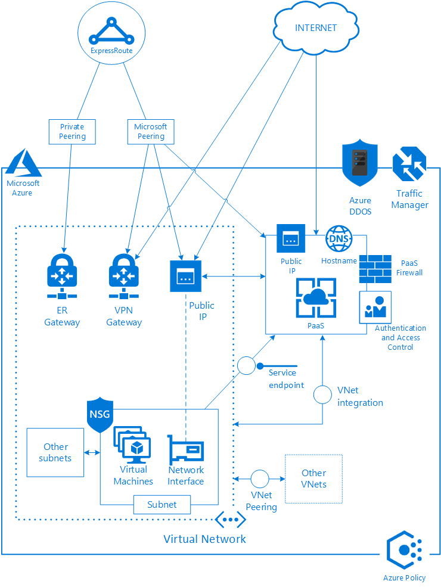

# Controlling ingress traffic in Azure Australia

A core element of securing ICT systems is controlling network traffic. Traffic should be restricted to only that necessary for a system to functions to reduce the potential for compromise.

This guide gives details about how inbound (ingress) network traffic works within Azure, and recommendations for implementing network security controls for an internet connected system.

The network controls align with the Australian Cyber Security Centre (ACSC) Consumer Guidance and the intent of the ACSC's Information Security Manual (ISM).

## Requirements

The overall security requirements for Commonwealth systems are defined in the ISM. To assist Commonwealth entities in implementing network security, the ACSC has published [ACSC Protect: Implementing Network Segmentation and Segregation](https://www.acsc.gov.au/publications/protect/network_segmentation_segregation.htm), and to assist with securing systems in Cloud environments the ACSC has published [Cloud Computing Security for Tenants](https://www.cyber.gov.au/publications/cloud-computing-security-for-tenants).

These guides outline the context for implementing network security and controlling traffic and include practical recommendations for network design and configuration.

The Microsoft [Cloud Computing Security for Tenants of Microsoft Azure](https://aka.ms/au-irap) guide in the Australian page of the Service Trust Portal highlights specific Microsoft technologies that enable you to meet the advice in the ACSC publications.

The following key requirements, identified in the publications from the ACSC, are important for controlling ingress traffic in Azure:

|Description|Source|
|---|---|
|**Implement Network Segmentation and Segregation, for example, n-tier architecture, using host-based firewalls and CSP's network access controls to limit inbound and outbound VM network connectivity to only required ports/protocols.**| _Cloud Computing for Tenants_|
|**Implement adequately high bandwidth, low latency, reliable network connectivity** between the tenant (including the tenant's remote users) and the cloud service to meet the tenant's availability requirements  | _Cloud Computing for Tenants_|
|**Apply technologies at more than just the network layer**. Each host and network should be segmented and segregated, where possible, at the lowest level that can be practically managed. In most cases, segmentation and segregation apply from the data link layer up to and including the application layer; however, in sensitive environments, physical isolation may be appropriate. Host-based and network-wide measures should be deployed in a complementary manner and be centrally monitored. Using a firewall or security appliance as the only security measure is not sufficient. |_ACSC Protect: Implementing Network Segmentation and Segregation_|
|**Use the principles of least privilege and need‐to‐know**. If a host, service or network doesn't need to communicate with another host, service, or network, it shouldn't be allowed to. If a host, service, or network only needs to talk to another host, service, or network using specific ports or protocols, then any other ports or protocols should be disabled. Adopting these principles across a network will complement the minimisation of user privileges and significantly increase the overall security posture of the environment. |_ACSC Protect: Implementing Network Segmentation and Segregation_|
|**Separate hosts and networks based on their sensitivity or criticality to business operations**. Separation can be achieved by using different hardware or platforms depending on different security classifications, security domains, or availability/integrity requirements for certain hosts or networks. In particular, separate management networks and consider physically isolating out-of-band management networks for sensitive environments. |_ACSC Protect: Implementing Network Segmentation and Segregation_|
|**Identify, authenticate, and authorise access by all entities to all other entities**. All users, hosts, and services should have their access restricted to only the other users, hosts, and services required to do their designated duties or functions. All legacy or local services which bypass or downgrade the strength of identification, authentication, and authorisation services should be disabled and their use should be closely monitored. |_ACSC Protect: Implementing Network Segmentation and Segregation_|
|**Implement allow listing of network traffic instead of deny listing**. Only permit access for known good network traffic (that is, that which is identified, authenticated, and authorised), rather than denying access to known bad network traffic (for example, blocking a specific address or service). Whitelisting results in a superior security policy to blacklisting, and significantly improves an organisation's capacity to detect and assess potential network intrusions. |_ACSC Protect: Implementing Network Segmentation and Segregation_|
|

This article provides information and recommendations on how these requirements can be met for systems deployed in Azure using both Infrastructure as a Service (IaaS) and Platform as a Service (PaaS). You should also read the article on [Controlling egress traffic in Azure Australia](gateway-egress-traffic.md) to fully understand controlling network traffic within Azure.

## Architecture

If you are involved in the design or implementation of network security and ingress traffic controls, you must first understand how ingress network traffic works within Azure across both IaaS and PaaS. This section provides an overview of the possible entry points where network traffic could reach a resource hosted in Azure, and the security controls available to restrict and control that traffic. Each of these components is discussed in detail in the remaining sections of this guide.

### Architecture components

The architectural diagram shown here depicts the possible paths that network traffic can take to connect into a service hosted in Azure. These components are divided into Azure, IaaS Ingress, PaaS Ingress, and Security Control, depending on the function that they provide for ingress traffic.

### Azure components

|Component | Description|
|---|---|
|**DDoS Protection** | Distributed denial of service (DDoS) attacks attempt to exhaust an application's resources, making the application unavailable to legitimate users. DDoS attacks can be targeted at any endpoint that is publicly reachable through the internet. Azure includes DDoS Protection automatically through the Azure platform and provides additional mitigation capabilities that can be enabled for specific applications for more granular control.|
| **Traffic Manager** | Azure Traffic Manager is a Domain Name System (DNS) based traffic load balancer that can distribute traffic optimally to services across Azure regions, while providing high availability and responsiveness. Traffic Manager uses DNS to direct client requests to the most appropriate endpoint based on a traffic-routing method and the health of the endpoints.|
| **ExpressRoute** | ExpressRoute is a dedicated network connection for consuming Microsoft cloud services. It is provisioned through a connectivity provider and offers more reliability, faster speeds, lower latencies, and higher security than typical connections over the Internet. An ExpressRoute circuit represents the logical connection between the on-premises infrastructure and Microsoft cloud services through a connectivity provider.|
| **ExpressRoute Private Peering** | ExpressRoute Private Peering is a connection between the on-premises environment and private Azure virtual networks. Private Peering enables access to Azure services such as Virtual Machines, that are deployed within a virtual network. The resources and virtual networks accessed via private peering are considered an extension of an organisation's core network. Private Peering provides bi-directional connectivity between the on-premises network and Azure virtual networks using private IP addresses.|
| **ExpressRoute Microsoft Peering** | ExpressRoute Microsoft Peering is a connection between the on-premises environment and Microsoft and Azure public services. This includes connectivity to Office 365, Dynamics 365, and Azure PaaS services. Peering is established over public IP addresses that are owned by the organisation or connectivity provider. No services are accessible via ExpressRoute Microsoft Peering by default and an organisation must opt in to the services that are required. This process then provides connectivity to the same endpoints that are available on the Internet.|
|

### IaaS ingress components

|Component | Description|
|---|---|
|**Network Interface** | A network interface is a resource that exists in Azure. It is attached to a Virtual Machine and assigned a private, non-Internet routable IP address from the subnet that it is associated with. This IP address is dynamically or statically assigned through Azure Resource Manager.|
|**Subnet** | A subnet is an IP address range that is created within a VNet. Multiple subnets can be created within a VNet for network segmentation.|
| **Virtual Network (VNet)** | A VNet is a foundational resource within Azure that provides a platform and boundary for deploying resources and enabling communication. The VNet exists within an Azure Region and defines the IP Address Space and Routing boundaries for VNet integrated resources such as Virtual Machines.|
| **VNet Peering** | VNet Peering is an Azure configuration option that enables direct communication between two VNets without the need for a Virtual Network Gateway. Once peered, the two VNets can communicate directly and additional configuration can control the use of Virtual Network Gateways and other transit options.|
| **Public IP** | A Public IP is a resource that reserves one of the Microsoft owned Public, Internet-Routable IP Addresses from the specified region for use within the virtual network. It can be associated with a specific Network Interface, which enables the resource to be accessible from the Internet, ExpressRoute and PaaS systems.|
| **ExpressRoute Gateway** | An ExpressRoute Gateway is an object in a Virtual Network provides connectivity and routing from the Virtual Network to on-premises networks over Private Peering on an ExpressRoute Circuit.|
| **VPN Gateway** | A VPN Gateway is an object in a Virtual Network that provides an encrypted tunnel from a Virtual Network to an external network. The encrypted tunnel can be Site-to-Site for bi-directional communication with an on-premises environment, other virtual network, or cloud environment or Point-to-Site for communication with a single end point.|
| **PaaS VNet Integration** | Many PaaS capabilities can be deployed into, or integrated with, a Virtual Network. Some PaaS capabilities can be fully integrated with a VNet and be accessible via only private IP addresses. Others, such as Azure Load Balancer and Azure Application Gateway, can have an external interface with a public IP address and an internal interface with a private IP address inside the virtual network. In this instance, traffic can ingress into the Virtual Network via the PaaS capability.|
|

### PaaS ingress components

|Component | Description|
|---|---|
|**Hostname** | Azure PaaS capabilities are identified by a unique public hostname that is assigned when the resource is created. This hostname is then registered into a public DNS domain, where it can be resolved to a Public IP address.|
|**Public IP** | Unless deployed in a VNet integrated configuration, Azure PaaS capabilities are accessed via a Public, Internet-routable IP address. This address can be dedicated to the specific resources, such as a Public Load Balancer, or could be associated with a specific capability that has a shared entry point for multiple instances, such as Storage or SQL. This Public IP addressed can be accessed from the Internet, ExpressRoute or from IaaS public IP addresses through the Azure backbone network.|
|**Service endpoints** | Service endpoints provide a direct, private connection from a Virtual Network to a specific PaaS capability. Service endpoints, which are only available for a subset of PaaS capabilities, provide increased performance and security for resources in a VNet accessing PaaS.|
|

### Security controls

|Component | Description|
|---|---|
|**Network Security Groups (NSGs)** | NSGs control traffic into and out of virtual network resources in Azure. NSGs apply rules for the traffic flows that are permitted or denied, which includes traffic within Azure and between Azure and external networks such as on-premises or the Internet. NSGs are applied to subnets within a virtual network or to individual network interfaces.|
|**PaaS Firewall** | Many PaaS capabilities, such as Storage and SQL have an inbuilt Firewall for controlling ingress network traffic to the specific resource. Rules can be created to allow or deny connections from specific IP Addresses and/or Virtual Networks.|
|**PaaS Authentication and Access Control** | As part of a layered approach to security, PaaS capabilities provide multiple mechanisms for authenticating users and controlling privileges and access.|
|**Azure Policy** | Azure Policy is a service in Azure for creating, assigning, and managing policies. These policies use rules to control the types of resources that can be deployed and the configuration of those resources. Policies can be used to enforce compliance by preventing resources from being deployed if they do not meet requirements or can be used for monitoring to report on compliance status.|
|

## General guidance

To design and build secure solutions within Azure, it is critical to understand and control the network traffic so that only identified and authorised communication can occur. The intent of this guidance, and the specific component guidance in later sections, is to describe the tools and services that can be utilised to apply the principles outlined in the _ACSC Protect: Implementing Network Segmentation and Segregation_ across Azure workloads. This includes detailing how to create a virtual architecture for securing resources when it is not possible to apply the same traditional physical and network controls that are possible in an on-premises environment.

### Specific focus areas

* Limit the number of entry points to virtual networks
* Limit the number of Public IP addresses
* Consider utilising a Hub and Spoke Network Design for Virtual Networks as discussed in the Microsoft Virtual Data Centre (VDC) documentation
* Utilise products with inbuilt security capabilities for inbound connections from the Internet (for example, Application Gateway, API Gateway, Network Virtual Appliances)
* Restrict communication flows to PaaS capabilities to only those necessary for system functionality
* Deploy PaaS in a VNet integrated configuration for increased segregation and control
* Configure systems to use encryption mechanisms in line with the ACSC Consumer Guidance and ISM
* Use identity-based protections such as authentication and role-based access control in addition to traditional network controls
* Implement ExpressRoute for connectivity with on-premises networks
* Implement VPNs for administrative traffic and integration with external networks
* Utilise Azure Policy to restrict the regions and resources to only those that are necessary for system functionality
* Utilise Azure Policy to enforce baseline security configuration for internet-accessible resources

### Additional resources

|Resource | Link|
|---|---|
|Australian Regulatory and Policy Compliance Documents including Consumer Guidance|[https://aka.ms/au-irap](https://aka.ms/au-irap)|
|Azure Virtual Data Centre|[https://docs.microsoft.com/azure/architecture/vdc/networking-virtual-datacenter](https://docs.microsoft.com/azure/architecture/vdc/networking-virtual-datacenter)|
|ACSC Network Segmentation|[https://acsc.gov.au/publications/protect/network_segmentation_segregation.htm](https://acsc.gov.au/publications/protect/network_segmentation_segregation.htm)|
|ACSC Cloud Security for Tenants| [https://acsc.gov.au/publications/protect/cloud-security-tenants.htm](https://acsc.gov.au/publications/protect/cloud-security-tenants.htm)|
|ACSC Information Security Manual|[https://acsc.gov.au/infosec/ism/index.htm](https://acsc.gov.au/infosec/ism/index.htm)|

## Component guidance

This section provides further guidance on the individual components that are relevant to ingress traffic to systems deployed in Azure. Each section describes the intent of the specific component with links to documentation and configuration guides that can be used to assist with design and build activities.

## Azure

All communication to resources within Azure passes through the Microsoft maintained network infrastructure, which provides connectivity and security functionality. A range of protections are automatically put in place by Microsoft to protect the Azure platform and network infrastructure and additional capabilities are available as services within Azure to control network traffic and establish network segmentation and segregation.

### DDoS Protection

Internet accessible resources are susceptible to DDoS attacks. To protect against these attacks, Azure provides DDoS protections at a Basic and a Standard level.

Basic is automatically enabled as part of the Azure platform including always-on traffic monitoring, and real-time mitigation of common network-level attacks, providing the same defences utilised by Microsoft's online services. The entire scale of Azure's global network can be used to distribute and mitigate attack traffic across regions. Protection is provided for IPv4 and IPv6 Azure public IP addresses

Standard provides additional mitigation capabilities over the Basic service tier that are tuned specifically to Azure Virtual Network resources. Protection policies are tuned through dedicated traffic monitoring and machine learning algorithms. Protection is provided for IPv4 Azure public IP addresses.

|Resource|Link|
|---|---|
|Azure DDoS Protection Overview|[https://docs.microsoft.com/azure/virtual-network/ddos-protection-overview](https://docs.microsoft.com/azure/virtual-network/ddos-protection-overview)|
|Azure DDoS Best Practices|[https://docs.microsoft.com/azure/security/fundamentals/ddos-best-practices](https://docs.microsoft.com/azure/security/fundamentals/ddos-best-practices)|
|Managing DDoS Protection|[https://docs.microsoft.com/azure/virtual-network/manage-ddos-protection](https://docs.microsoft.com/azure/virtual-network/manage-ddos-protection)|
|

### Traffic Manager

Traffic Manager is used to manage ingress traffic by controlling which endpoints of an application receive connections. To protect against a loss of availability of systems or applications due to cyber security attack, or to recover services after a system compromise, Traffic Manager can be used to redirect traffic to functioning, available application instances.

|Resource|Link|
|---|---|
|Traffic Manager Overview | [https://docs.microsoft.com/azure/traffic-manager/traffic-manager-overview](https://docs.microsoft.com/azure/traffic-manager/traffic-manager-overview)|
|Disaster recovery using Azure DNS and Traffic Manager Guide | [https://docs.microsoft.com/azure/networking/disaster-recovery-dns-traffic-manager](https://docs.microsoft.com/azure/networking/disaster-recovery-dns-traffic-manager)|
|

### ExpressRoute

ExpressRoute can be used to establish a private path from an on-premises environment to systems hosted in Azure. This connection can provide greater reliability and guaranteed performance with enhanced privacy for network communications. Express Route allows commonwealth entities to control inbound traffic from the on-premises environment and define dedicated addresses specific to the organisation to use for inbound firewall rules and access control lists.

|Resource | Link|
|---|---|
|ExpressRoute Overview | [https://docs.microsoft.com/azure/expressroute/](https://docs.microsoft.com/azure/expressroute/)|
|ExpressRoute Connectivity Models | [https://docs.microsoft.com/azure/expressroute/expressroute-connectivity-models](https://docs.microsoft.com/azure/expressroute/expressroute-connectivity-models)|
|

### ExpressRoute Private Peering

Private peering provides a mechanism for extending an on-premises environment into Azure using only private IP addresses. This enables commonwealth entities to integrate Azure Virtual Networks and address ranges with existing on-premises systems and services. Private Peering provides assurance that communication across ExpressRoute is only to Virtual Networks authorised by the organisation. If you use Private Peering, Commonwealth entities must implement Network Virtual Appliances (NVA) instead of Azure VPN Gateway to establish the secure VPN communication to your on-premises networks as required by the ACSC consumer guidance.

|Resource | Link|
|---|---|
|ExpressRoute Private Peering Overview | [https://docs.microsoft.com/azure/expressroute/expressroute-circuit-peerings#routingdomains](https://docs.microsoft.com/azure/expressroute/expressroute-circuit-peerings#routingdomains)|
|ExpressRoute Private Peering How-to Guide | [https://docs.microsoft.com/azure/expressroute/expressroute-howto-routing-portal-resource-manager#private](https://docs.microsoft.com/azure/expressroute/expressroute-howto-routing-portal-resource-manager#private)|
|

### ExpressRoute Microsoft Peering

Microsoft Peering provides a high-speed, low latency connection to Microsoft Public Services without needing to traverse the Internet. This provides greater reliability, performance, and privacy for connections. By using Route Filters, commonwealth entities can restrict communications to only the Azure Regions that they require, but this includes services hosted by other organisations and may necessitate additional filtering or inspection capabilities between the on-premises environment and Microsoft.

Commonwealth entities can use the dedicated Public IP addresses established through the peering relationship to uniquely identify the on-premises environment for use in firewalls and access control lists within PaaS capabilities.

As an alternative, commonwealth entities can use ExpressRoute Microsoft peering as an underlay network for establishing VPN connectivity through Azure VPN Gateway. In this model, there is no active communication from the internal on-premises network to Azure public services over ExpressRoute, but secure connectivity through to private Virtual Networks is achieved in compliance with the ACSC consumer guidance.

|Resource | Link|
|---|---|
|ExpressRoute Microsoft Peering Overview | [https://docs.microsoft.com/azure/expressroute/expressroute-circuit-peerings#routingdomains](https://docs.microsoft.com/azure/expressroute/expressroute-circuit-peerings#routingdomains)|
|ExpressRoute Microsoft Peering How-to Guide | [https://docs.microsoft.com/azure/expressroute/expressroute-howto-routing-portal-resource-manager#msft](https://docs.microsoft.com/azure/expressroute/expressroute-howto-routing-portal-resource-manager#msft)|
|

## IaaS ingress

This section provides the component guidance for controlling Ingress traffic to IaaS components. IaaS includes Virtual Machines and other compute resources that can be deployed and managed within a Virtual Network in Azure. For traffic to arrive at systems deployed using IaaS it must have an entry point to the Virtual Network, which can be established through a Public IP address, Virtual Network Gateway or Virtual Network peering relationship.

### Network interface

Network interfaces are the ingress points for all traffic to a Virtual Machine. Network Interfaces enable the configuration of IP Addressing, and can be used to apply NSGs or for routing traffic through a Network Virtual Appliance. The Network Interfaces for Virtual Machines should be planned and configured appropriately to align with overall network segmentation and segregation objectives.

|Resource | Link|
|---|---|
|Create, Change, or Delete a Network Interface | [https://docs.microsoft.com/azure/virtual-network/virtual-network-network-interface](https://docs.microsoft.com/azure/virtual-network/virtual-network-network-interface)|
|Network Interface IP Addressing | [https://docs.microsoft.com/azure/virtual-network/virtual-network-ip-addresses-overview-arm#private-ip-addresses](https://docs.microsoft.com/azure/virtual-network/virtual-network-ip-addresses-overview-arm#private-ip-addresses)|
|

### Subnet

Subnets are a crucial component for network segmentation and segregation within Azure. Subnets can be used similarly to provide separation between systems. NSGs can be applied to subnets to restrict ingress communication flows to only those necessary for system functionality. Subnets can be used as both source and destination addresses for firewall rules and access-control lists and can be configured for service endpoints to provide connectivity to PaaS capabilities.

|Resource | Link|
|---|---|
|Add, change, or delete a virtual network subnet | [https://docs.microsoft.com/azure/virtual-network/virtual-network-manage-subnet](https://docs.microsoft.com/azure/virtual-network/virtual-network-manage-subnet)|
|

### Virtual Network (VNet)

VNets are one of the fundamental building blocks for networking in Azure. Virtual Networks define an IP address space and routing boundary to be used across a variety of systems. Virtual Networks are divided into subnets and all subnets within a Virtual Network have a direct network route to each other. By using Virtual Network Gateways (ExpressRoute or VPN), systems within a Virtual Network can be made accessible to on-premises and external environments. Understanding Virtual Networks and the associated configuration parameters and routing is crucial in understanding and controlling ingress network traffic.

|Resource | Link|
|---|---|
|Virtual Networks Overview | [https://docs.microsoft.com/azure/virtual-network/virtual-networks-overview](https://docs.microsoft.com/azure/virtual-network/virtual-networks-overview)|
|Plan Virtual Networks How-to Guide | [https://docs.microsoft.com/azure/virtual-network/virtual-network-vnet-plan-design-arm](https://docs.microsoft.com/azure/virtual-network/virtual-network-vnet-plan-design-arm)|
Create a Virtual Network Quickstart | [https://docs.microsoft.com/azure/virtual-network/quick-create-portal](https://docs.microsoft.com/azure/virtual-network/quick-create-portal)|
|

### VNet Peering

VNet Peering is used to provide a direct communication path between two Virtual Networks. Once peering is established, hosts in one Virtual Network have a high-speed routing path directly to hosts in another Virtual Network. NSGs still apply to the traffic as normal and advanced configuration parameters can be used to define whether communication through Virtual Network Gateways or from other external systems is permitted.

|Resource | Link|
|---|---|
|Virtual Network Peering Overview |  [https://docs.microsoft.com/azure/virtual-network/virtual-network-peering-overview](https://docs.microsoft.com/azure/virtual-network/virtual-network-peering-overview)|
|Create, change, or delete a virtual network peering | [https://docs.microsoft.com/azure/virtual-network/virtual-network-manage-peering](https://docs.microsoft.com/azure/virtual-network/virtual-network-manage-peering)|
|

### Public IP on VNET

Public IP addresses are used to provide an ingress communication path to services deployed in a Virtual Network. Commonwealth entities should plan the allocation of Public IP addresses carefully and only assign them to resources where there is a genuine requirement. As a general design practice, Public IP addresses should be allocated to resources with inbuilt security capabilities such as Application Gateway or Network Virtual Appliances to provide a secure, controlled public entry point to a Virtual Network.

|Resource | Link|
|---|---|
|Public IP Addresses Overview | [https://docs.microsoft.com/azure/virtual-network/virtual-network-ip-addresses-overview-arm#public-ip-addresses](https://docs.microsoft.com/azure/virtual-network/virtual-network-ip-addresses-overview-arm#public-ip-addresses)|
|Create, change, or delete a public IP address | [https://docs.microsoft.com/azure/virtual-network/virtual-network-public-ip-address](https://docs.microsoft.com/azure/virtual-network/virtual-network-public-ip-address)|
|

### ExpressRoute Gateway

ExpressRoute Gateways provide an ingress point from the on-premises environment and should be deployed to meet security, availability, financial, and performance requirements. ExpressRoute Gateways provide a defined network bandwidth and incur usage costs after deployment. Virtual Networks can have only one ExpressRoute Gateway, but this can be connected to multiple ExpressRoute circuits and can be leveraged by multiple Virtual Networks through VNet Peering, allowing multiple Virtual Networks to share bandwidth and connectivity. Care should be taken to configure routing between on-premises environments and Virtual Networks using ExpressRoute Gateways to ensure end to end connectivity using known, controlled network ingress points. Commonwealth entities using ExpressRoute Gateway must also deploy Network Virtual Appliances to establish VPN connectivity to the on-premises environment for compliance with the ACSC consumer guidance.

|Resource | Link|
|---|---|
|ExpressRoute Gateway Overview | [https://docs.microsoft.com/azure/expressroute/expressroute-about-virtual-network-gateways](https://docs.microsoft.com/azure/expressroute/expressroute-about-virtual-network-gateways)|
|Configure a virtual network gateway for ExpressRoute | [https://docs.microsoft.com/azure/expressroute/expressroute-howto-add-gateway-portal-resource-manager](https://docs.microsoft.com/azure/expressroute/expressroute-howto-add-gateway-portal-resource-manager)|
|

### VPN Gateway

Azure VPN Gateway provides an ingress network point from an external network for secure site-to-site or point-to-site connections. VPN Gateways provide a defined network bandwidth and incur usage costs after deployment. Commonwealth entities utilising VPN Gateway should ensure that it is configured in accordance with the ACSC consumer guidance. Virtual Networks can have only one VPN Gateway, but this can be configured with multiple tunnels and can be leveraged by multiple Virtual Networks through VNet Peering, allowing multiple Virtual Networks to share bandwidth and connectivity. VPN Gateways can be established over the Internet or over ExpressRoute through Microsoft Peering.

|Resource | Link|
|---|---|
|VPN Gateway Overview | [https://docs.microsoft.com/azure/vpn-gateway/](https://docs.microsoft.com/azure/vpn-gateway/)|
|Planning and design for VPN Gateway | [https://docs.microsoft.com/azure/vpn-gateway/vpn-gateway-plan-design](https://docs.microsoft.com/azure/vpn-gateway/vpn-gateway-plan-design)|
|VPN Gateway configuration for Australian Government agencies|[IPSEC configuration required for Australian Government agencies](vpn-gateway.md)|
|

### PaaS VNet integration

Leveraging PaaS can provide enhanced functionality and availability and reduce management overhead but must be secured appropriately. To increase control, enforce network segmentation, or to provide a secure ingress entry point for applications and services, many PaaS capabilities can be integrated with a Virtual Network.

To provide a secure entry point, PaaS capabilities such as Application Gateway can be configured with an external, public facing interface and an internal, private interface for communicating with application services. This prevents the need to configure application servers with Public IP addresses and expose them to external networks.

To use PaaS as an integrated part of system or application architecture, Microsoft provides multiple mechanisms to deploy PaaS into a Virtual Network. The deployment methodology restricts the inbound access from external networks such as the Internet while providing connectivity and integration with internal systems and applications. Examples include App Service Environments, SQL Managed Instance, and more.

|Resource | Link|
|---|---|
|Virtual network integration for Azure services | [https://docs.microsoft.com/azure/virtual-network/virtual-network-for-azure-services](https://docs.microsoft.com/azure/virtual-network/virtual-network-for-azure-services)|
|Integrate your app with an Azure Virtual Network How-to guide | [https://docs.microsoft.com/azure/app-service/web-sites-integrate-with-vnet](https://docs.microsoft.com/azure/app-service/web-sites-integrate-with-vnet)|
|

## PaaS ingress

PaaS capabilities provide opportunities for increased capability and simplified management, but introduce complexities in addressing requirements for network segmentation and segregation. PaaS capabilities are typically configured with Public IP addresses and are accessible from the Internet.  When building systems using PaaS capabilities, care should be taken to identify all the necessary communication flows between components within the system and network security rules created to allow only this communication. As part of a defence-in-depth approach to security, PaaS capabilities should be configured with encryption, authentication, and appropriate access controls and permissions.  

### Hostname

PaaS capabilities are uniquely identified by hostnames to allow multiple instances of the same service to be hosted on the same Public IP address. Unique hostnames are specified when resources are created and exist within Microsoft owned DNS domains. The specific hostnames for authorised services can be used within security tools with application level filtering capabilities. Certain services can also be configured with custom domains as required.

|Resource | Link|
|---|---|
|Many public namespaces used by Azure services can be obtained through Powershell by running the Get-AzureRMEnvironment command | [https://docs.microsoft.com/powershell/module/azurerm.profile/get-azurermenvironment](https://docs.microsoft.com/powershell/module/azurerm.profile/get-azurermenvironment)|
|Configuring a custom domain name for an Azure cloud service | App Services and others can have custom domains [https://docs.microsoft.com/azure/cloud-services/cloud-services-custom-domain-name-portal](https://docs.microsoft.com/azure/cloud-services/cloud-services-custom-domain-name-portal)|
|

### Public IP for PaaS

Public IP addresses for PaaS capabilities are allocated based on the region where the service is hosted or deployed. To build appropriate network security rules and routing topology for network segmentation and segregation covering Azure Virtual Networks, PaaS and ExpressRoute and Internet connectivity, an understanding of Public IP address allocation and regions is required. Azure allocates IP addresses from a pool allocated to each Azure region. Microsoft makes the addresses used in each region available for download, which is updated in a regular and controlled manner. The services that are available in each region also frequently changes as new services are released or services are deployed more widely. Commonwealth entities should review these materials regularly and can leverage automation to maintain systems as required. Specific IP addresses for some services hosted in each region can be obtained by contacting Microsoft support.

|Resource | Link|
|---|---|
|Microsoft Azure Datacenter IP Ranges | [https://www.microsoft.com/download/details.aspx?id=41653](https://www.microsoft.com/download/details.aspx?id=41653)|
|Azure Services per region | [https://azure.microsoft.com/global-infrastructure/services/?regions=non-regional,australia-central,australia-central-2,australia-east,australia-southeast&products=all](https://azure.microsoft.com/global-infrastructure/services/?regions=non-regional,australia-central,australia-central-2,australia-east,australia-southeast&products=all)|
|

### Service endpoints

Virtual Network Service endpoints provide a high-speed, private ingress network connection for subnets within a Virtual Network to consume specific PaaS capabilities. For complete network segmentation and segregation of the PaaS capability, the PaaS capability must be configured to accept connections only from the necessary virtual networks. Not all PaaS Capabilities support a combination of Firewall rules that includes service endpoints and traditional IP address-based rules, so care should be taken to understand the flow of communications required for application functionality and administration so that the implementation of these security controls does not impact service availability.

|Resource | Link|
|---|---|
|Service endpoints overview | [https://docs.microsoft.com/azure/virtual-network/virtual-network-service-endpoints-overview](https://docs.microsoft.com/azure/virtual-network/virtual-network-service-endpoints-overview)
|Tutorial |[https://docs.microsoft.com/azure/virtual-network/tutorial-restrict-network-access-to-resources](https://docs.microsoft.com/azure/virtual-network/tutorial-restrict-network-access-to-resources)|
|

## Security

Implementing network segmentation and segregation controls on IaaS and PaaS capabilities is achieved through securing the capabilities themselves and by implementing controlled communication paths from the systems that will be communicating with the capability.

Designing and building solutions in Azure is a process of creating a logical architecture to understand, control, and monitor network resources across the entire Azure presence. This logical architecture is software defined within the Azure platform and takes the place of a physical network topology that is implemented in traditional network environments.

The logical architecture that is created must provide the functionality necessary for usability, but must also provide the visibility and control needed for security and integrity.

Achieving this outcome is based on implementing the necessary network segmentation and segregation tools, but also in protecting and enforcing the network topology and the implementation of these tools.

The information provided in this guide can be used to help identify the sources of ingress traffic that need to be permitted and the ways that the traffic can be further controlled or constrained.

### Network Security Groups (NSGs)

NSGs are used to specify the inbound and outbound traffic permitted for a subnet or a specific network interface. When configuring NSGs, commonwealth entities should use a whitelisting approach where rules are configured to permit the necessary traffic with a default rule configured to deny all traffic that does not match a specific permit statement. Care must be taken when planning and configuring NSGs to ensure that all necessary inbound and outbound traffic is captured appropriately. This includes identifying and understanding all private IP address ranges utilised within Azure Virtual Networks and the on-premises environment, and specific Microsoft services such as Azure Load Balancer and PaaS management requirements. Individuals involved in the design and implementation of Network Security Groups should also understand the use of Service Tags and Application Security Groups for creating fine-grained, service, and application-specific security rules.

|Resource | Link|
|---|---|
|Network Security Overview | [https://docs.microsoft.com/azure/virtual-network/security-overview](https://docs.microsoft.com/azure/virtual-network/security-overview)
|Create, change, or delete a network security group | [https://docs.microsoft.com/azure/virtual-network/manage-network-security-group](https://docs.microsoft.com/azure/virtual-network/manage-network-security-group)|
|

## PaaS firewall

A PaaS firewall is a network access control capability that can be applied to certain PaaS services. It allows IP address filtering or filtering from specific virtual networks to be configured to restrict ingress traffic to the specific PaaS instance. For PaaS capabilities that include a Firewall, network access control policies should be configured to permit only the necessary ingress traffic based on application requirements.  

|Resource | Link|
|---|---|
|Azure SQL Database and SQL Data Warehouse IP firewall rules | [https://docs.microsoft.com/azure/sql-database/sql-database-firewall-configure](https://docs.microsoft.com/azure/sql-database/sql-database-firewall-configure)|
|Storage Network Security | [https://docs.microsoft.com/azure/storage/common/storage-network-security](https://docs.microsoft.com/azure/storage/common/storage-network-security)|
|

## PaaS authentication and access control

Depending on the PaaS capability and its purpose, using network controls to restrict access may not be possible or practical. As part of the layered security model for PaaS, Azure provides a variety of authentication and access control mechanisms to restrict access to a service, even if network traffic is allowed. Typical authentication mechanisms for PaaS capabilities include Azure Active Directory, Application level authentication, and Shared Keys or access signatures. Once a user is securely identified, roles can be utilised to control the actions that the user can perform. These tools can be utilised as an alternative or as a complimentary measure to restrict access into services.

|Resource | Link|
|---|---|
|Controlling and granting database access to SQL Database and SQL Data Warehouse | [https://docs.microsoft.com/azure/sql-database/sql-database-manage-logins](https://docs.microsoft.com/azure/sql-database/sql-database-manage-logins)|
|Authorization for the Azure Storage Services | [https://docs.microsoft.com/rest/api/storageservices/authorization-for-the-Azure-Storage-Services](https://docs.microsoft.com/rest/api/storageservices/authorization-for-the-Azure-Storage-Services)|
|

## Azure Policy

Azure Policy is a key component for enforcing and maintaining the integrity of the logical architecture of the Azure environment. Given the variety of services and ingress network traffic paths available through Azure services, it is crucial that Commonwealth entities are aware of the resources that exist within their environment and the available network ingress points. To ensure that unauthorised network ingress points are not created in the Azure environment, Commonwealth entities should leverage Azure Policy to control the types of resources that can be deployed and the configuration of those resources. Practical examples include restricting resources to only those authorised and approved for use, enforcing HTTPS encryption on Storage and requiring NSGs to be added to subnets.

|Resource | Link|
|---|---|
|Azure Policy Overview | [https://docs.microsoft.com/azure/governance/policy/overview](https://docs.microsoft.com/azure/governance/policy/overview)|
|Allowed Resource Types sample policy | [https://docs.microsoft.com/azure/governance/policy/samples/allowed-resource-types](https://docs.microsoft.com/azure/governance/policy/samples/allowed-resource-types)
|Ensure HTTPS Storage Account sample policy|[https://docs.microsoft.com/azure/governance/policy/samples/ensure-https-storage-account](https://docs.microsoft.com/azure/governance/policy/samples/ensure-https-storage-account)_
|Force NSG on a subnet sample policy| [https://docs.microsoft.com/azure/governance/policy/samples/nsg-on-subnet](https://docs.microsoft.com/azure/governance/policy/samples/nsg-on-subnet)|
|

## Next steps

Review the article on [Gateway Egress Traffic Management and Control](gateway-egress-traffic.md) for details on managing traffic flows from your Azure environment to other networks using your Gateway components in Azure.
